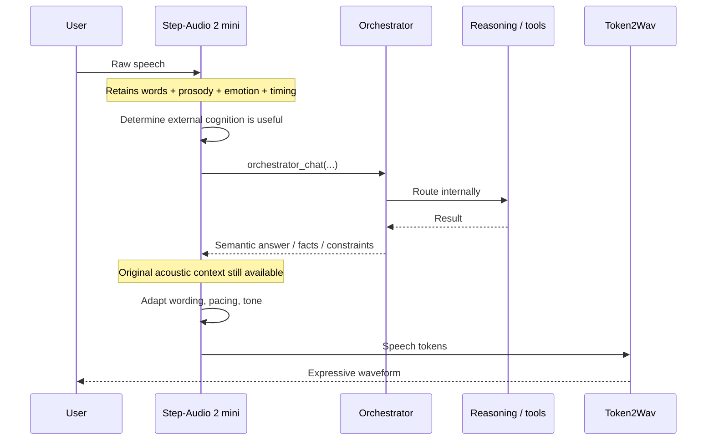
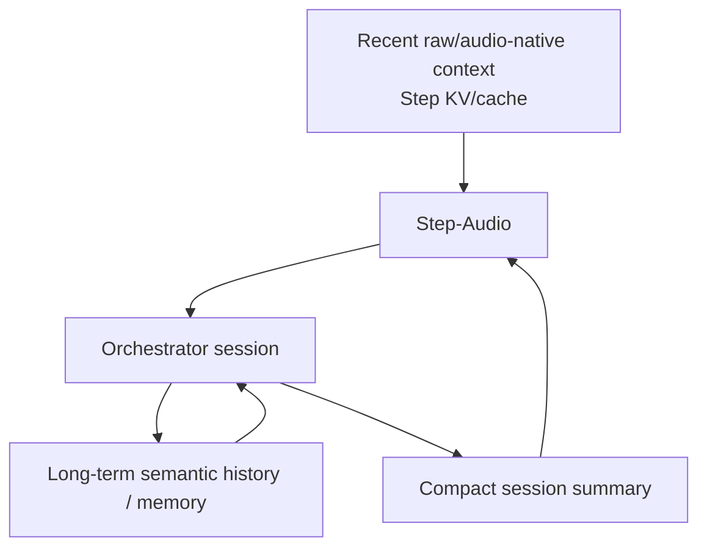
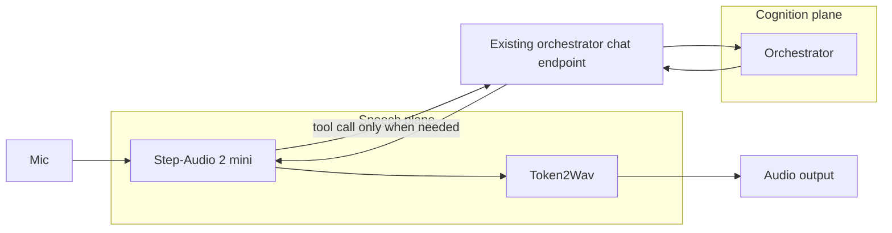

> **Operator draft, preserved verbatim as input (2026-09-24).** This is the operator's original design report. It was
> audited the same day. **Several factual premises in it are wrong for this host**: one MI210, not two; about 31.25 decode steps/s,
> not 25; decode-usable CPU bandwidth ≈150–220 GB/s, not 460; the #86 ROCm report shows only server start-up; there are no
> published tool-call numbers for *mini*; and the orchestrator has no voice path, streaming or conversation store. The ratified
> vision, the corrections and the work plan live in
> [`handoffs/active/conversation-stack.md`](../../../handoffs/active/conversation-stack.md) (INF-79). Where the two
> disagree, the handoff wins. Do not edit the text below. It is the historical record of the operator's intent.

---

# Speech-Native Interlocutor + External Orchestrator
## Design report for an efficient, natural, multi-turn local voice agent

**Status:** Architecture decision committed  
**Primary interlocutor:** Step-Audio 2 mini  
**External cognition surface:** existing orchestrator chat endpoint  
**Baseline/reference architecture:** Kyutai Unmute + external text LLM  
**Primary deployment targets:** CPU + large DDR5 RAM pool and/or AMD MI210 via ROCm  
**Date:** 2026-09-24

---

## 1. Executive decision

The target architecture is:

> **A permanently resident speech-native interlocutor that hears, interprets, and speaks natively, with one external tool: the existing orchestrator chat endpoint.**

Step-Audio 2 mini is the preferred interlocutor.

The speech-native model remains responsible for:

- raw-audio perception;
- transcription/semantic interpretation;
- prosody, hesitation, timing, emotion, timbre, vocal style, and other paralinguistic information;
- conversational turn-taking;
- short social and conversational responses;
- deciding whether a turn requires external cognition;
- incorporating the orchestrator result into the current acoustic/conversational context;
- final wording and expressive speech realization.

The orchestrator remains responsible for everything that benefits from a stronger or more specialized cognition stack:

- deeper reasoning;
- current knowledge;
- web search and RAG;
- coding;
- long-form analysis;
- persistent memory;
- specialist models;
- tool execution;
- future model routing.

This makes the voice model the **interlocutor**, not the ultimate intelligence ceiling.

The key architectural principle is:

> **Preserve speech-native state locally; export only the cognitive problem.**

This avoids the central weakness of a conventional `STT -> text LLM -> TTS` cascade: the user’s acoustic signal is not reduced to plain text before the agent decides how to respond.

---

## 2. Why this architecture instead of Kyutai Unmute

Kyutai Unmute remains an excellent baseline. Its modularity is attractive:

```text
microphone
   ↓
streaming STT
   ↓
text LLM
   ↓
streaming TTS
   ↓
speaker
```

The problem is not intelligence. A modern Qwen model at 60-120+ text tokens/s is more than fast enough to drive conversational speech.

The problem is the **information bottleneck**.

A transcription such as:

```text
"Yeah... I'm fine."
```

does not faithfully preserve:

- a long pause after “yeah”;
- a quiet or breathy delivery;
- falling pitch;
- vocal tension;
- hesitation;
- sarcasm;
- a sigh before speaking;
- laughter that conflicts with the lexical meaning;
- changes in affect mid-sentence;
- conversational overlap;
- entrainment to the other speaker.

One could build an “emotionally annotated transcript”:

```yaml
text: "Yeah... I'm fine."
tempo: slow
volume: quiet
pause_after_yeah_ms: 820
emotion:
  sadness: 0.61
  tension: 0.42
events:
  - sigh
literal_sentiment: positive
acoustic_sentiment: negative
```

A powerful text LLM could reason over this.

However, maintaining such a system means progressively recreating an audio-language representation by hand. It adds model stages, schemas, synchronization logic, calibration, failure modes, and maintenance burden.

That route is therefore rejected as the target architecture.

**Research conclusion:** use a speech-native model that already learned these representations, and make external reasoning a tool.

---

# 3. Core architecture

## 3.1 Logical architecture

```mermaid
flowchart LR
    MIC[Microphone / audio stream] --> STEP[Step-Audio 2 mini\nSpeech-native interlocutor]

    STEP -->|Simple / social / immediate turn| LOCAL[Local response generation]
    STEP -->|Needs external cognition| CALL[orchestrator_chat()]

    CALL --> ORCH[Existing Orchestrator]

    ORCH --> R1[Fast reasoning model]
    ORCH --> R2[Deep reasoning model]
    ORCH --> WEB[Web / RAG]
    ORCH --> CODE[Code / agents]
    ORCH --> SPEC[Specialist models / tools]
    ORCH --> MEM[Persistent memory / session state]

    R1 --> ORCH
    R2 --> ORCH
    WEB --> ORCH
    CODE --> ORCH
    SPEC --> ORCH
    MEM --> ORCH

    ORCH -->|Semantic result| STEP
    LOCAL --> STEP
    STEP --> T2W[Token2Wav]
    T2W --> SPK[Speaker]
```

The critical feature is that **the orchestrator never replaces the interlocutor**.

Step-Audio sees the original audio and retains the recent conversational state. When external reasoning is needed, the orchestrator supplies the *substance* of the answer; Step-Audio remains responsible for how that answer should be spoken in the current interaction.

---

## 3.2 Minimal tool surface

The interlocutor should ideally expose only two behaviors:

1. **Answer locally**
2. **Call the orchestrator**

There is no need for Step-Audio itself to know about:

- Qwen3.6;
- Qwen3.8;
- web search;
- RAG;
- coding agents;
- specialist models;
- memory databases;
- external APIs.

All of those are implementation details behind the existing orchestrator endpoint.

The speech model therefore receives one stable tool forever:

```text
orchestrator_chat(
    user_request,
    conversation_context,
    response_goal
)
```

The orchestrator can evolve independently.

This is preferable to exposing separate:

```text
deep_reason()
web_search()
rag_search()
code_agent()
...
```

tools to Step-Audio because:

- the tool-routing policy stays simple;
- tool descriptions consume less context;
- fewer tool-selection errors are possible;
- backend model upgrades do not require retraining or reprompting the speech model;
- orchestration policy remains centralized where it already exists.

---

# 4. Turn lifecycle

## 4.1 Local conversational turn

For lightweight interaction:

```text
User audio
   ↓
Step-Audio audio encoder
   ↓
speech-native semantic + paralinguistic state
   ↓
Step-Audio decides: no external cognition needed
   ↓
Step-Audio generates speech tokens
   ↓
Token2Wav
   ↓
spoken response
```

Examples:

- “Really?”
- “Wait, what did you mean by that?”
- “Yes.”
- “Give me a second.”
- “That’s hilarious.”
- greetings;
- backchannels;
- conversational clarification;
- many short factual responses already within the local model’s competence.

These should not incur orchestrator latency.

---

## 4.2 Escalated cognitive turn



Example:

> User, audibly frustrated: “Why does this liquidation mechanism blow up when utilization gets too high?”

Step-Audio need not describe the frustration to the reasoner in exhaustive acoustic detail. It may call the orchestrator with something like:

```json
{
  "user_request": "Explain why the liquidation mechanism becomes unstable at high utilization.",
  "conversation_context": "We are discussing the current lending-market simulation.",
  "response_goal": "Provide a technically rigorous explanation suitable for speaking aloud."
}
```

The orchestrator returns the substantive reasoning.

Step-Audio still possesses the original acoustic context and can deliver the answer with an appropriately calm, concise, non-patronizing vocal style.

---

# 5. Why Step-Audio 2 mini

Step-Audio 2 is explicitly designed for:

- end-to-end audio understanding;
- speech conversation;
- paralinguistic information;
- emotional reasoning;
- tool calling;
- multimodal RAG.

The official project also exposes a vLLM tool-call parser and automatic tool choice.

This is unusually well aligned with the proposed architecture: we do **not** need to teach a generic audio model how to delegate reasoning from scratch.

### Published StepEval paralinguistic results

StepFun reports the following on its own StepEval-Audio-Paralinguistic benchmark:

| Model | Average | Emotion | Pitch | Rhythm | Speed | Style | Timbre | Vocal |
|---|---:|---:|---:|---:|---:|---:|---:|---:|
| Kimi-Audio | 49.64 | 66 | 56 | 40 | 44 | 54 | 10 | 54 |
| Step-Audio 2 mini | **80.00** | **82** | **82** | **68** | **74** | **86** | **80** | **76** |
| Step-Audio 2 | 83.09 | 86 | 82 | 86 | 88 | 88 | 82 | 68 |

These are vendor-published benchmark numbers and should be independently spot-checked before treating their absolute values as definitive. There is at least one public issue reporting difficulty reproducing one StepEval category.

Nevertheless, the magnitude and breadth of the reported difference make Step-Audio 2 mini the most compelling first target for a speech-native interlocutor.

---

# 6. Step-Audio 2 mini: actual active-weight anatomy

The “8B” label is broadly accurate, but for CPU planning it is useful to separate *input-only* weights from the autoregressive core.

The official BF16 safetensors index reports:

```text
total_size = 16,630,358,528 bytes
```

At two bytes per BF16 scalar:

```text
≈ 8.315 billion parameters
```

The public configuration is:

```text
text backbone:
  hidden size:       3584
  layers:            28
  attention heads:   28
  KV heads:          4
  FFN size:          18944
  vocabulary:        158720

audio encoder:
  state size:        1280
  layers:            32
  attention heads:   20
```

Using those published dimensions, the checkpoint partitions approximately as follows:

| Step-Audio 2 mini stage | Approx. parameters | Active when |
|---|---:|---|
| Qwen2.5-derived AR transformer + embeddings + LM head | **~7.663B** | Every autoregressive output step |
| Audio encoder | **~0.637B** | Audio input encoding |
| Audio adapter | **~0.015B** | Audio input encoding |
| **Main checkpoint total** | **~8.315B** | Full model resident |

The total reconstructed from the layer dimensions (~8.315B) matches the published BF16 checkpoint size almost exactly.

### Important consequence

The public model code explicitly avoids re-running the audio encoder after the first generation step. Once the incoming audio has been converted into the LLM representation, subsequent autoregressive decode steps operate through the Qwen-derived text/audio token model.

Therefore:

> **For sustained output generation, the relevant dense autoregressive weight stream is about 7.66B parameters, not the full 8.315B.**

That is the number most relevant to CPU memory-bandwidth planning.

---

# 7. Token2Wav is comparatively small

The released Step-Audio 2 mini `token2wav` directory is approximately **1.23 GB total**, consisting of:

| Component | Published file size |
|---|---:|
| `speech_tokenizer_v2_25hz.onnx` | ~496 MB |
| `flow.pt` | ~623 MB |
| `hift.pt` | ~83.4 MB |
| `campplus.onnx` | ~28.3 MB |

The shipped speech-tokenizer filename explicitly identifies it as **25 Hz**.

The synthesis path uses a CosyVoice2-style causal flow model and HiFT waveform generator.

This is dramatically smaller than Kimi-Audio’s released 19 GB flow detokenizer.

The exact active parameter count of Step’s Token2Wav stages is not stated in the model card. However, even if every byte of the ~706 MB `flow.pt + hift.pt` pair represented two-byte weights, that would cap those two checkpoints at roughly 353M scalar parameters; if stored as FP32, the count would be about half that. Actual runtime cost also depends on the number of flow evaluations, so file size is not a complete latency model.

The key point is simply:

> **The Step waveform backend is clearly a sub-billion-scale component by checkpoint size, rather than another multi-billion-parameter conversational model.**

---

# 8. Kimi-Audio vs Step-Audio 2 mini: active-compute comparison

Kimi-Audio is more computationally interesting than the “7B” name suggests.

Its official BF16 main-model index reports:

```text
total_size = 19,532,673,280 bytes
```

which corresponds to:

```text
≈ 9.766 billion BF16 parameters
```

The Kimi model code contains:

- 28 ordinary Qwen2.5-derived transformer layers;
- **6 additional MIMO audio transformer layers**;
- two large output heads;
- audio-specific adapters.

The source code itself describes those six MIMO layers as the **“extra 1B audio transformers.”**

During generation, Kimi executes the ordinary decoder stack and then the MIMO audio stack, generating text and audio logits in parallel.

It additionally uses a Whisper-large-v3-derived continuous acoustic encoder on the input side. The runtime code loads only the Whisper **encoder** for feature extraction.

Kimi’s official audio representation is **12.5 Hz**, half Step’s 25 Hz speech-token rate.

---

## 8.1 Main AR leg

| | Step-Audio 2 mini | Kimi-Audio |
|---|---:|---:|
| Main published BF16 weights | 16.63 GB | 19.53 GB |
| Main parameter count | ~8.315B | ~9.766B |
| Approx. recurrent AR core | **~7.663B** | **~9.766B** |
| Input acoustic encoder | ~0.652B incl. adapter | Whisper-large-v3 encoder + adapter |
| Speech semantic/output rate | **25 Hz** | **12.5 Hz** |
| Separate output decoder | ~1.23 GB complete Token2Wav folder | **~19 GB flow detokenizer** + vocoder |

### Critical nuance: Kimi’s lower token rate matters

If the Step AR core were quantized to Q8:

```text
7.663 GB / output step × 25 steps/s
≈ 191.6 GB/s ideal weight bandwidth
```

For Kimi Q8:

```text
9.766 GB / output step × 12.5 steps/s
≈ 122.1 GB/s ideal weight bandwidth
```

Thus:

> **Kimi’s autoregressive LLM stage can actually require less ideal memory bandwidth per second of generated speech despite having more active parameters per step.**

This is why “model size” alone is not enough to rank audio-model efficiency.

However, Kimi then has a much heavier waveform-generation stage.

---

## 8.2 Kimi’s decoder is the real computational warning sign

Kimi’s released flow detokenizer is about **19 GB**.

Its published configuration uses a large DiT:

```text
hidden_size: 2304
depth:       16
heads:       18
mlp_ratio:   4
```

By contrast, Step’s published flow configuration uses:

```text
hidden_size: 512
depth:       16
heads:       8
mlp_ratio:   4
```

Because transformer-like dense matrix cost scales roughly with the square of hidden width, a 2304-wide DiT is fundamentally much heavier than a 512-wide DiT before even considering checkpoint packing or solver iterations.

A rough core-only parameter estimate for Kimi’s 16-layer 2304-wide DiT is already on the order of **~1B parameters** before auxiliary conditioning machinery. Flow matching also evaluates this network repeatedly during synthesis.

This is likely to be a much more difficult all-CPU component than Step’s Token2Wav.

---

# 9. Is Step definitely more efficient than Kimi?

**Preferred answer: Step is the better first implementation, but benchmark both before permanently discarding Kimi.**

Reasons Step is preferred:

1. **Much stronger published paralinguistic performance.**
2. **Native tool calling is already a documented design goal.**
3. **Main model is smaller.**
4. **Waveform decoder is dramatically smaller.**
5. **Apache 2.0 release.**
6. **A working ROCm port has already been demonstrated publicly.**
7. **The architecture maps almost perfectly to the desired interlocutor/orchestrator split.**

Reason Kimi remains worth one benchmark:

- its 12.5-Hz audio-token clock means its AR core needs only half as many decode steps per second of speech.

Therefore the correct engineering test is not:

> “Which checkpoint has fewer parameters?”

but:

> “Which complete pipeline gives lower RTF and lower time-to-first-audio at matched perceptual quality on this hardware?”

Step is still the leading candidate because its downstream decoder is so much lighter and its speech-understanding profile is better aligned with the project.

---

# 10. CPU feasibility

The target CPU/RAM system has already demonstrated **64.46 text tokens/s** on Qwen3.6-35B-A3B Q8.

For Step-Audio 2 mini, the relevant dense AR stream is ~7.66B parameters.

At Q8:

```text
~7.66 GB of weights per autoregressive step
```

At a 25-Hz target output clock:

```text
~191.6 GB/s ideal minimum weight traffic
```

This is well below a ~460 GB/s-class memory subsystem’s theoretical bandwidth.

Real implementations incur:

- imperfect bandwidth utilization;
- attention/KV reads;
- dequantization;
- LM-head work;
- scheduler overhead;
- cache misses;
- audio pipeline work.

Therefore 460 / 191.6 ≈ 2.4× is **not** a prediction of 2.4× realtime.

It does, however, establish that Q8 CPU decode is not absurd on bandwidth grounds.

### Quantization strategy

Because the external orchestrator supplies the difficult cognition, the interlocutor does not need maximum benchmark reasoning quality.

A sensible progression is:

1. BF16 reference quality;
2. Q8 interlocutor;
3. Q6;
4. Q5 if necessary;
5. Q4 only if quality remains acceptable.

Prefer initially quantizing:

- the 7.66B AR backbone;
- possibly the very large output projection.

Keep at higher precision initially:

- audio encoder;
- audio adapter;
- Token2Wav flow model;
- vocoder.

This isolates quantization risk to the component that is easiest to benchmark and whose reasoning burden is intentionally limited.

### Why aggressive quantization may be unusually acceptable here

The outer model’s responsibilities are primarily:

- understand conversational intent;
- preserve speech nuance;
- route;
- speak naturally;
- integrate returned semantic content.

It does **not** need to independently solve the hardest problems.

If Q5/Q6 preserves:

- tool-call reliability;
- acoustic understanding;
- conversational behavior;
- speech-token quality;

then losing some standalone reasoning benchmark performance is largely irrelevant.

---

# 11. ROCm feasibility

A public March 2026 issue documents Step-Audio-2-mini serving successfully on an AMD Radeon 8060S / Strix Halo system using StepFun’s vLLM fork and ROCm patches.

The published log states:

```text
Model loading took 16.0381 GiB
```

The port required fixes for:

- HIP architecture detection;
- unsupported GPU architecture lists;
- MFMA assumptions;
- Triton flash-attention behavior.

The important conclusion is not that the exact patches transfer directly to MI210.

It is:

> **The StepFun vLLM path is not intrinsically CUDA-only; a functioning ROCm route has already been demonstrated.**

MI210 is a data-center CDNA device and should be a much more conventional ROCm target than that RDNA APU.

The recommended deployment experiments are therefore:

### Topology A — all speech on CPU

```text
CPU + DDR5
 ├─ Step-Audio audio encoder
 ├─ Step-Audio AR interlocutor
 └─ Token2Wav

MI210(s)
 └─ orchestrator reasoning models
```

Advantages:

- GPUs stay fully available for Qwen/backend work;
- no GPU residency competition;
- maximum modularity.

Risk:

- Token2Wav and 25-Hz dense decode must both clear realtime on CPU.

### Topology B — Step on one MI210, cognition on the other

```text
MI210 #1
 └─ Step-Audio 2 mini + Token2Wav

MI210 #2
 └─ orchestrator reasoning workload

CPU + DDR5
 ├─ orchestration
 ├─ persistent memory
 ├─ RAG
 └─ overflow / background inference
```

Advantages:

- easiest path to very low speech latency;
- clean resource separation;
- Step fits easily in 64 GB VRAM.

### Topology C — split speech pipeline

```text
CPU + DDR5
 └─ Q5/Q8 Step AR core

MI210 #1
 ├─ audio encoder
 └─ Token2Wav

MI210 #2
 └─ reasoning models
```

This is architecturally possible but should be attempted only if profiling justifies the complexity. Moving hidden-state/audio chunks across PCIe can erase gains from splitting the pipeline.

**Preferred order:** benchmark A and B first.

---

# 12. Orchestrator contract

## 12.1 The interlocutor should request cognition, not surrender the conversation

The external call should be framed as:

> “Give me the substance I need to answer this user.”

not:

> “Take over the entire assistant turn.”

A useful logical response contract is:

```json
{
  "answer_content": "...",
  "must_preserve": [
    "exact numbers",
    "proper nouns",
    "commands",
    "technical caveats"
  ],
  "confidence": "high",
  "response_mode": "normal"
}
```

The Step interlocutor may:

- shorten;
- make speech more natural;
- vary pacing;
- acknowledge emotion;
- choose conversational phrasing.

It should **not** alter values placed in `must_preserve`.

For code, commands, URLs, or exact procedural instructions, the orchestrator can set:

```json
{
  "response_mode": "verbatim"
}
```

and Step should speak or display the payload with minimal transformation.

If the existing endpoint already returns ordinary assistant text, the first implementation can remain even simpler:

```text
Step sends question → orchestrator returns answer text → Step voices/paraphrases it
```

The richer schema can be added only if factual drift becomes measurable.

---

# 13. Binary routing policy

The best initial routing policy is deliberately simple.

## `LOCAL`

Use the resident Step model when:

- the turn is primarily social;
- it is a backchannel;
- it is a clarification about the immediate conversation;
- latency matters more than depth;
- the answer is obvious from current local context;
- the user is interrupting or correcting;
- the utterance is an interaction-control command.

## `ORCHESTRATOR`

Call the endpoint when:

- factual correctness matters;
- multi-step reasoning is required;
- current information may be needed;
- code or math is involved;
- long-term memory is relevant;
- the user asks for analysis;
- the local model is uncertain;
- tool use is implied;
- the answer would otherwise require the Step model to “think hard.”

This creates a very clean conceptual classifier:

```text
Can I respond naturally and safely from the immediate conversational state?
          │
       yes│                     no
          ▼                      ▼
       LOCAL                ORCHESTRATOR
```

No third route is necessary in the speech model.

---

# 14. Multi-turn state architecture

Step-Audio’s public configuration exposes a 16,384-token model window.

A long-running voice assistant should therefore separate **acoustic working memory** from **semantic long-term memory**.



## Local Step state

Keep:

- recent turns;
- recent audio embeddings;
- current speaker affect;
- local referents (“that one”, “what you just said”);
- interruption state;
- conversational rhythm.

This is the **working-memory layer**.

## Orchestrator state

Keep:

- durable transcript/history;
- factual commitments;
- project state;
- retrieved documents;
- long-term memory;
- task progress;
- model/tool results.

This is the **semantic memory layer**.

When Step’s local context approaches its desired limit, the orchestrator can return a compact semantic refresh:

```text
Current conversation state:
- User is comparing CPU vs ROCm deployment for Step-Audio.
- Step-Audio is the chosen interlocutor.
- The orchestrator is the only external tool.
- Current question concerns Q6 quantization.
...
```

The speech model does not need to retain hours of raw audio in-context.

---

# 15. Latency hiding: STITCH-inspired orchestration

Kyutai’s `glm-4-voice-of-reason-stitch-9b` is an important research reference.

The STITCH idea is:

> speech takes much longer to *play* than reasoning tokens take to *generate*.

Therefore reasoning can occur while previously generated speech is already being heard.

The hybrid architecture can exploit the same asymmetry.

## Basic version

```text
User finishes question
        ↓
Step decides ORCHESTRATOR
        ↓
orchestrator request launched
        ↓
result returns
        ↓
Step speaks answer
```

## Latency-hidden version

```text
User finishes question
        ↓
Step immediately launches orchestrator call
        ↓
Step begins a safe conversational bridge
   "There are two things going on there—"
        ↓
        ├──────── orchestrator works in parallel ────────┐
        │                                                │
        └── spoken bridge is already playing             │
                                                         ↓
                                          reasoning result arrives
                                                         ↓
Step continues substantive answer using returned content
```

This can hide hundreds of milliseconds, potentially more, without pretending that the local model solved the hard problem.

### Important implementation detail

This is **Phase 2**, not a requirement for the first prototype.

A standard tool-call loop normally pauses model generation while waiting for the tool.

To overlap speech and tool execution, the controller must support one of:

1. **early tool dispatch** followed by a separately generated bridge phrase;
2. **speculative prefetch** of the orchestrator before Step formally commits to the tool;
3. chunk-level generation in which the tool future is polled between speech chunks;
4. pre-generated neutral bridge utterances;
5. a custom continuation mechanism that inserts the tool result into the same conversational cache.

The first implementation should prioritize correctness and barge-in. Latency masking can be added after real timing measurements exist.

---

# 16. Speculative orchestration

A more aggressive future optimization is to invoke the orchestrator **before the user has completely finished speaking** when intent becomes clear.

Example:

```text
User:
"Can you compare the active weights of Step-Audio and Kimi and estimate—"

                    ↓

interlocutor/controller already knows:
- comparison task
- models involved
- likely need for technical reasoning

                    ↓

orchestrator prefetch begins

User:
"...whether Step can run in realtime on CPU?"
```

The final audio tail can then refine or cancel the speculative request.

This resembles speculative decoding at the system level:

- launch likely cognition early;
- keep only results that match the completed intent;
- discard mispredictions.

This is especially attractive because the orchestrator already has concurrency capacity.

---

# 17. Interruption and barge-in

The interlocutor must own interruption handling because it is the only component continuously connected to the acoustic conversation.

During Step speech:

```text
speaker output
     +
microphone input
     ↓
speech activity / turn detection
     ↓
user starts talking
     ↓
cancel:
  - queued Token2Wav audio
  - Step generation
  - optional orchestrator call if no longer useful
     ↓
ingest interruption
```

If an orchestrator request is expensive but its result may remain useful, the controller can choose not to cancel it immediately.

Example:

- user interrupts only to say “yeah, exactly” → retain result;
- user says “no, forget that, I meant something else” → cancel result.

This is a controller policy, not something the external reasoning model should decide.

---

# 18. Applications enabled by this architecture

## 18.1 Emotionally aware technical assistant

The assistant can hear:

- frustration;
- uncertainty;
- excitement;
- confusion;
- irony;
- hesitation;

while still having access to a much stronger reasoning stack.

The result can be technically rigorous without sounding oblivious to the human interaction.

---

## 18.2 Always-on conversational workstation interface

Step handles:

- immediate acknowledgements;
- conversational control;
- “open that” / “no, the other one” style referents;
- short voice interactions.

The orchestrator handles:

- filesystem/workflow actions;
- coding;
- research;
- long-running project context.

This can become a natural speech front end to the existing orchestration environment rather than a separate assistant product.

---

## 18.3 Research assistant with speech-native memory cues

A spoken interaction often contains useful uncertainty signals:

> “I think it was… maybe 2024?”

A text-only transcript preserves the lexical hedge but not necessarily:

- confidence;
- delay;
- self-correction;
- vocal uncertainty.

The interlocutor can use the full signal to decide that the orchestrator should verify rather than assume.

---

## 18.4 Meeting / discussion copilot

The audio-native front end can distinguish:

- who sounds uncertain;
- interruptions;
- emphasis;
- disagreement;
- laughter;
- speech rate changes.

The orchestrator can simultaneously:

- retrieve documents;
- fact-check;
- summarize;
- search prior project context;
- prepare responses.

---

## 18.5 Tutor / language partner

A speech-native interlocutor can react to:

- pronunciation;
- hesitation;
- cadence;
- confidence;
- stress;
- speaking speed;

while the orchestrator supplies:

- explanations;
- exercises;
- factual content;
- curriculum state.

---

## 18.6 Voice coding / systems administration

Step handles the fluid spoken interface:

> “No, stop. The ROCm build, not CUDA.”

The orchestrator handles the precise code/task layer.

This division is particularly useful because speech models should not be trusted to casually mutate exact shell commands while optimizing conversational wording.

---

## 18.7 Multi-model local “cognitive OS”

The user talks to **one stable persona/interlocutor**.

Behind it, the orchestrator may change:

```text
today:
  Qwen3.6
  Qwen3.8
  code model

six months later:
  newer reasoning model
  new RAG system
  new planning agent
  new specialist model
```

The vocal interface does not need to be retrained every time the intelligence stack changes.

This is one of the strongest long-term advantages of the architecture.

---

# 19. Why not transplant a stronger LLM into Step-Audio?

Step-Audio’s Qwen-derived transformer is not merely a replaceable “reasoning block.”

It is part of the audio-language interface:

- audio features are projected directly into its hidden space;
- its vocabulary contains audio/special tokens;
- its output logits produce speech representations;
- training aligned its hidden states with speech behavior.

Replacing the backbone with a 27B/35B Qwen would require new alignment work and likely substantial retraining.

That would destroy the primary benefit of the design: easy upgrades.

By contrast:

```text
speech-native interlocutor
        ↓
stable HTTP/API tool
        ↓
replaceable orchestrator
```

lets the cognition layer evolve indefinitely without retraining the audio system.

---

# 20. Why not make the orchestrator answer every turn?

It could.

A maximally simple first integration could be:

```text
every completed user turn
    ↓
Step acoustic interpretation
    ↓
orchestrator
    ↓
Step speech realization
```

This would still retain much more acoustic intelligence than an STT cascade because Step remains responsible for interpreting the incoming audio and realizing the outgoing speech.

However, always calling the orchestrator adds:

- network/process latency;
- unnecessary GPU work;
- reduced conversational immediacy;
- less graceful handling of tiny social turns.

Therefore the preferred architecture remains:

```text
LOCAL
or
ORCHESTRATOR
```

with a bias toward local handling for conversational glue.

If tool-routing reliability proves weaker than expected, “always call orchestrator for substantive user turns” is an excellent fallback policy.

---

# 21. First implementation plan

## Phase 0 — reference measurements

Run stock Step-Audio 2 mini and record:

- audio-input preprocessing time;
- prefill time;
- decode tokens/s;
- generated audio-token rate;
- Token2Wav RTF;
- time to first audio;
- end-to-end turn latency;
- VRAM/RAM footprint.

Create test clips covering:

- neutral speech;
- quiet speech;
- whisper;
- hesitation;
- sarcasm;
- laughter;
- frustration;
- interruption;
- background noise.

---

## Phase 1 — one-tool orchestrator integration

Expose one function:

```text
orchestrator_chat
```

Teach Step only:

```text
1. answer locally when immediate conversational competence is sufficient;
2. call orchestrator_chat when deeper/current/specialized cognition is useful.
```

The first return format can simply be ordinary text.

Measure:

- call precision;
- call recall;
- false local answers;
- unnecessary calls;
- semantic fidelity when Step revoices tool results.

---

## Phase 2 — CPU quantization

Quantize only the Step AR core.

Test:

- Q8;
- Q6;
- Q5.

Benchmark separately:

1. paralinguistic understanding;
2. tool-call routing;
3. semantic answer integration;
4. speech naturalness;
5. output corruption rate;
6. realtime factor.

Do not assume ordinary text perplexity is sufficient to evaluate an audio-language model.

---

## Phase 3 — ROCm path

Start from the known StepFun vLLM ROCm precedent.

Target MI210.

Compare:

- BF16 on MI210;
- quantized Step on CPU;
- split placement only if justified.

---

## Phase 4 — rolling session memory

Add:

- orchestrator session ID;
- durable transcript;
- periodic semantic summary;
- Step local-context trimming;
- acoustic working-state retention.

---

## Phase 5 — latency hiding

Add async orchestrator futures and STITCH-inspired overlap.

Measure perceived latency, not only compute latency.

---

# 22. Benchmark suite

The decisive metric should be:

> **natural conversational quality per unit of compute and latency.**

Track:

| Metric | Why |
|---|---|
| Time to first meaningful audio | Perceived responsiveness |
| RTF | Whether sustained speech clears realtime |
| Barge-in cancellation latency | Natural interaction |
| Local-vs-orchestrator routing F1 | Cognitive efficiency |
| Paralinguistic accuracy | Reason for using speech-native model |
| Semantic fidelity after tool result | Prevent Step from distorting reasoning |
| Exact-number retention | Important for technical conversation |
| Multi-turn referent accuracy | “that one”, “the previous model”, etc. |
| Conversation-context survival | Long-session quality |
| CPU memory bandwidth | Main CPU bottleneck |
| GPU occupancy / VRAM | Co-residency planning |
| Orchestrator concurrency impact | Whether speech starves backend workloads |

---

# 23. Current preferred deployment

## Preferred target



### Deployment philosophy

**Speech plane**
- permanently resident;
- low latency;
- stable;
- quantized as aggressively as quality permits.

**Cognition plane**
- modular;
- high capability;
- dynamically routed;
- GPU-accelerated;
- replaceable.

This separation is the architectural commitment.

---

# 24. Bottom line

The design goal is no longer:

> “Make a text LLM speak.”

It is:

> **“Build a speech-native conversational entity whose cognition can be upgraded independently.”**

Step-Audio 2 mini is a particularly strong basis because it already combines:

- rich audio perception;
- strong paralinguistic modeling;
- end-to-end speech conversation;
- tool calling;
- a relatively modest ~8.315B main checkpoint;
- a ~7.66B autoregressive core;
- a small Token2Wav backend;
- an Apache-2.0 release;
- an existing streaming vLLM path;
- demonstrated ROCm feasibility.

The external orchestrator then removes the largest weakness of a small audio-native model: its reasoning ceiling.

The resulting division of labor is clean:

```text
STEP-AUDIO:
  hear
  feel
  time
  converse
  interrupt
  route
  speak

ORCHESTRATOR:
  remember
  reason
  retrieve
  calculate
  code
  search
  act
```

That is substantially more maintainable than enriching a plain transcript until it approximates an audio latent space, and substantially more future-proof than retraining a speech model every time a stronger reasoning LLM appears.

---

# Appendix A — Step vs Kimi at a glance

| Dimension | Step-Audio 2 mini | Kimi-Audio |
|---|---|---|
| Main released model | ~8.315B params | ~9.766B params |
| AR core | ~7.663B dense | ~9.766B dense main path incl. MIMO |
| Audio input | ~0.637B encoder + ~0.015B adapter | Whisper-large-v3 encoder + adapter |
| Audio semantic/output clock | ~25 Hz | 12.5 Hz |
| Waveform backend | ~1.23 GB complete Token2Wav folder | ~19 GB flow detokenizer + vocoder |
| Tool calling | Explicitly supported | Not the central published feature |
| Paralinguistics | Excellent published StepEval results | Good, but much lower on StepEval |
| Open license | Apache 2.0 | Qwen-derived Apache 2.0 + other MIT code |
| ROCm precedent | Yes, public working report | No equally direct reference collected here |
| Fit for chosen architecture | **Excellent** | Interesting secondary benchmark |

---

# Appendix B — Reference links

## Step-Audio 2

1. **Official Step-Audio 2 repository**  
   https://github.com/stepfun-ai/Step-Audio2  
   Tool calling, multimodal RAG, paralinguistic benchmarks, vLLM invocation, license.

2. **Step-Audio 2 mini model repository**  
   https://huggingface.co/stepfun-ai/Step-Audio-2-mini  
   Released model files and model card.

3. **Step-Audio 2 mini `config.json`**  
   https://huggingface.co/stepfun-ai/Step-Audio-2-mini/blob/main/config.json  
   28 layers, hidden size 3584, FFN 18944, 4 KV heads, 32-layer 1280-wide audio encoder.

4. **Step-Audio 2 mini safetensors index**  
   https://huggingface.co/stepfun-ai/Step-Audio-2-mini/blob/main/model.safetensors.index.json  
   Published BF16 main-model byte size: 16,630,358,528.

5. **Step-Audio 2 model implementation**  
   https://huggingface.co/stepfun-ai/Step-Audio-2-mini/blob/main/modeling_step_audio_2.py  
   Shows audio encoder/adaptor injection and that later generation steps do not need to reprocess audio.

6. **Step Token2Wav files**  
   https://huggingface.co/stepfun-ai/Step-Audio-2-mini/tree/main/token2wav  
   25-Hz speech tokenizer, flow model, HiFT, speaker model.

7. **Step Token2Wav flow configuration**  
   https://huggingface.co/stepfun-ai/Step-Audio-2-mini/blob/main/token2wav/flow.yaml  
   512-wide, 16-layer causal flow architecture.

8. **Step-Audio 2 technical report**  
   https://arxiv.org/abs/2507.16632

9. **ROCm / AMD working report for Step-Audio 2 mini**  
   https://github.com/stepfun-ai/Step-Audio2/issues/86  
   Public demonstration on AMD gfx1151; model-load log ~16.038 GiB; documents HIP/vLLM fixes.

10. **vLLM-Omni Step-Audio 2 serving documentation**  
    https://docs.vllm.ai/projects/vllm-omni/en/v0.26.0/user_guide/examples/online_serving/step_audio2/  
    Async chunk serving and published time-to-first-packet / RTF measurements.

11. **StepEval reproduction discussion**  
    https://github.com/stepfun-ai/Step-Audio2/issues/33  
    Useful caveat when interpreting vendor-published paralinguistic benchmark numbers.

## Kimi-Audio

12. **Official Kimi-Audio repository**  
    https://github.com/MoonshotAI/Kimi-Audio

13. **Kimi-Audio technical report**  
    https://arxiv.org/abs/2504.18425

14. **Kimi-Audio 7B Instruct model**  
    https://huggingface.co/moonshotai/Kimi-Audio-7B-Instruct

15. **Kimi main model safetensors index**  
    https://huggingface.co/moonshotai/Kimi-Audio-7B-Instruct/blob/refs%2Fpr%2F16/model.safetensors.index.json  
    Published main-model byte size ~19.53 GB.

16. **Kimi model configuration**  
    https://huggingface.co/moonshotai/Kimi-Audio-7B-Instruct/blob/main/config.json  
    28 base layers, hidden 3584, 6 MIMO layers, audio/text output structure.

17. **Kimi model implementation**  
    https://huggingface.co/moonshotai/Kimi-Audio-7B-Instruct/blob/main/modeling_moonshot_kimia.py  
    Shows the extra MIMO audio transformer path and parallel audio/text logits.

18. **Kimi audio detokenizer**  
    https://huggingface.co/moonshotai/Kimi-Audio-7B-Instruct/tree/main/audio_detokenizer  
    Released detokenizer checkpoint ~19 GB.

19. **Kimi detokenizer configuration**  
    https://huggingface.co/moonshotai/Kimi-Audio-7B-Instruct/blob/main/audio_detokenizer/config.yaml  
    2304-wide, 16-layer DiT configuration.

## STITCH / speech-reasoning latency research

20. **Kyutai GLM-4-Voice-of-Reason STITCH model**  
    https://huggingface.co/kyutai/glm-4-voice-of-reason-stitch-9b  
    Fine-tunes GLM-4-Voice to interleave hidden reasoning chunks with spoken chunks.

21. **STITCH paper — Simultaneous Thinking and Talking with Chunked Reasoning for Spoken Language Models**  
    https://arxiv.org/abs/2507.15375

---

# Appendix C — Design decisions frozen for now

- **Primary interlocutor:** Step-Audio 2 mini.
- **Reasoning backend:** not embedded into Step; provided externally.
- **Tool surface exposed to Step:** one existing orchestrator chat endpoint.
- **Routing:** local response or orchestrator call.
- **Web/RAG/code/model selection:** hidden behind orchestrator.
- **Kyutai Unmute:** retained as benchmark/reference, not target architecture.
- **Emotionally annotated STT cascade:** rejected as unnecessarily complex and lossy.
- **Backbone transplant:** rejected.
- **Kimi-Audio:** secondary benchmark candidate, not primary implementation.
- **Quantization:** allowed and encouraged for the interlocutor, because deep cognition is external.
- **Long-term extensibility:** prioritize replaceable cognition without retraining speech.
