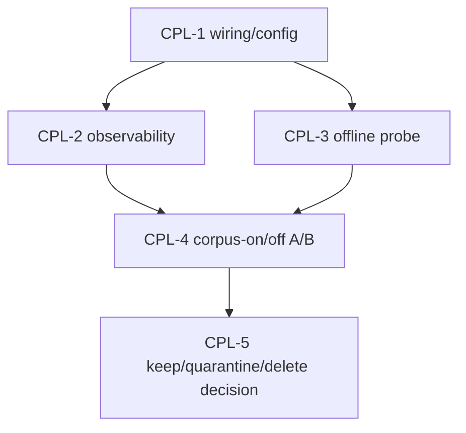

# Corpus-Augmented Prompt Lookup Revalidation

**Status**: ACTIVE-HIGH, CPL-1/2/3 complete; CPL-4 preflight ready 2026-07-03; A/B decision still open and now clean-window guarded
**Parent index**: [inference-acceleration-index.md](inference-acceleration-index.md)
**Priority**: high disk/capability ROI, below current G0/GPU and evidence-plane authority rows
**Related**: [speculative-decoding-mtp-refresh.md](speculative-decoding-mtp-refresh.md), [model-stack-single-source-update-pipeline.md](model-stack-single-source-update-pipeline.md), archived [hybrid-lookup-spec-decode.md](../archived/hybrid-lookup-spec-decode.md), archived [llama-server-prompt-lookup.md](../archived/llama-server-prompt-lookup.md)

## Objective

Decide whether the local code corpus at `/mnt/raid0/llm/cache/corpus` is a live
performance feature or reclaimable dead weight. The current artifact occupies
about `651G`, so it must either provide measured coding-task acceleration or be
quarantined/deleted by explicit operator decision.

## Current Findings

- Live `llama-server` commands do not pass n-gram/prompt-lookup corpus flags;
  active servers use draft-MTP where supported.
- No live process currently holds files under `/mnt/raid0/llm/cache/corpus`.
- Recent inference tap logs contain no `<reference_code>` or `## Reference Code`
  prompt-injection evidence.
- Production code still has corpus-injection call sites:
  `src/prompt_builders/builder.py:build_corpus_context()`,
  `src/api/routes/chat.py`, `src/api/routes/chat_pipeline/stream_adapter.py`,
  `src/graph/helpers.py`, and `src/api/routes/chat_delegation.py`.
- Direct `build_corpus_context()` testing returned an empty string before the
  2026-07-03 repair.
- 2026-07-03 repair: `build_corpus_context()` now resolves
  `RegistryLoader(validate_paths=False)`, gates on the parsed per-role
  `acceleration.corpus_retrieval` flag, emits structured log metadata for
  disabled/injected/slow/error outcomes, and suppresses retrievals above the
  configured slow-query threshold. The current live roles still return empty by
  design because their parsed role flag is `false`; this prevents the global
  `runtime_defaults.corpus_retrieval.enabled=true` from accidentally enabling
  prompt injection everywhere.
- Current `RegistryLoader(validate_paths=False)` reports
  `corpus_retrieval=False` for `frontdoor`, `coder_escalation`,
  `worker_general`, `architect_general`, and `ingest_long_context`, despite
  stale older YAML sections mentioning corpus retrieval.
- Forced retrieval against `/mnt/raid0/llm/cache/corpus/v3_sharded` can return
  snippets, but one realistic query took about `29s` for 3 snippets; short
  low-overlap queries returned no snippets in about `0.36s`.
- 2026-07-03 no-inference health probe artifact:
  `/mnt/raid0/llm/epyc-orchestrator/orchestration/reports/corpus_health_probe_20260703T112521Z.json`.
  Warm-cache observation over 6 representative coding queries: `6/6` returned
  snippets, `17` snippets total, `p50=0.331ms`, `p95=298.016ms`,
  `candidate_count_total=27`, `failure_count=0`, and
  `usable_for_online_prompt_injection=true` under a `5000ms` p95 threshold.
  This is health evidence only; it does not prove quality or end-to-end speed.
- 2026-07-03 A/B harness repair: `scripts/benchmark/corpus_quality_gate.py`
  now records per-prompt retrieval diagnostics in the corpus arm, reuses the
  corpus singleton across prompt pairs, supports no-inference `--preflight-only`,
  supports generation-only `--skip-judge`, and exposes `--min-score` /
  `--rag-min-score` so threshold candidates are explicit.
- No-inference quality-gate preflights show why the threshold must be explicit:
  `corpus_quality_preflight_20260703T124703Z.json` reproduced the old
  `min_score=0.5` behavior with `0/6` injected prompts and `ready_for_ab=false`;
  `corpus_quality_preflight_20260703T124756Z.json` used candidate
  `min_score=0.0` and returned `6/6` injected prompts, `3` snippets per prompt,
  `failure_count=0`, `p50=1.206ms`, and `ready_for_ab=true`. This only clears
  the lookup/injection preflight, not the live quality/speed A/B.
- 2026-07-03 live shakedown safety finding: a direct production-port
  `corpus_quality_gate.py` run while AutoPilot was active was aborted after one
  prompt pair and the partial artifact was deleted. The single contaminated row
  (`coder_escalation` async-retry, corpus 3 snippets, `471.5ms` lookup,
  baseline `12.7` t/s vs corpus `8.7` t/s) is not evidence because AutoPilot was
  concurrently using the same production fleet. Orchestrator now requires
  `--confirm-clean-window` for live generation and exits `75` when AutoPilot is
  active unless `--allow-active-autopilot` is passed for explicitly
  non-claim-grade live-load telemetry.
- 2026-07-04 doc correction: the architecture chapter no longer claims corpus
  injection is enabled for old-size coder roles or repeats stale `+8.7pp` /
  `+15.6pp` acceptance lifts. A live `RegistryLoader(validate_paths=False)`
  check confirms `frontdoor`, `coder_escalation`, `worker_general`,
  `architect_general`, and `ingest_long_context` all parse
  `acceleration.corpus_retrieval=false`; current enablement still waits on the
  clean-window CPL-4 A/B.

## Prioritized Task List

- [x] **CPL-1: Fix or explicitly retire the wiring path, no inference.**
  Repair `build_corpus_context()` registry loading, make per-role
  `corpus_retrieval` resolution explicit, and add fail-visible diagnostics when
  corpus retrieval is disabled by config, missing index, import failure, or slow
  query timeout. Done 2026-07-03 in orchestrator pending commit: current roles
  fail visible as `role_disabled` rather than hidden import failure.
- [x] **CPL-2: Add live observability.** Emit structured tap/log metadata when
  corpus snippets are injected: role, request/task id, index path, query n-grams,
  snippet count, context chars, retrieval latency, and timeout/failure reason.
  This must make "header only, no corpus" impossible to confuse with real use.
- [x] **CPL-3: Add a cheap offline health probe.** Provide a CLI probe over the
  v3 sharded corpus that runs representative coding queries and reports
  p50/p95 latency, snippets returned, candidate counts, and whether the current
  index is usable for online prompt injection. Done 2026-07-03 via
  `scripts/benchmark/corpus_health_probe.py` and focused tests; first report
  artifact is listed above.
- [ ] **CPL-4: Run a focused corpus-on/off A/B for coding tasks.** Compare
  corpus injection off vs on for `coder_escalation` and any intended cheap
  coding role. Use `scripts/benchmark/corpus_quality_gate.py --min-score 0.0`
  unless deliberately testing another threshold; the old `0.5` threshold
  preflights as a no-op. Capture latency, generated t/s, draft acceptance if
  available, quality, and injected-snippet telemetry. Live generation must run
  in a clean/isolated window (`--confirm-clean-window`; no active AutoPilot
  unless deliberately collecting non-claim telemetry with
  `--allow-active-autopilot`). This is not a production enablement gate unless
  it follows `/workspace/MEASUREMENT.md`.
- [ ] **CPL-5: Decide keep/quarantine/delete.** Keep only if the A/B shows a
  measured coding-task benefit and retrieval overhead is bounded. Otherwise
  mark `/mnt/raid0/llm/cache/corpus` reclaimable and preserve only the small
  build metadata/scripts needed to recreate it.

## Dependency Graph

## Cross-Cutting Concerns

- This is not the same as native draft-MTP. MTP may stay enabled while corpus
  injection is off; corpus work must not disturb current v6 draft-MTP serving.
- If role-level corpus enablement becomes a stack fact, it belongs in the
  generated stack-prior/descriptor pipeline rather than a stale local constant.
- Retrieval latency is part of the metric. A 29s snippet lookup is a regression
  even if the generated answer improves.
- Do not delete the `651G` corpus without an explicit operator decision after
  CPL-4/CPL-5 evidence.

## Key File Locations

- Corpus artifact: `/mnt/raid0/llm/cache/corpus/v3_sharded`
- Corpus service: `/mnt/raid0/llm/epyc-orchestrator/src/services/corpus_retrieval.py`
- Prompt wiring: `/mnt/raid0/llm/epyc-orchestrator/src/prompt_builders/builder.py`
- Chat call sites: `/mnt/raid0/llm/epyc-orchestrator/src/api/routes/chat.py`,
  `/mnt/raid0/llm/epyc-orchestrator/src/api/routes/chat_pipeline/stream_adapter.py`,
  `/mnt/raid0/llm/epyc-orchestrator/src/api/routes/chat_delegation.py`,
  `/mnt/raid0/llm/epyc-orchestrator/src/graph/helpers.py`
- Registry/config: `/mnt/raid0/llm/epyc-orchestrator/orchestration/model_registry.yaml`,
  `/mnt/raid0/llm/epyc-orchestrator/src/registry/registry_loader.py`
- Existing benchmark scaffold:
  `/mnt/raid0/llm/epyc-orchestrator/scripts/benchmark/corpus_quality_gate.py`

## Reporting Instructions

After any CPL step, update this handoff first, then
[inference-acceleration-index.md](inference-acceleration-index.md) if priority
or keep/delete status changes, and finally
[master-handoff-index.md](master-handoff-index.md) if it changes the active
queue. Record any numeric claims with protocol and era labels per
`/workspace/MEASUREMENT.md`.
