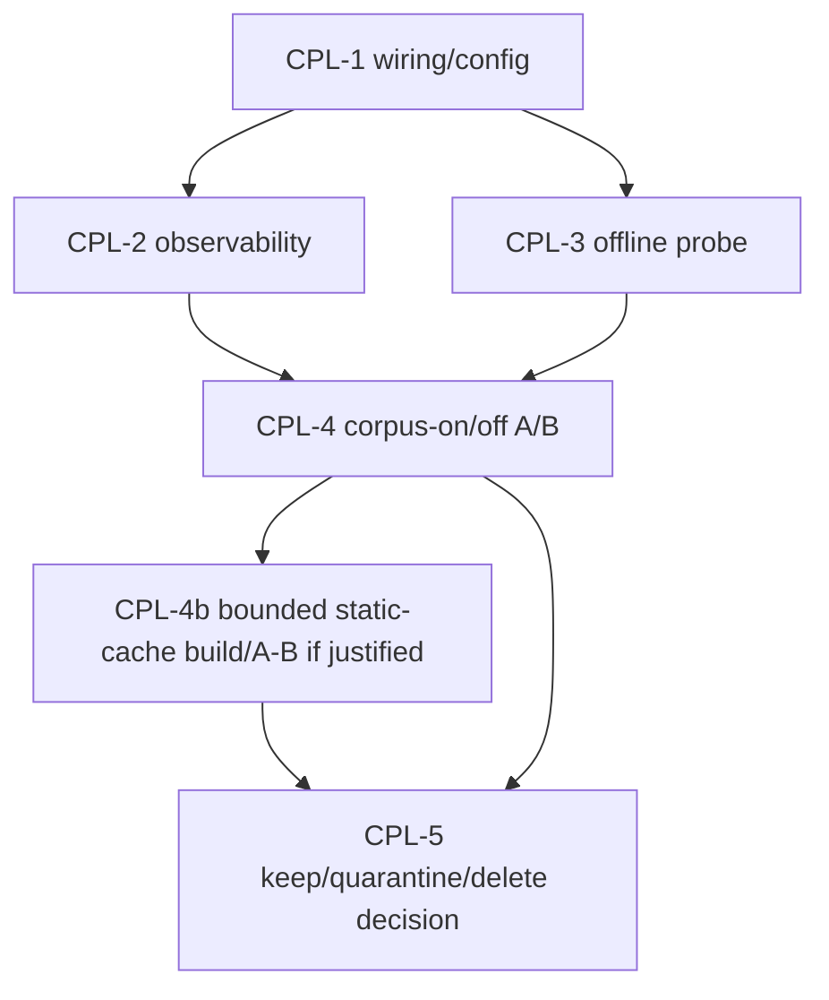

# Corpus-Augmented Prompt Lookup Revalidation

**Status**: ACTIVE-HIGH hypothesis, not proven ROI; CPL-1/2/3 complete; CPL-4 prompt-injection preflight ready 2026-07-04; worker prompt-injection support is default-off and code-task scoped in `epyc-orchestrator` `c0d5ee58`; native llama prompt-lookup/static-cache path still disabled for live roles; A/B decision open and clean-window guarded
**Parent index**: [inference-acceleration-index.md](inference-acceleration-index.md)
**Priority**: high option value because the corpus occupies about `651G`, below current G0/GPU and evidence-plane authority rows until code-writing A/B proves benefit
**Related**: [speculative-decoding-mtp-refresh.md](speculative-decoding-mtp-refresh.md), [model-stack-single-source-update-pipeline.md](model-stack-single-source-update-pipeline.md), archived [hybrid-lookup-spec-decode.md](../archived/hybrid-lookup-spec-decode.md), archived [llama-server-prompt-lookup.md](../archived/llama-server-prompt-lookup.md)

## Objective

Decide whether the local code corpus at `/mnt/raid0/llm/cache/corpus` is a live
performance feature or reclaimable dead weight. The current artifact occupies
about `651G`, so it must either provide measured coding-task acceleration or be
quarantined/deleted by explicit operator decision.

## Current Findings

- Live `llama-server` commands do not pass native n-gram/prompt-lookup corpus
  flags; active servers use draft-MTP where supported.
- Prompt-stuffing corpus retrieval is distinct from native llama prompt lookup:
  the former injects `## Reference Code` / `<reference_code>` snippets into the
  prompt, while the latter would pass lookup/static-cache flags to
  `llama-server` and draft tokens without prompt content.
- Recent inference tap logs are not the strongest corpus proof. The current
  proof is the corpus health/preflight artifacts plus live `RegistryLoader`
  role parsing.
- Production code still has corpus-injection call sites:
  `src/prompt_builders/builder.py:build_corpus_context()`,
  `src/api/routes/chat.py`, `src/api/routes/chat_pipeline/stream_adapter.py`,
  `src/graph/helpers.py`, and `src/api/routes/chat_delegation.py`.
- Direct `build_corpus_context()` testing returned an empty string before the
  2026-07-03 repair.
- 2026-07-03 repair: `build_corpus_context()` now resolves
  `RegistryLoader(validate_paths=False)`, gates on the parsed per-role
  `acceleration.corpus_retrieval` flag, emits structured log metadata for
  disabled/injected/slow/error outcomes, and suppresses retrievals above the
  configured slow-query threshold.
- Current live role parsing intentionally enables prompt-stuffing only for the
  frontdoor/coder lane: `frontdoor=True`, `coder_escalation=True`, and
  `worker_general=False`, `architect_general=False`, `ingest_long_context=False`
  for `acceleration.corpus_retrieval`. All five keep native `lookup=false`.
- Forced retrieval against `/mnt/raid0/llm/cache/corpus/v3_sharded` can return
  snippets, but one realistic query took about `29s` for 3 snippets; short
  low-overlap queries returned no snippets in about `0.36s`.
- 2026-07-03 no-inference health probe artifact:
  `/mnt/raid0/llm/epyc-orchestrator/orchestration/reports/corpus_health_probe_20260703T112521Z.json`.
  Warm-cache observation over 6 representative coding queries: `6/6` returned
  snippets, `17` snippets total, `p50=0.331ms`, `p95=298.016ms`,
  `candidate_count_total=27`, `failure_count=0`, and
  `usable_for_online_prompt_injection=true` under a `5000ms` p95 threshold.
  This is health evidence only; it does not prove quality or end-to-end speed.
- 2026-07-03 A/B harness repair: `scripts/benchmark/corpus_quality_gate.py`
  now records per-prompt retrieval diagnostics in the corpus arm, reuses the
  corpus singleton across prompt pairs, supports no-inference `--preflight-only`,
  supports generation-only `--skip-judge`, and exposes `--min-score` /
  `--rag-min-score` so threshold candidates are explicit.
- No-inference quality-gate preflights show why the threshold must be explicit:
  `corpus_quality_preflight_20260703T124703Z.json` reproduced the old
  `min_score=0.5` behavior with `0/6` injected prompts and `ready_for_ab=false`;
  `corpus_quality_preflight_20260703T124756Z.json` used candidate
  `min_score=0.0` and returned `6/6` injected prompts, `3` snippets per prompt,
  `failure_count=0`, `p50=1.206ms`, and `ready_for_ab=true`. This only clears
  the lookup/injection preflight, not the live quality/speed A/B.
- 2026-07-03 live shakedown safety finding: a direct production-port
  `corpus_quality_gate.py` run while AutoPilot was active was aborted after one
  prompt pair and the partial artifact was deleted. The single contaminated row
  (`coder_escalation` async-retry, corpus 3 snippets, `471.5ms` lookup,
  baseline `12.7` t/s vs corpus `8.7` t/s) is not evidence because AutoPilot was
  concurrently using the same production fleet. Orchestrator now requires
  `--confirm-clean-window` for live generation and exits `75` when AutoPilot is
  active unless `--allow-active-autopilot` is passed for explicitly
  non-claim-grade live-load telemetry.
- 2026-07-04 read-only audit: `/mnt/raid0/llm/cache/corpus/v3_sharded` is the
  live default corpus path, with `/mnt/raid0/llm/cache/corpus/mvp_index` still
  supported as a fallback; the full corpus tree is about `651G`. The loader is
  `CorpusRetriever`, `build_corpus_context()` is called by live chat,
  stream-adapter, delegation, and graph-helper paths on turn 0, and
  `corpus_quality_preflight_20260704T164539Z.json` shows `injected_count=6`,
  `6/6` injected prompts, `3` snippets per prompt, and no failures.
- These findings prove wiring/searchability only. They do **not** prove that
  corpus assistance improves code-writing quality or end-to-end latency.
- What remains disabled/unproven: native llama prompt lookup (`--lookup-*`,
  `--lookup-cache-static`) is not active for current frontdoor/coder roles; the
  old disabled `worker_pool.prompt_lookup` path is not used by the API;
  delegated specialist corpus context is default-off; and the quality-RAG branch
  is disabled unless `rag_enabled` is configured.
- 2026-07-04 no-inference scaffold: `scripts/corpus/build_static_ngram_cache.py`
  can export bounded text chunks from the v3 `snippets.db`, invoke
  `llama-lookup-create -m <model> -f <chunk> -lcs <part>`, and merge parts with
  `llama-lookup-merge`. Focused tests cover chunking, command construction,
  snippets filtering, dry-run behavior, and the large-scan guard. A tiny dry-run
  against the live corpus selected 3 Python snippets and wrote
  `/mnt/raid0/llm/tmp/corpus_static_ngram_dryrun_manifest.json` without loading
  a model or executing llama tools. This only makes the static-cache experiment
  ready; it does not justify a full corpus cache build.
- 2026-07-04 A/B harness alignment: `corpus_quality_gate.py` now defaults to
  the actual CPL-4 role pair, `coder_escalation` + `worker_general`, rather
  than `frontdoor` + `worker_general` + `architect_general`. The benchmark
  artifact records production role corpus flags separately from the benchmark's
  forced corpus arm, so `worker_general` can be tested without flipping live
  production config. Current no-inference preflight artifact:
  `orchestration/reports/corpus_quality_preflight_20260704T203100Z.json`
  (`6/6` prompts injected, `failure_count=0`, `ready_for_ab=true`,
  `coder_escalation.production_role_enabled=true`,
  `worker_general.production_role_enabled=false`,
  `benchmark_forces_prompt_injection=true`). This clears A/B setup only; no live
  generation or quality verdict has run.
- 2026-07-04 production-path guardrail: `epyc-orchestrator` `c0d5ee58` adds an
  explicit code-task scoped corpus eligibility path for roles whose
  `acceleration.corpus_retrieval` remains false. Current production behavior is
  unchanged because no live registry entry sets `task_scoped_roles` /
  `code_task_roles`, but a clean-window A/B can now enable `worker_general`
  without globally injecting corpus snippets into generic worker traffic. Focused
  tests prove configured worker code prompts can inject snippets, while
  configured non-code worker prompts still skip with `task_scope_disabled`.

## Prioritized Task List

- [x] **CPL-1: Fix or explicitly retire the wiring path, no inference.**
  Repair `build_corpus_context()` registry loading, make per-role
  `corpus_retrieval` resolution explicit, and add fail-visible diagnostics when
  corpus retrieval is disabled by config, missing index, import failure, or slow
  query timeout. Done 2026-07-03; current disabled roles fail visible as
  `role_disabled` rather than hidden import failure, while the frontdoor/coder
  lane now injects snippets when the query passes retrieval thresholds.
- [x] **CPL-2: Add live observability.** Emit structured tap/log metadata when
  corpus snippets are injected: role, request/task id, index path, query n-grams,
  snippet count, context chars, retrieval latency, and timeout/failure reason.
  This must make "header only, no corpus" impossible to confuse with real use.
- [x] **CPL-3: Add a cheap offline health probe.** Provide a CLI probe over the
  v3 sharded corpus that runs representative coding queries and reports
  p50/p95 latency, snippets returned, candidate counts, and whether the current
  index is usable for online prompt injection. Done 2026-07-03 via
  `scripts/benchmark/corpus_health_probe.py` and focused tests; first report
  artifact is listed above.
- [ ] **CPL-4: Run a focused corpus-on/off A/B for coding tasks.** Compare
  corpus injection off vs on for `coder_escalation` and `worker_general` if that
  role still handles any coding/refactor workload. Use
  `scripts/benchmark/corpus_quality_gate.py --min-score 0.0`
  unless deliberately testing another threshold; the old `0.5` threshold
  preflights as a no-op. Capture retrieval latency, generated t/s, quality, and
  injected-snippet telemetry. Live generation must run in a clean/isolated window
  (`--confirm-clean-window`; no active AutoPilot unless deliberately collecting
  non-claim telemetry with `--allow-active-autopilot`). This A/B decides whether
  prompt-stuffing corpus retrieval is useful, not whether native n-gram lookup
  should be enabled. **Setup status 2026-07-04**: default model selection and
  preflight metadata now match this role pair; next command for a claim-grade
  generation pass is `uv run python scripts/benchmark/corpus_quality_gate.py
  --models coder_escalation worker_general --min-score 0.0
  --confirm-clean-window --skip-judge --output <artifact>`, followed by judge or
  scoring only after the clean-window generation rows exist. If promoting live
  `worker_general` corpus injection after the A/B, use the new code-task scoped
  eligibility rather than a blanket `corpus_retrieval: true` flip.
- [ ] **CPL-4b: Corpus as a static n-gram *speculation* source (distinct mechanism from prompt-injection).** Design landed 2026-07-04 (subagent aba31618, verified against fork source), and the no-inference chunk/merge scaffold now exists at `scripts/corpus/build_static_ngram_cache.py`. **The llama.cpp wiring ALREADY EXISTS and is server-enabled — do NOT add a flag.** `--lookup-cache-static`/`-lcs` (`common/arg.cpp:1254-1259`, `.set_examples({...LLAMA_EXAMPLE_SERVER})`) loads a prebuilt static cache via `common_ngram_cache_load()` (`speculative.cpp:1669-1680`) and drafts tokens directly from the corpus bigram distribution (`ngram-cache.cpp:187-188`); builder `llama-lookup-create`/`-merge`/`-stats` already compiled. This is **µs-latency draft-acceptance** (changes decode t/s), *not* prompt content (the 29 s vector path). **Important sequencing**: do not spend CPU/disk on a large/full corpus-derived cache until CPL-4 first establishes that corpus-assisted code writing has value, unless the operator explicitly wants a throughput-only static-cache experiment. **Remaining gaps**: (1) no decision-grade corpus-derived cache exists — `/mnt/raid0/llm/tmp/lookup_cache.bin` is a 27 KB toy [unverified origin]; (2) `lookup-create` tokenizes the whole `-f` file in-memory, so use bounded chunking and `llama-lookup-merge`; (3) the launcher never passes `-lcs`; (4) **vocab-lock** — the cache stores token ids, so it MUST be built with the *target model's own tokenizer* and is not portable. Format is **bigram-only** (`LLAMA_NGRAM_STATIC=2`, no widening without code). **A/B (spec-only; run under MEASUREMENT.md in a clean window after the code-writing value gate or explicit operator approval)**: three arms on held-out code prompts — plain / context-only `--spec-type ngram-cache` (no `-lcs`) / corpus-static `-lcs corpus_ngram_static.bin` — measure **draft acceptance + decode t/s** (pair with correctness). **Bar to clear (measured 2026-07-04, GPU 27B-Q8):** context-only ngram is NEGATIVE — all variants regress (plain 28.4 → best ngram-simple 27.7; ngram-cache −8.1%), acceptance ~15% << break-even. The corpus-static arm's thesis is that a code-corpus bigram table lifts acceptance far above ~15%; report acceptance first because a corpus cache below ~40-50% acceptance is dead on arrival.
- [ ] **CPL-5: Decide keep/quarantine/delete.** Keep only if the prompt-injection
  A/B and/or static n-gram cache A/B shows a measured coding-task benefit with
  bounded overhead. Otherwise mark `/mnt/raid0/llm/cache/corpus` reclaimable and
  preserve only the small build metadata/scripts needed to recreate it.

## Dependency Graph

## Cross-Cutting Concerns

- This is not the same as native draft-MTP. MTP may stay enabled while corpus
  injection is off; corpus work must not disturb current v6 draft-MTP serving.
- If role-level corpus enablement becomes a stack fact, it belongs in the
  generated stack-prior/descriptor pipeline rather than a stale local constant.
- Do not enable corpus retrieval broadly for `worker_general` unless a separate
  mixed-workload A/B proves it does not regress non-code worker traffic; the
  current safe path is code-task scoped only.
- Retrieval latency is part of the metric. A 29s snippet lookup is a regression
  even if the generated answer improves.
- Do not delete the `651G` corpus without an explicit operator decision after
  CPL-4/CPL-5 evidence.

## Key File Locations

- Corpus artifact: `/mnt/raid0/llm/cache/corpus/v3_sharded`
- Static n-gram cache builder:
  `/mnt/raid0/llm/epyc-orchestrator/scripts/corpus/build_static_ngram_cache.py`
- Corpus service: `/mnt/raid0/llm/epyc-orchestrator/src/services/corpus_retrieval.py`
- Prompt wiring: `/mnt/raid0/llm/epyc-orchestrator/src/prompt_builders/builder.py`
- Chat call sites: `/mnt/raid0/llm/epyc-orchestrator/src/api/routes/chat.py`,
  `/mnt/raid0/llm/epyc-orchestrator/src/api/routes/chat_pipeline/stream_adapter.py`,
  `/mnt/raid0/llm/epyc-orchestrator/src/api/routes/chat_delegation.py`,
  `/mnt/raid0/llm/epyc-orchestrator/src/graph/helpers.py`
- Registry/config: `/mnt/raid0/llm/epyc-orchestrator/orchestration/model_registry.yaml`,
  `/mnt/raid0/llm/epyc-orchestrator/src/registry/registry_loader.py`
- Existing benchmark scaffold:
  `/mnt/raid0/llm/epyc-orchestrator/scripts/benchmark/corpus_quality_gate.py`

## Reporting Instructions

After any CPL step, update this handoff first, then
[inference-acceleration-index.md](inference-acceleration-index.md) if priority
or keep/delete status changes, and finally
[master-handoff-index.md](master-handoff-index.md) if it changes the active
queue. Record any numeric claims with protocol and era labels per
`/workspace/MEASUREMENT.md`.
