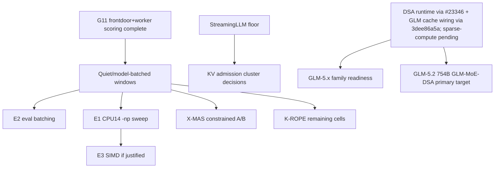

# Inference Acceleration — Active Index

**Purpose**: dispatch point for local inference optimization across CPU throughput, KV/context efficiency, speculative decoding, GPU-prep work, and model-serving experiments.
**Updated**: 2026-07-17 (GLM current-source DSA cache/runtime wiring closed + runtime `DSA-DENSE-MASK` classification + N5 index sync) — v6-consolidation row rewritten to CUTOVER-COMPLETE reality (v6+iqk LIVE since 2026-06-26); gemma-challenge row updated (K3/K5 done, onegraph DEFERRED, next = K4 + operator v6 quality-gate + K10/K11); gpu-cot-scaffold marked COMPLETE with autopilot-cost-lever successor; DFlash/DDTree converted to a fund-or-close decision row; checklist rows added for K4/K5/T4/T5/P6b/v6-iqk verification. Prior stamp 2026-07-05 carried 2026-07-11/14 row edits. // 2026-07-05 MI210 residency ladder 2-for-2 (122B IQ2 eval-parity PASSED + 80B-ingest IQ2 VIABLE), **CoT-scaffold REOPENED + VALIDATED on reasoning-bottlenecked tasks (GPQA reversal: scaffold-Qwable 73% vs nothink 48% = +12, 15 rescues/3 regr/0 truncation — the earlier code-distribution falsification was DISTRIBUTION-SPECIFIC; reconciles with amplifier-not-substitute, receiver latent capability is the gate); Qwable-standalone GPQA control DONE and dominated scaffold delivery (77% standalone > 73% scaffold), so standalone strong-reasoner routing is primary and scaffold is fallback for beneficiary-must-answer cases; verifier/selector best-of-N remains complementary but marginal on measured workloads**, **KV-quant (findings-05c L14) SCOPED → DEFER (marginal, rider-only, no dedicated GPU run — GDN O(1)/gemma SWA/aggregate weight-dominated; only qwen35 ~1/4 full-global @ single-stream 32–64k alive)**, **MTP-on-GPU-MoE CONVERGED ~neutral at production temp (curve: temp0 +6.5% / temp0.2 −1.6% (production) / temp0.6 −6.8%; `de447119f` neutralized the −12% → a WASH, not a no-go; the 3-way flip-flop root cause = measured arbitrary temps not the deployed config)**, **stream-K confirmed ALREADY the live CDNA2 MMQ path (`use_stream_k=true`) — not an un-tried bet**, eval-batch activation smoke completion, K-MEM completion, G11 frontdoor+worker scoring, and Granite warm embedder recipe refresh.
**History**: pre-compaction detail lives in [../archived/inference-acceleration-index-history-through-2026-06-19.md](../archived/inference-acceleration-index-history-through-2026-06-19.md).

**2026-07-17 GLM/DSA correction**: the GLM/DSA gate is no longer "wait for PR #21149"; the v6/v7 fork contains generic DeepSeek32 DSA via upstream #23346. GLM-5.2 UD-IQ2_M download/integrity, load-smoke, 4K/8K traces, and stale-binary true >64K runnability are recorded. A current-source audit found GLM cache/runtime wiring missing, and experimental-v7 commit `3dee86a5a` closed that gap by wiring `LLM_ARCH_GLM_DSA` to `llama_kv_cache_dsa`, aliasing the DeepSeek32 DSA graph, requiring live indexer tensors, and force-building GLM indexer Hadamard rotation tensors. Current-source `glm-dsa` / `deepseek32` synthetic tests, ASAN `glm-dsa`, and exact `READY` GLM smoke passed. Current-source fixed-`indexer_top_k=32` runtime scaling (`/mnt/raid0/llm/tmp/glm52-current-source-kv-scaling-20260717T130222Z/runtime_summary.md`) classified behavior as **DSA-DENSE-MASK**: Lightning/indexer caches engage, but prompt throughput declines with KV length (`23.81 -> 21.04 -> 17.28 t/s` at 2.9K/5.9K/11.9K prompt tokens). Current-source 32K needle/coherence then failed in both default-reasoning and reasoning-off modes: each run ingested ~24K prompt tokens, decoded 64 tokens, and returned HTTP 500 because generated output did not match `peg-native`; the hidden code was absent. Summary: `/mnt/raid0/llm/epyc-inference-research/data/glm52_dsa_probe/current_source_32k_needle_20260717T1755Z/summary.json`. The open gates are malformed-output root cause and quality recovery first; real sparse final-attention/native GLM-MTP only stay high-value if GLM quality is recovered.

**2026-07-16 control-plane additions**: the Architect→Reviewer control-plane series ([reviewer-control-plane-index.md](reviewer-control-plane-index.md)) appended **K22-K31** to [gemma-challenge-kernel-techniques-v7.md](gemma-challenge-kernel-techniques-v7.md) — P0s: grammar-sampler crash (`sampling.cpp:292`, blocks GBNF typed-decision emission on v7), GLM-5.2 glm-dsa load reconciliation (K23; feeds the empirical gate above), v7 non-spec base-decode regression root-cause (architect −9.24% K20 guard; spec paths near parity); P1-P3 quality-neutral levers (mmvq draft-tree verify widths, f16-vs-bf16 KV, Q8_0 8x8 repack, chunked GDN prefill, draft-path malloc, composed-spec state, EA-server/DSA audits). GPU sequencing operator-locked 1→4; teleport axis **AXA-1..3** appended to [mi210-big-model-and-acceleration-roadmap.md](mi210-big-model-and-acceleration-roadmap.md).

## Start Here

1. Read [master-handoff-index.md](master-handoff-index.md) for global priority and active inference-lane constraints.
2. Use `/workspace/MEASUREMENT.md` for benchmark claim grammar and cache-state labeling.
3. Coordinate all throughput-sensitive runs with [bulk-inference-campaign.md](bulk-inference-campaign.md). K-MEM Tulving, frontdoor G5 short-m@k, frontdoor+worker G11 AA-Omniscience, and architect G10 collection/scoring are complete; G12 tier calibration has accepted deterministic AA-Omniscience 4-class scoring and updated production role multipliers. Remaining clean-window work is the consolidated measurement batch, including DS-E1 dynamic-stack KV measurement, not more G12 scoring.
4. Do not revive closed speculative-decoding or NUMA tracks without their documented reopen trigger.
5. For llama.cpp work, use a dedicated feature branch/worktree and do not touch the production binary without an explicit rollout plan.

## Active Landscape

| Area | Owner handoff | Status | Next action |
|------|---------------|--------|-------------|
| Batched decode / eval batching | [batched-decode-measurement.md](batched-decode-measurement.md) | ACTIVE-HIGH; A3B E1 and E2 decision-grade evidence landed 2026-07-03, with E2 a 4.858x wall-minutes/eval keep-candidate. Default-off eval-batch metadata, warm `eval_batch_frontdoor`, guarded route rewrite, smoke probe, activation-window runner, and the 2026-07-05 smoke/rollback pass are packaged. | Representative EvalTower quality/reliability/throughput telemetry is now the remaining gate before any default path change. Dense-control E1 remains re-scope-only; do not start E3 solely from the A3B result. |
| Dynamic stack KV measurement | [bulk-inference-campaign.md](bulk-inference-campaign.md) | DS-E1 is now staged in the clean-window manifest; no production flip | Run only in the consolidated quiet window after AutoPilot/live llama-server blockers clear. |
| X-MAS / routing measurement dependency | [x-mas-text-routing.md](x-mas-text-routing.md), [routing-and-optimization-index.md](routing-and-optimization-index.md) | Enforce default-off; 2026-06-21 constrained-policy held-out A/B completed with `decision.status=hold` | Repair quality regressions before another attested quiet-window A/B; G5/G11 no longer block scheduling. |
| K-MEM / Tulving episodic benchmark | [research-evaluation-index.md](research-evaluation-index.md), [bulk-inference-campaign.md](bulk-inference-campaign.md) | Completed/scored; corrected score in research `9e63af0` | Use failure-mode report for follow-up design; no memory-routing promotion. |
| RoPE long-context probes | [research-evaluation-index.md](research-evaluation-index.md), [yarn-context-extension-research.md](yarn-context-extension-research.md) | Partial 4K/8K/16K evidence; worker path blocked by Gemma4 MTP serving issue | Resume K-ROPE cells in clean model-batched windows after active lane clears. |
| KV compaction stack | [attention-matching-kv-compaction.md](attention-matching-kv-compaction.md), [triattention-kv-selection.md](triattention-kv-selection.md), [memento-block-reasoning-compression.md](memento-block-reasoning-compression.md), [streaming-llm-baseline.md](streaming-llm-baseline.md) | Quantization deployed; AM merged; Expected Attention deployed; Memento S2 and StreamingLLM sweep remain open | Run current-stack long-context/coding refresh and StreamingLLM floor sweep before more rollout decisions. |
| CPU throughput backlog | [cpu-inference-optimization-index.md](cpu-inference-optimization-index.md) | Active queue compacted; high-value gates are batched decode, DSA, MoE-Spec, and roofline calibration | Start with the CPU index and owning handoffs; do not use old historical sections as current instructions. |
| Frontdoor drafter / speculative decoding | [gpu-drafter-mi200-investigation.md](gpu-drafter-mi200-investigation.md) | G0 self-MTP baseline is measured from live production logs (2026-07-03): frontdoor α=0.6582, architect_general α=0.6854, worker_general α=0.8256, failed MTP roles none. External qwen35/frontdoor N5 retest is now decision-grade on v7 (`n5_spec_on` accepted `376/376`; `positive_mtp` `355/401`; `spec_off` `0` draft tokens; 2026-07-16). | Use the N5 retest as the external-drafter acceptance baseline; next work is Stage-1/2 end-to-end speed/co-residency economics, not another alpha retest. |
| MTP spec-dec refresh (new heads) | [speculative-decoding-mtp-refresh.md](speculative-decoding-mtp-refresh.md) | UPDATED 2026-07-11: gemma-4-31B dense MTP benched but Pareto-dominated by the 26B-A4B worker -> no promotion; Qwen/native-MTP port surface is present in `llama.cpp-experimental` (`draft-mtp`, MTP context, Qwen graph, help flags) and the CPU build/help smoke passed; architect/Qwen3.5-27B MTP remains dead (GDN wall). | T1/T2/T3 done. Remaining MTP work is gated: T4 Qwen3.6-35B-A3B model-load/gate-bench, T5 gemma-4-26B-A4B `draft_max` sweep, and qwen-mtp P6b operator bench; P7 FR-Spec vocab-trim is optional/post-reconcile. There is no ungated MTP implementation action in this index. intake-721..725; intake-737..742. |
| llama.cpp v6 consolidation (framework rebase + kernel port) | [llamacpp-v6-consolidation.md](llamacpp-v6-consolidation.md), [v6-iqk-promotion.md](v6-iqk-promotion.md) | **CUTOVER COMPLETE 2026-06-26 — v6+iqk LIVE in production** (GGML_IQK=1; beats ik_llama +11% on the gemma worker; ik_llama fully deprecated, no second binary). Stage 1 finding preserved: CCD is `#ifndef GGML_USE_OPENMP` -> compiled out in prod (OpenMP-ON) -> GGML_CCD_* env vars vestigial. | Open items: live throughput+garbage verification + clean post-reboot canonical bench (the [../completed/iqk-port.md](../completed/iqk-port.md) residual is tracked in [v6-iqk-promotion.md](v6-iqk-promotion.md)); resolve 5 NEEDS-OPERATOR-REVIEW commits; f1-paged-attn fold; GGML_CCD_* env cleanup; concurrent 4×quarter+MTP aggregate bench; -np 8 paged-attn A/B redo. (updated 2026-07-14) |
| GPU acceleration / MI210 | [gpu-drafter-mi200-investigation.md](gpu-drafter-mi200-investigation.md), [gpu-acceleration-path.md](gpu-acceleration-path.md), [agentic-rocm-kernel-authoring.md](agentic-rocm-kernel-authoring.md), [rocm-verify-profile-backend.md](rocm-verify-profile-backend.md); **MI210 campaign 2026-07-03/05:** [roadmap](mi210-big-model-and-acceleration-roadmap.md) · [summary](mi210-speed-campaign-summary.md) · [findings-05b](fable5-window2-findings-05b-mi210-inference-architecture.md) · [05c](fable5-window2-findings-05c-mi210-lever-category-matrix.md) · [cot-sidecar — study COMPLETE 2026-07-06, archived; live successor: scaffold-autopilot-cost-lever-deployment.md](../completed/gpu-cot-scaffold-sidecar.md) | **Speed campaign COMPLETE + capability/residency phase LIVE.** Single-stream dense-Q8 exhausted (+37%→40.4 t/s); aggregate solved by config (FA + bf16, up to 1548 t/s); both occupancy-rewrite bets falsified. **Residency ladder 2-for-2:** 122B IQ2 VIABLE + **eval-parity PASSED judge-free** (Δ0.0pp, p=1.000) and 80B-ingest IQ2 VIABLE (55.8 single / 405 agg-ceiling @B128, PPL 5.77). **N5 external-drafter alpha cleared 2026-07-16**; Stage-1/2 speed/co-residency is now the open drafter work. **CoT-scaffold REOPENED + VALIDATED on reasoning-bottlenecked tasks (GPQA REVERSAL 2026-07-05).** Scaffold-Qwable beat nothink on GPQA (**73% vs 48%**, 15 rescues/3 regressions/0 truncation), but **Qwable-standalone control dominated scaffold** (**77% > 73%**), proving Qwable is the stronger GPQA reasoner and the scaffold is a lossy delivery path through the 35B. Deployment split: route reasoning-heavy tasks to Qwable standalone when it can answer; use scaffold only when the beneficiary must answer because of tools/context/role constraints. **VERIFIER/SELECTOR best-of-N is complementary but measured marginal** (cruxeval/GSM8K/GPQA envelope; systematic errors, small stochastic gap). **KV-quant (findings-05c L14) SCOPED → DEFER** (marginal, rider-only, no dedicated GPU run — GDN O(1)/gemma SWA/aggregate weight-dominated → 3/4 resident classes ~0 payoff; only qwen35 ~1/4 full-global @ single-stream 32–64k alive; a ~2–4h rider on a future dense-full-global long-ctx role, not a speed lever). **MTP-on-GPU-MoE CONVERGED ~neutral at production temp** (curve 35B-A3B/seed42: temp0 +6.5% / temp0.2 −1.6% (PRODUCTION, registry intent 0.1–0.3) / temp0.6 −6.8%; `de447119f` MMQ-verify **neutralized** the old −12% → a WASH, no longer a no-go; the temp-0 +6.5% and temp-0.6 −6.8% are two points of one curve — the 3-way flip-flop came from measuring arbitrary temps not the deployed config; findings-05c §Axis-D L8 + `feedback_production_sampling_seed_not_temp0`). **stream-K confirmed ALREADY the live CDNA2 MMQ path** (`use_stream_k=true`; the 104-WG grid = stream-K working as designed — not a "bigger separate bet"; residual = `nsm→k·nsm` + compact-LDS ~2-line, +0–10%, pmc-CSV-gated). All experimental-HOLD (operator-only prod push, CPU-correctness gate). | Roadmap gating experiments before building (Axes A/B): expert-routing-skew profile (offload/REAP viability), Stage-1/2 GPU-drafter speed economics, GLM-5.2 sparse-vs-dense/quality gate before offload work; **GPU reasoner next**: codify Qwable standalone routing for reasoning-heavy tasks, and separately register/codify the scaffold fallback for beneficiary-must-answer cases behind difficulty_band + task-class gates. |
| GPU reasoner / Qwable routing | [scaffold-autopilot-cost-lever-deployment.md](scaffold-autopilot-cost-lever-deployment.md), research registry `qwable_v1_iq4xs` | ✅ 2026-07-17 expanded IQ4_XS `default+expanded` gate passed `18/18` on MI210 plain (`106.65 t/s`), MI210 `ngram-mod` (`106.66 t/s`, neutral), and CPU plain (`15.96 t/s`). Research routing is codified as plain reasoning-off IQ4_XS standalone for reasoning-heavy tasks; scaffold remains beneficiary-must-answer fallback. | Stack-managed hosting/composite-route wiring remains in the scaffold handoff; ngram is not a default Qwable speed lever without per-task evidence. |
| DSA / DeepSeek V3.2 / GLM-5.1 | [llama-cpp-dsa-contribution.md](llama-cpp-dsa-contribution.md), [deepseek-v4-flash-cpu-port.md](deepseek-v4-flash-cpu-port.md), [glm51-reap-cpu-evaluation.md](glm51-reap-cpu-evaluation.md) | Active tracker, user/inference-gated; PR #21149 premise superseded by generic DSA via upstream #23346; GLM-5.2 stale-binary true >64K runnability observed; current-source GLM DSA cache/runtime wiring closed on experimental-v7 `3dee86a5a`; runtime scaling now classifies final attention as **DSA-DENSE-MASK**; 32K current-source needle/coherence failed on malformed `peg-native`. | Root-cause GLM malformed output before role claims; implement/profile a real sparse final-attention path only if GLM quality is recoverable. |
| GLM-5.2 (PRIMARY GLM target) | [glm51-reap-cpu-evaluation.md](glm51-reap-cpu-evaluation.md), [llama-cpp-dsa-contribution.md](llama-cpp-dsa-contribution.md) | Download/integrity, short load-smoke, 4K/8K traces, true >64K prompt runnability, current-source GLM DSA cache/runtime wiring, runtime `DSA-DENSE-MASK` classification, and current-source 32K needle failure are recorded; intake-699, supersedes GLM-5.1. | GLM-5.2 (754B GLM-MoE-DSA, MIT) remains research-only and quality-blocked. Next: malformed-output root cause; do not promote or prioritize native GLM-MTP/sparse final-attention from runnability alone. |
| Amortized KV-cache synthesis (AM watch) | [summary-token-attention-readiness.md](summary-token-attention-readiness.md) | GATED: no public code + GPU-CPT required; watch-item only | Still — amortized KV-cache synthesis (intake-708) watch-item; primary tracker summary-token-attention-readiness.md. NB deployed default compactor is Expected-Attention, not AM. (added 2026-06-20 via research-intake batch deep-dive) |
| Kimi-K2.7-Code (coder_escalation candidate) | large-MoE completed ledger (2026-06-20 addendum) | DEFERRED on storage + operator approval | Kimi-K2.7-Code (~1T MoE, intake-703) — coder_escalation candidate, deferred: raid0 only ~633 GB free (Q4_K_M 620 GB near-blocker; Q3_K_M 489 GB), MoonViT unsupported in fork. See the large-moe completed ledger 2026-06-20 addendum. (added 2026-06-20 via research-intake batch deep-dive) |
| Linear / recurrent architecture watches | [lightning-attention-port.md](lightning-attention-port.md), [log-linear-gated-deltanet-readiness.md](log-linear-gated-deltanet-readiness.md), [summary-token-attention-readiness.md](summary-token-attention-readiness.md), [engram-conditional-memory.md](engram-conditional-memory.md) | Mostly monitoring or role-decision gated | Activate only when the owning handoff's evidence template or checkpoint availability gate is satisfied. |
| Future context extension | [yarn-context-extension-research.md](yarn-context-extension-research.md) | Deferred pending datasets and RoPE bounds | Use Tulving 200ch and RoPE collapse points to set the next YaRN quality gate. |

## Additional Active References

These are active acceleration or model-serving references with narrow gates. They are indexed here so they do not become invisible, but they should not displace the current clean-window and CPU-throughput queues unless their gate fires.

| Handoff | Current role | Next action |
|---------|--------------|-------------|
| [angelslim-techniques-evaluation.md](angelslim-techniques-evaluation.md) | Sub-2-bit/STQ and SpecExit monitor. | Track upstream artifacts; avoid local implementation until a concrete mergeable kernel or checkpoint exists. |
| [delta-mem-reproduction.md](delta-mem-reproduction.md) | Frozen-memory topology spike; mechanical setup passed, accuracy/GPU-scale gates open. | Run only after the named reproduction/gpu-scale gate is approved. |
| [intra-process-tensor-parallel-decode.md](intra-process-tensor-parallel-decode.md) | Dormant TP decode reference. | Reopen only after its topology/workload checklist proves single-session saturation matters. |
| [multiscreen-attention-evaluation.md](multiscreen-attention-evaluation.md) | Checkpoint/research monitor for multiscreen attention. (intake-813 Titans-sleep added 2026-07-14 via research-intake — RIU in handoff) | Continue monitoring; no inference until pretrained artifacts and a current gate exist. |
| [qwen36-27b-cpu-feasibility.md](qwen36-27b-cpu-feasibility.md) | Candidate dense-model feasibility note. | Do a roofline/load-smoke only if the model becomes a real role candidate. |
| [tq3-quantization-evaluation.md](tq3-quantization-evaluation.md) | TurboQuant/TQ3 upstream monitor. (+ lossless-weight-compression sub-area — intake-815/816/817/818 added 2026-07-14 via research-intake — RIU in handoff; verdict: close for inference, ~11-12 bpw loses to Q4_K_M) | Watch PR #21089/ChunkKV; do not merge TQ3_1S. |
| [scaffold-autopilot-cost-lever-deployment.md](scaffold-autopilot-cost-lever-deployment.md) | DESIGN handoff (2026-07-06) — deploy the now-COMPLETE CoT scaffold as an episodic-memory-gated CPU-cost lever in autopilot's existing 4D-Pareto/q_reward optimization; downstream of [gpu-cot-scaffold-sidecar.md](../completed/gpu-cot-scaffold-sidecar.md). | Operator + live-autopilot-agent gated (T0.1: coordinate before any `scripts/autopilot/*` or capability-registry edit). No code/measurement yet. |
| [dflash-block-diffusion-speculation.md](../completed/dflash-block-diffusion-speculation.md), [tree-draft-forward-port-plan.md](tree-draft-forward-port-plan.md) | **DFlash/DDTree — FUND-OR-CLOSE decision** (was a dormant watch). Both activation gates fired: MI210 landed 2026-07-02; M0 α baseline measured 2026-07-03. **BUT** every production target now ships a native MTP head, and tree-draft Phase-1b was shelved 2026-07-06 on exactly that ground. | Decision leans **confirm-negative** — the only remaining opening is a narrow MTP-less niche. Close unless such a niche materializes. |
| [tree-draft-forward-port-plan.md](tree-draft-forward-port-plan.md) | DySpec tree-draft port; **Phase 1a VALIDATED 2026-07-06** on the v7-candidate (engine correct, draft-tree==draft-simple bit-for-bit) but uncompetitive vs embedded MTP on MTP-equipped targets (MTP 41.9 ≫ ext-draft ~18 < plain 31). | Phase 1b **SHELVED** 2026-07-06 — GLM-5.2 also ships an MTP head (inert stub on our fork); no MTP-less niche remains. Native-GLM-MTP forward-graph port is the better future lever once GLM-5.2 runnability and DSA-indexer engagement are proven. |
| [gemma-challenge-kernel-techniques-v7.md](gemma-challenge-kernel-techniques-v7.md) | Gemma Challenge kernel techniques folded into v7-experimental workflow (production-freeze rails, hard MMLU-Pro/GPQA gate). **ONEGRAPH structural check ✅ + HIP graph infra ✅ + K2 MI210 bench ✅ (2026-07-11)**. Preconditions re-audited (P1/P2/warm-up CONFIRMED; P3 scoped to gemma4 branch). K2: per-decode HIP graph capture engages on MI210 (gfx90a, ROCm 6.2, existing `build-hip`) and is net-positive — Q8 decode **+4.3%** (A4B) / **+6.1%** (dense 31B), Q8 MTP spec-dec **+25%** (A4B MoE) / **+3.4%** (dense 31B); output numerically transparent. Scope: lossless only (observation-grade numbers). **K3 done ✅ 2026-07-11** (answered by K1 audit — no CPU win). **K4/N5 drafter-α done ✅ 2026-07-16** on v7 `da1bf5e2f`: `n5_spec_on` accepted `376/376`, `positive_mtp` accepted `355/401`, `spec_off` emitted `0` draft tokens. **K5 quality-gate wiring done ✅ 2026-07-14** (runner + comparator built; both repos wired). **K24 closed ✅ 2026-07-17**: paired quiet CPU rerun removed the old large base-decode regression as a v7-source blocker (`frontdoor -2.64%`, `architect -3.05%`, `ingest +1.00%` current v7 vs production); the remaining issue is production/current host CPU throughput drift, now tracked as K34. **K26 done ✅ 2026-07-17**: BF16 KV is not a default win on MI210/Qwen3.6-35B (`f16/f16` server median `104.375 t/s`; `bf16/bf16` `100.224`; mixed BF16 K/V `88-91`; raw bench mixed arms collapse to `~12.9 t/s`). **onegraph single-graph fold DEFERRED** (very-high effort, lower-EV — it attacks the already-optimal draft loop, not the verify thrash; no longer "biggest EV"). Lever A implemented → NEUTRAL → reverted (patch preserved); GRAPH_OPT rejected. | **Next:** operator v6 MMLU-Pro/GPQA-Diamond baseline (SOLE remaining gate unblocking v7 promotion of the banked GPU wins: HIP graphs +25% spec-dec, MMVQ→MMQ +17–32%, bf16 state +16–21%); **K34** CPU host-throughput drift root-cause so future CPU A/Bs are not poisoned; **K10** Lever-A land/drop decision; **K11** gemma4 MTP HIP non-determinism root-cause (correctness flag; spec-dec A/Bs must run quiesced + sequential + fresh-server). Coordinate with gpu-drafter-mi200-investigation.md. |

## Closed / Historical Anchors

These are not active work queues. Read their completed handoffs before reopening:

- NUMA 4-way parallel and page-cache prewarm are deployed/complete.
- Hadamard KV quantization is production config.
- Qwen3.6 production upgrade is archived.
- Corpus-augmented prompt lookup is completed and reclaimed:
  [corpus-augmented-prompt-lookup-revalidation.md](../completed/corpus-augmented-prompt-lookup-revalidation.md).
  The 2026-07-04 clean-window A/B did not show prompt-injection ROI, the
  operator declined the optional static n-gram experiment, and
  `/mnt/raid0/llm/cache/corpus` was deleted to recover about `651G`.
- Peer-verifier speculation, MAB tree-shape selector, MTP on hybrid, hybrid SSM slot-promotion, NUMA_MIRROR, DFlash on Q4_K_M, and dynamic expert selection are closed or no-go for their measured targets.
- [Kernel reconciliation audit](../completed/kernel-reconciliation-audit.md) is complete: the read-only 2026-07-06 audit proved the GPU-opts line and prod/bench iqk-CPU line are cleanly separable and underwrote the validated v7-candidate. Future v7 production promotion remains operator-gated; do not reopen the audit itself without a new divergence.
- Completed accelerator history is preserved in `handoffs/completed/` and in the dated archive linked at the top of this file.

## Dependency Graph

**Cross-cutting (added 2026-06-20 via research-intake batch deep-dive)**: the ~633 GB raid0 free-space gate bounds BOTH GLM-5.2 and Kimi-K2.7, but asymmetrically — GLM-5.2 escapes it via unsloth UD-IQ2 (~238 GB), while Kimi-K2.7 stays storage-tight even at Q2_K (373 GB) and is a near-blocker at Q4_K_M (620 GB). Do not double-count the same headroom across both.

## Reporting

After completing an acceleration item:

1. Update the owning handoff first.
2. Update this index only if the live queue, gate, or dependency order changes.
3. Append `progress/YYYY-MM/YYYY-MM-DD.md` with artifacts, command lines, cache state, and hardware/runtime state.
4. If a result changes routing or stack deployment, update [routing-and-optimization-index.md](routing-and-optimization-index.md) and the relevant stack governance handoff.

## Progress checklist

- [ ] Batched decode E2: EvalTower quality/reliability/throughput telemetry gate before default flip
- [ ] DS-E1 dynamic-stack KV measurement in consolidated quiet window
- [x] External qwen35/frontdoor drafter alpha retest (`n5_spec_on` 376/376, decision-grade) ✅ 2026-07-16
- [x] CoT-scaffold: Qwable-standalone GPQA control completed — standalone 77% beat scaffold 73%, so standalone routing is primary. ✅ 2026-07-05
- [x] GPU reasoner evidence: Qwable quiet-host IQ4/Q8 strict-output + top-level `json_schema` harness gate closed; scaffold/selector stubs remain non-deployable ✅ 2026-07-17
- [x] GPU/CPU reasoner task-quality first slice: Qwable IQ4_XS and Q8_0 both passed `6/6` deterministic tasks on MI210 and CPU; no Q8-only advantage found in the small slice ✅ 2026-07-17
- [x] GPU reasoner: codify Qwable standalone routing for reasoning-heavy tasks + scaffold fallback only for beneficiary-must-answer cases; expanded IQ4_XS gate passed `18/18` on MI210 plain/`ngram-mod` and CPU plain, with ngram neutral ✅ 2026-07-17
- [ ] Verifier/selector best-of-N harness (driver_verifier.py) run
- [x] GLM-5.2 UD-IQ2_M download integrity + stale-binary load + true >64K runnability probe ✅ 2026-07-17
- [x] GLM-5.2 expert-routing-skew profile on production-representative prompts: near-uniform global aggregate (`top_32=15.19%`, entropy `0.9987`) with weak layer-local skew; generic hot-expert offload/REAP not justified without a narrower role-specific corpus ✅ 2026-07-17
- [x] GLM-5.2 static sparse-vs-dense audit: pre-fix source left GLM DSA cache wiring open; generic DSA final attention is DSA-DENSE-MASK-LIKELY, not proven sparse compute ✅ 2026-07-17
- [x] GLM-5.2 current-source DSA cache/runtime reconciliation: experimental-v7 `3dee86a5a` wires GLM to `llama_kv_cache_dsa` + DeepSeek32 DSA graph; synthetic tests, ASAN, and exact `READY` GLM smoke passed ✅ 2026-07-17
- [x] GLM-5.2 runtime sparse-vs-dense classification: fixed-`indexer_top_k=32` current-source scaling run classified final attention as **DSA-DENSE-MASK** (`23.81 -> 21.04 -> 17.28 t/s` as prompt tokens grew `2900 -> 5906 -> 11921`) ✅ 2026-07-17
- [x] GLM-5.2 current-source 32K long-context needle/coherence executed and failed on malformed `peg-native`; hidden code absent in default-reasoning and reasoning-off arms ✅ 2026-07-17
- [ ] GLM-5.2 malformed-output root cause before reviewer/architect quality gates or acceleration spend
- [ ] GLM-5.2 real sparse final-attention implementation/profiling only if quality is recoverable
- [x] Bonsai-27B Q1_0 CPU+MI210 prompting gate executed: 6/8 strict probes passed, short instruction-format probe failed on both devices; not role-ready ✅ 2026-07-17
- [x] Ternary Bonsai Q2_g64 CPU+MI210 runtime/coherence smoke passed on experimental v7; Q2_0 offset mismatch remains separate ✅ 2026-07-17
- [x] Ternary Bonsai Q2_g64 strict quality/throughput follow-up executed: quality passed only 6/8, raw MI210/CPU p512-tg128 control was `10.53`/`8.39` decode t/s, and realistic MI210 `ngram-mod` structured-copy improved `9.8 -> 22.9` t/s but remains speed-only because output retained empty `<think>` tags ✅ 2026-07-17
- [x] Qwen3-VL-8B local image runtime/coherence smoke passed on experimental v7 after rebuilding `llama-mtmd-cli`; CPU shapes and MI210 OCR fixtures both coherent ✅ 2026-07-17
- [ ] Ternary Bonsai Q2_0 artifact/runtime offset-mismatch investigation before retry; Q2_g64 prompt/template or broader quality work only if tiny-quant role remains interesting
- [ ] StreamingLLM floor sweep + KV admission cluster decisions
- [ ] Operator v6 quality-gate baseline (K5 MMLU-Pro/GPQA-Diamond) -> promote banked GPU wins to v7
- [x] K4 drafter-α baseline on real task corpus (`summary.json` decision_grade=true) ✅ 2026-07-16
- [ ] T4 Qwen3.6-35B-A3B MTP model-load / gate-bench
- [ ] T5 worker gemma-4-26B-A4B `draft_max` sweep
- [ ] P6b qwen-mtp model-load operator gate-bench
- [ ] v6-iqk live throughput+garbage verification + clean post-reboot canonical bench
