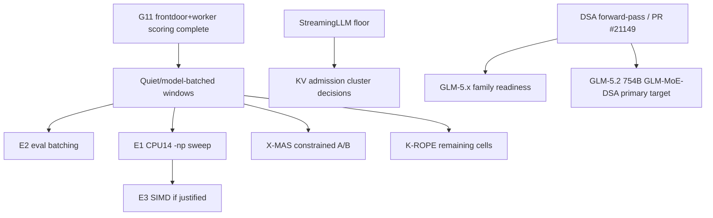

# Inference Acceleration — Active Index

**Purpose**: dispatch point for local inference optimization across CPU throughput, KV/context efficiency, speculative decoding, GPU-prep work, and model-serving experiments.
**Updated**: 2026-07-05 MI210 residency ladder 2-for-2 (122B IQ2 eval-parity PASSED + 80B-ingest IQ2 VIABLE), **CoT-scaffold REOPENED + VALIDATED on reasoning-bottlenecked tasks (GPQA reversal: scaffold-Qwable 73% vs nothink 48% = +12, 15 rescues/3 regr/0 truncation — the earlier code-distribution falsification was DISTRIBUTION-SPECIFIC; reconciles with amplifier-not-substitute, receiver latent capability is the gate); verifier/selector best-of-N now COMPLEMENTARY not replacement (harness BUILT, `driver_verifier.py`); Qwable-standalone GPQA control PENDING**, **KV-quant (findings-05c L14) SCOPED → DEFER (marginal, rider-only, no dedicated GPU run — GDN O(1)/gemma SWA/aggregate weight-dominated; only qwen35 ~1/4 full-global @ single-stream 32–64k alive)**, **MTP-on-GPU-MoE CONVERGED ~neutral at production temp (curve: temp0 +6.5% / temp0.2 −1.6% (production) / temp0.6 −6.8%; `de447119f` neutralized the −12% → a WASH, not a no-go; the 3-way flip-flop root cause = measured arbitrary temps not the deployed config)**, **stream-K confirmed ALREADY the live CDNA2 MMQ path (`use_stream_k=true`) — not an un-tried bet**, eval-batch activation smoke completion, K-MEM completion, G11 frontdoor+worker scoring, and Granite warm embedder recipe refresh.
**History**: pre-compaction detail lives in [../archived/inference-acceleration-index-history-through-2026-06-19.md](../archived/inference-acceleration-index-history-through-2026-06-19.md).

## Start Here

1. Read [master-handoff-index.md](master-handoff-index.md) for global priority and active inference-lane constraints.
2. Use `/workspace/MEASUREMENT.md` for benchmark claim grammar and cache-state labeling.
3. Coordinate all throughput-sensitive runs with [bulk-inference-campaign.md](bulk-inference-campaign.md). K-MEM Tulving, frontdoor G5 short-m@k, frontdoor+worker G11 AA-Omniscience, and architect G10 collection/scoring are complete; G12 tier calibration has accepted deterministic AA-Omniscience 4-class scoring and updated production role multipliers. Remaining clean-window work is the consolidated measurement batch, including DS-E1 dynamic-stack KV measurement, not more G12 scoring.
4. Do not revive closed speculative-decoding or NUMA tracks without their documented reopen trigger.
5. For llama.cpp work, use a dedicated feature branch/worktree and do not touch the production binary without an explicit rollout plan.

## Active Landscape

| Area | Owner handoff | Status | Next action |
|------|---------------|--------|-------------|
| Batched decode / eval batching | [batched-decode-measurement.md](batched-decode-measurement.md) | ACTIVE-HIGH; A3B E1 and E2 decision-grade evidence landed 2026-07-03, with E2 a 4.858x wall-minutes/eval keep-candidate. Default-off eval-batch metadata, warm `eval_batch_frontdoor`, guarded route rewrite, smoke probe, activation-window runner, and the 2026-07-05 smoke/rollback pass are packaged. | Representative EvalTower quality/reliability/throughput telemetry is now the remaining gate before any default path change. Dense-control E1 remains re-scope-only; do not start E3 solely from the A3B result. |
| Dynamic stack KV measurement | [bulk-inference-campaign.md](bulk-inference-campaign.md) | DS-E1 is now staged in the clean-window manifest; no production flip | Run only in the consolidated quiet window after AutoPilot/live llama-server blockers clear. |
| X-MAS / routing measurement dependency | [x-mas-text-routing.md](x-mas-text-routing.md), [routing-and-optimization-index.md](routing-and-optimization-index.md) | Enforce default-off; 2026-06-21 constrained-policy held-out A/B completed with `decision.status=hold` | Repair quality regressions before another attested quiet-window A/B; G5/G11 no longer block scheduling. |
| K-MEM / Tulving episodic benchmark | [research-evaluation-index.md](research-evaluation-index.md), [bulk-inference-campaign.md](bulk-inference-campaign.md) | Completed/scored; corrected score in research `9e63af0` | Use failure-mode report for follow-up design; no memory-routing promotion. |
| RoPE long-context probes | [research-evaluation-index.md](research-evaluation-index.md), [yarn-context-extension-research.md](yarn-context-extension-research.md) | Partial 4K/8K/16K evidence; worker path blocked by Gemma4 MTP serving issue | Resume K-ROPE cells in clean model-batched windows after active lane clears. |
| KV compaction stack | [attention-matching-kv-compaction.md](attention-matching-kv-compaction.md), [triattention-kv-selection.md](triattention-kv-selection.md), [memento-block-reasoning-compression.md](memento-block-reasoning-compression.md), [streaming-llm-baseline.md](streaming-llm-baseline.md) | Quantization deployed; AM merged; Expected Attention deployed; Memento S2 and StreamingLLM sweep remain open | Run current-stack long-context/coding refresh and StreamingLLM floor sweep before more rollout decisions. |
| CPU throughput backlog | [cpu-inference-optimization-index.md](cpu-inference-optimization-index.md) | Active queue compacted; high-value gates are batched decode, DSA, MoE-Spec, and roofline calibration | Start with the CPU index and owning handoffs; do not use old historical sections as current instructions. |
| Frontdoor drafter / speculative decoding | [gpu-drafter-mi200-investigation.md](gpu-drafter-mi200-investigation.md) | G0 self-MTP baseline is now measured from live production logs (2026-07-03): frontdoor α=0.6582, architect_general α=0.6854, worker_general α=0.8256, failed MTP roles none; report `epyc-orchestrator/orchestration/reports/mtp_acceptance_report_20260703T114323Z.md`. External qwen35/frontdoor drafter alpha is still not measured and remains blocked by the validated-path retest requirements. | Treat the live self-MTP α as the baseline any external drafter must beat; find a non-failing external draft path or fix decode-position handling, then rerun the clean qwen35/frontdoor retest. |
| MTP spec-dec refresh (new heads) | [speculative-decoding-mtp-refresh.md](speculative-decoding-mtp-refresh.md) | UPDATED 2026-07-11: gemma-4-31B dense MTP benched but Pareto-dominated by the 26B-A4B worker -> no promotion; Qwen/native-MTP port surface is present in `llama.cpp-experimental` (`draft-mtp`, MTP context, Qwen graph, help flags) and the CPU build/help smoke passed; architect/Qwen3.5-27B MTP remains dead (GDN wall). | T1/T2/T3 done. Remaining MTP work is gated: T4 Qwen3.6-35B-A3B model-load/gate-bench, T5 gemma-4-26B-A4B `draft_max` sweep, and qwen-mtp P6b operator bench; P7 FR-Spec vocab-trim is optional/post-reconcile. There is no ungated MTP implementation action in this index. intake-721..725; intake-737..742. |
| llama.cpp v6 consolidation (framework rebase + kernel port) | [llamacpp-v6-consolidation.md](llamacpp-v6-consolidation.md) | Stage 1 DONE (commits 814e81782 repack kernels + c159997e0 CCD code, on branch production-consolidated-v6); builds + Qwen3.5-9B MTP verified (~89% accept). Finding: CCD is #ifndef GGML_USE_OPENMP -> compiled out in prod (OpenMP-ON) -> GGML_CCD_* env vars vestigial. NOT promoted. | Reboot host (25-day uptime) -> run NUMA topology bench on v6 (quarter/half/full x {9B,31B} x {base,MTP}, + OpenMP-ON vs -OFF/CCD). Then Stage 2 parity (paged-attn/KV-compaction/Hadamard/IMROPE - check upstream-native first). (added 2026-06-23) |
| GPU acceleration / MI210 | [gpu-drafter-mi200-investigation.md](gpu-drafter-mi200-investigation.md), [gpu-acceleration-path.md](gpu-acceleration-path.md), [agentic-rocm-kernel-authoring.md](agentic-rocm-kernel-authoring.md), [rocm-verify-profile-backend.md](rocm-verify-profile-backend.md); **MI210 campaign 2026-07-03/05:** [roadmap](mi210-big-model-and-acceleration-roadmap.md) · [summary](mi210-speed-campaign-summary.md) · [findings-05b](fable5-window2-findings-05b-mi210-inference-architecture.md) · [05c](fable5-window2-findings-05c-mi210-lever-category-matrix.md) · [cot-sidecar](gpu-cot-scaffold-sidecar.md) | **Speed campaign COMPLETE + capability/residency phase LIVE.** Single-stream dense-Q8 exhausted (+37%→40.4 t/s); aggregate solved by config (FA + bf16, up to 1548 t/s); both occupancy-rewrite bets falsified. **Residency ladder 2-for-2:** 122B IQ2 VIABLE + **eval-parity PASSED judge-free** (Δ0.0pp, p=1.000) and 80B-ingest IQ2 VIABLE (55.8 single / 405 agg-ceiling @B128, PPL 5.77). **CoT-scaffold REOPENED + VALIDATED on reasoning-bottlenecked tasks (GPQA REVERSAL 2026-07-05).** The scaffold was falsified on **code** (single-shot both regimes + self-debug loop 4%, RL-ceiling arXiv:2504.13837) and the literature read as a dead-end — **but a GPQA re-test on the RIGHT distribution REVERSED it**: scaffold-Qwable **73% vs nothink 48% = +12** (15 of 25 nothink-failures rescued, 3 regressions, 0 truncation; ownthink 67% lower-bound — 20/48 truncated @16384). Two operator methodology catches were decisive: wrong distribution (bigcodebench = library-API, not reasoning) + too-tight caps (8192 truncated ownthink). **The verdict is DISTRIBUTION-CONDITIONAL, not dead** — the scaffold amplifies where the receiver has latent capability, reconciling with "amplifier not substitute" (2605.28913; the RECEIVER's latent capability is the gate: GPQA has it, code-libs don't). Scaffold ≈ ownthink quality but far more token-efficient (Qwable concise/no-truncation vs the 35B overthinking). **VERIFIER/SELECTOR best-of-N is now COMPLEMENTARY, not a replacement** (GenRM 2408.15240, GenPRM 2504.00891 — a 1.5B PRM beats GPT-4o as a judge; GPU-only via beneficiary-t/s rescale, reuses the EV-9 scorer) — **harness BUILT** (`driver_verifier.py`), not yet launched. Qwable-standalone GPQA control PENDING (disambiguates amplify vs Qwable-solves-and-relays; deployment value holds either way). **KV-quant (findings-05c L14) SCOPED → DEFER** (marginal, rider-only, no dedicated GPU run — GDN O(1)/gemma SWA/aggregate weight-dominated → 3/4 resident classes ~0 payoff; only qwen35 ~1/4 full-global @ single-stream 32–64k alive; a ~2–4h rider on a future dense-full-global long-ctx role, not a speed lever). **MTP-on-GPU-MoE CONVERGED ~neutral at production temp** (curve 35B-A3B/seed42: temp0 +6.5% / temp0.2 −1.6% (PRODUCTION, registry intent 0.1–0.3) / temp0.6 −6.8%; `de447119f` MMQ-verify **neutralized** the old −12% → a WASH, no longer a no-go; the temp-0 +6.5% and temp-0.6 −6.8% are two points of one curve — the 3-way flip-flop came from measuring arbitrary temps not the deployed config; findings-05c §Axis-D L8 + `feedback_production_sampling_seed_not_temp0`). **stream-K confirmed ALREADY the live CDNA2 MMQ path** (`use_stream_k=true`; the 104-WG grid = stream-K working as designed — not a "bigger separate bet"; residual = `nsm→k·nsm` + compact-LDS ~2-line, +0–10%, pmc-CSV-gated). All experimental-HOLD (operator-only prod push, CPU-correctness gate). | Roadmap gating experiments before building (Axes A/B): expert-routing-skew profile (offload/REAP viability), GPU-draft N5 feasibility + quant-asymmetric self-spec α, GLM-5.2 endgame (DSA-gated, offload-mandatory); **CoT-scaffold reopened** → next: Qwable-standalone GPQA control (science, not a deploy blocker) + register the scaffold as a `capability_registry` lever gated by difficulty_band + task-class; **VERIFIER/SELECTOR best-of-N harness is BUILT** (`driver_verifier.py`, GenRM on cruxeval) and runs COMPLEMENTARY to the scaffold; gemma-4-26B IQ4_XS (13.6 GB) mid-precision probe queued. |
| DSA / DeepSeek V3.2 / GLM-5.1 | [llama-cpp-dsa-contribution.md](llama-cpp-dsa-contribution.md), [deepseek-v4-flash-cpu-port.md](deepseek-v4-flash-cpu-port.md), [glm51-reap-cpu-evaluation.md](glm51-reap-cpu-evaluation.md) | Active tracker, user/inference-gated | Pull/build/smoke PR #21149 under explicit approval; reuse outcome for GLM-5.1 readiness. |
| GLM-5.2 (PRIMARY GLM target) | [glm51-reap-cpu-evaluation.md](glm51-reap-cpu-evaluation.md), [llama-cpp-dsa-contribution.md](llama-cpp-dsa-contribution.md) | GATED on DSA PR #21149 (dense-MLA fallback today); intake-699, supersedes GLM-5.1 | GLM-5.2 (754B GLM-MoE-DSA, MIT) is now the primary GLM target. Gated on the DSA forward-pass landing in our fork (currently dense-MLA fallback; tracked in llama-cpp-dsa-contribution.md). Storage-viable via unsloth UD-IQ2 (~238 GB); see glm51-reap-cpu-evaluation.md RIU 2026-06-20. (added 2026-06-20 via research-intake batch deep-dive) |
| Amortized KV-cache synthesis (AM watch) | [summary-token-attention-readiness.md](summary-token-attention-readiness.md) | GATED: no public code + GPU-CPT required; watch-item only | Still — amortized KV-cache synthesis (intake-708) watch-item; primary tracker summary-token-attention-readiness.md. NB deployed default compactor is Expected-Attention, not AM. (added 2026-06-20 via research-intake batch deep-dive) |
| Kimi-K2.7-Code (coder_escalation candidate) | large-MoE completed ledger (2026-06-20 addendum) | DEFERRED on storage + operator approval | Kimi-K2.7-Code (~1T MoE, intake-703) — coder_escalation candidate, deferred: raid0 only ~633 GB free (Q4_K_M 620 GB near-blocker; Q3_K_M 489 GB), MoonViT unsupported in fork. See the large-moe completed ledger 2026-06-20 addendum. (added 2026-06-20 via research-intake batch deep-dive) |
| Linear / recurrent architecture watches | [lightning-attention-port.md](lightning-attention-port.md), [log-linear-gated-deltanet-readiness.md](log-linear-gated-deltanet-readiness.md), [summary-token-attention-readiness.md](summary-token-attention-readiness.md), [engram-conditional-memory.md](engram-conditional-memory.md) | Mostly monitoring or role-decision gated | Activate only when the owning handoff's evidence template or checkpoint availability gate is satisfied. |
| Future context extension | [yarn-context-extension-research.md](yarn-context-extension-research.md) | Deferred pending datasets and RoPE bounds | Use Tulving 200ch and RoPE collapse points to set the next YaRN quality gate. |

## Additional Active References

These are active acceleration or model-serving references with narrow gates. They are indexed here so they do not become invisible, but they should not displace the current clean-window and CPU-throughput queues unless their gate fires.

| Handoff | Current role | Next action |
|---------|--------------|-------------|
| [angelslim-techniques-evaluation.md](angelslim-techniques-evaluation.md) | Sub-2-bit/STQ and SpecExit monitor. | Track upstream artifacts; avoid local implementation until a concrete mergeable kernel or checkpoint exists. |
| [delta-mem-reproduction.md](delta-mem-reproduction.md) | Frozen-memory topology spike; mechanical setup passed, accuracy/GPU-scale gates open. | Run only after the named reproduction/gpu-scale gate is approved. |
| [intra-process-tensor-parallel-decode.md](intra-process-tensor-parallel-decode.md) | Dormant TP decode reference. | Reopen only after its topology/workload checklist proves single-session saturation matters. |
| [multiscreen-attention-evaluation.md](multiscreen-attention-evaluation.md) | Checkpoint/research monitor for multiscreen attention. | Continue monitoring; no inference until pretrained artifacts and a current gate exist. |
| [qwen36-27b-cpu-feasibility.md](qwen36-27b-cpu-feasibility.md) | Candidate dense-model feasibility note. | Do a roofline/load-smoke only if the model becomes a real role candidate. |
| [tq3-quantization-evaluation.md](tq3-quantization-evaluation.md) | TurboQuant/TQ3 upstream monitor. | Watch PR #21089/ChunkKV; do not merge TQ3_1S. |
| [scaffold-autopilot-cost-lever-deployment.md](scaffold-autopilot-cost-lever-deployment.md) | DESIGN handoff (2026-07-06) — deploy the now-COMPLETE CoT scaffold as an episodic-memory-gated CPU-cost lever in autopilot's existing 4D-Pareto/q_reward optimization; downstream of [gpu-cot-scaffold-sidecar.md](gpu-cot-scaffold-sidecar.md). | Operator + live-autopilot-agent gated (T0.1: coordinate before any `scripts/autopilot/*` or capability-registry edit). No code/measurement yet. |
| [kernel-reconciliation-audit.md](kernel-reconciliation-audit.md) | Read-only audit (2026-07-06) proving the GPU-opts line and the prod/bench iqk-CPU line are cleanly separable (only overlap `hip.h`, byte-identical); underwrote the validated **v7-candidate** (v6+iqk+4 GPU opts+tree-draft, branch `experimental-v7-candidate`/`46f876c12` in llama.cpp-experimental). | Reference for the eventual production-consolidated-v7 promotion; no epyc-root code action. |
| [tree-draft-forward-port-plan.md](tree-draft-forward-port-plan.md) | DySpec tree-draft port; **Phase 1a VALIDATED 2026-07-06** on the v7-candidate (engine correct, draft-tree==draft-simple bit-for-bit) but uncompetitive vs embedded MTP on MTP-equipped targets (MTP 41.9 ≫ ext-draft ~18 < plain 31). | Phase 1b **SHELVED** 2026-07-06 — GLM-5.2 also ships an MTP head (inert stub on our fork); no MTP-less niche remains. Native-GLM-MTP forward-graph port is the better future lever (gated on GLM-5.2 runnability, DSA PR#21149). |
| [gemma-challenge-kernel-techniques-v7.md](gemma-challenge-kernel-techniques-v7.md) | Gemma Challenge kernel techniques folded into v7-experimental workflow (production-freeze rails, hard MMLU-Pro/GPQA gate). **ONEGRAPH structural check ✅ + HIP graph infra ✅ + K2 MI210 bench ✅ (2026-07-11)**. Preconditions re-audited (P1/P2/warm-up CONFIRMED; P3 scoped to gemma4 branch). K2: per-decode HIP graph capture engages on MI210 (gfx90a, ROCm 6.2, existing `build-hip`) and is net-positive — Q8 decode **+4.3%** (A4B) / **+6.1%** (dense 31B), Q8 MTP spec-dec **+25%** (A4B MoE) / **+3.4%** (dense 31B); output numerically transparent. Scope: lossless only (observation-grade numbers). | **Next: K3** CPU warm-up-redundancy; **K4** drafter-α baseline on real task corpus; **onegraph single-graph fold** = a not-yet-implemented speculative-aware capture feature (biggest EV on the fast A4B MoE spec-dec path). Coordinate with gpu-drafter-mi200-investigation.md. |

## Closed / Historical Anchors

These are not active work queues. Read their completed handoffs before reopening:

- NUMA 4-way parallel and page-cache prewarm are deployed/complete.
- Hadamard KV quantization is production config.
- Qwen3.6 production upgrade is archived.
- Corpus-augmented prompt lookup is completed and reclaimed:
  [corpus-augmented-prompt-lookup-revalidation.md](../completed/corpus-augmented-prompt-lookup-revalidation.md).
  The 2026-07-04 clean-window A/B did not show prompt-injection ROI, the
  operator declined the optional static n-gram experiment, and
  `/mnt/raid0/llm/cache/corpus` was deleted to recover about `651G`.
- Peer-verifier speculation, MAB tree-shape selector, MTP on hybrid, hybrid SSM slot-promotion, NUMA_MIRROR, DFlash on Q4_K_M, and dynamic expert selection are closed or no-go for their measured targets.
- Completed accelerator history is preserved in `handoffs/completed/` and in the dated archive linked at the top of this file.

## Dependency Graph

**Cross-cutting (added 2026-06-20 via research-intake batch deep-dive)**: the ~633 GB raid0 free-space gate bounds BOTH GLM-5.2 and Kimi-K2.7, but asymmetrically — GLM-5.2 escapes it via unsloth UD-IQ2 (~238 GB), while Kimi-K2.7 stays storage-tight even at Q2_K (373 GB) and is a near-blocker at Q4_K_M (620 GB). Do not double-count the same headroom across both.

## Reporting

After completing an acceleration item:

1. Update the owning handoff first.
2. Update this index only if the live queue, gate, or dependency order changes.
3. Append `progress/YYYY-MM/YYYY-MM-DD.md` with artifacts, command lines, cache state, and hardware/runtime state.
4. If a result changes routing or stack deployment, update [routing-and-optimization-index.md](routing-and-optimization-index.md) and the relevant stack governance handoff.

## Progress checklist

- [ ] Batched decode E2: EvalTower quality/reliability/throughput telemetry gate before default flip
- [ ] DS-E1 dynamic-stack KV measurement in consolidated quiet window
- [ ] External qwen35/frontdoor drafter alpha retest (still unmeasured)
- [ ] CoT-scaffold: Qwable-standalone GPQA control + register capability_registry lever
- [ ] Verifier/selector best-of-N harness (driver_verifier.py) run
- [ ] DSA PR #21149 build/smoke -> GLM-5.2 / GLM-5.x readiness
- [ ] StreamingLLM floor sweep + KV admission cluster decisions
