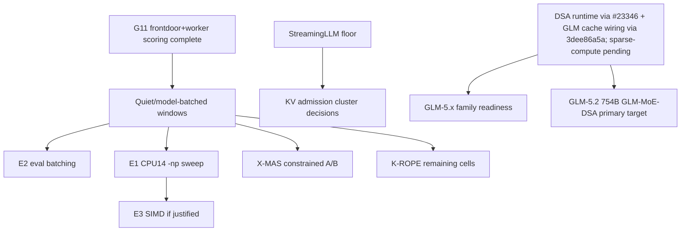

# Inference Acceleration — Active Index

**Purpose**: dispatch point for local inference optimization across CPU throughput, KV/context efficiency, speculative decoding, GPU-prep work, and model-serving experiments.
**Updated**: 2026-07-26 — v8 production is frozen as `production-consolidated-v8` at `67a433bf45a8a091d83b4ea0b32ff0735fd51800`, `llama-server` version `10107`. Terminal both-mode lineup passed `24/24` smoke and `6/6` API; `artifacts/operator/ratify_v8_final_freeze_20260725.json` SHA is `e7fce2c5cd720940fc84b669f57b78a61589fd8baef9b4e03030ed0dc4a3175b`. CPU Q4 architect remains live at `8083`; WAIVE-Q8 makes no v8 Q8 performance/non-regression claim. PC-4p's GLM-MTP + default-off `CONCAT` package is promoted but remains default-off, and preserved CPU-matrix `promotion_decision=false` is not a veto of the operator freeze. Historical v7 rows below remain provenance; post-v8 research stays in its owning handoffs.
**History**: pre-compaction detail lives in [../archived/inference-acceleration-index-history-through-2026-06-19.md](../archived/inference-acceleration-index-history-through-2026-06-19.md).

**2026-07-25/26 v8 audit and freeze**: the `experimental-v8-refresh-20260724` cluster (Laguna+DFlash `afa770382`, IQK `b8ad9d292`/`6c44557bf`/`1977a5d78`, and PC-4p's two-bank package) was promoted and frozen as `production-consolidated-v8` at `67a433bf45a8a091d83b4ea0b32ff0735fd51800` / version `10107`. Final terminal evidence is `24/24` both-mode smoke and `6/6` API, attested in `artifacts/operator/ratify_v8_final_freeze_20260725.json` SHA `e7fce2c5cd720940fc84b669f57b78a61589fd8baef9b4e03030ed0dc4a3175b`. Laguna's release lanes and L-7 are closed; DFlash stays FAIL/no-go, CPU Q8 stays characterization only, and L-8 plus future architect evaluation remain open. IQK NEW-6 and other post-v8 riders remain research; WAIVE-Q8 means no Q8 performance/non-regression claim.

**2026-07-18 v7 lever audit + two-lane queue**: full read-only audit of ~5 weeks of v7 experimental-kernel + CPU/GPU/spec-dec/GLM optimization work (5-agent sweep of handoffs, progress reports, negative results, live branch state). **Headline then: the largest measured win was already built, correctness-verified, and banked; it is now promoted in `production-consolidated-v7` as of 2026-07-20.** See the new **[§ v7 lever audit + two-lane execution queue](#2026-07-18-v7-lever-audit--two-lane-execution-queue)** below — do-not-re-propose ledger, EV-ranked survivor levers, and the LANE A (operator-facing v7-promotion prep) / LANE B (agent-executable exploration) queue. Two new tracks opened: [cpu-prefill-compute-large-models.md](cpu-prefill-compute-large-models.md), [gpu-drafter-control-redesign.md](gpu-drafter-control-redesign.md).

**2026-07-18 GLM/DSA correction**: the GLM/DSA gate is no longer "wait for PR #21149"; the v6/v7 fork contains generic DeepSeek32 DSA via upstream #23346. GLM-5.2 UD-IQ2_M download/integrity, load-smoke, 4K/8K traces, and stale-binary true >64K runnability are recorded. A current-source audit found GLM cache/runtime wiring missing, and experimental-v7 commit `3dee86a5a` closed that gap by wiring `LLM_ARCH_GLM_DSA` to `llama_kv_cache_dsa`, aliasing the DeepSeek32 DSA graph, requiring live indexer tensors, and force-building GLM indexer Hadamard rotation tensors. Current-source `glm-dsa` / `deepseek32` synthetic tests, ASAN `glm-dsa`, and exact `READY` GLM smoke passed. Current-source fixed-`indexer_top_k=32` runtime scaling (`/mnt/raid0/llm/tmp/glm52-current-source-kv-scaling-20260717T130222Z/runtime_summary.md`) classified behavior as **DSA-DENSE-MASK**: Lightning/indexer caches engage, but prompt throughput declines with KV length (`23.81 -> 21.04 -> 17.28 t/s` at 2.9K/5.9K/11.9K prompt tokens). Inference-research commit `a6651ed` then narrowed the malformed-output blocker into a cap diagnosis: `glm-dsa.attention.indexer.top_k` is the final-attention KV selection cap. The follow-up schedule sweep closed the prompt-band policy: `top_k=2048` passes exact `READY` at `1767` and `2056` but fails at `2168`, `3045`, and `12043`; `3072` fails strict exact output at 2.1K/3K; `8192` and `12288` fail at 12K; next power-of-two caps recover exact `READY` (`4096` for `2168/3045`, `16384` at `12045`). The reviewer-serving chat protocol/schema matrix then passed exact free-text and JSON-schema output at actual ~2.9K/~12.0K prompt bands under that schedule. Direct GC-1/2/3 reviewer-capability smokes were executed and initially mixed, then natural-prompt repair smokes passed small synthetic GC-1/2/3 checks. Near-miss corpus interpretation is now representation-scoped: the runner refuses mixed selections and refuses `substring`/`exact_match` answer-fragment rows by default, supports explicit row-id slices, and now supports curated `--oracle-notes-file` constraints for audited hard negatives. Homogeneous `seeded-mutation/cruxeval/exact_match` n=24 improved only as exact-answer judging (`FA=0.0%`, `FR=16.7%`); matched `c-crab/python` patch-diff n=24 failed by over-approval (`FA=91.7%`); the pinned C-CRAB row-id n=6 screen improved to FA `33.3%` / FR `0.0%`, v4 prompt-only alignment did not move the SQLFluff L009 false accept, v5 oracle-note replay fixed that audited row, and the targeted C-CRAB n=12 confirmation rejected all six old false-accepted hard negatives (`FA=0.0%`) while still false-rejecting one observation-grade CVAT clean-control accept (`FR=16.7%`). Source-only prep made the acceleration tasks concrete: native GLM-MTP needs Qwen-style `DECODER_MTP` graph/tail tensor loading, while real sparse final-attention needs a new indexed-attention op rather than a graph-only switch. The 2026-07-19 P-REV-1 evidence then routed production patch-review away from GLM; sparse final-attention/native GLM-MTP are now scoped acceleration work only if GLM remains coupled or gets a non-reviewer role.

**2026-07-16 control-plane additions**: the Architect→Reviewer control-plane series ([reviewer-control-plane-index.md](reviewer-control-plane-index.md)) appended **K22-K31** to [gemma-challenge-kernel-techniques-v7.md](gemma-challenge-kernel-techniques-v7.md) — P0s: grammar-sampler crash (`sampling.cpp:292`, blocks GBNF typed-decision emission on v7), GLM-5.2 glm-dsa load reconciliation (K23; feeds the empirical gate above), v7 non-spec base-decode regression root-cause (architect −9.24% K20 guard; spec paths near parity); P1-P3 quality-neutral levers (mmvq draft-tree verify widths, f16-vs-bf16 KV, Q8_0 8x8 repack, chunked GDN prefill, draft-path malloc, composed-spec state, EA-server/DSA audits). GPU sequencing operator-locked 1→4; teleport axis **AXA-1..3** appended to [mi210-big-model-and-acceleration-roadmap.md](mi210-big-model-and-acceleration-roadmap.md).

## Start Here

1. Read [master-handoff-index.md](master-handoff-index.md) for global priority and active inference-lane constraints.
2. Use `/workspace/MEASUREMENT.md` for benchmark claim grammar and cache-state labeling.
3. Coordinate all throughput-sensitive runs with [bulk-inference-campaign.md](bulk-inference-campaign.md). K-MEM Tulving, frontdoor G5 short-m@k, frontdoor+worker G11 AA-Omniscience, and architect G10 collection/scoring are complete; G12 tier calibration has accepted deterministic AA-Omniscience 4-class scoring and updated production role multipliers. Remaining clean-window work is the consolidated measurement batch, including DS-E1 dynamic-stack KV measurement, not more G12 scoring.
4. Do not revive closed speculative-decoding or NUMA tracks without their documented reopen trigger.
5. For llama.cpp work, use a dedicated feature branch/worktree and do not touch the production binary without an explicit rollout plan.

## 2026-07-18 v7 lever audit + two-lane execution queue

Read-only audit of ~5 weeks of v7-experimental + CPU/GPU/spec-dec/GLM optimization work.
**The single highest-EV lever was promoting the already-banked v7 kernel**
(`experimental-v7-refresh-20260716`; promotion candidate frozen at `6ad45fa3ff`, see
[v7-promotion.md](v7-promotion.md) for the live promotion state; iqk + all GPU opts + `Q2_0` present):
HIP graphs **+25%** worker spec-dec, MMVQ→MMQ **+17–32%**, bf16-GDN-state **+16–21%** agg,
**+37%** single-stream dense-Q8. K5 quality gate PASSED (v6≈v7, +0.0%); all P0 correctness
blockers resolved (K22/K23/K32/K33). OP-2, `P-GPU-1`, and final cutover smoke are closed.
The reviewer/control-plane route is decoupled from release. Native GLM-MTP serving was repaired
on post-candidate `12a292f0c`; include it in production only by selecting that newer exact tip
and rerunning final smoke. Frozen-candidate v7 promotion completed on 2026-07-20; future kernel
replacements need an exact-tip promotion gate, not more reviewer work.

### Do-not-re-propose ledger (measured negative/exhausted)
- **CPU decode is bandwidth-exhausted** (0.17 IPC, 96.6% memory-stalled @96t). Dead:
  AVX-512VNNI vec_dot, AVX-512BW 8×8 repack *at multi-thread*, Q6_K/Q5_K default-ON,
  shape-specialized GEMV catalog, manual prefetch, parallel RMS_NORM, CPU22 dyn-MoE-LB,
  CPU4 barrier-coalesce, generic-scalar Q8 repack (K27), L3aaN, NUMA_MIRROR, GGML_NUMA_WEIGHTS,
  NUMA private weights, CCD threadpool.
- **GPU raw-speed frontier exhausted**: GRAPH_OPT, Q8_PREFETCH, Lever-A shape-key, onegraph
  fold, MTP-on-GPU-MoE, BF16 KV (K26), both occupancy rewrites, persistent/megakernel,
  fused-dequant, GPU n-gram spec, mmid dispatch, vLLM-ROCm (gfx90a arch-blocked).
- **Spec-dec: external drafting is dead on MTP-equipped targets** (every target ships a
  native MTP head): tree-draft/DySpec, external drafter, GPU-draft Stage-1/2 (0.915×/0.355×),
  MAB selector, peer-verifier, hybrid-SSM slot-promotion, draft_max 2→4 (keep 2), Hy3 MTP.
- **GLM offload/REAP**: near-uniform routing (top_32=15.19%, entropy 0.9987) → not justified;
  `ngram-mod` = 0 drafts on GLM; AirLLM per-token streaming = PCIe anti-pattern.

### EV-ranked survivor levers
1. **v7 promotion** — banked; operator-gated. *Highest measured EV.*
2. **CPU Q8_0 barrier-count operator/graph fusion** — sole live CPU decode lever; +2.6% measured → +10–15% (graph-rewrite) → +72% ceiling. → [cpu-shape-specialized-gemv-decode.md](cpu-shape-specialized-gemv-decode.md).
3. **Residency / teleport** — AXA-1 (122B IQ2 resident 2.2×/8–9×; K22 fix unblocks it), AXA-2 teleport, Gate-R (`P-GPU-1` ratified; decision-grade Gate-R now requires the current production-named `production-consolidated-v8`). 2026-07-19 AXA-2 prefill sizing has observation rows at 2K/8K/16K (`342.06`/`135.56`/`76.52 t/s`), default-build homogeneous 32K controls (`489.31-489.82 t/s` f16/f16, `487.87-489.07 t/s` q4_0/q4_0), and an isolated `GGML_CUDA_FA_ALL_QUANTS=ON` mixed q4_0/f16 32K row (`415.31 t/s`). Current default HIP build still rejects mixed-KV 32K cost because it falls into CPU fallback; all-quants is not a blanket replacement because homogeneous 32K controls dropped to `416.55`/`414.60 t/s` in that build. AXA-2 dry policy-trace scaffolding is closed (`epyc-orchestrator/orchestration/reports/axa2_policy_trace_20260719/`), the live cutover/continuity operator bundle is prepared (`epyc-orchestrator/orchestration/reports/axa2_live_cutover_bundle_20260719/`), and the same-quant IQ2 v1 live smoke executed on 2026-07-20 (`axa2-live-samequant-iq2-20260720T052826Z`) with `status=executed`, lease release, exclusive nonzero-VRAM GPU ownership, and exact seeded CPU/GPU continuity. This remains observation-grade until rerun under the production-named `P-GPU-1` path. → [mi210-big-model-and-acceleration-roadmap.md](mi210-big-model-and-acceleration-roadmap.md).
4. **Native GLM-MTP forward-graph port** — serving repaired on `12a292f0c` after the initial zero-chunk failure: repaired `draft-mtp` reached `512` completion tokens, `5.33 t/s` decode, alpha `0.933`, versus no-spec `2.49 t/s`. Source hardening also landed: `test-llama-archs` now asserts the GLM-DSA unmasked NEXTN row-selection contract, with focused GLM-DSA/DeepSeek32 validation passing. The repair is carried in frozen v8 as `6ead35060`. Separate reviewer-quality policy remains unresolved; GLM is not admitted as production patch reviewer on the current policy. → [tree-draft-forward-port-plan.md](tree-draft-forward-port-plan.md), [glm52-reviewer-capability-gates.md](glm52-reviewer-capability-gates.md).
5. **CPU prefill-compute for large models (SCOPED)** — PC-0 first cell is now
   positive from OP-2 quiet-window evidence on the 122B architect target:
   production-v6 `p8192/n1` recorded `112.730698 t/s`, `1.09` IPC, `68.597`
   CPUs utilized, and `46.47%` resolved `libggml-cpu` DSO samples. PC-3 resolved
   the large `(deleted)` bucket as LLVM OpenMP worker spin/pause (`0x7fea0`,
   `38.36%` self). PC-4a prepared and build-validated a default-off
   `LLAMA_QWEN35_PREFILL_TRACE=1` graph-node trace scaffold in
   `llama.cpp-experimental`; PC-4b traced qwen35moe `p8192/n1` and points to
   recurrent `linear_attn` as the high graph-node island (`92/99` node deltas
   vs full-attn `75`). PC-4c then closed the level-2 subphase trace: recurrent
   `linear_attn_total` median delta `53`, per-layer `ffn_total` `40`,
   `full_attn_total` `29`, with recurrent sub-islands `conv_state=15`,
   `gated_delta_net=13`, and `ssm_state=8`. PC-4d closed the target choice:
   same-input MoE/FFN barrier-count reduction first; do not prototype recurrent
   GDN first while GDN/SSM/RMS stay at about `1-2%` in the timing profile. PC-4e
   then localized the FFN island: routed `ffn_moe` is `32` of the stable `40`
   FFN graph nodes per layer, while shared expert/gate/gating/add account for
   only `8`. PC-4f diagnosed routed `build_moe_ffn`: router/weights (`11`),
   expert views (`8`), and aggregation (`7`) dominate the routed-MoE graph-node
   expansion; gate-up/activation/down/weighting are only `6` combined. PC-4g
   then rejected the view/add expansion skip: exact output held on the cheap
   smoke, but the real `p8192/n1` cell regressed from `141.588462` to
   `100.069829` prompt t/s. PC-4h then ruled out router/top-k/weights as a
   prototype target: `argsort`/`get_rows`/`soft_max` were only hundredths of a
   percent while `GOMP_barrier` / `__kmpc_barrier` remained `43.95%` children.
   PC-4i closed scheduler-split attribution as a no-go, PC-4j/4k/4l carried the
   source-proven `CONCAT` dim0 row-partition candidate through positive repeat
   evidence, PC-4m source-hardened/expanded correctness coverage, and PC-4n
   committed the default-off package as post-candidate experimental work
   (`llama.cpp-experimental` `93d945885`). PC-4o closed with a clean-detached
   repeat and keeps the path default-off/env-gated for prefill/batched-prefill
   only; no default-on or frozen-v7 update. →
   [cpu-prefill-compute-large-models.md](cpu-prefill-compute-large-models.md).
6. **stream-K `nsm→k·nsm`+compact-LDS** — +0–10%, IQ2/capacity; pmc-CSV read first. → mi210 roadmap.
7. **K28 GDN long-prefill recurrence kernel (GPU)** — `gated_delta_net.cu:191`; Phase 0 shows serial-dependency headroom but direct HIP-event timing now validates the bounded full-model ceiling: GDN is `15.45%` of p2048 prompt wall-clock and `14.64%` of p8192 on Qwen3.6-35B-A3B Q8 MI210, so a 4x GDN-op kernel maps to only `11.59%` / `10.98%` full-model prompt gain. Experimental post-candidate commit `8bb53c520` adds the default-off `GGML_CUDA_GDN_TIMING=1` hook; evidence is in inference-research commit `2c2b94b7`. A separate isolated worktree now has a compile-safe default-off `GGML_CUDA_GDN_CHUNKED_PROTOTYPE` scaffold, but no fused kernel or speed evidence yet. Keep K28 default-off/post-promotion unless the actual constrained fused-recurrence prototype materially raises EV. → mi210 roadmap, [k28-fused-chunked-gdn-kernel-research.md](k28-fused-chunked-gdn-kernel-research.md).
8. **MoE-Spec CPU reopen** — +5–15% Coder/REAP; zero-inference assessment first. → [cpu-inference-optimization-index.md](cpu-inference-optimization-index.md).
9. **Real sparse final-attention (GLM DSA)** — currently DSA-DENSE-MASK; long-context only; contingent on GLM quality. → [llama-cpp-dsa-contribution.md](llama-cpp-dsa-contribution.md).
10. **Batched-decode E2/E3** — serving throughput; telemetry gate. → [batched-decode-measurement.md](batched-decode-measurement.md).
11. **GPU-drafter control redesign (NEW)** — Stage-1/2 failed; needs a *different* design. → [gpu-drafter-control-redesign.md](gpu-drafter-control-redesign.md).

### Two-lane queue (benches need operator per-run approval → split by bench-window need)
**LANE A — operator-facing (bank the banked win):**
- A1 **K35 finalize CLOSED ✅ 2026-07-18** — consolidated throughput-vs-context release
  artifact now includes vision throughput/quality/memory rows and the MiniCPM-o/frontdoor
  mixed-service matrix; the MiniCPM-o source/config flip and controlled live smoke are
  implemented/verified, while remaining K35 work is optional parser/stress follow-up only.
  **Note 2026-07-31**: the MiniCPM-o rows in this and the two K35 service/text-matrix rows below
  remain valid *throughput* evidence, but MiniCPM-o is now **DEPRECATED with its weights
  DELETED** — it scored 31/42 vs the Qwen2.5-VL-7B incumbent's 35/42 on 42q OCRBench+ChartQA,
  so none of these rows supports a role flip and the 2026-07-18 activation policy is revoked. →
  [gemma-challenge-kernel-techniques-v7.md](gemma-challenge-kernel-techniques-v7.md).
- A2 **OP-2 canonical-bench window CLOSED ✅ 2026-07-19** — run package drafted at
  [docs/reference/op-2-canonical-bench-window-package-2026-07-18.md](../../docs/reference/op-2-canonical-bench-window-package-2026-07-18.md)
  ✅ 2026-07-18; execution completed 2026-07-19 with v6+iqk live preflight PASS, role smokes
  `6/6`, clean sentinel `status=ok`, and P-BENCH-1 frontdoor Q8 tg128 `avg_ts=12.442712`
  (`n=10`, `96` threads). B1 was skipped as `not_staged`; B4 is closed no-go. →
  [v6-iqk-promotion.md](../completed/v6-iqk-promotion.md).
- A3 **`P-GPU-1` ratification CLOSED ✅ 2026-07-19** — package drafted at
  `docs/reference/p-gpu-1-ratification-package-2026-07-18.md` ✅ 2026-07-18; the operator
  signed `/workspace/MEASUREMENT.md` on 2026-07-19. The ratified path is production-named
  kernels only, so existing experimental-v7 Gate-R/K35/AXA rows stay observation-grade and
  Gate-R certification now reruns on the current production-named
  `production-consolidated-v8`.
- A4 **Branch-naming reconciliation** — authoritative promotion candidate frozen:
  `experimental-v7-refresh-20260716` commit `6ad45fa3ff` (final-smoke binary `10098`).
  The earlier `d1e5a20eb` checkpoint remains the branch-reconcile baseline; old
  `experimental-v7-candidate` mentions are historical checkpoints only. The narrow
  upstream-ahead pre-promotion fixes are included in `6ad45fa3ff` and validated against the
  focused HIP build/test gate. If the experimental branch advances past `6ad45fa3ff`, that
  newer tip is post-candidate research and must re-run the final coherence+garbage smoke
  before it is eligible for promotion. ✅ 2026-07-19

**LANE B — agent-executable:**
- *Zero-inference now:* current B2/B3/B5/B6/B7 scoping batch closed; do not reopen without a new handoff trigger.
- *Needs a bench window (fold into A2 or its successor):* B1 barrier-fusion `tg128` A/B only if a staged immutable on/off pair exists. PC-0 prefill-compute premise profiling and PC-3 target selection closed positive; PC-4a/PC-4b show qwen35moe recurrent `linear_attn` is the graph-node-heavy path, PC-4c through PC-4o are closed as recorded below, and PC-4p is promoted in frozen v8 as the GLM-MTP + default-off `CONCAT` package. It is not default-on, its retained `promotion_decision=false` CPU-matrix result is not a veto of the operator freeze, and remaining prefill research stays open. B4 DSA-D3 profile-first ran 2026-07-19 and closed D3.1 as no-go: Lightning Indexer was only `1.08%` of cycle samples, so do not start the AVX-512BW indexer kernel from current evidence.

## Active Landscape

| Area | Owner handoff | Status | Next action |
|------|---------------|--------|-------------|
| Batched decode / eval batching | [batched-decode-measurement.md](batched-decode-measurement.md) | ACTIVE-HIGH; A3B E1 and E2 decision-grade evidence landed 2026-07-03, with E2 a 4.858x wall-minutes/eval keep-candidate. Default-off eval-batch metadata, warm `eval_batch_frontdoor`, guarded route rewrite, smoke probe, activation-window runner, and the 2026-07-05 smoke/rollback pass are packaged. | Representative EvalTower quality/reliability/throughput telemetry is now the remaining gate before any default path change. Dense-control E1 remains re-scope-only; do not start E3 solely from the A3B result. |
| Heterogeneous CPU×GPU slot fabric + dynamic residency (design) | [heterogeneous-slot-fabric-residency.md](heterogeneous-slot-fabric-residency.md); EXTENDS [within-role-placement-state-machine.md](within-role-placement-state-machine.md); parameterized by [batched-decode-measurement.md](batched-decode-measurement.md) **E5** | **DESIGN 2026-07-20; GATED post-v7-promotion, provisioning PENDING E5.** "Everything is a slot": CPU `N×K` (NUMA×`-np`) + GPU `1×K_gpu`; teleport / residency-swap / spillover = slot ops; 3-layer control (dispatcher ungated / residency-actuator gated / autopilot tuner); re-prefill teleport, **session-handover drain** (no mid-decode preempt), **designated-CPU-fallback** ("GPU accelerates, CPU guarantees"). EXTENDS the live CPU placement fabric — not greenfield. | Consume E5 for the (N,K) provisioning, then design GPU-as-placement-target + the Layer-2 residency verb. Post-promotion order: `inference-batch-loop → architect-bench → E5 → this`. |
| Dynamic stack KV measurement | [bulk-inference-campaign.md](bulk-inference-campaign.md) | DS-E1 is now staged in the clean-window manifest; no production flip | Run only in the consolidated quiet window after AutoPilot/live llama-server blockers clear. |
| X-MAS / routing measurement dependency | [x-mas-text-routing.md](x-mas-text-routing.md), [routing-and-optimization-index.md](routing-and-optimization-index.md) | Enforce default-off; 2026-06-21 constrained-policy held-out A/B completed with `decision.status=hold` | Repair quality regressions before another attested quiet-window A/B; G5/G11 no longer block scheduling. |
| K-MEM / Tulving episodic benchmark | [research-evaluation-index.md](research-evaluation-index.md), [bulk-inference-campaign.md](bulk-inference-campaign.md) | Completed/scored; corrected score in research `9e63af0` | Use failure-mode report for follow-up design; no memory-routing promotion. |
| RoPE long-context probes | [research-evaluation-index.md](research-evaluation-index.md), [yarn-context-extension-research.md](yarn-context-extension-research.md) | Partial 4K/8K/16K evidence; worker path blocked by Gemma4 MTP serving issue | Resume K-ROPE cells in clean model-batched windows after active lane clears. |
| KV compaction stack | [attention-matching-kv-compaction.md](attention-matching-kv-compaction.md), [triattention-kv-selection.md](triattention-kv-selection.md), [memento-block-reasoning-compression.md](memento-block-reasoning-compression.md), [streaming-llm-baseline.md](streaming-llm-baseline.md) | Quantization deployed; AM merged; Expected Attention deployed; Memento S2 remains open; v7 exposes default-off `--kv-streaming-sink` / `--kv-streaming-window` controls across server/CLI/completion at `cf051d3e1`. The 2026-07-20 Qwen3-1.7B Q8 CPU-only pre-v7 floor/admission sweep crossed context cleanly but admitted no sink/window cluster: quality failed for all arms and speed was flat (`0.990x` to `1.011x`). | Do not block v7 on StreamingLLM. Keep the broader 4-axis StreamingLLM/KV research sweep as post-promotion research before LU-KV/KVP/ForesightKV rank changes. |
| CPU throughput backlog | [cpu-inference-optimization-index.md](cpu-inference-optimization-index.md) | Active queue compacted; high-value gates are batched decode, DSA, MoE-Spec, and roofline calibration | Start with the CPU index and owning handoffs; do not use old historical sections as current instructions. |
| Frontdoor drafter / speculative decoding | [gpu-drafter-mi200-investigation.md](gpu-drafter-mi200-investigation.md), [gpu-drafter-control-redesign.md](gpu-drafter-control-redesign.md) | Stage-1/2 external-drafter economics failed despite high/perfect acceptance (`0.915x` and `0.355x`), so do not revive those lanes as-is. Quant-asymmetric same-model self-spec is now the live Axis-B candidate: DR-0e.2 passed quality/stability/cleanup for K1/K2/K4, DR-2 selected K2 as first default-off lane, DR-3b/c passed broader K2 observation packages, and DR-3d passed the frontdoor opportunity-cost gate on experimental v7: frontdoor `93.690 -> 94.157 t/s` after eviction/reload (`1.005x`), DR-3 K2 active `11.701 t/s`, alpha `1.000`, cleanup pass. Serving/NumericSwarm remain disabled because the result is observation-grade and production routing still requires a production-named `P-GPU-1` rerun. | Next work is DR-3e: rerun required K2/frontdoor GPU claims under current `production-consolidated-v8` for `P-GPU-1` before any serving route or NumericSwarm K surface. Do not download IQ1_M solely for DR-0; IQ2_M passed the strict drafter gate. |
> ⚙ **STRUCTURAL FACT ADDED 2026-07-31 — speculative decoding is LAUNCH-FIXED on v8; there is no per-request surface.** Read from frozen source. `--spec-type` is launch-only (`common/arg.cpp:3935`). The per-request fields `speculative.n_max`/`n_min`/`p_min`/`type`/`ngram_*` **are registered but compiled out** — `tools/server/server-schema.cpp` wraps them in `#if 0` (206→234) under the upstream comment *"to keep things simple, we disable speculative parameter adjustments for now"*; the `speculative.n_max` keys in `tools/server/README.md` are `generation_settings` echoes of launch defaults, not accepted request fields. **Autopilot therefore cannot dial the draft budget per call, and cannot disable ngram selectively** (that needs separate server instances). Enabling it is a **kernel change** → a new production version, never a patch to the frozen tree. The composed recipe's ~1.6% cost is thus paid on **every** drafted request — and with the ngram upside retracted below, nothing is left to pay for. Master index **N28**; tasks SW-1..SW-4 in [speculative-decoding-mtp-refresh.md](speculative-decoding-mtp-refresh.md).
>
> ⛔ **RETRACTED 2026-07-31 — the ngram row below is a measurement artifact, not a lever.** Same prompt repeated against a warm server let `ngram-mod` copy its own previous answer out of retained context (draft len 3.58→15.88, accept→1.000). Corrected gain: **−4.2% to +1.3%**; `ngram-mod` alone costs **23–31%**. **Do not deploy on any role.** See master index **N26** and research `84067a6e`. Original row retained below unedited.

| MTP spec-dec refresh (new heads) | [speculative-decoding-mtp-refresh.md](speculative-decoding-mtp-refresh.md), [qwen-mtp-llamacpp-port.md](qwen-mtp-llamacpp-port.md) | UPDATED 2026-07-29: the Qwen/native-MTP surface is already present on the fresh v8 experimental base (`draft-mtp`, MTP context, Qwen graph, help flags); the old v5 cherry-pick narrative is historical only. **AMENDED 2026-07-30 — a second speculation path exists and is undeployed.** ⛔ **CORRECTED 2026-07-31: that amendment was wrong.** ~~Production launches `--spec-type draft-mtp` **alone**, while the master registry has carried `ngram_candidate_spec_type: ngram-mod,draft-mtp` as a never-deployed candidate.~~ Composed `ngram-mod,draft-mtp` **is** the production recipe (operator standing decision, ~−1.6% ordinary-text cost accepted for repetitive-context upside); the `ngram_candidate_spec_type` sidecar is **RETIRED**. **Canonical source — link, do not restate:** the `speculative_decoding_policy` block at the top of `epyc-inference-research/orchestration/model_registry.yaml`. NG1–NG3 below are cancelled by the 2.80× retraction and must not be actioned. Measured on realistic text (10.6% repeated 5-grams, era `production-consolidated-v8` @ `67a433bf4`): Qwen3.6-35B-A3B `24.92 → 69.89` tok/s at 14,059 tokens (**2.80×**, acceptance `.505 → .755`) and `12.46 → 18.71` at 53,730 (1.50×); **Qwen3-Next-80B `17.40 → 20.06`** — its SSM hybrid has **no draft-model path** (`acceleration: {type: none}`), so `ngram-mod` is the **only** speculation that role can have, and "not viable on CPU" must be re-read as *no draft-model speculation*. gemma4-26B (`.754` accept) and Qwen3.5-122B (`.650`) gain **nothing**. PRINCIPLE: **ngram's benefit is inversely proportional to the incumbent drafter's acceptance rate.** | **NG1–NG3 are the newly actionable rows** (deploy `ngram-mod,draft-mtp` on `frontdoor`/`coder_escalation` and `ngram-mod` on `ingest_long_context`; explicitly NOT on `worker_general`/`architect_general`) — each needs a quality/bit-exactness pass, and the registry change forces a second recompile + contention re-bench, so sequence it **after** the N25 topology-cutover commit. **NG4: a GPU ngram sweep (36 cells) is IN FLIGHT and NOT reportable** — ngram IS supported on GPU and the v8 HIP build works (`ROCm0: AMD Instinct MI210`, version `10107`). **NG5: every ngram claim must carry its corpus and repeated-5-gram fraction** — synthetic filler inflated the same measurement to a near-meaningless `2.52×`. Prior gated MTP work unchanged: T1/T2/T3 done. Remaining MTP work is gated: T4 Qwen3.6-35B-A3B model-load/gate-bench, T5 gemma-4-26B-A4B `draft_max` sweep, and qwen-mtp P6b operator bench. P7 FR-Spec vocab-trim is optional and must start from fresh v8 experimental, not an old reconciliation branch. There is no ungated MTP implementation action in this index. intake-721..725; intake-737..742. |
| llama.cpp v6 consolidation (framework rebase + kernel port) | [llamacpp-v6-consolidation.md](llamacpp-v6-consolidation.md), [v6-iqk-promotion.md](../completed/v6-iqk-promotion.md) | **CUTOVER COMPLETE 2026-06-26 — v6+iqk LIVE in production** (GGML_IQK=1; beats ik_llama +11% on the gemma worker; ik_llama fully deprecated, no second binary). OP-2 closed the live throughput+garbage verification and bench-clean canonical CPU decode row on 2026-07-19. Stage 1 finding preserved: CCD is `#ifndef GGML_USE_OPENMP` -> compiled out in prod (OpenMP-ON) -> GGML_CCD_* env vars vestigial. | Non-release residuals only: resolve 5 NEEDS-OPERATOR-REVIEW commits; f1-paged-attn fold; GGML_CCD_* env cleanup; concurrent 4×quarter+MTP aggregate bench; -np 8 paged-attn A/B redo. Do not reopen OP-2 live/bench verification without a new regression trigger. (updated 2026-07-19) |
| GPU acceleration / MI210 | [gpu-drafter-mi200-investigation.md](gpu-drafter-mi200-investigation.md), [gpu-drafter-control-redesign.md](gpu-drafter-control-redesign.md), [gpu-acceleration-path.md](gpu-acceleration-path.md), [agentic-rocm-kernel-authoring.md](agentic-rocm-kernel-authoring.md), [rocm-verify-profile-backend.md](rocm-verify-profile-backend.md); **MI210 campaign 2026-07-03/05:** [roadmap](mi210-big-model-and-acceleration-roadmap.md) · [summary](mi210-speed-campaign-summary.md) · [findings-05b](fable5-window2-findings-05b-mi210-inference-architecture.md) · [05c](fable5-window2-findings-05c-mi210-lever-category-matrix.md) · [cot-sidecar — study COMPLETE 2026-07-06, archived; live successor: scaffold-autopilot-cost-lever-deployment.md](../completed/gpu-cot-scaffold-sidecar.md) | **RE-TARGETED 2026-08-03 (research-intake): the gap is a QUANT deficit, not a device deficit** — fp16 already attains **62.6%** of bandwidth roofline on this card and vLLM-ROCm **69.2%**, so the memory system is not the limiter; the collapse is entirely down the quant ladder (Q8_0 50.2 → Q4_K 35.1 → MoE-Q8 21.3 → **architect MoE-IQ2 10.3**) inside `mul_mat_vec_q` at 77.8% of decode. The program objective moves from the Q8 rung to the **fp16 rung**. **Denominators measured 2026-08-03**: HBM achievable **1433.3 GB/s** (87.5% of the 1638 spec) and PCIe **28.89/28.20 GB/s** H2D/D2H (Gen4 x16, retiring a ~64 GB/s figure). Cross-vendor comparison stays **spec-to-spec**; peak FLOPS is the last derived-from-spec constant. Profiler tooling is available and the gfx90a counter taxonomy is proven (465 counters). **Speed campaign COMPLETE + capability/residency phase LIVE.** Single-stream dense-Q8 exhausted (+37%→40.4 t/s); aggregate solved by config (FA + bf16, up to 1548 t/s); both occupancy-rewrite bets falsified. **Residency ladder 2-for-2:** 122B IQ2 VIABLE + **eval-parity PASSED judge-free** (Δ0.0pp, p=1.000) and 80B-ingest IQ2 VIABLE (55.8 single / 405 agg-ceiling @B128, PPL 5.77). Qwen3.6-27B dense current-v7 context observation at `data/gpu-mi210/qwen36-27b-dense-v7-context-20260718T2225Z` recorded prompt `854.17/807.61/666.62 t/s` and decode `29.64 t/s`; it remains observation-only because ratified `P-GPU-1` requires a production-named kernel. **N5 external-drafter alpha cleared 2026-07-16 but Stage-1/2 economics failed** (`0.915x` CPU-target external, `0.355x` GPU-resident external); DR-1 formalized the break-even rule and shifts Axis-B to quant-asymmetric/control redesign. **CoT-scaffold REOPENED + VALIDATED on reasoning-bottlenecked tasks (GPQA REVERSAL 2026-07-05).** Scaffold-Qwable beat nothink on GPQA (**73% vs 48%**, 15 rescues/3 regressions/0 truncation), but **Qwable-standalone control dominated scaffold** (**77% > 73%**), proving Qwable is the stronger GPQA reasoner and the scaffold is a lossy delivery path through the 35B. Deployment split: route reasoning-heavy tasks to Qwable standalone when it can answer; use scaffold only when the beneficiary must answer because of tools/context/role constraints. **VERIFIER/SELECTOR best-of-N is complementary but measured marginal** (cruxeval/GSM8K/GPQA envelope; systematic errors, small stochastic gap). **KV-quant (findings-05c L14) SCOPED → DEFER** (marginal, rider-only, no dedicated GPU run — GDN O(1)/gemma SWA/aggregate weight-dominated → 3/4 resident classes ~0 payoff; only qwen35 ~1/4 full-global @ single-stream 32–64k alive; a ~2–4h rider on a future dense-full-global long-ctx role, not a speed lever). **MTP-on-GPU-MoE CONVERGED task/temperature-dependent**: older short Stage-2 temp/shape was neutral-negative, while later K35 long repetitive frontdoor rows show native MTP winning; Qwen3.6 Q8 n-gram smoke was mixed (`ngram-simple` `33.40` vs baseline `31.37 t/s`, `4/4` output match; cache slower with `3/4` match), so route by task class, not a global flag. **stream-K confirmed ALREADY the live CDNA2 MMQ path** (`use_stream_k=true`; the 104-WG grid = stream-K working as designed — not a "bigger separate bet"; residual = `nsm→k·nsm` + compact-LDS ~2-line, +0–10%, pmc-CSV-gated). Gate-R decision-grade certification now requires current `production-consolidated-v8`, not pre-promotion CPU-correctness work. | Roadmap gating experiments before building (Axes A/B): DR-0 quant-asymmetric same-model self-spec acceptance/economics, AXA teleport/residency gates, GLM-5.2 sparse-vs-dense/quality gate before offload work; **GPU reasoner next**: codify Qwable standalone routing for reasoning-heavy tasks, and separately register/codify the scaffold fallback for beneficiary-must-answer cases behind difficulty_band + task-class gates. |
| GPU reasoner / Qwable routing | [scaffold-autopilot-cost-lever-deployment.md](scaffold-autopilot-cost-lever-deployment.md), research registry `qwable_v1_iq4xs` | ✅ 2026-07-17 expanded IQ4_XS `default+expanded` gate passed `18/18` on MI210 plain (`106.65 t/s`), MI210 `ngram-mod` (`106.66 t/s`, neutral), and CPU plain (`15.96 t/s`). ✅ 2026-07-18 current-v7 `llama-bench` context probes on `d1e5a20eb`: MI210 IQ4_XS `pp2048 2049.95`, `pp8192 1951.43`, `tg1024 91.54`, `pp32768 1763.72`, `tg512 100.32 t/s`; MI210 Q8_0 `pp2048 2085.55`, `pp8192 1982.17`, `tg1024 102.89`, `pp32768 1647.90`, `tg512 104.11 t/s`; CPU-only IQ4_XS `pp2048 116.13`, `pp8192 110.76`, `tg512 13.99 t/s`. Clean rebuilt Q8 current-tip rerun on `cf051d3e1` supersedes the stale-build first artifact: prompt-only `p512 2101.21 t/s`, decode-only `tg128 99.17 t/s`, and combined prompt+generation `pg2048/1024 266.82`, `pg8192/1024 602.12`, `pg32768/512 1252.67 avg_ts`. ✅ 2026-07-18 paired `default+expanded` GPU quality repeat did not support Q8 upgrade: IQ4_XS `14/18` at `108.38 t/s`, Q8_0 `13/18` at `110.44 t/s`. Research routing remains plain reasoning-off IQ4_XS standalone for reasoning-heavy tasks; scaffold remains beneficiary-must-answer fallback. | Stack-managed hosting/composite-route wiring remains in the scaffold handoff; ngram is not a default Qwable speed lever without per-task evidence. |
| Architect model selection (reasoning re-gate) | [architect-model-selection-bench.md](architect-model-selection-bench.md), evidence [docs/reference/architect-model-selection-2026-07-20.md](../../docs/reference/architect-model-selection-2026-07-20.md) | **SPEC'd 2026-07-20; GATED** (post-v7-promotion + post-[inference-batch-loop.md](inference-batch-loop.md) + operator quiet window). 4-arm reasoning bench {122B-IQ2 / 122B-Q4 / 27B-dense-Q8 / 35B-A3B} — the reasoning re-gate AXA-1 deferred: its Δ0.0pp parity was knowledge/IF-heavy (n≈4 per hard-reasoning suite, statistically powerless). Literature (intake-859..863, exact-toolchain 2505.02390) says 2-bit keeps knowledge ~99% while halving reasoning. | Build the AIME'25 adapter now (no inference; reuse `v7_quality_gate_runner.py` gpqa/mmlu_pro pattern); run Phase 1 (AIME'25 + GPQA-Diamond + MMLU-Pro control) after the three gates clear. |
| DSA / DeepSeek V3.2 / GLM-5.1 | [llama-cpp-dsa-contribution.md](llama-cpp-dsa-contribution.md), [deepseek-v4-flash-cpu-port.md](deepseek-v4-flash-cpu-port.md), [glm51-reap-cpu-evaluation.md](glm51-reap-cpu-evaluation.md) | Active tracker, user/inference-gated; PR #21149 premise superseded by generic DSA via upstream #23346; GLM-5.2 stale-binary true >64K runnability observed; current-source GLM DSA cache/runtime wiring closed on experimental-v7 `3dee86a5a`; runtime scaling now classifies final attention as **DSA-DENSE-MASK**; top-k cap diagnosis and smallest tested schedule are closed; reviewer-serving chat/free+schema matrix passed under the schedule; synthetic GC-1/2/3 repair smokes now pass but are not role-admissible; corpus runner now refuses mixed source-suite/scoring and answer-fragment rows by default. | P-REV-1/corpus-level reviewer probes only after matched full-candidate reviewer-scope corpus selection under the next-power-of-two top-k schedule and chat channel; real sparse final-attention source work is scoped but should be prioritized after GLM quality is recoverable beyond synthetic smokes. |
| GLM-5.2 (PRIMARY GLM target) | [glm51-reap-cpu-evaluation.md](glm51-reap-cpu-evaluation.md), [llama-cpp-dsa-contribution.md](llama-cpp-dsa-contribution.md) | Download/integrity, short load-smoke, 4K/8K traces, true >64K prompt runnability, current-source GLM DSA cache/runtime wiring, runtime `DSA-DENSE-MASK` classification, current-source top-k cap evidence, chat protocol/schema evidence, repaired native-MTP serving, and the no-inference GLM-DSA NEXTN row-selection regression assertion are recorded; intake-699, supersedes GLM-5.1. The 2026-07-18 checkpoints show exact `READY` recovery at `1767/2056` with `2048`, at `2168/3045` with `4096`, and at `12045` with `16384`; non-power-of-two `3072`/`12288` and 12K `8192` failed strict exact output. Native GLM-MTP repaired on 2026-07-19: `512` completion tokens, `5.33 t/s` decode, alpha `0.933`, versus no-spec `2.49 t/s`. Exact-answer review is scoped-positive (`cruxeval/exact_match` n=24: `FA=0.0%`, `FR=16.7%`, parse `0.0%`). Decision-grade C-CRAB P-REV-1 patch review failed on 2026-07-19 (`FA 41.7%`, `FR 25.0%`, `AUC 0.509`); JudgeBench/SWE evidence is positive but partial. | GLM-5.2 remains research-only and is not admitted as production patch reviewer on the current policy. Do not rerun unchanged GLM C-CRAB/SWE policies. Native GLM-MTP source hardening is closed; do not rerun unchanged A/B. Sparse final-attention remains a follow-up only if quality is recoverable or GLM gets a scoped non-reviewer role. |
| Amortized KV-cache synthesis (AM watch) | [summary-token-attention-readiness.md](summary-token-attention-readiness.md) | GATED: no public code + GPU-CPT required; watch-item only | Still — amortized KV-cache synthesis (intake-708) watch-item; primary tracker summary-token-attention-readiness.md. NB deployed default compactor is Expected-Attention, not AM. (added 2026-06-20 via research-intake batch deep-dive) |
| Kimi-K2.7-Code (coder_escalation candidate) | large-MoE completed ledger (2026-06-20 addendum) | DEFERRED on storage + operator approval | Kimi-K2.7-Code (~1T MoE, intake-703) — coder_escalation candidate, deferred: raid0 only ~633 GB free (Q4_K_M 620 GB near-blocker; Q3_K_M 489 GB), MoonViT unsupported in fork. See the large-moe completed ledger 2026-06-20 addendum. (added 2026-06-20 via research-intake batch deep-dive) |
| Linear / recurrent architecture watches | [lightning-attention-port.md](lightning-attention-port.md), [log-linear-gated-deltanet-readiness.md](log-linear-gated-deltanet-readiness.md), [summary-token-attention-readiness.md](summary-token-attention-readiness.md), [engram-conditional-memory.md](engram-conditional-memory.md) | Mostly monitoring or role-decision gated | Activate only when the owning handoff's evidence template or checkpoint availability gate is satisfied. |
| Future context extension | [yarn-context-extension-research.md](yarn-context-extension-research.md) | Deferred pending datasets and RoPE bounds | Use Tulving 200ch and RoPE collapse points to set the next YaRN quality gate. |
| **Laguna S 2.1 v8 capability cluster (CPU lane)** — PROMOTED/FROZEN 2026-07-26 | [laguna-s21-cpu-port.md](laguna-s21-cpu-port.md) → [iqk-iquant-enablement.md](iqk-iquant-enablement.md) → [speculative-decoding-mtp-refresh.md](speculative-decoding-mtp-refresh.md) | v8 `67a433bf45a8a091d83b4ea0b32ff0735fd51800` / version `10107` carries the base arch and IQ2/Q4 release lanes; terminal both-mode lineup passed `24/24` smoke and `6/6` API. DFlash is FAIL/no-go and CPU Q8 remains characterization only. | L-7 is complete. Keep L-8 GPU-smoke script hygiene and future Laguna architect evaluation as post-v8 research; do not represent DFlash or Q8 as a v8 performance/non-regression claim. |
| **AutoKernel system-wide autonomous kernel research loop** — DESIGN COMPLETE / AUDITED 2026-08-02 | **Runtime repository:** `epyc-inference-research`. **Single owning handoff:** [autokernel-research-loop.md](autokernel-research-loop.md) (bootstrap corpus folded in as §19; design audit folded into §§2–15). Inputs: [agentic-rocm-kernel-authoring.md](agentic-rocm-kernel-authoring.md) + [agent-collab-rnd-harness.md](agent-collab-rnd-harness.md) + historical [mi210-kernel-rnd-loop-proposal.md](mi210-kernel-rnd-loop-proposal.md) + [rocm-verify-profile-backend.md](rocm-verify-profile-backend.md) | The mechanical MI210 evaluator/sweep/store, C6 integrity layer, generic task descriptor, dashboard, backend kernel paths, and derived freeze-scope seed exist — but the evaluator never gates on coherence, so the store's correct-only Pareto is contaminated, and **no cross-process GPU device claim exists anywhere**. Missing: autonomous source authoring, event-sourced memory, storage/retention plane, bus identity, affected-surface derivation, codified microbench recipe, generic freeze gate. | **AK0 ratified 2026-08-03; AK1–AK4 BUILT** (substrate, evaluator, controller — 3,042 tests green, ~90k lines). Remaining: AK5 release gate, AK6 packager, AK7 first supervised freeze (needs an operator freeze request), AK8 serving adapter, AK9 speech protocols.** AutoKernel maintains a continuously validated **champion** per source tree and, on operator request, produces a sealed **release package**; it never freezes or cuts over — that crosses four human-only boundaries (freeze/cutover, era rows, AutoPilot rebaseline, the pinned path list). Objective is per-backend, per-phase non-inferiority plus improvement at production-optimal recipes; +25%/+20% is an advisory readiness signal, not a trigger. One T3 program is both final evaluation and freeze gate, admitting hash-pinned operator waivers. Scheduler uses a separate stack-release adapter. |

## Additional Active References

These are active acceleration or model-serving references with narrow gates. They are indexed here so they do not become invisible, but they should not displace the current clean-window and CPU-throughput queues unless their gate fires.

| Handoff | Current role | Next action |
|---------|--------------|-------------|
| [angelslim-techniques-evaluation.md](angelslim-techniques-evaluation.md) | Sub-2-bit/STQ and SpecExit monitor. | Track upstream artifacts; avoid local implementation until a concrete mergeable kernel or checkpoint exists. |
| [delta-mem-reproduction.md](delta-mem-reproduction.md) | Frozen-memory topology spike; mechanical setup passed, accuracy/GPU-scale gates open. | Run only after the named reproduction/gpu-scale gate is approved. |
| [intra-process-tensor-parallel-decode.md](intra-process-tensor-parallel-decode.md) | Dormant TP decode reference. | Reopen only after its topology/workload checklist proves single-session saturation matters. |
| [multiscreen-attention-evaluation.md](multiscreen-attention-evaluation.md) | Checkpoint/research monitor for multiscreen attention. (intake-813 Titans-sleep added 2026-07-14 via research-intake — RIU in handoff) | Continue monitoring; no inference until pretrained artifacts and a current gate exist. |
| [qwen36-27b-cpu-feasibility.md](qwen36-27b-cpu-feasibility.md) | Candidate dense-model feasibility note. | Do a roofline/load-smoke only if the model becomes a real role candidate. |
| [tq3-quantization-evaluation.md](tq3-quantization-evaluation.md) | TurboQuant/TQ3 upstream monitor. (+ lossless-weight-compression sub-area — intake-815/816/817/818 added 2026-07-14 via research-intake — RIU in handoff; verdict: close for inference, ~11-12 bpw loses to Q4_K_M) | Watch PR #21089/ChunkKV; do not merge TQ3_1S. |
| [scaffold-autopilot-cost-lever-deployment.md](scaffold-autopilot-cost-lever-deployment.md) | DESIGN handoff (2026-07-06) — deploy the now-COMPLETE CoT scaffold as an episodic-memory-gated CPU-cost lever in autopilot's existing 4D-Pareto/q_reward optimization; downstream of [gpu-cot-scaffold-sidecar.md](../completed/gpu-cot-scaffold-sidecar.md). | Operator + live-autopilot-agent gated (T0.1: coordinate before any `scripts/autopilot/*` or capability-registry edit). No code/measurement yet. |
| [dflash-block-diffusion-speculation.md](../completed/dflash-block-diffusion-speculation.md), [tree-draft-forward-port-plan.md](tree-draft-forward-port-plan.md) | **DFlash/DDTree — FUND-OR-CLOSE decision** (was a dormant watch). Both activation gates fired: MI210 landed 2026-07-02; M0 α baseline measured 2026-07-03. **BUT** every production target now ships a native MTP head, and tree-draft Phase-1b was shelved 2026-07-06 on exactly that ground. | Decision leans **confirm-negative** — the only remaining opening is a narrow MTP-less niche. Close unless such a niche materializes. |
| [tree-draft-forward-port-plan.md](tree-draft-forward-port-plan.md) | DySpec tree-draft port; **Phase 1a VALIDATED 2026-07-06** on the v7-candidate (engine correct, draft-tree==draft-simple bit-for-bit) but uncompetitive vs embedded MTP on MTP-equipped targets (MTP 41.9 ≫ ext-draft ~18 < plain 31). | Phase 1b **SHELVED** 2026-07-06 — GLM-5.2 also ships an MTP head. Native-GLM-MTP single-NextN serving is now repaired, throughput-positive on the matched long-output gate, and covered by the no-inference row-selection regression assertion; remaining work is reviewer-quality policy, not DySpec. |
| [gemma-challenge-kernel-techniques-v7.md](gemma-challenge-kernel-techniques-v7.md) | Gemma Challenge kernel techniques folded into v7-experimental workflow (production-freeze rails, hard MMLU-Pro/GPQA gate). K5 quality, K35/A1 release evidence, K22/K23/K32/K33 P0 correctness, K24 source-regression clarification, K26 BF16-KV decision, K23.1/B6 scaffold + serving repair, K28.2/K28.3 GDN boundary/source guards, K28.4 Phase 0 ceiling gate, K31.2a/K31.2c server telemetry/evict-only guards, OP-2, P-GPU-1 ratification, upstream-ahead narrow audit, GLM reviewer disposition, final cutover smoke, native GLM-MTP repair/measurement, and K34 CPU host-throughput drift control are closed. K11 no-stop exact-count free-form is positive on post-candidate `12a292f0c21d`, but natural-prose GPU no-spec remains nondeterministic; the TopK-MoE fusion-off trace also failed (`10` hashes), so the broad GPU-worker lane remains policy-blocked pending a real sampler/backend determinism fix or stricter serving template. | **Next:** frozen v7 candidate `6ad45fa3ff` is promoted; reviewer/control-plane, K28 fused recurrence, and GPU-worker lane work are decoupled/default-off research. Future decision-grade CPU A/Bs must run the K34 preflight first. |

## Closed / Historical Anchors

These are not active work queues. Read their completed handoffs before reopening:

- NUMA 4-way parallel and page-cache prewarm are deployed/complete.
- Hadamard KV quantization is production config.
- Qwen3.6 production upgrade is archived.
- Corpus-augmented prompt lookup is completed and reclaimed:
  [corpus-augmented-prompt-lookup-revalidation.md](../completed/corpus-augmented-prompt-lookup-revalidation.md).
  The 2026-07-04 clean-window A/B did not show prompt-injection ROI, the
  operator declined the optional static n-gram experiment, and
  `/mnt/raid0/llm/cache/corpus` was deleted to recover about `651G`.
- Peer-verifier speculation, MAB tree-shape selector, MTP on hybrid, hybrid SSM slot-promotion, NUMA_MIRROR, DFlash on Q4_K_M, and dynamic expert selection are closed or no-go for their measured targets.
- [Kernel reconciliation audit](../completed/kernel-reconciliation-audit.md) is complete: the read-only 2026-07-06 audit proved the GPU-opts line and prod/bench iqk-CPU line are cleanly separable and underwrote the validated v7-candidate. Future v7 production promotion remains operator-gated; do not reopen the audit itself without a new divergence.
- Completed accelerator history is preserved in `handoffs/completed/` and in the dated archive linked at the top of this file.

## Dependency Graph

**Cross-cutting (added 2026-06-20 via research-intake batch deep-dive)**: the ~633 GB raid0 free-space gate bounds BOTH GLM-5.2 and Kimi-K2.7, but asymmetrically — GLM-5.2 escapes it via unsloth UD-IQ2 (~238 GB), while Kimi-K2.7 stays storage-tight even at Q2_K (373 GB) and is a near-blocker at Q4_K_M (620 GB). Do not double-count the same headroom across both.

## Reporting

After completing an acceleration item:

1. Update the owning handoff first.
2. Update this index only if the live queue, gate, or dependency order changes.
3. Append `progress/YYYY-MM/YYYY-MM-DD.md` with artifacts, command lines, cache state, and hardware/runtime state.
4. If a result changes routing or stack deployment, update [routing-and-optimization-index.md](routing-and-optimization-index.md) and the relevant stack governance handoff.

## Progress checklist

- [ ] Batched decode E2: EvalTower quality/reliability/throughput telemetry gate before default flip
- [ ] DS-E1 dynamic-stack KV measurement in consolidated quiet window
- [x] StreamingLLM current-v7 source/build reconciliation: commits `111bff89d` and `cf051d3e1` are pushed on `fork/experimental-v7-refresh-20260716`; clean Qwable Q8 MI210 rebuilt artifact is recorded, with combined `pg` rows explicitly treated as prompt+generation `avg_ts` ✅ 2026-07-18
- [x] StreamingLLM CPU mechanical smoke: baseline `319` tokens at `105.57 t/s` and StreamingLLM `319` tokens at `103.10 t/s`; both mechanical smokes passed but prompt-quality failed, so no admission/performance claim ✅ 2026-07-18
- [x] Gemma4 UD-IQ4_XS optimized MI210 observation: sidecar compared UD-IQ4_XS against ORIG Q4_K_M on current experimental v7 `cf051d3e1`; UD was slower (`2451.99` vs `2721.78` prompt t/s, `81.52` vs `87.80` decode t/s), and local MMLU-Pro/GPQA adapters sampled `0` rows, so this is observation-only and not a quality-retention gate ✅ 2026-07-18
- [x] K28 GDN source-readiness review: source path identified (`gated_delta_net.cu` serial recurrence, `delta-net-base.cpp` graph chunking, existing backend-op coverage); next action is profile-first `rocprofv2`, not a blind kernel patch ✅ 2026-07-18
- [x] K28 direct timing gate: after cheap graph-vs-fused and BF16-speed paths closed, experimental post-candidate commit `8bb53c520` added a default-off `GGML_CUDA_GDN_TIMING=1` HIP-event timing hook; focused backend-op validation passed `38/38`, and Qwen3.6-35B-A3B Q8 MI210 direct timing measured GDN at `15.45%` p2048 / `14.64%` p8192, validating the `~11%` 4x-op full-model ceiling rather than raising it. Evidence: inference-research commit `2c2b94b7`, `data/k28_gdn_perf/k28-gdn-op-timing-hook-qwen35-20260720Tcurrent/summary.json`. ✅ 2026-07-20
- [x] K28 default-off scaffold gate: isolated worktree `/mnt/raid0/llm/llama.cpp-k28-prototype-20260720` adds compile-safe `GGML_CUDA_GDN_CHUNKED_PROTOTYPE` scaffolding and a constrained eligibility predicate (GDA-only/F32/K==1/no fused cache/S_v=128/n_seqs=1/n_tokens>=64), but every path still falls back to the existing serial GDN kernel. This is not speed evidence and does not close the functional fused-kernel task. ✅ 2026-07-20
- [x] A2 OP-2 canonical-bench window package drafted: operator approval matrix,
  preflight/abort gates, v6+iqk live verify, bench-clean P-BENCH-1 bench, B1
  barrier-fusion A/B, B4 DSA-D3 perf-record routing, no production-v6 edits/builds,
  and no AutoPilot restart captured ✅ 2026-07-18
- [x] B4 DSA-D3 profile-first executed on GLM-5.2 CPU `kv_length_scaling` (`p5906`,
  `indexer_top_k=2048`): prompt `18.69 t/s`; symbol-only `perf report` shows
  `ggml_compute_forward_lightning_indexer` at `1.08%` of cycles, far below the
  quantized dot/flash-attn bottlenecks. D3.1 closed no-go; raw `perf.data`
  remains local scratch, summary/report/logs live under
  `data/op2_canonical_window/op2_b4_dsa_d3_profile_20260719T075142/b4-dsa-d3/`.
  ✅ 2026-07-19
- [x] PC-4c qwen35moe recurrent prefill subphase trace executed: CPU-only
  `p8192/n1`, `LLAMA_QWEN35_PREFILL_TRACE=2`, exit `0`, `pp8192 118.040030
  t/s`, `tg1 5.339296 t/s`, clean process/GPU cleanup. Subphase evidence now
  routes PC-4d to a profile-confirmed choice between recurrent
  `conv_state`/`gated_delta_net`/`ssm_state` fusion and same-input MoE/FFN graph
  fusion. ✅ 2026-07-20
- [x] PC-4d qwen35moe prefill target selection closed: combine PC-3/PC-0 timing
  with PC-4c graph-node evidence and choose same-input MoE/FFN barrier-count
  reduction first; reject recurrent-GDN-first for current evidence because
  GDN/SSM/RMS are only about `1-2%` while OpenMP barrier and MoE `mul_mat_id`
  dominate. ✅ 2026-07-20
- [x] PC-4e qwen35moe FFN boundary trace executed: CPU-only `p8192/n1`,
  `LLAMA_QWEN35_PREFILL_TRACE=2`, exit `0`, `pp8192 115.842650 t/s`, `tg1
  5.266122 t/s`, clean process/GPU cleanup. Routed `ffn_moe` accounts for `32`
  of `40` stable FFN nodes per layer; shared expert/gate/gating/add account for
  `8` combined. PC-4f should diagnose routed `build_moe_ffn` internals before
  any prototype. ✅ 2026-07-20
- [x] PC-4f qwen35moe routed-MoE helper trace executed: CPU-only `p8192/n1`,
  `LLAMA_QWEN35_PREFILL_TRACE=2`, exit `0`, `pp8192 110.411171 t/s`, `tg1
  5.162607 t/s`, clean process/GPU cleanup. Routed-MoE graph-node expansion is
  largest in router/weights (`11`), expert views (`8`), and aggregation (`7`);
  gate-up/activation/down/weighting account for only `6` combined. ✅ 2026-07-20
- [x] PC-4g qwen35moe compact aggregation scheduling prototype rejected: exact
  output matched on the cheap smoke, but `p8192/n1` regressed from
  `141.588462` to `100.069829` prompt t/s and `5.242545` to `4.840255` decode
  t/s, so the prototype code was reverted. ✅ 2026-07-20
- [x] PC-4h qwen35moe router/weights profile-first follow-up closed no-go:
  `perf record` on `p8192/n1` captured `1,563,013` samples; router/top-k/
  weights symbols were tiny (`soft_max`/`get_rows`/`argsort` around
  `0.01-0.05%`), while `GOMP_barrier` / `__kmpc_barrier` remained `43.95%`
  children. ✅ 2026-07-20
- [x] PC-4i qwen35moe graph/scheduler barrier attribution closed no-go:
  qwen35moe `p8192/n1` is one CPU scheduler split, so PC-4 moved into CPU
  backend node/barrier attribution. ✅ 2026-07-20
- [x] PC-4j/4k/4l qwen35moe CPU backend CONCAT dim0 row-partition path:
  PC-4j mapped the barrier to `CONCAT`/`conv_input-*`, PC-4k proved
  `GGML_CPU_CONCAT_DIM0_ROWS=1` as a default-off keep-candidate, and PC-4l
  repeated/expanded it positive. ✅ 2026-07-20
- [x] PC-4m qwen35moe CONCAT dim0 row-partition hardening:
  source-reviewed the default-off path, added an explicit support predicate,
  expanded backend correctness coverage to src0/src1/both-transposed dim0
  cases, and reran recurrent rollback env-off/env-on. ✅ 2026-07-20
- [x] PC-4n qwen35moe CONCAT dim0 row-partition package:
  committed and pushed the default-off patch in `llama.cpp-experimental`
  commit `93d945885`; touched only `ggml/src/ggml-cpu/ops.cpp` and
  `tests/test-backend-ops.cpp`; validation passed with experimental DSOs
  pinned. ✅ 2026-07-20
- [x] PC-4o qwen35moe CONCAT dim0 row-partition admission/default-policy:
  clean detached `93d945885` repeat kept the path default-off/env-gated as a
  prefill/batched-prefill tuning candidate. It improved `p8192/n1` by `+7.771%`,
  `p8192/tg16` by `+34.948%`, and batched `pl=2` prompt speed by `+22.031%`,
  but regressed tg-only by `-5.775%`; keep it out of frozen v7 unless the exact
  promotion tip is re-smoked and decode exposure is explicitly decided. ✅ 2026-07-20
- [x] External qwen35/frontdoor drafter alpha retest (`n5_spec_on` 376/376, decision-grade) ✅ 2026-07-16
- [x] CoT-scaffold: Qwable-standalone GPQA control completed — standalone 77% beat scaffold 73%, so standalone routing is primary. ✅ 2026-07-05
- [x] GPU reasoner evidence: Qwable quiet-host IQ4/Q8 strict-output + top-level `json_schema` harness gate closed; scaffold/selector stubs remain non-deployable ✅ 2026-07-17
- [x] GPU/CPU reasoner task-quality first slice: Qwable IQ4_XS and Q8_0 both passed `6/6` deterministic tasks on MI210 and CPU; no Q8-only advantage found in the small slice ✅ 2026-07-17
- [x] GPU reasoner: codify Qwable standalone routing for reasoning-heavy tasks + scaffold fallback only for beneficiary-must-answer cases; expanded IQ4_XS gate passed `18/18` on MI210 plain/`ngram-mod` and CPU plain, with ngram neutral ✅ 2026-07-17
- [x] GPU reasoner current-v7 context throughput: Qwable IQ4_XS `tg1024 91.54 t/s`, `tg512 100.32 t/s`; Qwable Q8_0 `tg1024 102.89 t/s`, `tg512 104.11 t/s`; Q8 is modestly faster but about double the footprint, so IQ4_XS remains the default reasoning-heavy route absent a Q8-only quality win ✅ 2026-07-18
- [x] Verifier/selector best-of-N harness run: old scratch-only `/mnt/raid0/llm/tmp/cot-g1/driver_verifier.py` path is now ported as `scripts/benchmark/qwable_verifier_selector_runner.py` with unit coverage and a live MI210 smoke. First fixed run `data/qwable_reasoning_economics/verifier_selector_qwable_iq4_qwen35b_n3_limit2_20260718Tfixed/summary.json` co-loaded Qwen3.6-35B-A3B Q8 beneficiary + Qwable IQ4_XS verifier, scored `n=2`, pass@1 `1/2`, verifier-selected `1/2`, oracle pass@3 `1/2`, selection accuracy `1/1`, gap-recovered `null`, cleanup clean. ✅ 2026-07-18
- [x] Verifier/selector representative headroom slice: `data/qwable_reasoning_economics/verifier_selector_qwable_iq4_qwen35b_n5_limit6_20260718Theadroom/summary.json` ran six cruxeval tier-1 rows with five Qwen3.6 candidates each and Qwable IQ4 verifier. Observation-grade metrics: pass@1 `1/6`, verifier-selected `2/6`, oracle pass@5 `3/6`, gap recovered `0.5`, selection accuracy `2/3`; cleanup clean. ✅ 2026-07-18
- [x] Verifier/selector prompt/control tuning before scale-up: research commit `4bd5c35` adds scoring-pattern final-answer extraction to `scripts/benchmark/qwable_verifier_selector_runner.py` and passes extracted answers to Qwable before bounded candidate context. Tiny same-slice MI210 validation at `data/qwable_reasoning_economics/verifier_selector_extracted_answer_gpu_20260718Tpostpatch_limit2/summary.json` improved `cruxeval` tier-1 start-0/limit-2 from the previous GPU worker's verifier-selected `1/2` to `2/2` (`oracle_pass_at_n=2/2`, gap recovered `1.0`, selection accuracy `1.0`). ✅ 2026-07-18
- [x] Verifier/selector cap-control follow-up: research commit `21ff0d7` adds explicit `--[no-]verifier-thinking` and `--[no-]verifier-solve-first` controls to `scripts/benchmark/qwable_verifier_selector_runner.py`. Negative control `data/qwable_reasoning_economics/verifier_selector_no_verifier_thinking_gpu_20260718Tcapcontrol_limit6/summary.json` still hit `length` on `5/6` verifier calls (`gap_recovered=0.0`), while `data/qwable_reasoning_economics/verifier_selector_no_solve_first_gpu_20260718Tcapcontrol_limit6/summary.json` stopped cleanly on `6/6`, selected `3/3` rows with a passing candidate, and recovered the available gap (`pass@1=2/6`, `oracle=3/6`, `verifier_selected=3/6`, `selection_accuracy=1.0`, `gap_recovered=1.0`). ✅ 2026-07-18
- [x] Verifier/selector scaled best-of-N gate: `data/qwable_reasoning_economics/verifier_selector_scaled_no_solve_first_20260718T191709Z/summary.json` ran 12 `cruxeval` tier-1 rows with extracted-answer + `--no-verifier-thinking --no-verifier-solve-first`, `candidate_max_tokens=1024`, and research commit `5095df2` telemetry; pass@1 `6/12`, oracle pass@5 `7/12`, verifier-selected `7/12`, selection accuracy `7/7`, gap recovered `1.0`, verifier finish `stop=12`, parse mode `marker=12`. ✅ 2026-07-18
- [x] Verifier/selector continuation rows `12-23`: `data/qwable_reasoning_economics/verifier_selector_scaled_no_solve_first_start12_20260718T192418Z/summary.json` used the same extracted-answer + `--no-verifier-thinking --no-verifier-solve-first` controls, scored pass@1 `2/12`, oracle pass@5 `6/12`, verifier-selected `4/12`, selection accuracy `4/6`, gap recovered `0.5`, finish `stop=12`, parse `marker=12`. Combined rows `0-23`: pass@1 `8/24`, oracle `13/24`, selected `11/24`, selection accuracy `11/13`, gap recovered `0.6`; positive observation-grade lift, not deployment evidence. ✅ 2026-07-18
- [x] Verifier/selector expansion rows `24-47`: `data/qwable_reasoning_economics/verifier_selector_scaled_no_solve_first_start24_20260718T193035Z/summary.json` scored pass@1 `15/24`, oracle pass@5 `15/24`, verifier-selected `15/24`, selection accuracy `15/15`, finish `stop=24`, parse `marker=24`; no selector misses among solvable rows. Combined rows `0-47`: pass@1 `23/48`, oracle `28/48`, selected `26/48`, selection accuracy `26/28`, gap recovered `0.6`; still observation-grade, not deployment evidence. ✅ 2026-07-18
- [x] Verifier/selector expansion rows `48-95`: `data/qwable_reasoning_economics/verifier_selector_scaled_no_solve_first_start48_20260718T194032Z/summary.json` completed the queued MI210 continuation in `18m01.82s`, with pass@1 `22/48`, oracle pass@5 `25/48`, verifier-selected `23/48`, selection accuracy `23/25`, gap recovered `0.333`, finish `stop=48`, parse `marker=48`, and clean final GPU/process cleanup. Selector misses among solvable rows: `cruxeval_output_0057` and `cruxeval_output_0081`. Combined rows `0-95`: pass@1 `45/96`, oracle `53/96`, verifier-selected `49/96`, selection accuracy `49/53` (`92.45%`), gap recovered `0.5`; still observation-grade economics evidence, not deployment evidence. ✅ 2026-07-18
- [x] Verifier/selector known-miss replay: `data/qwable_reasoning_economics/verifier_selector_replay_known_misses_20260718T_main/summary.json` regenerated no beneficiary candidates, enabled solve-first judging, replayed `10` candidate-order permutations over the two known misses, recovered both `cruxeval_output_0057` and `cruxeval_output_0081`, and selected passing candidates in `10/10` cases. Exact selected source candidate remained order-sensitive when multiple candidates were correct, but pass/fail recovered cleanly. ✅ 2026-07-18
- [x] Verifier/selector decision-grade gate: `data/qwable_reasoning_economics/verifier_selector_replay_full96_20260718T203101Z/summary.json` replayed the full existing 96-row candidate set with no beneficiary regeneration, passed `328/328` verifier cases, selected passing candidates in `278/285` solvable replay cases (`0.9754385965`), marked `50` qids order-sensitive, and recovered both known misses (`cruxeval_output_0057`, `cruxeval_output_0081`) across all replay permutations. This closes the replay gate as strong verifier-selector/reasoning-economics evidence; production deployment still requires separate routing/admission policy. ✅ 2026-07-18
- [x] Qwable CPU standalone verifier artifact audit: `data/qwable_reasoning_economics/qwable_cpu_verifier_standalone_20260719T021216Z/summary.compact.json` reports execute `exit_code=0`, both CPU-only arms `status=ok` on `--device none -ngl 0`, decode `13.9607/14.0744 t/s`, `finish_reason=stop`, and post-run ROCm `No KFD PIDs currently running`. SHA256 anchors: `summary.json` `2162d9429f18ea038eb41aa53dc75a6633feaef8f0c9bcc5063ec27b88274791`, `summary.compact.json` `80643872dfc7d4528269e83b4df63d574cbdc8aaefa3778da3777c240f8970fd`. Artifact is untracked in the research worktree at audit time; stage it explicitly if retained. ✅ 2026-07-19
- [x] K35 MiniCPM-o/frontdoor MI210 service-concurrency row: `data/k35_minicpm_service_matrix/k35_minicpm_service_mi210_currentv7_20260719T024452Z/summary.json` passed active overlap (`8/8` fixture/context pairs), with frontdoor alone `96.25 t/s`, resident-idle frontdoor `95.71 t/s`, active-overlap frontdoor `94.49 t/s`, and MiniCPM-o `87.13 t/s`; both GPU servers cleaned up and final ROCm showed no KFD PIDs. ✅ 2026-07-19
- [x] MiniCPM-o Q4 current-build MI210 text matrix: `data/minicpm_o45_gpu_text_matrix/minicpm_o45_q4_mi210_context_decode_currentv7_20260719T0535Z/summary.json` measured `pp512 2195.42 t/s`, `pp2048 2277.36 t/s`, `pp8192 1693.85 t/s`, and `tg1024 100.77 t/s` on experimental v7 `6a8dd5ea6`; cleanup verified no KFD PIDs. This is text-throughput evidence, not a role flip beyond the K35 service gate. ✅ 2026-07-19
- [x] K35 Qwen3-VL-8B reasoning-off repeat: `data/k35_vision_matrix/k35_qwen3vl8_mi210_reasoning_off_default_image_20260719T024903Z/summary.json` again passed only `3/4`, failing `chart_tanzania` as `Moldova` despite `--reasoning off`; keep Qwen3-VL-8B rejected as the active vision-escalation replacement until a tuned lane fixes the chart miss. ✅ 2026-07-19
- [x] K35 Qwen3-VL-8B latest-tip default-image repeat: `data/gpu-mi210/k35_qwen3vl8_mi210_default_image_currentv7_20260719T042531Z/summary.json` ran on experimental-v7 `6a8dd5ea6`, passed `3/4`, and failed `chart_tanzania` as `Moldova` again; decode was `111.21-120.93 t/s`, VRAM was about `11-12%`, cleanup was clean, and this confirms the image-token override was not the chart-failure cause. ✅ 2026-07-19
- [x] Qwen3-VL-8B current-build MI210 text-only row: `data/gpu-mi210/qwen3vl8b_textonly_mi210_currentv7_20260719T053640Z/summary.json` measured `pp2048 2275.96 t/s` and `tg1024 106.00 t/s` on experimental v7 `6a8dd5ea6`; cleanup verified no KFD PIDs. This is text-throughput evidence only and does not change the rejected K35 vision-candidate verdict. ✅ 2026-07-19
- [x] Qwen3-4B-Instruct-2507 small-verifier gate: Q8 MI210 server/chat is fast (`pp512 3915.57`, `tg512 145.23 t/s`) and grammar-backed categorical cells passed `12/12` at `77.08 t/s`; matched controls favor Q8 over BF16 because Q8 measured MI210 `tg512 145.39` and CPU `tg512 10.12 t/s`, while BF16 measured MI210 `tg512 102.46`, CPU `tg512 7.14 t/s`, and passed only `8/12`. Use Q8 Instruct+grammar for the next calibrated verifier gate; keep Thinking Q8 protocol-gated on empty `message.content`. ✅ 2026-07-19
- [x] Qwen3-4B-Instruct-2507 expanded verifier gate: `data/gpu-mi210/qwen3_4b_instruct_2507_mi210_verifier_grammar_slice24_20260719T033317Z/summary.json` passed `22/24` at `76.21 t/s`; `data/gpu-mi210/qwen3_4b_instruct_2507_mi210_verifier_repair_probe_20260719T033440Z/summary.json` showed both misses are prompt-sensitive and repairable, but not clean enough for production-stack routing. ✅ 2026-07-19
- [x] Qwen3-4B-Instruct-2507 generic policy follow-up: `data/gpu-mi210/qwen3_4b_instruct_2507_prompt_policy_probe_20260719T040156Z/summary.json` passed `15/18` at `77.33 t/s`; both discount variants still failed and one literal-code row returned quoted output, so a generic system preamble is insufficient for role gating. ✅ 2026-07-19
- [x] Qwen3-4B-Thinking-2507 CPU-only r1 context row: `data/cpu-model-characterization/20260719_cpu_lane_qwen3_4b_thinking_2507_q8_k24cpu_r1/summary.json` ran on non-HIP CPU build `9882c2c69` with `-t 32` and measured `pp512 319.78 t/s`, `pp2048 274.32 t/s`, `pp8192 158.95 t/s`, `pp32768 49.37 t/s`, and `tg512 11.53 t/s`; cleanup verified no KFD PIDs. This is CPU throughput evidence only; Thinking remains protocol-gated on empty `message.content`. ✅ 2026-07-19
- [x] Qwen2.5-VL worker-vision current-build MI210 text-only repeats: `data/gpu-mi210/qwen25vl7b_worker_vision_textonly_mi210_currentv7_20260719T054159Z/summary.json` and `data/gpu-mi210/qwen25vl7b_textonly_mi210_currentv7_20260719T054328Z/summary.json` measured `pp2048 3474.97/3485.47 t/s` and `tg1024 123.30/123.16 t/s` on experimental v7 `6a8dd5ea6`; cleanup verified no KFD PIDs. These are text-throughput repeats, not a replacement for K35 vision fixture evidence. ✅ 2026-07-19
- [x] SuperGemma4-26B Q8 current-build MI210 text-only row: `data/gpu-mi210/supergemma4-26b-q8-mi210-textonly-20260719T054708Z/summary.json` measured requested `pp2048/tg1024` at `238.13 t/s` on experimental v7 `6a8dd5ea6`, with standalone `pp512 2718.19` and `tg128 89.07 t/s`; cleanup verified no KFD PIDs. This is text-throughput evidence; K35 multimodal fixture evidence still owns the fallback/admission verdict. ✅ 2026-07-19
- [x] PaddleOCR-VL current-build MI210 text-only row: `data/gpu-mi210/paddleocr_vl_textonly_mi210_currentv7_20260719T055029Z/summary.json` measured `pp2048 22141.06 t/s` and `tg1024 486.43 t/s` on experimental v7 `6a8dd5ea6`; cleanup verified no KFD PIDs. This is text-throughput evidence; ODL document-parser rows still own quality/admission. ✅ 2026-07-19
- [x] Qwen3-Next 80B IQ2_M MI210 semantic/role-gate probes: initial semantic slices passed `12/12` and `23/24`; targeted code-review repair passed `10/10`; broader role-quality probe `data/gpu-mi210/qwen3next_80b_iq2m_mi210_broader_role_quality_probe_20260719T034859Z/summary.json` passed `35/42` at `16.79 t/s` but exposed arithmetic, strict-format, tool-shape, no-bug false-positive, and JSON-truncation blockers. Keep as promising research lane, not role-ready. ✅ 2026-07-19
- [x] Nemotron-Nano Q8_0 broad protocol gate: `data/nemotron_nano_task_quality/nemotron_nano_q8_mi210_broad24_deepseek_nosystem_20260719T033826Z/summary.json` passed only `7/24`; broader exact/constrained rows still expose empty visible `message.content` with `reasoning_content` present, superseding the earlier 5/5 small-slice optimism for role readiness. ✅ 2026-07-19
- [x] Qwable IQ4_XS CPU current-head context row: `data/qwable_v1/qwable_iq4xs_cpu_v7_context_currenthead_20260719T032854Z/summary.json` completed cleanly on CPU-only experimental build `9882c2c69`: `pp2048 125.05`, `pp8192 112.33`, `pp32768 98.51`, `tg512 13.78 t/s`. ✅ 2026-07-19
- [x] Qwable Q8_0 CPU current-head context row: `data/qwable_v1/qwable_q8_cpu_v7_context_currenthead_20260719T034724Z/summary.json` completed cleanly on CPU-only experimental build `9882c2c69` with 8 threads: `pp2048 101.60`, `pp8192 92.73`, `pp32768 73.998`, `tg512 10.24 t/s`; IQ4_XS remains the faster CPU route in this control. ✅ 2026-07-19
- [x] Ternary Bonsai Q2_g64 CPU partial-bench salvage: `data/cpu-model-characterization/20260719_cpu_lane_ternary_bonsai_q2_g64/salvage_summary.json` recovered prompt-only `pp512 10.68` and `pp4096 10.57 t/s` from the truncated JSON; no decode row is recoverable, so this remains a partial artifact rather than role-speed closure. ✅ 2026-07-19
- [x] GLM-5.2 UD-IQ2_M download integrity + stale-binary load + true >64K runnability probe ✅ 2026-07-17
- [x] GLM-5.2 expert-routing-skew profile on production-representative prompts: near-uniform global aggregate (`top_32=15.19%`, entropy `0.9987`) with weak layer-local skew; generic hot-expert offload/REAP not justified without a narrower role-specific corpus ✅ 2026-07-17
- [x] GLM-5.2 static sparse-vs-dense audit: pre-fix source left GLM DSA cache wiring open; generic DSA final attention is DSA-DENSE-MASK-LIKELY, not proven sparse compute ✅ 2026-07-17
- [x] GLM-5.2 current-source DSA cache/runtime reconciliation: experimental-v7 `3dee86a5a` wires GLM to `llama_kv_cache_dsa` + DeepSeek32 DSA graph; synthetic tests, ASAN, and exact `READY` GLM smoke passed ✅ 2026-07-17
- [x] GLM-5.2 runtime sparse-vs-dense classification: fixed-`indexer_top_k=32` current-source scaling run classified final attention as **DSA-DENSE-MASK** (`23.81 -> 21.04 -> 17.28 t/s` as prompt tokens grew `2900 -> 5906 -> 11921`) ✅ 2026-07-17
- [x] GLM-5.2 current-source 32K long-context needle/coherence executed and failed on malformed `peg-native`; hidden code absent in default-reasoning and reasoning-off arms ✅ 2026-07-17
- [x] GLM-5.2 top-k cap diagnosis: `glm-dsa.attention.indexer.top_k` is the final-attention KV selection cap; `2048` passes `1767/2056`, `4096` passes `2168/3045`, `16384` passes `12045` ✅ 2026-07-18
- [x] GLM-5.2 smallest-safe prompt-length-aware top-k schedule before reviewer/architect quality gates or acceleration spend: `3072` fails at 2.1K/3K, `8192` and `12288` fail at 12K, so use next power-of-two caps for the tested bands ✅ 2026-07-18
- [x] GLM-5.2 protocol-channel/context-threshold matrix after the schedule is fixed: chat/free+schema reviewer-serving channel passed at actual ~2.9K/~12.0K prompt bands; raw endpoints remain unvalidated ✅ 2026-07-18
- [x] GLM-5.2 GC-1/2/3 reviewer-capability smokes under the schedule: strict-IF grammar works but free parse fails schema; rubric authoring is schema-valid but shallow; why-diagnosis detects defects but misses root causes ✅ 2026-07-18
- [x] GLM-5.2 synthetic GC-1/2/3 repair smokes after prompt/scorer review: free strict-IF `3/3`, rubric `mean_composite=1.0`, synthetic why `why_match_rate=1.0`; observation-only, not role admission ✅ 2026-07-18
- [x] GLM-5.2 near-miss corpus shadow + explicit same-row `multi_oracle` replay: parse-clean but FR-heavy (`FA=16.7%`, `FR=66.7%`, accept `25.0%`); unchanged reruns retired, next work is reviewer-policy/prompt repair ✅ 2026-07-18
- [x] GLM-5.2 binary-schema/prompt repair attempt: local `approve|reject` schema fixed the invalid 7-way action surface, but n=24 near-miss quality still failed (`FA=50.0%`, `FR=75.0%`, accept `37.5%`); next work is policy/threshold/calibration, not schema rerun ✅ 2026-07-18
- [x] GLM-5.2 near-miss corpus representation repair: runner now records/refuses mixed source-suite/scoring selections; homogeneous `cruxeval/exact_match` n=24 observation improved to `FA=0.0%`, `FR=16.7%`, parse `0.0%`; exact-answer only, not patch-review admission ✅ 2026-07-18
- [x] GLM-5.2 matched C-CRAB patch-diff reviewer calibration: observation-grade n=24 parse-clean but over-approved bad patches (`FA=91.7%`, `FR=16.7%`, accept `87.5%`) ✅ 2026-07-18
- [x] GLM-5.2 patch-review negative-evidence prompt/rubric smoke + answer-fragment guard: C-CRAB n=4 parse-clean with FA `0.0%`, FR `50.0%` against observation accepts; seeded/debugbench substring n=12 proved answer-fragment rows are invalid full-candidate controls; runner now refuses `substring`/`exact_match` answer-fragment rows unless explicit ✅ 2026-07-18
- [x] GLM-5.2 pinned full-candidate C-CRAB row-id screen: three `clean_control=true` merged-patch accepts plus three multi-oracle rejects, parse-clean, FA `33.3%`, FR `0.0%`; still false-accepted one SQLFluff L009 raw-slice reject, so not role-ready ✅ 2026-07-18
- [x] GLM-5.2 v4 task/test-alignment prompt attempt: parse-clean pinned n=6 result stayed FA `33.3%`, FR `0.0%`; the SQLFluff L009 reject was still false-accepted, proving simple prompt-only alignment is insufficient ✅ 2026-07-18
- [x] GLM-5.2 targeted C-CRAB hard-negative false-accept repair: explicit n=12 oracle-note confirmation rejected all six old false-accepted hard negatives (`FA=0.0%`) but still false-rejected one observation clean-control accept (`FR=16.7%`), so this closes the FA repair and opens accept-control audit ✅ 2026-07-18
- [x] GLM-5.2 accept-control deterministic label audit/filter: inference-research generated a reproducible n=24 C-CRAB/Python accept-control candidate slice; result is still observation-only across the whole filtered pool (`matching_pool_n=151`, `hard_accept_control_pool_n=0`). ✅ 2026-07-18
- [x] GLM-5.2 accept-control machine-review prep: sidecar produced `docs/data/glm52_ccrab_accept_control_machine_recommendations_20260718.json` and `.md` from the prepared 24-row packet without modifying authoritative signoff fields; it recommends `24/24` hard-accept candidates, flags five redacted long-digit rows plus one submodule-update format concern, and leaves helper report mode decision-grade false (`unreviewed_n=24`). ✅ 2026-07-18
- [x] GLM-5.2 C-CRAB accept-control relabel/signoff path resolved: the mechanical fail-then-pass c-CRAB oracle made the matched hard-accept pool decision-grade, the matched n=48 P-REV-1 patch-review run executed, and GLM failed reviewer admission (`FA 41.7%`, `FR 25.0%`, `AUC 0.509`). This supersedes the earlier manual-signoff blocker; next work is route-away reviewer selection or a concrete new GLM repair hypothesis, not more accept-control labeling. ✅ 2026-07-19
- [x] H5/RM-2 reviewer anchors advanced after GLM failure: RM-2.fast found no clean small/fast replacement; RM-2.next materialized A0 objective floor (`FA/FR 0.0%`, AUC undefined), ran A3 Qwen3.5-122B `UD-IQ2_M` on MI210 (`FA 12.5%`, `FR 58.3%`, `AUC 0.513`, `ECE 0.302`), and ran A1 status-quo Qwen3.5-122B `UD-Q4_K_M` CPU self-review (`FA 45.8%`, `FR 41.7%`, `AUC 0.463`, `ECE 0.385`). None are role-ready; remaining reviewer/control-plane work is RM-3 screening, Ref external judge-of-judge, or a named repair hypothesis, not re-running the closed anchors. ✅ 2026-07-19
- [x] K11 explicit-greedy no-spec attribution: `samplers=["temperature"]`, `top_k=0`, `backend_sampling=false` still failed the 200-word exact-stop n=10 gate with 3 hashes and only 4/10 task pass; ROCm `TOP_K` warning is unlikely to be the target-generation root cause ✅ 2026-07-18
- [x] K11 stop-string diagnostic instrument: runner now supports repeatable `--stop`; no-spec explicit-greedy `stop=["END"]` produced one hash over `10/10` runs but still task-failed by never emitting `END` and hitting 512 repeated words ✅ 2026-07-18
- [x] K11 current-v7 shared-host follow-up: external-head MTP no-stop free-form n=3 passed exactly 200 words with one hash, mean decode `110.77 t/s`, and `399/402` drafts accepted; matched no-spec failed `1/3` by cap-running in two runs; MTP with `stop=["END"]` was deterministic but failed `0/3` by never emitting `END` and hitting the cap. This narrows the blocker to stop/termination semantics, not all free-form MTP. Artifacts: `data/k11_gemma4_determinism/k11_freeform_mtp_np4_n3_currentv7_sharedcpu_20260718T233511Z/summary.json`, `data/k11_gemma4_determinism/k11_freeform_nospec_np4_n3_currentv7_sharedcpu_20260718T233619Z/summary.json`, and `data/k11_gemma4_determinism/k11_stop_end_mtp_np4_n3_currentv7_sharedcpu_20260718T233707Z/summary.json`. Observation-grade because another CPU bench was active and the server was thread-throttled. ✅ 2026-07-18
- [x] K11 Gemma4 UD-IQ4_XS source-head MTP schema confirmation: corrected `1024`-token artifact `data/k11_gemma4_determinism/k11_schema_word_array_ud_iq4xs_mtp_np4_n10_currentv7_20260719Tmain_1024/summary.json` passed `10/10` fresh servers with one output hash, exact `word-array-200`, and `94.86-95.31%` draft acceptance; the earlier `...20260719Tmain/summary.json` was deterministic but cap-truncated at `512` tokens. ✅ 2026-07-19
- [x] K11 Gemma4 UD-IQ4_XS no-stop free-form MTP slice: `data/gpu-mi210/gemma4_ud_iq4xs_mtp_freeform_termination_20260719T035436Z/summary.json` passed `3/3` fresh servers with exactly 200 words, one output hash, no reasoning content, mean decode `126.33 t/s`, and `133/134` accepted drafts (`99.25%`) each run; broad n>=10 and stop-string gates remain open. ✅ 2026-07-19
- [x] K11 Gemma4 UD-IQ4_XS no-stop free-form MTP n=10 post-candidate confirmation: `data/k11_gemma4_determinism/k11_freeform_ud_iq4xs_mtp_n10_post_candidate_20260720T063000Z/summary.json` passed `10/10` no-schema exact-count fresh-server runs with one output hash, mean decode `126.44 t/s`, and `1330/1340` drafts accepted (`99.25%`). This is post-candidate observation evidence only; stop-string semantics and ORIG-vs-UD quality retention remain open. ✅ 2026-07-20
- [x] K11 Gemma4 stop-string positive repeat + ORIG comparison: concurrent-with-PC-4o MI210 n=10 stop-string runs passed for both UD-IQ4_XS and ORIG-Q4 with one output hash, exact 200 words, and clean cleanup. UD artifact `data/k11_gemma4_determinism/k11_stop_end_ud_iq4xs_mtp_n10_concurrent_pc4o_20260720T084818Z/summary.json`: mean decode `113.738 t/s`, `1333/1340` accepted (`99.48%`). ORIG artifact `data/k11_gemma4_determinism/k11_stop_end_orig_q4_mtp_n10_concurrent_pc4o_20260720T085122Z/summary.json`: mean decode `141.788 t/s`, `1330/1340` accepted (`99.25%`). This narrows the stop-string concern but shows UD is not the faster worker replacement on this slice. Observation-grade because PC-4o CPU bench overlapped. ✅ 2026-07-20
- [x] K11 Gemma4 natural free-form clean ORIG-vs-UD comparison: no-overlap MI210 n=10 fresh-server natural-prose prompt with `stop=["END"]` failed deterministic/bounded-output policy for both arms. ORIG-Q4 completed `10/10` but produced `9` hashes, mean `108.702 t/s`, acceptance `906/1720`, and `0/10` exact 160-word runs. UD-IQ4_XS completed `10/10` but produced `10` hashes, mean `89.548 t/s`, acceptance `953/1702`, and `1/10` exact 160-word runs. Aggregate artifact `data/k11_gemma4_determinism/k11_natural_freeform_compare_20260720T0937Z.summary.json`; cleanup showed no KFD/live llama residue. Verdict: broad natural free-form GPU-worker serving remains policy-blocked; repeated-token/schema passes are not enough. ✅ 2026-07-20
- [x] K11 default-off TopK-MoE fusion kill switch source prep: post-candidate experimental source now has `GGML_CUDA_DISABLE_TOPK_MOE_FUSION=1` to skip only CUDA/HIP TopK-MoE fusion in `ggml_cuda_try_fuse`; default behavior is unchanged. Build-only validation passed (`git diff --check`, `cmake --build build-hip --target llama-server -j 8`, env key present in `libggml-hip.so`). Runtime verdict remains open until the K11 natural-prose GPU trace is rerun with only this env set. GitNexus impact analysis is degraded because the re-index aborted with native `Napi::Error`. ✅ 2026-07-20
- [x] K11 TopK-MoE fusion-off runtime trace closed negative: same ORIG-Q4 no-spec single-slot natural prompt with only `GGML_CUDA_DISABLE_TOPK_MOE_FUSION=1` still failed (`task_passed=false`, `deterministic=false`, `10` output hashes, word counts `149-159`, all `finish_reason=stop`, mean decode `69.704 t/s`, first divergence at token index `7`: `maintaining` x9 vs `a` x1). Artifact: `data/k11_gemma4_determinism/k11_natural_freeform_orig_q4_gpu_nospec_np1_topk_moe_fusion_off_20260720T130746Z/summary.json`. ✅ 2026-07-20
- [x] Frontdoor Gate-R candidate observation: K35 runner now supports CPU no-spec / MI210 no-spec / MI210 native-MTP frontdoor arms plus `--reps`; quiet-host `n=5` 8K/1024-token artifact shows CPU `17.10 t/s`, MI210 no-spec `95.39 t/s` (`5.58x`), MI210 native MTP `119.69 t/s` (`7.00x`, `3835/3835` accepted drafts). Context-edge extension added 2K/32K rows: CPU no-spec `21.63/10.15 t/s`, MI210 no-spec `101.52/78.14 t/s`, MI210 native MTP `123.55/105.17 t/s`, with `767/767` accepted drafts in both edge MTP cells. Current-tip same-Q8 diagnostic at `data/k35_stack_context_matrix/frontdoor_gpu_native_mtp_ctx16k_1024tok_20260718T175718Z/summary.json` used v7 `231db22c7` (superseded by source-prep tip `41ae83402`), nominal 16K, 1024 generated tokens, and measured `115.013 t/s` decode with `767/767` accepted drafts. These remain observation-grade under ratified `P-GPU-1` because they were measured on experimental v7; decision-grade Gate-R now requires a rerun on `production-consolidated-v7`. ✅ 2026-07-18
- [x] P-GPU-1 artifact completeness machine audit: inference-research `scripts/benchmark/pgpu1_artifact_completeness_audit.py` and reports `docs/data/pgpu1_artifact_completeness_audit_20260719.{json,md}` classify the Gate-R candidate, context-edge/supporting K35 rows, and AXA-2 supporting rows as incomplete under the mandatory field list. The primary Gate-R row is missing clocks, power, temp, production-named-kernel identity, explicit warm-up/discard policy, explicit CPU-stack interference policy, and post-cleanup VRAM sample. This is no-inference prep only; `P-GPU-1` is now ratified production-named-only, so current experimental GPU rows remain observation-grade and Gate-R reruns post-promotion. ✅ 2026-07-19
- [x] P-GPU-1 future-rerun runner prep: K35 stack runner now records expanded ROCm clocks/power/temp snapshots, before-launch and after-cleanup ROCm samples, prompt/request/response/result artifacts, binary git identity including whether the branch is production-named, and explicit `pgpu1_protocol_fields` for warm-up/discard and CPU-stack interference policy. It also emits `operator_run.sh` with the exact `--execute` invocation for the prepared plan. Focused unit tests and dry-run plan checks passed; dry-run artifact `docs/data/pgpu1_k35_runner_dryrun_20260719/` prepares `frontdoor_gpu_native_mtp` 8K/1024-token `reps=5`. This makes the next Gate-R rerun structurally capable of satisfying the ratified mandatory fields if run on `production-consolidated-v7`. ✅ 2026-07-19
- [x] AXA-2 live cutover/continuity bundle prep: `epyc-orchestrator` `scripts/benchmark/axa2_live_cutover_bundle.py` and dry artifact `orchestration/reports/axa2_live_cutover_bundle_20260719/` prepare an explicit same-quant cutover operator run against already-running CPU/GPU endpoints, including policy decision, prompt hash, `operator_run.sh`, required live artifact checklist, lease-release telemetry, and CPU-vs-GPU continuity output hashes. No inference was launched; live evidence remains MI210-window work, with decision-grade GPU claims requiring production-named `P-GPU-1`. ✅ 2026-07-19
- [x] AXA-2 same-quant live cutover/lease/continuity smoke: after fixing the live harness KFD parser to ignore zero-VRAM CPU-server rows and the rocm-smi VRAM byte column, artifact `orchestration/reports/axa2_live_cutover_runs/axa2-live-samequant-iq2-20260720T052826Z/summary.json` executed Qwen3.5-122B UD-IQ2_M CPU→MI210 v1 re-prefill cutover with `decision.should_cutover=true`, `global_gpu_preflight.exclusive_to_allowed=true`, `lease_released=true`, and exact seeded CPU/GPU continuity (`first_char_divergence=null`). Observation-grade only until repeated under production-named `P-GPU-1`. ✅ 2026-07-20
- [x] DR-0e.2 quant-asymmetric self-spec full K sweep: inference-research `61a21d0a` final artifact `data/dr0_quant_asym_self_spec/dr0_quant_asym_self_spec_20260720T060423Z_dr0e2_full_k_sweep_final/summary.json` passed quality (`28/28`), combined-vs-CPU output stability for K1/K2/K4 on all task classes, and cleanup; CPU baseline `7.083 t/s`; combined K1/K2/K4 `9.888` / `11.407` / `11.847 t/s`; alpha `0.945` / `0.900` / `0.787`; F/H rows K1 `39.040s/0.545s`, K2 `33.667s/0.657s`, K4 `32.280s/0.781s`. DR-0 measurement closes as observation-grade; DR-3 broader K2 admission runner/package remains open. ✅ 2026-07-20
- [x] DR-2 quant-asymmetric self-spec serving/routing design: [docs/reference/quant-asymmetric-self-spec-serving-design-2026-07-20.md](../../docs/reference/quant-asymmetric-self-spec-serving-design-2026-07-20.md) selects K2 for the first default-off lane (`1.610x`, alpha `0.900`) because K4 adds only `3.85%` throughput over K2 while alpha drops to `0.787`; DR-3 broader K2 admission runner/package is now the open execution item. ✅ 2026-07-20
- [x] DR-3a quant-asymmetric K2 admission dry-run package: inference-research `scripts/benchmark/dr3_quant_asym_k2_admission_prep.py` generated `data/dr3_quant_asym_k2_admission/dr3_quant_asym_k2_admission_20260720T063100Z_codex_dryrun/` with fixed-K2 8K/16K command templates, six broader task classes, and required CPU-equivalence, lease/cleanup, frontdoor-opportunity-cost, and production-named `P-GPU-1` gates; focused tests passed (`5 passed`). ✅ 2026-07-20
- [x] DR-3b quant-asymmetric K2 live admission executor + 8K smoke: inference-research `scripts/benchmark/dr3_quant_asym_k2_admission_runner.py` generated `data/dr3_quant_asym_k2_admission/dr3_quant_asym_k2_admission_20260720T071200Z_live_smoke_ctx8192_r1_v2/`; quality `12/12`, output stability pass, cleanup pass, CPU baseline `7.185 t/s`, combined K2 `11.104 t/s` (`1.545x`, alpha `0.876`), `observation_grade=true`, `decision_grade=false`. ✅ 2026-07-20
- [x] DR-3c quant-asymmetric K2 default 8K+16K admission package: artifact `data/dr3_quant_asym_k2_admission/dr3_quant_asym_k2_admission_20260720T071816Z_dr3c_default_ctx8192_16384_r1/` passed quality (`24/24`), output stability, context coverage for `8192`/`16384`, and cleanup; 8K combined K2 `10.535` vs CPU baseline `6.980 t/s` (`1.509x`, alpha `0.876`, `408/466` accepted); 16K combined K2 `10.429` vs `6.979 t/s` (`1.494x`, alpha `0.879`, `420/478` accepted); `observation_grade=true`, `decision_grade=false`. ✅ 2026-07-20
- [x] DR-3d frontdoor opportunity-cost gate: inference-research `scripts/benchmark/dr3_frontdoor_opportunity_cost_gate.py` and artifact `data/dr3_frontdoor_opportunity_cost/dr3_frontdoor_opportunity_cost_20260720T074853Z_live_ctx8192_r1/` measured resident frontdoor before/after DR-3 lease (`93.690 -> 94.157 t/s`, `1.005x`), DR-3 K2 active (`11.701 t/s`, alpha `1.000`), and cleanup (`pass`); observation-grade only, serving/NumericSwarm disabled. ✅ 2026-07-20
- [ ] DR-3e production-named `P-GPU-1` rerun: rerun required quant-asymmetric K2/frontdoor GPU claims under current `production-consolidated-v8` before any serving route or NumericSwarm K surface.
- [x] Model-probe scoreboard enforcement guard: root validator `scripts/validate/check_model_probe_scoreboard_guard.py` now fails staged model-probe evidence additions in the research registry/model-admission docs or active handoffs unless `docs/reference/model-probe-scoreboard.md` is updated in the same cross-repo checkpoint. The guard passes on staged changes and intentionally flags the current dirty research-registry stop-list probe notes in `--mode worktree`, keeping them out of commits until reviewed. ✅ 2026-07-19
- [x] Qwen3.6-27B dense current-v7 MI210 context observation recorded in research commit `179442b`: artifact `data/gpu-mi210/qwen36-27b-dense-v7-context-20260718T2225Z`, prompt `854.17/807.61/666.62 t/s`, decode `29.64 t/s`; observation-only because ratified `P-GPU-1` requires a production-named kernel. ✅ 2026-07-18
- [x] Qwen3.6 MTP Q8 n-gram GPU smoke recorded in research commit `179442b`: baseline `31.37 t/s`; `ngram-simple` `33.40 t/s`, `34/58` accepted, `4/4` output match; `ngram-cache` `29.11 t/s`, `8/17` accepted, `3/4` output match. Raw server logs intentionally stayed uncommitted due PII-hook false positives on timing strings; committed summaries carry the usable observation evidence. ✅ 2026-07-18
- [x] Worker-general optimized K35 context curve: CPU Gemma4 composed `ngram-mod,draft-mtp` lane with assistant v6 Q8, q8 KV, reasoning off, 1024 generated tokens: 2K `175.75 t/s`, 8K `110.03 t/s`, 14K `97.57 t/s`, stable draft acceptance `996/1173` in every cell. A later CPU-only 32K observation row after the hidden-ROCm env fix measured `30,792` prompt tokens at `94.36 t/s` and `1,024` decode tokens at `31.26 t/s`, with draft acceptance `996/1173` (`84.9%`) and cleanup proof; artifact `data/k35_stack_context_matrix/worker_general_32k_clean_no_kfd_monitor_20260718T195136Z/summary.json`. ✅ 2026-07-18
- [x] Worker-general K34 drift control rerun: CPU Gemma4 composed-spec lane on current experimental v7 `231db22c7`, `512` generated tokens, measured 2K `102.96 t/s` and 8K `81.79 t/s`, median `92.37 t/s`, draft acceptance `984/1332` (`73.87%`); artifact `data/k34_cpu_host_throughput_drift/k34_worker_general_cpu_composed_spec_20260718T181013Z/summary.json`. This is observation-grade but confirms host-throughput sensitivity under the shorter token/control shape. ✅ 2026-07-18
- [x] Architect-general optimized K35 context curve: CPU Qwen3.5-122B native NEXTN/draft-MTP lane with q4_0/f16 KV and thinking disabled: 2K `23.89 t/s`, 8K `20.72 t/s`, draft acceptance `818/820` and `818/819`; higher contexts skipped by production two-slot/16K cap ✅ 2026-07-18
- [x] Ingest-long-context optimized K35 context curve: CPU Qwen3-Next no-spec lane with default experts, q4_0 KV, and 1024 generated tokens: 2K `20.52 t/s`, 8K `15.93 t/s`, 32K `9.72 t/s`; cleanup blockers empty ✅ 2026-07-18
- [x] `P-GPU-1` ratification/update for MI210 plus explicit certification path ✅ 2026-07-19. Signed `/workspace/MEASUREMENT.md` requires production-named kernels, so experimental-v7 Gate-R/K35/AXA rows remain observation-grade; Gate-R closes decision-grade only via a post-promotion rerun under `production-consolidated-v7`.
- [x] GLM-5.2 native MTP/NEXTN acceptance/throughput gate repaired and PASSED ✅ 2026-07-19: GLM tail tensor loading and the single-NextN `glm-dsa` `DECODER_MTP` scaffold exist; the first generated-token A/B found a zero-chunk `draft-mtp` failure, then the DeepSeek32/GLM-DSA NEXTN row-selection repair passed the matched retry. No-spec served `2931` prompt tokens + `512` completion tokens at `22.56` prompt t/s / `2.49` decode t/s; repaired `draft-mtp` served `2919` prompt tokens + `512` completion tokens at `22.77` prompt t/s / `5.33` decode t/s, streaming chunks `515`, draft alpha `0.933` (`376/403` accepted). Evidence: `epyc-inference-research/docs/data/glm52_native_mtp_ab_20260719.md`, initial artifact `epyc-inference-research/data/glm52_native_mtp_ab/glm52-native-mtp-ab-20260719T185837Z/`, repair artifact `epyc-inference-research/data/glm52_native_mtp_ab/glm52-native-mtp-draft-long-repair-20260719T195037Z/`.
  - [x] B6 scaffold guard + target graph smoke: experimental-v7 `glm-dsa`/DeepSeek32 DSA target graph now exposes `t_h_nextn`, loads the physical `blk.78` NextN tail tensors, and adds the GLM-5.2 single-NextN `glm-dsa` MTP graph. HIP builds, bounded CPU real-GLM load/decode and same-model draft-MTP smokes, and matching-library CTest arch/rollback validation passed. ✅ 2026-07-18
  - [x] B6 blocker audit: validated the `n_layer_nextn==1` assumption against the GLM-5.2 and no-inference Qwen3.5-27B MTP tensor contracts. Both are single-NextN artifacts; the GLM scaffold should stay scoped as single-NextN until a future multi-head artifact forces the `step35`/`hy_v3` `nextn_layer_offset` pattern into the GLM/DeepSeek32 graph. Audit: [glm-mtp-contract-generalization-audit-2026-07-19.md](../../docs/reference/glm-mtp-contract-generalization-audit-2026-07-19.md). ✅ 2026-07-19
  - [x] B6 release hardening: added the GLM-DSA unmasked NEXTN row-selection regression assertion to `test-llama-archs`; focused experimental-v7 validation passed for `glm-dsa` and `deepseek32`. ✅ 2026-07-19
- [ ] GLM-5.2 real sparse final-attention implementation/profiling only if quality is recoverable; source prep says current DSA uses a dense top-k mask and needs a new indexed-attention op, not a graph-only switch
  - [ ] D2 blocker audit: implement an indexed-attention path or capture backend-level proof that masked rows are skipped; current scout result is still DSA-DENSE-MASK, so more load smokes alone are not progress.
- [x] Bonsai-27B Q1_0 CPU+MI210 prompting gate executed: 6/8 strict probes passed, short instruction-format probe failed on both devices; not role-ready ✅ 2026-07-17
- [x] Ternary Bonsai Q2_g64 CPU+MI210 runtime/coherence smoke passed on experimental v7; Q2_0 offset mismatch remains separate ✅ 2026-07-17
- [x] Ternary Bonsai Q2_g64 strict quality/throughput follow-up executed: quality passed only 6/8, raw MI210/CPU p512-tg128 control was `10.53`/`8.39` decode t/s, and realistic MI210 `ngram-mod` structured-copy improved `9.8 -> 22.9` t/s but remains speed-only because output retained empty `<think>` tags ✅ 2026-07-17
- [x] Bonsai-8B Q1_0 current-build MI210 speed-only probe executed on experimental v7 `d1e5a20eb`: `pp2048 2349.46 t/s`, `pp8192 1750.72 t/s`, `tg1024 38.37 t/s`, artifact `/mnt/raid0/llm/tmp/v7-bonsai8b-gpu-bench-current-20260718T141319Z/`; cleanup verified no KFD PIDs. ✅ 2026-07-18
- [x] Bonsai-8B Q1_0 current-build MI210 context repeat executed on experimental v7 `6a8dd5ea6`: `pp512 2414.00 t/s`, `pp4096 2062.67 t/s`, `pp16384 1284.44 t/s`, `tg1024 36.74 t/s`, artifact `/mnt/raid0/llm/epyc-inference-research/data/bonsai_current_v7/bonsai8b_mi210_context_6a8dd5ea68_20260719T052624Z/`; cleanup verified no KFD PIDs. This supersedes the older `/tmp` Bonsai-8B speed row for current-tip context evidence, but remains speed-only. ✅ 2026-07-19
- [x] Bonsai-27B Q1_0 current-v7 MI210 speed-only context probe executed on experimental v7 `d1e5a20eb`: `pp2048 798.59 t/s`, `pp8192 759.19 t/s`, `tg1024 11.24 t/s`, artifact `/mnt/raid0/llm/epyc-inference-research/data/bonsai_current_v7/bonsai27_q1_mi210_llama_bench_20260718T150243Z/`; confirms the local Q1 path remains decode-slow and not role-ready. ✅ 2026-07-18
- [x] Bonsai-27B Q1_0 CPU prompt-repair characterization executed: `data/bonsai_current_v7/bonsai27_q1_cpu_prompt_repair_20260718T191220Z/` measured CPU-only `pp512 84.63 t/s`, `tg128 9.58 t/s`; direct six-word prompt failed with three words, repaired prompt passed with exactly six lowercase words. Follow-up n=6 prompt-control at `data/bonsai_current_v7/bonsai27_q1_cpu_prompt_control_n6_20260718T200059Z/summary.json` weakened the path: direct prompts passed `0/6`, repaired prompts `1/6`, overall `1/12`, with CLI generation `10.4-12.3 t/s`. Do not spend near-term role-readiness cycles on Bonsai Q1_0 without a new quality hypothesis. ✅ 2026-07-18
- [x] Ternary Bonsai Q2_g64 current-v7 MI210 context probe attempted on experimental v7 `d1e5a20eb`: artifact `/mnt/raid0/llm/epyc-inference-research/data/bonsai_current_v7/ternary_bonsai_q2_g64_mi210_llama_bench_20260718T150707Z/` emitted `pp2048 25.68 t/s`, then stayed CPU-bound with `0%` GPU and no decode row until manual termination; do not treat this as a clean decode bench. ✅ 2026-07-18
- [x] Ternary Bonsai Q2_g64 current-v7 MI210 short-instruction retry executed: command exited cleanly but output was a punctuated seven-word sentence instead of exactly six lowercase words, so the quality blocker survives the refreshed binary ✅ 2026-07-18
- [x] Qwen3-VL-8B local image runtime/coherence smoke passed on experimental v7 after rebuilding `llama-mtmd-cli`; CPU shapes and MI210 OCR fixtures both coherent ✅ 2026-07-17
- [x] Hy3 task-quality / architecture-fit first slice: CPU no-spec and MI210-hybrid no-spec both passed `5/6`, failed only exact six-word instruction, and cleaned up runtime PIDs; hybrid no-spec averaged `11.51 t/s` decode vs CPU `5.21 t/s`. Follow-up CPU-only strict slice at `data/hy3_current_v7/hy3_cpu_strict_slice_20260718T1917Z/` reproduced `5/6`, mean decode `5.257 t/s`, failed exact six-word count, and exposed a code-only/fenced-markdown strictness smell. Hy3 remains research-only and role-quality-blocked. ✅ 2026-07-18
- [x] Hy3 exact-count prompt-repair micro-probe: `data/hy3_current_v7/hy3_cpu_strict_prompt_repair_20260718T1932Z/` passed `2/2` repaired six-word variants on CPU-only experimental v7, mean prompt `26.078 t/s`, mean decode `4.985 t/s`; observation-grade only. ✅ 2026-07-18
- [x] Hy3 repaired strict-suite gate: `data/hy3_current_v7/hy3_cpu_repaired_strict_suite_20260718T193122Z/` passed `7/7` on CPU-only experimental v7, including repaired exact-count and explicit code-only/no-fence checks; mean prompt `26.806 t/s`, mean decode `5.167 t/s`; cleanup showed no extra PIDs. ✅ 2026-07-18
- [x] Hy3 production-shaped hybrid role gate: repaired strict/role slice passed `7/7` in the MI210-hybrid lane (`--device ROCm0 -ngl 99 --cpu-moe --fit on`), mean prompt `22.33 t/s`, mean decode `11.43 t/s`; artifact `data/hy3_current_v7/hy3_mi210_hybrid_repaired_strict_suite_20260718T200124Z/summary.json`. Hy3 remains research-only pending broader role-policy/admission and context-throughput evidence. ✅ 2026-07-18
- [x] Hy3 production-shaped hybrid context-throughput row: server/chat lane measured nominal 2K at `1562` prompt / `310` completion tokens, prompt `71.31 t/s`, decode `9.62 t/s`; nominal 8K at `6030` prompt / `258` completion tokens, prompt `82.65 t/s`, decode `9.37 t/s`; and nominal 32K at `20171` prompt / `334` completion tokens, prompt `72.34 t/s`, decode `8.61 t/s`. Artifacts: `data/hy3_current_v7/hy3_mi210_hybrid_context_sweep_20260718Tmain/summary.json` and `data/hy3_current_v7/hy3_mi210_hybrid_context32k_20260718T201619Z/summary.json`. ✅ 2026-07-18
- [x] Hy3 MI210 hybrid max-token follow-up: `data/gpu-mi210/hy3_iq1m_mi210_hybrid_task_quality_max384_20260719T035151Z/summary.json` passed `5/6` at mean prompt `22.29 t/s` and decode `11.17 t/s`, again failing only exact six-word strict-IF by returning seven words; lane remains research-only/strictness-blocked. ✅ 2026-07-19
- [x] Nemotron-Nano current-v7 reruns: Q8 MI210 context bench measured `tg1024 84.00 t/s` and `tg512 84.50 t/s`; CPU-only Q8 control measured `tg512 5.44 t/s`; clean no-system deepseek quality failed `0/5` under conservative caps, improved to `4/5` at 512 tokens, then passed `5/5` at 1024 tokens with mean decode `81.42 t/s`. BF16 reference passed a different `4/5` at `59.44 t/s` task decode and `llama-bench` measured `tg1024 59.03`, `tg512 57.31 t/s`; Q8 now has a clean bounded lane but still needs role-policy/admission before production-stack use ✅ 2026-07-18
- [x] Nemotron-Nano Q8 CPU current-v7 throughput row recorded in research commit `179442b`: artifact `data/nemotron/cpu-v7-nemotron-nano-9b-q8_0-20260718T2215Z`, `pp2048 136.09 t/s`, `pp8192 127.50 t/s`, `tg512 5.395 t/s`; observation-only, semantic quality not tested. ✅ 2026-07-18
- [x] Nemotron-Nano Q8 CPU context row extended: artifact `data/nemotron/nemotron-nano-9b-q8-cpu-v7-context-20260718T231825Z` measured `pp512 134.62 t/s`, `tg512 5.43 t/s`, and combined `2048/8192/32768 + tg512` at `23.21/53.24/75.62 t/s` on `-dev none -ngl 0 -fa off -t 16`; cleanup proof showed no residual inference PIDs/KFD users. The benchmark binary reports `cf051d3e1` while the experimental source tree was at `ed4091266`, so this is stale-binary observation evidence. Semantic quality not tested. ✅ 2026-07-18
- [x] Ternary Bonsai Q2_0 artifact verifier completed: raw GGUF header/tensor-info parser confirmed Q2_0 has `498/498` Q2_0 tensors short under current-v7 18-byte/block layout while sibling Q2_g64 has `0/498` mismatches; artifact `/mnt/raid0/llm/epyc-inference-research/data/bonsai_current_v7/ternary_bonsai_q2_layout_contract_20260718Tcodex.json` ✅ 2026-07-18
- [x] Ternary Bonsai Q2_0 loader/export decision: classify as a producer/export contract bug first, not a v7 loader bug. The artifact declares `GGML_TYPE_Q2_0` type id `42` but all `498/498` Q2_0 tensors are physically short under the current 18-byte/64-weight upstream contract; first mismatch is `output.weight` short by one byte per 64-value block. Safest next step is a canonical producer/export replacement or a distinct metadata/type contract; blind padding transcode is unsafe, and a gated compatibility loader is high-risk. Ordinary CPU/MI210 smoke retries remain closed until the raw layout verifier passes on a corrected artifact. ✅ 2026-07-18
- [x] StreamingLLM v7 source-surface forward-port: experimental-v7 commits `111bff89d` and `cf051d3e1` add default-off `--kv-streaming-sink` / `--kv-streaming-window` controls for CLI/server/completion, schema validation, generation settings, and context-shift keep/window logic. Late 2026-07-18 build-surface audit first appeared stale because the shell inherited production-v6 `LD_LIBRARY_PATH`; with `LD_LIBRARY_PATH=/mnt/raid0/llm/llama.cpp-experimental/build-hip/bin`, all three rebuilt `llama-server`/`llama-cli`/`llama-completion` help surfaces expose both flags. ✅ 2026-07-18
- [x] StreamingLLM forced build-surface revalidation: forced experimental build completed for `llama-server`, `llama-cli`, and `llama-completion`; pinned-library help parse accepted `--kv-streaming-sink 16 --kv-streaming-window 32`, and `test-arg-parser` passed. Floor-sweep execution is now blocked only by workload-quality/sweep design, not missing flags. ✅ 2026-07-18
- [x] StreamingLLM floor sweep + KV admission cluster decisions: inference-research artifact `data/streamingllm_floor/streamingllm_qwen17_q8_cpu_sweep_20260720Tlive/summary.json` ran Qwen3-1.7B Q8 CPU-only with context-shift baseline plus sink/window `8:128`, `16:192`, and `32:256`. All arms exited `0` and decoded about `31 t/s`, but all failed the final-marker quality floor and no streaming arm materially beat baseline (`0.990x` to `1.011x`). Admission decision `admit_cluster=false`; no pre-v7 KV cluster is admitted from StreamingLLM. The full 4-axis KV research sweep remains open in `streaming-llm-baseline.md`. ✅ 2026-07-20
- [x] K28 Phase 0 + direct GDN timing closeout: fresh MI210 `GATED_DELTA_NET` op rerun reproduced falling effective bandwidth with length; the initial ceiling model estimated GDN share at `15.31%` p2048 / `14.54%` p8192 and a 4x-op full-model gain of `11.48%` / `10.91%`. The later default-off `GGML_CUDA_GDN_TIMING=1` hook directly measured Qwen3.6-35B-A3B Q8 GDN share at `15.45%` p2048 / `14.64%` p8192 and a 4x-op ceiling of `11.59%` / `10.98%`. Do not delay frozen-v7 promotion for K28 Phase 1; leave K28 as post-promotion/default-off research unless a constrained fused-recurrence prototype raises EV. Evidence: `data/k28_gdn_perf/k28-phase0-ceiling-20260720T102644Z/summary.json` and `data/k28_gdn_perf/k28-gdn-op-timing-hook-qwen35-20260720Tcurrent/summary.json`. ✅ 2026-07-20
- [x] K28 prototype scaffold checkpoint: isolated worktree `/mnt/raid0/llm/llama.cpp-k28-prototype-20260720` compile-validates a default-off `GGML_CUDA_GDN_CHUNKED_PROTOTYPE` launch hook and source note, but does not implement or benchmark a fused chunked recurrence kernel. ✅ 2026-07-20
- [x] K5 v6/v7 quality-gate baseline PASS (`+0.0%` MMLU-Pro/GPQA) ✅ 2026-07-16
- [x] K4 drafter-α baseline on real task corpus (`summary.json` decision_grade=true) ✅ 2026-07-16
- [ ] T4 Qwen3.6-35B-A3B MTP model-load / gate-bench remains artifact/protocol-blocked for the quant-parity gate; the 2026-07-18 same-Q8 native-MTP diagnostic above is useful mechanics/Gate-R evidence but does not close the Q4 no-spec vs Q4-MTP T4 gate.
- [x] T5 worker gemma-4-26B-A4B `draft_max` sweep: 2026-07-18 CPU-only 8K/1024-token rerun confirmed `draft_max=2` remains best (`105.20 t/s`, `996/1173` accepted) over depth 3 (`93.91 t/s`, `996/1316`) and depth 4 (`101.00 t/s`, `998/1242`); artifact `data/t5_gemma_worker_draft_depth/20260718T175656Z_cpu_8k_1024tok/summary.json`. ✅ 2026-07-18
- [ ] P6b qwen-mtp model-load operator gate-bench
- [x] v6-iqk live throughput+garbage verification + bench-clean canonical bench closed by OP-2 PASS ✅ 2026-07-19
- [x] OP-2 package narrowing: B1 is recorded as `skipped_not_staged` because no current v7 barrier-fusion flag/binary pair exists; B4 is already complete as `D3.1 CLOSED NO-GO` from the GLM DSA-D3 profile. The narrowed payload was live v6+iqk role/garbage verification plus clean canonical CPU decode bench; live5 execution later closed it as OP-2 PASS. ✅ 2026-07-19
- [x] OP-2 quiet-window execution scaffold: inference-research `scripts/benchmark/op2_quiet_window_prep.py` generated `docs/data/op2_quiet_window_prep_20260719/` with host/repo/process state, narrowed stage plan, and an absolute-path `operator_next_commands.sh`; it performed no inference, no AutoPilot restart, and no production-v6 touch. 2026-07-19 follow-up closed the prose-only role-smoke gap: the generated operator script now writes fixed `OP2_READY` request JSON, per-role port rows, response/meta/check artifacts, and `role_smoke_aggregate.json` for `frontdoor`, `worker_general`, `architect_general`, `ingest_long_context`, `worker_vision`, and `vision_escalation`. ✅ 2026-07-19
- [x] **[v7-audit LANE A]** A1 K35 finalize: release artifact includes vision throughput/quality/memory rows, MiniCPM-o/frontdoor mixed-service evidence, K35.13d source/config flip, and K35.13f controlled live smoke. ✅ 2026-07-18
- [x] **[v7-audit LANE A]** A3 `P-GPU-1` MEASUREMENT ratification package drafted and ratified: `docs/reference/p-gpu-1-ratification-package-2026-07-18.md`; `/workspace/MEASUREMENT.md` signed 2026-07-19 with production-named-only certification path. ✅ 2026-07-19
- [x] **[v7-audit LANE A]** A3a `P-GPU-1` retro-cert field audit helper/report: machine audit confirms existing Gate-R/K35/AXA artifacts are not retro-certification-complete and also fail the signed production-named-kernel rule. Gate-R reruns under ratified protocol on `production-consolidated-v7`. ✅ 2026-07-19
- [x] **[v7-audit LANE A]** A4 v7 branch-naming reconciliation: authoritative promotion candidate is frozen at `experimental-v7-refresh-20260716` commit `6ad45fa3ff` / binary `10098`; the earlier `d1e5a20eb` checkpoint is the branch-reconcile baseline, old `experimental-v7-candidate` references are historical only, and the narrow upstream-ahead pre-promotion fixes are included in the frozen candidate. Any newer experimental tip is post-candidate research until it reruns the final coherence+garbage smoke. ✅ 2026-07-19
- [x] **[v7-audit LANE B]** B2 stream-K `nsm→k·nsm` pmc-CSV zero-build read: recovered `/mnt/raid0/llm/tmp/mi210-build/campaign/` artifacts; read verdict = stream-K already live, compact-LDS patch negative, only a separate operator-gated `2*nsm=208` bench remains if pursued. ✅ 2026-07-18
- [x] **[v7-audit LANE B]** B3 MoE-Spec CPU reopen assessment: decision = reopen for a current live-MTP MoE verifier B-sweep; no registry integration until that sweep exists. Evidence: 2026-07-03 live-α report shows frontdoor α=0.6582, worker α=0.8256, architect α=0.6854, failed MTP roles `[]`. ✅ 2026-07-18
- [x] **[v7-audit LANE B]** B5 E3/E4 zero-inference decisions: E3 8x8 GEMM SIMD body is no-go/closed for now; E4 CPU17 reopens only to measurement, CPU18 remains gated pending padding-cost profile. ✅ 2026-07-18
- [x] **[v7-audit LANE B]** B6 native-GLM-MTP source/tensor-contract scoping plus real A/B/repair/hardening: actual GLM-5.2 `blk.78.*` NextN tail contract recorded in inference-research, the single-NextN `glm-dsa` graph scaffold smokes, the repaired generated-token `draft-mtp` retry passed with `512` completion tokens, `5.33 t/s`, alpha `0.933`, and `test-llama-archs` now asserts the GLM-DSA unmasked NEXTN row-selection contract. GLM patch review has routed away on current P-REV-1 policy. ✅ 2026-07-19
- [x] **[v7-audit LANE B]** B7 CPU prefill-compute track scoping: closed from existing PC-1 prompt-wall sizing + PC-2 fusion design; owner handoff now leaves PC-0 as a concrete operator-window profile gate, not more docs scoping. ✅ 2026-07-18
- [x] **GPU-drafter DR-1 economics model**: external Stage-1/2 failed despite high/perfect acceptance; future drafter/control lanes must satisfy `E(α,K) > F(K)+H(K)` before any serving build. Owner: [gpu-drafter-control-redesign.md](gpu-drafter-control-redesign.md). ✅ 2026-07-18
- [x] Qwable artifact cleanup checkpoint recorded in research commit `179442b`: cleanup/status files were added to the earlier Qwable artifact rather than split into a detached follow-up. ✅ 2026-07-18

## 2026-07-25 — intake-derived work (research-intake Stage-2)

New coordination point: [`intake-derived-work-2026-07-25.md`](intake-derived-work-2026-07-25.md) (38 open items).
Acceleration-relevant outstanding items:
- **DFlash blocker is dead** — merged upstream 2026-06-28 (PR #22105), in **production** since `ed4091266` (2026-07-18); `src/models/dflash.cpp` is carried in current `production-consolidated-v8`, and `Qwen3.6-27B-DFlash-f16.gguf` has been on disk since 2026-07-03. Retire the "needs SGLang/vLLM" framing wherever it still defers work (ID-28).
- **Two unmeasured DFlash drafters for LIVE production roles** (collection grew ~4 → 22): `gemma-4-26B-A4B-it-DFlash` (worker_general; pure MoE, dodges the GDN wall; incumbent measured NOT VIABLE at 58.7%/1.06x) and `Qwen3.5-122B-A10B-DFlash` (architect_general) — both recorded as "GAP — needs custom training" in the March handoff (ID-29/ID-30).
- ~~Two doc errors bias the reopen decision (ID-31)~~ ✅ **CORRECTED 2026-07-25**: the Q4_K_M NO-GO was attributed to "hybrid-SSM targets" but was measured on **Qwen3-Coder-30B-A3B, a pure MoE** — an architecture-GENERAL result (chapter 10 line 699 struck + dated correction block, `epyc-inference-research aa026750`). The "iterative denoising over T=8-16" error was **not in any chapter** but in two completed handoffs (one of which already contradicted itself further down the same file); both struck. A third stale claim was fixed on the same line: Nemotron-Diffusion "not yet ported to llama.cpp" (loader fixed 2026-07-18; GGUF on disk since 2026-07-10; real blocker is content control).
- **MTP presence must be read from tensor count** (851 = no MTP, 866 = MTP, 24-byte ranged header read) — file-size deltas are unsound (ID-15/ID-16).
