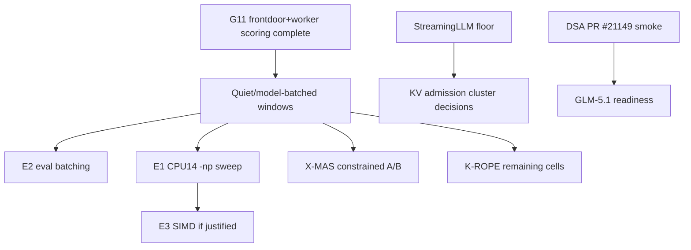

# Inference Acceleration — Active Index

**Purpose**: dispatch point for local inference optimization across CPU throughput, KV/context efficiency, speculative decoding, GPU-prep work, and model-serving experiments.
**Updated**: 2026-06-20 K-MEM completion, G11 frontdoor+worker scoring, and Granite warm embedder recipe refresh.
**History**: pre-compaction detail lives in [../archived/inference-acceleration-index-history-through-2026-06-19.md](../archived/inference-acceleration-index-history-through-2026-06-19.md).

## Start Here

1. Read [master-handoff-index.md](master-handoff-index.md) for global priority and active inference-lane constraints.
2. Use `/workspace/MEASUREMENT.md` for benchmark claim grammar and cache-state labeling.
3. Coordinate all throughput-sensitive runs with [bulk-inference-campaign.md](bulk-inference-campaign.md). K-MEM Tulving, frontdoor G5 short-m@k, and frontdoor+worker G11 AA-Omniscience collection/scoring are complete; architect G10 and the scoring-policy decision still need clean scheduling before G12 tier calibration.
4. Do not revive closed speculative-decoding or NUMA tracks without their documented reopen trigger.
5. For llama.cpp work, use a dedicated feature branch/worktree and do not touch the production binary without an explicit rollout plan.

## Active Landscape

| Area | Owner handoff | Status | Next action |
|------|---------------|--------|-------------|
| Batched decode / eval batching | [batched-decode-measurement.md](batched-decode-measurement.md) | ACTIVE-HIGH; scout exists, decision-grade E1/E2 still pending | Run E2 then E1 in the consolidated quiet window; use results to decide E3 SIMD work. |
| X-MAS / routing measurement dependency | [x-mas-text-routing.md](x-mas-text-routing.md), [routing-and-optimization-index.md](routing-and-optimization-index.md) | Enforce default-off; constrained policy needs quiet held-out A/B | Rerun only after the active G5 frontdoor lane clears or a separate quiet window is approved. |
| K-MEM / Tulving episodic benchmark | [research-evaluation-index.md](research-evaluation-index.md), [bulk-inference-campaign.md](bulk-inference-campaign.md) | Completed/scored; corrected score in research `9e63af0` | Use failure-mode report for follow-up design; no memory-routing promotion. |
| RoPE long-context probes | [research-evaluation-index.md](research-evaluation-index.md), [yarn-context-extension-research.md](yarn-context-extension-research.md) | Partial 4K/8K/16K evidence; worker path blocked by Gemma4 MTP serving issue | Resume K-ROPE cells in clean model-batched windows after active lane clears. |
| KV compaction stack | [attention-matching-kv-compaction.md](attention-matching-kv-compaction.md), [triattention-kv-selection.md](triattention-kv-selection.md), [memento-block-reasoning-compression.md](memento-block-reasoning-compression.md), [streaming-llm-baseline.md](streaming-llm-baseline.md) | Quantization deployed; AM merged; Expected Attention deployed; Memento S2 and StreamingLLM sweep remain open | Run current-stack long-context/coding refresh and StreamingLLM floor sweep before more rollout decisions. |
| CPU throughput backlog | [cpu-inference-optimization-index.md](cpu-inference-optimization-index.md) | Active queue compacted; high-value gates are batched decode, DSA, MoE-Spec, and roofline calibration | Start with the CPU index and owning handoffs; do not use old historical sections as current instructions. |
| Frontdoor drafter / speculative decoding | [gpu-drafter-mi200-investigation.md](gpu-drafter-mi200-investigation.md) | Blocked by qwen35/qwen35moe decode-position failures; metadata compatibility alone is not acceptance evidence | Find a non-failing draft path or fix decode-position handling, then rerun clean qwen35/frontdoor retest. |
| GPU acceleration / MI210 prep | [gpu-acceleration-path.md](gpu-acceleration-path.md), [agentic-rocm-kernel-authoring.md](agentic-rocm-kernel-authoring.md), [rocm-verify-profile-backend.md](rocm-verify-profile-backend.md) | Hardware-gated until MI210; prep only | Pin commits, license/env recipe, and gfx90a verification protocol before hardware arrives. |
| DSA / DeepSeek V3.2 / GLM-5.1 | [llama-cpp-dsa-contribution.md](llama-cpp-dsa-contribution.md), [deepseek-v4-flash-cpu-port.md](deepseek-v4-flash-cpu-port.md), [glm51-reap-cpu-evaluation.md](glm51-reap-cpu-evaluation.md) | Active tracker, user/inference-gated | Pull/build/smoke PR #21149 under explicit approval; reuse outcome for GLM-5.1 readiness. |
| Linear / recurrent architecture watches | [lightning-attention-port.md](lightning-attention-port.md), [log-linear-gated-deltanet-readiness.md](log-linear-gated-deltanet-readiness.md), [summary-token-attention-readiness.md](summary-token-attention-readiness.md), [engram-conditional-memory.md](engram-conditional-memory.md) | Mostly monitoring or role-decision gated | Activate only when the owning handoff's evidence template or checkpoint availability gate is satisfied. |
| Future context extension | [yarn-context-extension-research.md](yarn-context-extension-research.md) | Deferred pending datasets and RoPE bounds | Use Tulving 200ch and RoPE collapse points to set the next YaRN quality gate. |

## Additional Active References

These are active acceleration or model-serving references with narrow gates. They are indexed here so they do not become invisible, but they should not displace the current clean-window and CPU-throughput queues unless their gate fires.

| Handoff | Current role | Next action |
|---------|--------------|-------------|
| [angelslim-techniques-evaluation.md](angelslim-techniques-evaluation.md) | Sub-2-bit/STQ and SpecExit monitor. | Track upstream artifacts; avoid local implementation until a concrete mergeable kernel or checkpoint exists. |
| [delta-mem-reproduction.md](delta-mem-reproduction.md) | Frozen-memory topology spike; mechanical setup passed, accuracy/GPU-scale gates open. | Run only after the named reproduction/gpu-scale gate is approved. |
| [intra-process-tensor-parallel-decode.md](intra-process-tensor-parallel-decode.md) | Dormant TP decode reference. | Reopen only after its topology/workload checklist proves single-session saturation matters. |
| [multiscreen-attention-evaluation.md](multiscreen-attention-evaluation.md) | Checkpoint/research monitor for multiscreen attention. | Continue monitoring; no inference until pretrained artifacts and a current gate exist. |
| [qwen36-27b-cpu-feasibility.md](qwen36-27b-cpu-feasibility.md) | Candidate dense-model feasibility note. | Do a roofline/load-smoke only if the model becomes a real role candidate. |
| [tq3-quantization-evaluation.md](tq3-quantization-evaluation.md) | TurboQuant/TQ3 upstream monitor. | Watch PR #21089/ChunkKV; do not merge TQ3_1S. |

## Closed / Historical Anchors

These are not active work queues. Read their completed handoffs before reopening:

- NUMA 4-way parallel and page-cache prewarm are deployed/complete.
- Hadamard KV quantization is production config.
- Qwen3.6 production upgrade is archived.
- Peer-verifier speculation, MAB tree-shape selector, MTP on hybrid, hybrid SSM slot-promotion, NUMA_MIRROR, DFlash on Q4_K_M, and dynamic expert selection are closed or no-go for their measured targets.
- Completed accelerator history is preserved in `handoffs/completed/` and in the dated archive linked at the top of this file.

## Dependency Graph

## Reporting

After completing an acceleration item:

1. Update the owning handoff first.
2. Update this index only if the live queue, gate, or dependency order changes.
3. Append `progress/YYYY-MM/YYYY-MM-DD.md` with artifacts, command lines, cache state, and hardware/runtime state.
4. If a result changes routing or stack deployment, update [routing-and-optimization-index.md](routing-and-optimization-index.md) and the relevant stack governance handoff.
