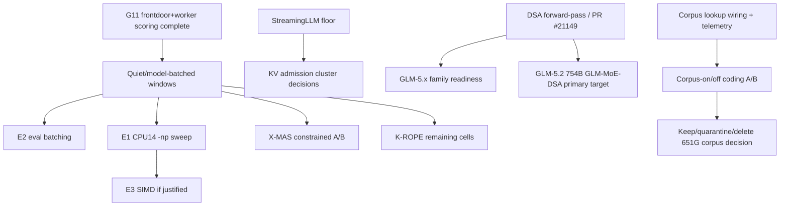

# Inference Acceleration — Active Index

**Purpose**: dispatch point for local inference optimization across CPU throughput, KV/context efficiency, speculative decoding, GPU-prep work, and model-serving experiments.
**Updated**: 2026-06-20 K-MEM completion, G11 frontdoor+worker scoring, and Granite warm embedder recipe refresh.
**History**: pre-compaction detail lives in [../archived/inference-acceleration-index-history-through-2026-06-19.md](../archived/inference-acceleration-index-history-through-2026-06-19.md).

## Start Here

1. Read [master-handoff-index.md](master-handoff-index.md) for global priority and active inference-lane constraints.
2. Use `/workspace/MEASUREMENT.md` for benchmark claim grammar and cache-state labeling.
3. Coordinate all throughput-sensitive runs with [bulk-inference-campaign.md](bulk-inference-campaign.md). K-MEM Tulving, frontdoor G5 short-m@k, frontdoor+worker G11 AA-Omniscience, and architect G10 collection/scoring are complete; G12 tier calibration has accepted deterministic AA-Omniscience 4-class scoring and updated production role multipliers. Remaining clean-window work is the consolidated measurement batch, including DS-E1 dynamic-stack KV measurement, not more G12 scoring.
4. Do not revive closed speculative-decoding or NUMA tracks without their documented reopen trigger.
5. For llama.cpp work, use a dedicated feature branch/worktree and do not touch the production binary without an explicit rollout plan.

## Active Landscape

| Area | Owner handoff | Status | Next action |
|------|---------------|--------|-------------|
| Batched decode / eval batching | [batched-decode-measurement.md](batched-decode-measurement.md) | ACTIVE-HIGH; A3B E1 and E2 decision-grade evidence landed 2026-07-03, with E2 a 4.858x wall-minutes/eval keep-candidate. Default-off eval-batch metadata, warm `eval_batch_frontdoor`, guarded route rewrite, smoke probe, and activation-window runner are packaged. | In the next clean window, run `uv run python scripts/benchmark/eval_batch_serving_activation_window.py --apply --confirm-clean-window`, then collect representative EvalTower quality/reliability/throughput before any default path change. Dense-control E1 remains re-scope-only; do not start E3 solely from the A3B result. |
| Dynamic stack KV measurement | [bulk-inference-campaign.md](bulk-inference-campaign.md) | DS-E1 is now staged in the clean-window manifest; no production flip | Run only in the consolidated quiet window after AutoPilot/live llama-server blockers clear. |
| X-MAS / routing measurement dependency | [x-mas-text-routing.md](x-mas-text-routing.md), [routing-and-optimization-index.md](routing-and-optimization-index.md) | Enforce default-off; 2026-06-21 constrained-policy held-out A/B completed with `decision.status=hold` | Repair quality regressions before another attested quiet-window A/B; G5/G11 no longer block scheduling. |
| K-MEM / Tulving episodic benchmark | [research-evaluation-index.md](research-evaluation-index.md), [bulk-inference-campaign.md](bulk-inference-campaign.md) | Completed/scored; corrected score in research `9e63af0` | Use failure-mode report for follow-up design; no memory-routing promotion. |
| RoPE long-context probes | [research-evaluation-index.md](research-evaluation-index.md), [yarn-context-extension-research.md](yarn-context-extension-research.md) | Partial 4K/8K/16K evidence; worker path blocked by Gemma4 MTP serving issue | Resume K-ROPE cells in clean model-batched windows after active lane clears. |
| KV compaction stack | [attention-matching-kv-compaction.md](attention-matching-kv-compaction.md), [triattention-kv-selection.md](triattention-kv-selection.md), [memento-block-reasoning-compression.md](memento-block-reasoning-compression.md), [streaming-llm-baseline.md](streaming-llm-baseline.md) | Quantization deployed; AM merged; Expected Attention deployed; Memento S2 and StreamingLLM sweep remain open | Run current-stack long-context/coding refresh and StreamingLLM floor sweep before more rollout decisions. |
| CPU throughput backlog | [cpu-inference-optimization-index.md](cpu-inference-optimization-index.md) | Active queue compacted; high-value gates are batched decode, DSA, MoE-Spec, and roofline calibration | Start with the CPU index and owning handoffs; do not use old historical sections as current instructions. |
| Frontdoor drafter / speculative decoding | [gpu-drafter-mi200-investigation.md](gpu-drafter-mi200-investigation.md) | G0 self-MTP baseline is now measured from live production logs (2026-07-03): frontdoor α=0.6582, architect_general α=0.6854, worker_general α=0.8256, failed MTP roles none; report `epyc-orchestrator/orchestration/reports/mtp_acceptance_report_20260703T114323Z.md`. External qwen35/frontdoor drafter alpha is still not measured and remains blocked by the validated-path retest requirements. | Treat the live self-MTP α as the baseline any external drafter must beat; find a non-failing external draft path or fix decode-position handling, then rerun the clean qwen35/frontdoor retest. |
| MTP spec-dec refresh (new heads) | [speculative-decoding-mtp-refresh.md](speculative-decoding-mtp-refresh.md) | UPDATED 2026-06-22: gemma-4-31B dense MTP benched (2.5-3.2x, valid output) but Pareto-dominated by the 26B-A4B worker -> no promotion; #22673 Qwen-MTP cherry-pick INFEASIBLE (model-framework gap, ~901 commits behind) BUT **fresh-upstream-build path VERIFIED WORKING** (Qwen3.5-9B dense MTP 1.97x, 87% accept); architect/Qwen3.5-27B MTP DEAD (GDN wall); EAGLE-3 -> MI210/July | T1 + T3 done (gemma-4-31B benched no-promotion; Qwen3.5-9B dense MTP functionally verified on fresh-upstream build, ~2x/87% accept — upstream kernels only, not apples-to-apples for deploy). #22673 infeasible by cherry-pick (see qwen-mtp-llamacpp-port.md). No open MTP action; the deploy fork is fresh-upstream (proven, loses our NUMA opts) vs reimplement-in-fork. intake-721..725. (added 2026-06-22) **2026-07-02 intake batch**: DeepSpec/DSpark/FR-Spec-vocab-trim → speculative-decoding-mtp-refresh.md + qwen-mtp-llamacpp-port.md; DSpark-scheduler/DFlare/Graft → moe-spec-cpu-spec-dec-integration.md. **DFlare (intake-741) ≠ our closed DFlash-on-Q4_K_M** (different technique + metric axis; see L57). intake-737..742. |
| Corpus-augmented prompt lookup / local code corpus | [corpus-augmented-prompt-lookup-revalidation.md](corpus-augmented-prompt-lookup-revalidation.md) | ACTIVE-HIGH option value, **not proven ROI**, 2026-07-04: `/mnt/raid0/llm/cache/corpus` is ~651G. CPL-1/2/3 no-inference work is complete: `build_corpus_context()` now uses `RegistryLoader`, gates on parsed per-role `corpus_retrieval`, logs disabled/injected/slow/error outcomes, and has an offline health probe. Read-only audit confirmed the hook is called by live chat/delegation paths; `frontdoor` and `coder_escalation` parse `corpus_retrieval=true`, while `worker_general`/architect/long-context roles remain disabled. The older worker-pool native `prompt_lookup` path is effectively unused by the API, and live llama native lookup/static-cache flags remain off. First warm-cache health artifact (`corpus_health_probe_20260703T112521Z.json`) returned snippets for `6/6` representative coding queries, `p95=298.016ms`, `17` snippets total, no failures. The CPL-4 harness now records injection diagnostics and is clean-window guarded; `corpus_quality_preflight_20260704T164539Z.json` injected `6/6` prompts with `3` snippets each and no failures. `scripts/corpus/build_static_ngram_cache.py` now provides a no-inference bounded chunk/merge scaffold for future static-cache experiments, with a tiny live-corpus dry-run manifest at `/mnt/raid0/llm/tmp/corpus_static_ngram_dryrun_manifest.json`. | Next: first run clean/isolated corpus-on/off code-writing A/B for `coder_escalation` and `worker_general` if it still handles coding/refactor work, using `--min-score 0.0` unless another threshold is deliberately tested. Do not spend CPU/disk building a large corpus-derived static n-gram cache unless that code-writing gate passes or the operator explicitly requests a throughput-only static-cache experiment. Keep only if one path shows measured quality/speed benefit with bounded overhead, otherwise mark the corpus reclaimable by operator decision. |
| llama.cpp v6 consolidation (framework rebase + kernel port) | [llamacpp-v6-consolidation.md](llamacpp-v6-consolidation.md) | Stage 1 DONE (commits 814e81782 repack kernels + c159997e0 CCD code, on branch production-consolidated-v6); builds + Qwen3.5-9B MTP verified (~89% accept). Finding: CCD is #ifndef GGML_USE_OPENMP -> compiled out in prod (OpenMP-ON) -> GGML_CCD_* env vars vestigial. NOT promoted. | Reboot host (25-day uptime) -> run NUMA topology bench on v6 (quarter/half/full x {9B,31B} x {base,MTP}, + OpenMP-ON vs -OFF/CCD). Then Stage 2 parity (paged-attn/KV-compaction/Hadamard/IMROPE - check upstream-native first). (added 2026-06-23) |
| GPU acceleration / MI210 | [gpu-drafter-mi200-investigation.md](gpu-drafter-mi200-investigation.md), [gpu-acceleration-path.md](gpu-acceleration-path.md), [agentic-rocm-kernel-authoring.md](agentic-rocm-kernel-authoring.md), [rocm-verify-profile-backend.md](rocm-verify-profile-backend.md) | **MI210 INSTALLED 2026-07-02; HIP build VERIFIED on gfx90a** (fp8 fix, branch `mi210-hip-enable`); first GPU benchmarks in (gemma4-31B 30 t/s, +MTP 43 t/s/1.44×/60% accept, qwen35 GDN clean, ~47% roofline). Observations (contended host). | gfx90a verification DONE → HIP kernel-authoring for the ~47%-roofline gap + finish the vLLM (rocm6.4.1_vllm_0.10.1) Qwen3-8B head-to-head. See gpu-drafter-mi200-investigation.md § 2026-07-02 Advancement. |
| DSA / DeepSeek V3.2 / GLM-5.1 | [llama-cpp-dsa-contribution.md](llama-cpp-dsa-contribution.md), [deepseek-v4-flash-cpu-port.md](deepseek-v4-flash-cpu-port.md), [glm51-reap-cpu-evaluation.md](glm51-reap-cpu-evaluation.md) | Active tracker, user/inference-gated | Pull/build/smoke PR #21149 under explicit approval; reuse outcome for GLM-5.1 readiness. |
| GLM-5.2 (PRIMARY GLM target) | [glm51-reap-cpu-evaluation.md](glm51-reap-cpu-evaluation.md), [llama-cpp-dsa-contribution.md](llama-cpp-dsa-contribution.md) | GATED on DSA PR #21149 (dense-MLA fallback today); intake-699, supersedes GLM-5.1 | GLM-5.2 (754B GLM-MoE-DSA, MIT) is now the primary GLM target. Gated on the DSA forward-pass landing in our fork (currently dense-MLA fallback; tracked in llama-cpp-dsa-contribution.md). Storage-viable via unsloth UD-IQ2 (~238 GB); see glm51-reap-cpu-evaluation.md RIU 2026-06-20. (added 2026-06-20 via research-intake batch deep-dive) |
| Amortized KV-cache synthesis (AM watch) | [summary-token-attention-readiness.md](summary-token-attention-readiness.md) | GATED: no public code + GPU-CPT required; watch-item only | Still — amortized KV-cache synthesis (intake-708) watch-item; primary tracker summary-token-attention-readiness.md. NB deployed default compactor is Expected-Attention, not AM. (added 2026-06-20 via research-intake batch deep-dive) |
| Kimi-K2.7-Code (coder_escalation candidate) | large-MoE completed ledger (2026-06-20 addendum) | DEFERRED on storage + operator approval | Kimi-K2.7-Code (~1T MoE, intake-703) — coder_escalation candidate, deferred: raid0 only ~633 GB free (Q4_K_M 620 GB near-blocker; Q3_K_M 489 GB), MoonViT unsupported in fork. See the large-moe completed ledger 2026-06-20 addendum. (added 2026-06-20 via research-intake batch deep-dive) |
| Linear / recurrent architecture watches | [lightning-attention-port.md](lightning-attention-port.md), [log-linear-gated-deltanet-readiness.md](log-linear-gated-deltanet-readiness.md), [summary-token-attention-readiness.md](summary-token-attention-readiness.md), [engram-conditional-memory.md](engram-conditional-memory.md) | Mostly monitoring or role-decision gated | Activate only when the owning handoff's evidence template or checkpoint availability gate is satisfied. |
| Future context extension | [yarn-context-extension-research.md](yarn-context-extension-research.md) | Deferred pending datasets and RoPE bounds | Use Tulving 200ch and RoPE collapse points to set the next YaRN quality gate. |

## Additional Active References

These are active acceleration or model-serving references with narrow gates. They are indexed here so they do not become invisible, but they should not displace the current clean-window and CPU-throughput queues unless their gate fires.

| Handoff | Current role | Next action |
|---------|--------------|-------------|
| [angelslim-techniques-evaluation.md](angelslim-techniques-evaluation.md) | Sub-2-bit/STQ and SpecExit monitor. | Track upstream artifacts; avoid local implementation until a concrete mergeable kernel or checkpoint exists. |
| [delta-mem-reproduction.md](delta-mem-reproduction.md) | Frozen-memory topology spike; mechanical setup passed, accuracy/GPU-scale gates open. | Run only after the named reproduction/gpu-scale gate is approved. |
| [intra-process-tensor-parallel-decode.md](intra-process-tensor-parallel-decode.md) | Dormant TP decode reference. | Reopen only after its topology/workload checklist proves single-session saturation matters. |
| [multiscreen-attention-evaluation.md](multiscreen-attention-evaluation.md) | Checkpoint/research monitor for multiscreen attention. | Continue monitoring; no inference until pretrained artifacts and a current gate exist. |
| [qwen36-27b-cpu-feasibility.md](qwen36-27b-cpu-feasibility.md) | Candidate dense-model feasibility note. | Do a roofline/load-smoke only if the model becomes a real role candidate. |
| [tq3-quantization-evaluation.md](tq3-quantization-evaluation.md) | TurboQuant/TQ3 upstream monitor. | Watch PR #21089/ChunkKV; do not merge TQ3_1S. |

## Closed / Historical Anchors

These are not active work queues. Read their completed handoffs before reopening:

- NUMA 4-way parallel and page-cache prewarm are deployed/complete.
- Hadamard KV quantization is production config.
- Qwen3.6 production upgrade is archived.
- Peer-verifier speculation, MAB tree-shape selector, MTP on hybrid, hybrid SSM slot-promotion, NUMA_MIRROR, DFlash on Q4_K_M, and dynamic expert selection are closed or no-go for their measured targets.
- Completed accelerator history is preserved in `handoffs/completed/` and in the dated archive linked at the top of this file.

## Dependency Graph

**Cross-cutting (added 2026-06-20 via research-intake batch deep-dive)**: the ~633 GB raid0 free-space gate bounds BOTH GLM-5.2 and Kimi-K2.7, but asymmetrically — GLM-5.2 escapes it via unsloth UD-IQ2 (~238 GB), while Kimi-K2.7 stays storage-tight even at Q2_K (373 GB) and is a near-blocker at Q4_K_M (620 GB). Do not double-count the same headroom across both.

## Reporting

After completing an acceleration item:

1. Update the owning handoff first.
2. Update this index only if the live queue, gate, or dependency order changes.
3. Append `progress/YYYY-MM/YYYY-MM-DD.md` with artifacts, command lines, cache state, and hardware/runtime state.
4. If a result changes routing or stack deployment, update [routing-and-optimization-index.md](routing-and-optimization-index.md) and the relevant stack governance handoff.
