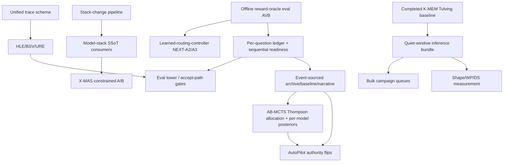

# Routing & Optimization — Coordination Index

**Created**: 2026-03-25
**Updated**: 2026-07-14
**Purpose**: Actionable entry point for agents working on routing, optimization, and stack infrastructure. Read this first — it tells you what needs doing, in what order, and where to find the details.

> **2026-06-12**: Fable 5 architecture review complete — verdicts + new owning handoffs in [master-handoff-index.md](master-handoff-index.md); standing reference [fable5-findings-00-executive-summary.md](../completed/fable5-findings-00-executive-summary.md). Measurement claims now follow /workspace/MEASUREMENT.md.
> New owning handoffs in this domain: [routing-truth-restoration.md](routing-truth-restoration.md), [model-capability-descriptors.md](model-capability-descriptors.md), and the evidence-plane-* handoffs (autopilot).

> **2026-07-16**: **Architect→Reviewer control-plane series created** — coordination index [reviewer-control-plane-index.md](reviewer-control-plane-index.md) (H0) + 9 leaves (trace-materialization, typed-artifacts, decision-plane, calibration-accounting, model-ablations, glm52-capability-gates, latency-budget, escalation-policy, autopilot-integration). Activates the dormant `ArchitectReviewService`/plan-review machinery as a governed, FA/FR-calibrated judicial layer; milestones M1 observable → M4 governed; enforce-mode blocked on the H-LB budget gate; **TR-4/5 + DAR gates NOT needed** (RD-7 answers tri-role TR-1 telemetry-only). Operator decisions: OP-5 bundle in master-index §A00. Evidence: intake-834..849 + audit doc `research/deep-dives/2026-07-16-architect-reviewer-control-plane-audit.md`.

---

## Cheapest open experiment — competence-region probe (registered 2026-07-21)

Zero inference, data already on disk, and it is the **only** proposed routing feature with a
pre-declared kill criterion. It was buried at line ~1444 of `learned-routing-controller.md` and
appeared in no index until now.

`COMP_r(x) = max cos(e(x), e(m))` over memories with `action=r, outcome=success`, using the 1024-d
BGE vectors already in `sessions/embeddings.faiss`; `retriever.py _retrieve()` L235-326 already does
this FAISS lookup, so only a per-role restriction and success filter are new. Feature concatenates at
`routing_classifier.py:61`.

- [ ] Run `COMP_r(x)` **leave-one-objective-out** (mandatory — only ~2,384 distinct objectives, so an
  in-sample nearest neighbour scores AUC≈1.0 for free); report AUC for `success | role` plus argmax
  accuracy on the 622-objective counterfactual set. **AUC ≤0.55 → record the null and close the
  intake-866 line** (both the difficulty axis and the familiarity axis are then flat). **AUC ≥0.65 →
  first routing feature with real spread in the program's history.** Owner:
  [learned-routing-controller.md](learned-routing-controller.md).
- [ ] Develop jointly with the **Escalation-prediction** surface (10,528 pos / 56,457 neg, status
  *Ready*, never built) — 'will this role succeed?' and 'will the base attempt fail?' are the same
  quantity, and the latter is the gate a conditional-depth surface needs
  ([rao-redel-substrate-spike.md](rao-redel-substrate-spike.md)).

## GPU np×budget throughput surface (registered 2026-07-23)

Measured for ALL three GPU architect candidates: `reasoning_budget → (optimal np, aggregate t/s, per-request
t/s)`. **Batching is architecture-dependent** — throughput ranking **A4 (35B-A3B MoE) ≫ A3 (27B dense) > A1
(122B-A10B IQ2 MoE)** at every batched point (L2k peaks 243/153/103). A3 + A4 batch robustly at every budget
(2.2–3.4×); **A1 is the sole outlier** — the np=2 dip and long-CoT batching *collapse* are A1-specific, NOT
generic-MoE (A4 MoE has no dip) and NOT generic-long-context. This is the missing *budget → concurrency
policy* half of routing — it co-determines each arm's launch `-np`, the admission-control ceiling, and which
GPU arm serves a given (budget,load) point. Full surface + per-arm rule + **router-integration plan
(TB-6-ROUTER, GATED on the GPU joining the orchestration stack)**:
[reasoning-effort-levels.md](reasoning-effort-levels.md) §TB-6. Primary consumer:
[heterogeneous-slot-fabric-residency.md](heterogeneous-slot-fabric-residency.md).

## How to Use This Index

1. **Read the outstanding tasks below** — they are ordered by priority and dependency
2. **Check the dependency graph** — some tasks unblock others
3. **Read the relevant handoff** for implementation details before starting work
4. **After completing a task**, update both the handoff AND this index (mark task done, update status)
5. **Check cross-cutting concerns** before modifying any subsystem — changes cascade

---

## Standing Comparative Context

Before proposing or revising routing/coordination architecture, read [`research/deep-dives/trinity-evolved-llm-coordinator-methodology.md`](../../research/deep-dives/trinity-evolved-llm-coordinator-methodology.md) (intake-474, ICLR 2026, Sakana AI). Trinity is the most direct prior art for the lightweight-learned-coordinator-over-heterogeneous-pool thesis we are pursuing. The deep-dive cross-checks Trinity's choices against ours on architecture, training signal, optimizer, action space, and pool composition — and lists the portable lessons (tri-role action space, sep-CMA-ES cold-start, block-ε-separability diagnostic, SVD-FT) and the non-portable ones (penultimate-token finding, frontier-closed-pool gain numbers). Reference it explicitly when arguing for a routing-architecture change so we know which Trinity lever the change does or does not echo.

**Routing/coordination design-space reference points (added 2026-04-28)**: four published systems anchor the current research landscape for learned routing and coordination heads:

- **BaRP** (intake-495, arxiv:2510.07429) — bandit-feedback training + 2-D preference-vector conditioning. **EPYC adopts patterns** at DAR-3 (motivation), DAR-4b (preference vector + cost τ), and via the routing-policy lens.
- **LLM Bandit** (intake-496, arxiv:2502.02743) — IRT score predictor + model identity vectors + IRT-stratified cold-start onboarding. **EPYC adopts patterns** at LRC P4.1.3 (P19.9, IRT feature audit), LRC P5 (P19.10, IRT-stratified cold-start), and DAR-5.
- **Trinity** (intake-474, arxiv:2512.04695) — sep-CMA-ES on a 0.6B SLM + 10K head with tri-role `(LLM, role)` action space. **EPYC tracks selectively** — tri-role architectural change (P19.1) is a real candidate; sep-CMA-ES is the realistic CPU-feasible escalation path if DAR-3/4 underdeliver.
- **Conductor** (intake-493, arxiv:2512.04388) — 7B GRPO-trained coordinator emitting `(worker_id, NL_subtask, access_list)`. **EPYC treats as competitive intelligence ONLY** (NOT a target architecture; OC-0.6 captures the comparison row, with explicit "what to learn from / what NOT to copy" framing). GPU-class architecture, out of CPU stack.

When making a routing-architecture proposal, name which of these four (and which Trinity lever from the deep-dive) the proposal echoes — and which it deliberately does not. Closure-inflation discipline applies: do not generalize "Conductor's 7B is out of scope" into "no learned coordinator could ever work" — the four systems are distinct points, not a single architecture.

---

## Subsystem Status

**Current AutoPilot checkpoint - 2026-08-09**: AutoPilot is intentionally stopped. Orchestrator
`3f62f712` implements the staged T1 screen → matched T2 → matched T3 → fresh T1 promotion policy,
same-tier baselines, exact runtime rollback, and fail-closed startup until a human-ratified three-tier
bundle exists. `83c8777a`/`f3b262b8` repair batched episodic reseeding across all six embedder servers;
an atomic 63,786-row semantic rebuild is in progress. After its semantic gate: API-only dashboard
reload, immutable T1=100/T2=500/T3=160 incumbent baselines, then one consolidated human ratifier.
Do not restart AutoPilot after ratification without separate operator permission. Runtime and detailed
evidence remain authoritative in
[`autopilot-continuous-optimization.md`](autopilot-continuous-optimization.md); older PID/current-code
claims below are historical.

**2026-07-06T06:36Z update**: orchestrator `f16a7bba` adds
`autopilot_planner_provider_watch`, an active-safe deterministic lab job backed
by `scripts/autopilot/planner_provider_health_report.py`. The live smoke reports
planner-provider status `healthy`, `local_frontdoor` draft success and
`local_worker` critique success in the latest current-code turn, plus earlier
local-worker/deep-eval critic issues in `recent_issues` for follow-up. The
self-running lab inventory is now `10` jobs, `6` enabled, and `4`
active-safe deterministic ready-now jobs while AutoPilot is active.
Orchestrator `b886f761` then scopes this watch to the current AutoPilot PID by
default, so the live signal now excludes old Codex-era provider attempts:
`scope=current_process`, `event_count=2`, `fallback_provider_starts=0`, and
`recent_issues=[]` for PID `3795561`. The same commit pins the local
`deep_eval tier=3` selectable-action path with a provider-coordinator
regression test.

Dashboard Regions Lock coherency is repaired in source in four layers:
`6a016f25` separates real `/proc` holders from tap-inferred active holders,
`d2b0cbd0` adds enriched structured tap rows to the coherent snapshot, and
`554b71af` keeps tap-inferred holders visible even when `/proc` reports the same
physical holder. `b81f3113` then makes the coherent snapshot use the fresh
region-lock scanner rather than the TTL cache. `c366e8aa` adds a final
display-activity reconciliation layer so raw CPU slot history cannot masquerade
as active CPU holders without structured-tap or `/proc` corroboration. These
layers are live after the 2026-07-06 API reload. Tool batching telemetry is now
registry-backed: `64db8a12` adds multi-tool/read-only/parallel coverage
reporting and `87e957ba` adds narrowed `side_effects: ["read_only"]`
annotations without marking eval-style Python/NumPy or embedding tools
read-only. T3 is now named as the expert/hard workflow validation lane in the
controller constitution and higher-tier probe guard. W8 remains evidence-bound,
but the blocker has moved from candidate generation to collecting fresh
promotion-eval evidence, combined E-process strength, and sequential
confirmation.
The 2026-07-14 dashboard-region-lock topology sidecar in orchestrator
`774fed69` extends the render path to all configured topology, so
`stack_numa_mode=full` no longer hides configured quarter instances and known
NUMA ports are labeled independently of expected launch mode.

**Next clean/quiet-window bundle (non-MI210)**: the 2026-07-07 stopped-window
closed J17 live consult evidence, `real_suite_v1` n=50, A9 contrast-replan
collection, and the E1 dense-control tail. Do not rerun those as first-idle
tasks. Remaining quiet-window candidates should be selected from genuinely open
rows such as ODL follow-up with a better table benchmark, W8/Fable report
refreshes, or future eval-batch serving telemetry. E2 activation/rollback is
closed and DS-E1 is decision-ready, so neither should be scheduled as next-run
work. RI-10 scored factuality is complete and currently holds on no enforce
factuality lift.
The 2026-07-06 sidecar command expansion is recorded in today's progress log;
current live verification shows tool-use activation is **not** blocked by
`api_env_missing_AUTOPILOT_TOOL_SENTINELS` (`tool_use_activation ready []`,
API and AutoPilot `/proc` env both carry `AUTOPILOT_TOOL_SENTINELS=1`).

**Prior checkpoint - 2026-07-06T01:52Z**: AutoPilot is live as PID `3438615`
with `--max-trials 3000` and `code_stale=false`. Trial `1200` was a replayable
`memrl_retrieval` `numeric_trial` but failed safety on `tool_use` regression
and was dominated; the daemon was restarted at that boundary onto orchestrator
`8464986e` and `ea47f672`. The routine planner split is now `local_frontdoor`
draft -> `local_worker` critique with `claude` fallback, and the dashboard
Regions Lock count split has been reloaded. Planner hints, tool sentinels,
sequential verdicts, W6 audit accrual, and W4-W6 authority env are active.
Startup verified StrategyStore search health exact (`1,420` SQLite/FAISS/FTS
rows, `100.0%` coverage).
Orchestrator `3364bdd7` repairs the W8 fallback loop so seed/deep/prune
deferrals are not consumed as W8 candidate-generation evidence, and
`a13a2948` makes a new empty-params `numeric_trial` an Optuna request whose
concrete applied params are journaled by dispatch. The first canary exercised
that path: W8 fallback selected `chat_pipeline`, and NumericSwarm applied
`chat.try_cheap_first_quality_threshold=0.8742715026951258`. Trial `1194`
then failed safety on a `tool_use` regression and was reverted/blacklisted for
that exact concrete param. Orchestrator
`69cbe730` repairs dashboard tap-inferred CPU-lock aliases so logical tap roles
such as `coder_escalation` map back to the physical region-grid role before
painting. The API was reloaded after the contention-freshness fix and live
`/dashboard/api/contention` reports `matrix_status="ok"`. Orchestrator
`120498c9` resolves the v6 contention
false-stale by hashing the production roles measured in
`contention_matrix.yaml` rather than auxiliary explicit-only launch roles such
as `eval_batch_frontdoor`; no contention rebench was needed.
Research commit `955beb6` records the four A9 audit-target live collection
batches from the quiet window, so A9's next step is rebuild/scoring on those
rows rather than more collection plumbing. Follow-up fold/scoring completed as
timestamped `20260705T185704Z` artifacts: the scorer rows are valid (`162`
rows, target agreement `0.9506`), but both candidate-only pairwise contracts
remain below the contrast gate (`3` binary cross-action pairs, `6`
score-ordered cross-action pairs; no eligible ranker holdouts). Orchestrator
`ee96e423` repairs the follow-up planner so collection targets are satisfied
only by source-binary directional contrast, not by same-record role presence:
the live slice has `81` presence groups but only `2` target-satisfying contrast
groups. The current A9 pickup is the four-batch guarded contrast-replan
manifest
`offline_reward_pairwise_audit_target_live_20260705T185704Z_contrast_replan_20260705T202257Z_collection_manifest.json`,
blocked only while AutoPilot is active. Outcome progress remains `attention`:
latest frontier admission is still trial `1005` (`205` trials stale at this
checkpoint).

| Subsystem | Handoff | Status | Next Action |
|-----------|---------|--------|-------------|
| Routing Intelligence | [`routing-intelligence.md`](routing-intelligence.md) | **COMPACTED 2026-05-28; RI-10 SCORED; DECISION HOLD ON NO FACTUALITY LIFT** — Phases 0-5 history moved to completed ledger; hardened report semantics distinguish raw high-risk volume from decision-grade canary evidence and do not count non-canary-role shadow rows as sampled canary arms. Live progress logs satisfy the DS-E1 packet's RI-10 consumer gate, and orchestrator `adf010b4` attaches the scored response summary to `ri10_canary_decision_report.py`. Current packet `20260706T065654Z` reports `hold_quality_scored_no_lift`: enforce operational proxies are favorable (`61` enforce / `80` shadow rows, p95 ratio `0.211511`, cost ratio `0.532151`), but scored factuality is tied (`3/30` enforce vs `3/30` shadow; accuracy delta `0.0`). | Keep classifier/risk-routing expansion frozen unless a future scored packet shows enforce-arm factuality lift or the operator explicitly accepts a lower-evidence rollout decision; DS-E1 is no longer blocked on RI-10/KV evidence. |
| AutoPilot / AutoResearch | [`autopilot-continuous-optimization.md`](autopilot-continuous-optimization.md) · sequencing audit: [`orchestration-robustness-audit-2026-07-11.md`](orchestration-robustness-audit-2026-07-11.md) | **Authority wiring current; A10 planner hints ACTIVE; episodic FAISS exact; tool-use activation ready; numeric candidate generation repaired; DS-E1 ready; W8 report repaired; local planner canary verified and now monitored; outcome-stall guard live; forced W8 replay/AP-9 seam repaired; seq fallback unblock landed.** Current volatile PID/trial/code-freshness state is delegated to the handoff's top checkpoint and `phase_health_report.py --json`; the latest audited refresh (2026-07-14T00:00Z) reports AutoPilot active and back on current code (`code_stale=false`) at trial `1346` after the 2026-07-14 authority restart onto orchestrator `402e461b` (seq-fallback unblock; `177` tests passed), with `AUTOPILOT_PLANNER_SPEND_BREAKER=0` and retryable seq baseline-reference fallback selection active. Planner routing is local-first (`local_ingest` primary, `local_frontdoor` critic, Claude fallback). Active-safe deterministic lab watches include planner-provider, restart, outcome-progress, review-queue, quiet-window-plan, and queue-drift reports. Episodic StrategyStore search, tool sentinel prompts, stale broad numeric blacklist constraints, numeric short-param application, W8 stale replay pressure, W8 candidate-generation deferral replacement, local planner fallback semantics, CPU MTP same-file launch, dashboard tap-lock alias/count rendering, and forced replay/AP-9 attribution are repaired. | Do not infer current-code-clean status from this index; re-run phase health first. Open AutoPilot work is rollout/validation evidence: AP-26 needs operator-approved non-RLM vs RLM live comparison, AP-27 needs Ouro/inference integration review, BSV-2 needs live paired-run evidence before enabling `AUTOPILOT_BSV2_ACCEPT_GATE`, and BSV-3 enforcement stays default-off/observe until BSV-2 evidence exists. A9 folding is complete and the acquisition planner is repaired in `ee96e423`; run the guarded four-batch contrast-replan manifest only in the next clean AutoPilot-stopped window, then rebuild/score. Research-intake 2026-07-14: intake-819 (Sleep-time Compute) filed as an adopt_patterns **rider on AP-29 KnowledgeDistiller wiring** (not new scaffolding) — see handoff RIU. |
| Routing Truth Restoration | [`routing-truth-restoration.md`](routing-truth-restoration.md) | **CLOSED 2026-07-14** — W1-W8 landed in `epyc-orchestrator` `b5f26e5` + `41a6944` + `2a52740` + `e40df31` + `1dfbc22`; live `/config/attest` sampled 6 workers with `specialist_routing=true`, `model_fallback=true`, wave-2 flags false, `routing_classifier=false`, no heterogeneity; q_scorer TPS loads from lean registry; confidence/3-way routing dead paths removed; Trinity/URE shadow telemetry persists in progress JSONL; DAR-1 current replay measured 0.00% identifiable mean regret; the overdue `dispatch_swarm_fanout` watch is now resolved delete/defer. | Routing expansion stays frozen. Current `epyc-orchestrator` carries only the default-off `swarm_fanout` feature flag in `src/features.py`; `dispatch_swarm_fanout` has no live implementation symbol or tests in the current checkout. The intake-746/747 RSA/GSA arms in [reasoning-compression.md](reasoning-compression.md) remain design-only and must reopen as a fresh owned experiment if pursued. |
| Stack Startup NUMA Prewarm | [`numa-page-cache-prewarm.md`](../completed/numa-page-cache-prewarm.md) | ✅ **COMPLETE 2026-05-29** (archived) — codified `[1.5]` page-cache prewarm passed cold-cache P5; previously-collapsed shared GGUFs are ~25% per NUMA node, 27.3 s cold prewarm time | Monitor future cold starts for regression; re-open the archived handoff if symptom recurs |
| Dynamic Stack | [`dynamic-stack-concurrency.md`](dynamic-stack-concurrency.md) | **COMPACTED 2026-05-28; DS-E1 + DS-7 DECISION READY 2026-07-05** — Phases B-D complete; DS-6/DS-7 design ledger split to completed history; `069f8c0` aligned `stack_templates/default.yaml` to the live manifest with aliases and retired-role rejection. Research manifest refreshes cleared the original stale DS-E1 blocker; orchestrator `c98c9e14` now makes the DS-E1 manifest freshness check content-aware so same-version stack-prior recompile timestamps do not create false blockers when all live roles are covered. Current packet `ds_e1_evidence_packet_20260705T094913Z` reports `ready_for_profile_decision=true` with `blockers=[]`; current Fable gate `fable5_gate_report_20260705T094913Z` has `ds_e1_dynamic_stack=ready` and is blocked only by W8 candidate generation. `stack_templates/default.yaml` now records `metadata.ds7_profile=steady_state_static_prewarm` and `metadata.ds7_decision.status=retain_default`; report `ds7_profile_decision_20260704T194020Z` validates the default profile (`17` roles, `28` instances, `657` GB) and parks DS-6 until future evidence proves static pre-warm insufficient. Orchestrator `464aca54` adds a default-template/generated-prior parity guard so future serving-port drift fails validation. | **⚠ TOPOLOGY CHANGED 2026-07-30 — quarters are RETIRED.** Every quarterable role is now **1 full + 2 halves** (full `0-95` + `interleave=all` `-t 96`; half A `0-47,96-143` + `interleave=0,1` `-t 48`; half B `48-95,144-191` + `interleave=2,3` `-t 48`), with ports `8280 8380 8282 8382 8385 8485` **freed and not to be revived**. Consequences for this row: **DS-6 QuarterScheduler is not merely parked — it is moot**, and `scripts/server/quarter_scheduler.py` (403 ln, zero runtime importers) is a delete candidate (N25 P1-9); `stack_templates/default.yaml` is a **fourth hand-maintained copy of the topology** whose parity gate already fails 7 ways (N25 P1-4); and DS-E1's static-prewarm evidence was collected on the old shape, so re-run it before citing it against the new one. See [numa-topology-cutover-resume-20260730.md](numa-topology-cutover-resume-20260730.md) (N25) and [numa-placement-defect-20260730.md](numa-placement-defect-20260730.md) (N24). Prior guidance: Monitor for topology/model changes that require rerunning DS-E1. Do not implement DS-6 QuarterScheduler unless future DS-E1-equivalent evidence shows a material static-prewarm throughput or latency gap. |
| Stack Change Governance | [`standardized-stack-update-pipeline-finalization.md`](standardized-stack-update-pipeline-finalization.md) + [`stack-change-governance-pipeline.md`](stack-change-governance-pipeline.md) | **IN PROGRESS 2026-06-27** — canonical stack-change command/gates, generated stack-prior contract, guard/scanner ownership, runtime attestation, launch/preflight gates, promotion-gate execution, representative swap-CI witnesses, and fail-closed production-blocker waiver enforcement are live. Completed chronology is compacted into dated history ledgers. | Continue high-risk consumer migrations from `orchestration/stack_change_surface_manifest.yaml`; production-blocker waivers require the explicit emergency `--allow-production-blocker-waivers` path; broaden W4 swap-CI only when migrated consumers create new witness surfaces. |
| Model Stack Quantity SSoT | [`model-stack-single-source-update-pipeline.md`](model-stack-single-source-update-pipeline.md) | **PARTIAL IMPLEMENTATION; CONFIG CATALOG RE-AUDITED 2026-06-27; X-MAS ENFORCE ENABLED 2026-07-04** — stack-prior SSoT and representative consumers are live across config/admission, OpenAI `/v1/models`, health/status/preflight, routing/action, benchmark/eval, runtime policy, PromptForge, GraphRouter, seeding, generated-stack docs, AutoPilot system-card generation, X-MAS table compilation, and X-MAS incumbent-aware constrained policy. `health_preflight_probes`, `launch_maps`, `config_model_catalog`, and the current 13-surface/27-rule inventory are re-audited/guarded rather than open consumer tails. The historical 2026-06-21 X-MAS constrained-policy A/B was negative, but `f517902d`/`b108f865` repaired and versioned the policy as `incumbent_constrained_cheapfirst_v2`; the 2026-07-03 quiet-window A/B returned `decision.status=promote_candidate`, score delta `+0.10`, latency ratio `0.938`, no blockers, and no regression domains. `epyc-orchestrator` `d4a6c927` enabled guarded X-MAS enforce, reloaded the API, and post-restart Fable5 reports X-MAS ready. | Monitor post-enable X-MAS routing telemetry and keep rollback (`mode: off` + API reload) ready; shared launch/stack-prior helper work remains main-thread if a future concrete duplicated fact appears. |
| Registry Compile / Master Reconcile | [`registry-compile-master-reconcile.md`](../completed/registry-compile-master-reconcile.md) | ✅ **COMPLETE 2026-06-27** — generated lean registry compiles by default from the master registry, strict stack-prior evidence gaps are closed, checked-in lean YAML semantically equals `compile_lean(master, active_roles_from_launch_meta(ROLE_LAUNCH_META))`, worker-general recipe facts derive from registry/server-mode data, and obsolete hand-edit banner wording has been removed. | Historical reference; reopen only for a concrete new master/lean drift class or duplicated runtime fact. |
| Prompt Construction / Sampling Determinism | [`prompt-construction-determinism.md`](prompt-construction-determinism.md) · master **N14** | **DEPLOYED LIVE 2026-06-26, attestation-green, committed (orch `f4a8a3ca` / root docs)** — audit found prompt *construction* deterministic but *sampling* not. Fixed + reloaded: per-role `generation_defaults.temperature` (0.1–0.3) wired into sampler payloads, fixed `seed`, unified `top_k/top_p/repeat_penalty`, and `architect_general` flipped to chat-completions so `enable_thinking=false` fires. 2026-07-04 code gap closed and deployed: orchestrator `fe390e5a` forwards caller-explicit `temperature`/`seed`/`top_p`/`top_k` from `/v1/chat/completions` through `LLMPrimitives`/`InferenceRequest`, omitted temperature preserves registry defaults, and content-cache keys separate explicit sampling; API reload PID `3577452` is healthy. 2026-07-06 clean-window J12/D2 probe closed with durable report `orchestration/reports/j12_think_loop_probe_20260706T143621Z/`: frontdoor `15/15`, architect `14/15`, and `0` empty outputs / errors / `<think>` leaks / known wait-reference loops / repetition loops. | Operator: **D3** manual canonical bench greedy→sampled (co-schedule w/ N13 post-reboot bench); **D4** sampling-quality `autopilot_quality` era after D3. |
| Within-Role Placement + KV Migration | [`within-role-placement-state-machine.md`](within-role-placement-state-machine.md) | **WP-0/WP-1/WP-2/WP-3/WP-4/WP-5-scaffold IMPLEMENTED 2026-05-26** MERGED TO MAIN (`epyc-orchestrator` merge `fe6805c`; tip now `15350fe`; 155/155 dispatcher-adjacent tests at merge). WP-2/WP-3/WP-4 ship behind env flags (ORCHESTRATOR_PLACEMENT_STATE_MACHINE, ORCHESTRATOR_REVERSE_MIGRATION) defaulting off; WP-0/WP-1/WP-5-scaffold are live. WP-3 dropped the speculative load-transition trigger (could not preempt mid-decode); shipped transactional MigrationTransaction + policy gating + migration_budget_ms threading on the existing session-handover trigger. | **WP-6 / WP-7 / WP-5 full ratification** — all inference-gated, awaiting operator approval + measurement. WP-3/WP-4 gate verifications also inference-gated. |
| Cross-Role Contention + Placement | [`shape-keyed-contention-gating.md`](shape-keyed-contention-gating.md) | **A/A-1 + B CODE-COMPLETE END-TO-END; C prep only. Remaining = rollout-only, no code.** Step 1 (GLOBAL region mutex) was armed live on 2026-05-31 and the 24-row sampler was analyzed 2026-06-12: all rows `matrix=ok`, `global_locks=4`, 14/24 rows had blocked pairs, max `wait_s=205.4`, and 2 rows reported `timeout=2`; counters reset/alias inside the trace, so this proves function but not a stable cost total. Step 2 (dispatch-side caller passes real `candidate_topology_idx`) DONE 2026-05-31 — `inference.py` defers coarse pre-gate, `concurrency_aware._dispatch` gates per-candidate, `contention_gate.admit()` threads idx; 146-test suite green. Both shape-aware flags still default off -> inert. C only has pure `select_backfill_candidate`; heavy veto/barrier/pressure-skip untouched. | Rollout: (1) clean quiesce-window live smoke for Step 2 (disjoint admit / overlap queue) before `SHAPE_AWARE_CONTENTION=1`; (2) if smoke passes, flag-on bracket with attested env; (3) switch A placement to exact-region snapshot; (4) C behavior changes under an epoch boundary. | **⚠ 2026-08-01: a LOCKED decision in that plan is now FALSE** — `architect_general` is no longer "strictly solo/whole-machine"; it is an 8-thread GPU host lane and its worst measured pair went **0.66 block → 1.40 allow**. The whole-machine blocker was renamed `architect_critic`. Device-aware feasibility (artifact 1) landed as `src/scheduling/device_model.py`; flags stay default-off. Design + open questions: [`contention-model-device-and-load-axes-rider.md`](contention-model-device-and-load-axes-rider.md).
| KV Cache Quantization | [`kv-cache-quantization.md`](../completed/kv-cache-quantization.md) | COMPLETE — Hadamard deployed, TQ/PQ abandoned | Historical reference; monitor upstream TurboQuant from inference index |
| Context Folding | [`context-folding-progressive.md`](context-folding-progressive.md) | **COMPACTED 2026-05-28** — core phases and Phase 2d preserved in completed ledger. CF-DD8 closed 2026-06-13: no new CF-owned per-message cap; tool-output-compression owns budget reduction, surgical snip is telemetry-gated. CF-2c.0 alpha sweep met the `>2%` proxy gate on 2026-06-19; next is Phase 2b design-variant promotion plus live/held-out validation, not production behavior. | CF-L5 max-compression validation and CF-3c live quality-monitor validation remain. |
| Conversation Management | [`orchestrator-conversation-management.md`](../completed/orchestrator-conversation-management.md) | COMPLETE (B1-B7 + integration) | Historical reference |
| LangGraph Migration | [`langgraph-migration.md`](../completed/langgraph-migration.md) | COMPLETE / historical migration infrastructure | Historical reference; reopen only for a fresh LangGraph migration push |
| ~~CC Local Integration~~ | ~~[`claude-code-local-constellation-routing.md`](../archived/claude-code-local-constellation-routing.md)~~ | ARCHIVED — superseded by Hermes outer shell | — |
| Retrain Routing Models | [`retrain-routing-models.md`](retrain-routing-models.md) | **PARTIAL 2026-07-05** — BGE repair completed HEALTHY; current-data MLP retrain staged (81.0% val acc; >=0.8 threshold precision 94.4% / coverage 61.6%); orchestrator `7f5d874f` adds a no-inference rollout harness; orchestrator `fe270b48` proves the enable/attest/rollback bracket passes; live flag still OFF | Decide explicitly whether to run a `--keep-enabled` bracket; treat `fe270b48` as feature-attestation evidence, not routing-quality promotion evidence. GAT/SkillBank remain frozen unless future regret gates justify them |
| Meta-Harness Optimization | [`meta-harness-optimization.md`](meta-harness-optimization.md) | **IMPLEMENTATION/COORDINATION QUEUE CLOSED 2026-07-11** — Tier 1/2, MH-4/5, HLE-1/2, HLE-3/J9, MH-7, MH-9, MH-10, MH-11, MH-12, and SkillOpt/EV-10 coordination are recorded in the owning ledger. | No live Meta-Harness implementation tail. EV-10 deploy/restart and paired A/B validation remain in `bulk-inference-campaign.md` Package K; Tier 3 outer loop remains deferred. |
| Web Research Pipeline | [`searxng-search-backend.md`](searxng-search-backend.md) | SX-1–4 done; root CLI fallback semantics hardened in `epyc-root` `fa75cfa` so valid JSON without `.results` exits documented fallback code `2`; CA-1–7 landed/validated in `epyc-orchestrator` `0dadb2e` + `38ddc97` + `6424d05`: Crawl4AI-first `web_research` fetch backend on port `11235`, urllib fallback/cache/provenance preserved, first-run Docker timeout hardening, live container smoke against `/health`, `/crawl`, and `_fetch_page()`, plus opt-in bounded docs/log crawl helper. SX-5/6 remain AR-3 gated and CA-6 waits for Camofox. Claude Code bash bridge moved to completed: [`searxng-bash-websearch-bridge.md`](../completed/searxng-bash-websearch-bridge.md). | Next: SX-5/6 remain AR-3-gated; CA-6 waits for Camofox; optional future CA-7 live-service smoke or default-pipeline wiring only if needed |
| Internal Interaction Lifecycle | [`internal-interaction-lifecycle.md`](internal-interaction-lifecycle.md) | P1 substrate landed 2026-06-28 in orchestrator `18956892`: additive `Interaction` dataclasses, `interaction_type` telemetry, internal delegation wrapper, and `ProgressLogger.log_interaction()`; no inference admission-path edit. P2 scaffold plus first route seam are staged default-off through orchestrator `0e555822`: `interaction_skills.yaml`, `src/orchestration/consultation.py`, consult cache namespacing, `log_consult()`, opt-in `run_edit_transaction()` review hook, and `force_mode="edit"` callback wiring behind `review_before_commit_consult`. The J17 harness supports `--task-suite targeted` and `--arms baseline,consult,gated`; AutoPilot has the `consult_gate_probe` surface and generalized `should_consult(ConsultIntent, ConsultSignals)` is landed in orchestrator `1967c682`. | P1 regression/contention bake cleared 2026-07-07. BEP J17 (`internal_interaction_j17_ab_20260707T011136Z`) tied baseline and showed blanket enablement is wasteful. Targeted J17 (`internal_interaction_j17_ab_20260707T121211Z`) improved quality `35/50 -> 40/50` (`+10.0pp`) with `15` reruns, rescuing parser/data-contract edge cases but adding consult latency. T3 canary trial `1251` recorded a frontier row: gated `8/10` vs baseline `7/10`, `consult_gate_targeted=2.4`, gate reason counts preserved, and `journal-consult-gate-trial-1251` retrieves as the top StrategyStore memory for consult/parser/T3 queries. Keep default-off; next work is T2/T3 breadth and week-scale shadow data before enforcement. |
| Decision-Aware Routing | [`decision-aware-routing.md`](decision-aware-routing.md) | GATED — DAR-2 contrastive is live, the 2026-07-03 DAR-1 current replay measured 0.00% gate regret over 22,992 routing decisions with 98.6% regret-identifiable coverage and 99.6% uniform Q-values, DAR-4b request-level preference-vector/cost-τ plumbing is staged default-compatible in `epyc-orchestrator` `fbd569b5`, and the first offline proxy sweep (`b40207b4`) shows the logged selector surface is almost insensitive to the tested knobs (`0.00%` baseline flips for balanced/perf-heavy, `0.06%` for cost-heavy over 24,918 eligible frozen decisions) | DAR-3/DAR-6/Package-I expansion remains frozen until a future DAR-1 replay proves >=5% regret and N2 per-question vectors exist. DAR-4b still needs a live/controlled latency-quality measurement before any policy default uses the new knobs; the current sweep is selector-proxy evidence only. |
| Learned Routing Controller | [`learned-routing-controller.md`](learned-routing-controller.md) | **STAGED, not live (refreshed 2026-06-27)** — BGE repair is healthy and current retrain produced 81.0% validation accuracy with 94.4% precision at threshold >=0.8 over 61.6% coverage; production attestation still reports `routing_classifier=false`. Phases 1.5+ remain frozen until per-question eval vectors exist and a future DAR-1 replay shows >=5% routing regret. P4.5 journal-derived soft-label SFT and P4.6 soft-arm role dropout both ran as zero-inference methodology experiments and both are **NULL** under the current role-success gate. | Do not retune the current soft-label/dropout path. Regret gate still applies to enabling the classifier in production. The actionable LRC thread is content-routing miss learning from Phase A and future classifier rollout/canary evidence, not P4.5/P4.6 replay. Research-intake 2026-07-14: intake-814 (Knowing-Using Gap) filed as a **reference caveat** — the router is EPYC's one memory→weights path (`routing_classifier.py`) but the fine-tuning gap does not transfer to a single-step discriminative head; see handoff RIU. |
| Environment Synthesis (5th species) | [`agent-world-env-synthesis.md`](agent-world-env-synthesis.md) | **REFRESHED 2026-07-14** — AW-1..AW-5 built/tested; Phase 1 training-free path is live in the owning handoff. Phase 2 gate = Phase-1 progress + gfx90a GRPO-viability smoke on the installed MI210 (NOT GPU acquisition / NOT DGX) | AW-6 bootstrap run; AW-7 Endless-Terminals re-eval |
| Deep Research Mode | [`minddr-deep-research-mode.md`](minddr-deep-research-mode.md) | REFRESHED 2026-05-28 — Phase 1 scaffold landed; MD-9 A/B is the live gate; Phase 2 GPU-gated. **2026-07-14 gate note**: the owning handoff's "DGX Spark acquisition" Phase-2 gate is DEAD as written (DGX abandoned; MI210 gfx90a installed 2026-07-02) — the gate must be re-evaluated against MI210 training viability | MD-9: sentinel A/B with EV-9 rubric if available; keep dispatcher wiring deferred until pass |
| Tri-Role Coordinator | [`tri-role-coordinator-architecture.md`](tri-role-coordinator-architecture.md) | REFRESHED 2026-06-20 — TR-1/2/3.1/3.2/3.3/3.4 complete; latest report has 10,686 role-bearing rows over 7.822d, TR-3.3 clean-week PASS, TR-3.4 non-degenerate PASS | TR-4/5 remain frozen until DAR-regret and per-question-vector gates pass; clean-week is no longer the blocker |
| Outer-Coordinator Learned Head | [`outer-coordinator-learned-head.md`](outer-coordinator-learned-head.md) | REFRESHED 2026-06-25 — SCOPING/PARKING ONLY; no implementation until dependency gates or measured Claude-loop bottleneck. **Calibration update**: Sakana Fugu (intake-728, June 2026) productizes Trinity+Conductor at frontier scale — Fugu Ultra SWE-Bench Pro 73.7%, GPQA-D 95.5% (self-reported, multi-agent, non-standardized scaffold). Two-tier design (single-dispatch for latency / team-assembly for quality) is a direct design reference for OC-0's latency/quality axis. Conductor code/weights remain commercially blocked post-Fugu launch. Real-world: ~30-minute Fugu Ultra wait times suggest multi-agent orchestration overhead is real. | OC-0 only when triggered by measured ROI; archive as not_pursued if replaceable token fraction <20%; do not treat Fugu benchmark scores as single-model baselines |
| ~~Stack Audit~~ | ~~[`orchestrator-stack-audit.md`](../completed/orchestrator-stack-audit.md)~~ | ARCHIVED 2026-03-29 | Purpose fulfilled by NUMA + REAP deployments |

## Outstanding Tasks (Priority Order)

This index is a dispatch surface. Completed implementation chronology was pruned during the 2026-06-19 wrap-up and moved to [../archived/routing-and-optimization-index-history-through-2026-06-19.md](../archived/routing-and-optimization-index-history-through-2026-06-19.md). Keep detailed task state in the owning handoffs; keep this section to live work only.

| Priority | Queue | Current entry point | Next action |
|----------|-------|---------------------|-------------|
| P0 | Evidence-plane readiness and authority gates | [autopilot-continuous-optimization.md](autopilot-continuous-optimization.md), [evidence-plane-ledger-and-sequential-verdicts.md](evidence-plane-ledger-and-sequential-verdicts.md), [evidence-plane-event-sourcing-and-narrative.md](evidence-plane-event-sourcing-and-narrative.md) | **BINDING CONSTRAINT (2026-07-14)**: the operator sign-off bundle P0.1–P0.3 ([orchestration-robustness-audit-2026-07-11.md](orchestration-robustness-audit-2026-07-11.md) + [loops-and-dashboards-audit-2026-07-05.md](loops-and-dashboards-audit-2026-07-05.md) Phase-2 MEASUREMENT amendment) makes promotion unreachable by construction until the rate-axis era-fence amendment is signed — do not accrue more W8 evidence into the dead gate (master index §A00 OP-1). Authority wiring, planner-hint per-turn refresh, R4 alpha-wealth guard, critic-reject fallback-ladder fix, W8 benign-exclusion replay-selector fix, W8 report/live selector alignment, the canonical Fable authority launcher, local-planner canary, W8 candidate-generation fallback repair, replayable numeric fallback for critic rejections, selectable-action provider coordination, outcome-stall dispatch guard, and forced replay/AP-9 attribution repair are in place. Current live state is not copied here because it drifts quickly; latest audited refresh (2026-07-14T00:00Z) has AutoPilot active and back on current code (`code_stale=false`) at trial `1346` after the 2026-07-14 authority restart onto orchestrator `402e461b` (seq-fallback unblock; `177` tests passed), with local planner primary/critic and spend breaker off plus retryable seq baseline-reference fallback selection active. W8/BSV/AP-26/AP-27 remain evidence-bound/operator-gated. Continue strict-readiness/W6/era monitoring and fail closed if any current-era readiness gate regresses. A8 remains open for live W8/N2 coordination, not residual archive-source or post-repair preflight hygiene. |
| P0 | Stack-change / model-stack SSoT | [standardized-stack-update-pipeline-finalization.md](standardized-stack-update-pipeline-finalization.md), [model-stack-single-source-update-pipeline.md](model-stack-single-source-update-pipeline.md) | Keep the generated/guarded SSoT contract fresh; broaden swap-CI only when future migrated consumers create new witness surfaces. |
| P0 complete / monitor | X-MAS text routing | [x-mas-text-routing.md](x-mas-text-routing.md), [model-stack-single-source-update-pipeline.md](model-stack-single-source-update-pipeline.md) | Winner table validates and guarded enforce is now live. The repaired `incumbent_constrained_cheapfirst_v2` quiet-window A/B completed 2026-07-03 with `decision.status=promote_candidate`, score delta `+0.10`, latency ratio `0.938`, lift domain `reasoning`, no blockers, and no regression domains; `epyc-orchestrator` `d4a6c927` switched `xmas_routing.mode` to `enforce`, reloaded API PID `2679680`, and post-restart Fable5 reports X-MAS ready. Next action is post-enable telemetry monitoring, not another enablement decision. |
| P1 (READY — offline rebuild/scoring slice only; collection batches are quiet-window gated) | Offline reward-oracle eval (A9) | [learned-routing-controller.md](learned-routing-controller.md), [research/deep-dives/2026-06-20-avb-offline-reward-stack.md](../../research/deep-dives/2026-06-20-avb-offline-reward-stack.md) | The deterministic `reference_token_coverage` scorer remains the decision-grade offline baseline; the absolute MLP/verifier calibration family and same-feature expansion paths are exhausted null results — do NOT retune them (full 2026-06-21/22 chronology: Cross-Cutting Concern §14 addenda below, the direction-audit artifact `orchestration/reports/offline_reward_oracle_token_coverage_final_labels_20260621/offline_reward_pairwise_preference_direction_audit.{json,md}`, and progress/2026-06/2026-06-22.md). The guarded four-batch contrast-replan collection **executed in the 2026-07-07 clean window** (timestamp `20260707T015010Z`; manifest `offline_reward_pairwise_audit_target_live_20260705T185704Z_contrast_replan_20260705T202257Z_collection_manifest.json`; per-batch scores in the A9 blocks below). **Next action**: rebuild/score the pairwise contract on the `20260707T015010Z` rows, then make a revised acquisition decision. Do NOT rerun collection scripts while AutoPilot is active (quiet-window gated) and do NOT claim A9 pairwise closure from raw collection rows. OFFLINE-only (no serve-time reference); not blocked by the FROZEN routing-learning expansion because this is oracle/eval tooling, not classifier enablement. |
| P1 | Routing canaries and classifier rollout | [routing-intelligence.md](routing-intelligence.md), [retrain-routing-models.md](retrain-routing-models.md), [learned-routing-controller.md](learned-routing-controller.md) | RI-10 telemetry depth and scored factuality completeness are sufficient, but the current packet is `hold_quality_scored_no_lift`: enforce is operationally cheaper/faster, yet exact accuracy is tied with shadow. Keep classifier/risk-routing changes gated until new scored evidence shows enforce-arm factuality lift or the operator accepts lower evidence. Do not pursue learned-routing expansion until DAR regret and per-question-vector gates reopen. |
| P1 | Dynamic stack / placement | [dynamic-stack-concurrency.md](dynamic-stack-concurrency.md), [within-role-placement-state-machine.md](within-role-placement-state-machine.md), [shape-keyed-contention-gating.md](shape-keyed-contention-gating.md) | DS-E1 packet and DS-7 profile decision are complete: retain the default static-prewarm profile. The default profile now self-checks against generated live stack-prior serving ports. Shape-keyed and within-role probes remain separate quiesce-window work; DS-6 reopens only on future evidence of a material static-prewarm gap. |
| P1 | Bulk inference campaign / clean windows | [bulk-inference-campaign.md](bulk-inference-campaign.md) | K-MEM Tulving completed/scored; resume the model-batched or quiesce-window execution order recorded there based on current stack residency and host-health. |
| P2 | Delegation/context/edit harness work | [delegation-context-preassembly.md](delegation-context-preassembly.md), [bep-dcp-falsification-harness.md](bep-dcp-falsification-harness.md), [batched-edit-parallel-apply.md](batched-edit-parallel-apply.md), [internal-interaction-lifecycle.md](internal-interaction-lifecycle.md) | DCP-5 non-prescriptive discovery prompt is landed (`b7ba6265`), and orchestrator `7c84f102` closes the J7 runner-prep footgun by making default invocation schema-only stub mode with a fresh artifact at `benchmarks/results/runs/dcp_j7/stub-20260706T033205Z/`. DCP/J7 still remains default-off because the first live A/B self-classifies as `decision.status=hold` from latency regression and missing quality scores; only a deliberate larger quality-scored live run can reopen enablement. BEP deterministic apply now has an explicit full-tree verifier gate (`8fb8f69a`) while J8 remains optional legacy batch-edit decision evidence. Internal Interaction P2 consult plumbing and first edit-mode seam are staged default-off (`4183522f`, `0e555822`); the P1 bake gate is now clear, so the remaining consult work is P2/J17 live evidence and any deliberate enablement decision. |
| P2 | Trace, behavior-signature, and eval validation follow-through | [unified-trace-memory-service.md](unified-trace-memory-service.md), [eval-tower-verification.md](eval-tower-verification.md), [autopilot-continuous-optimization.md](autopilot-continuous-optimization.md), [bulk-inference-campaign.md](bulk-inference-campaign.md) | Meta-Harness implementation/coordination is closed; keep remaining work in its owning lanes: BSV/URE trace fields, EV-10 Package K paired A/B validation, and N2/J11 restart-gated eval evidence. |
| P2 | Research-derived routing experiments | [decision-aware-routing.md](decision-aware-routing.md), [tri-role-coordinator-architecture.md](tri-role-coordinator-architecture.md), [outer-coordinator-learned-head.md](outer-coordinator-learned-head.md), [swarm-dataset-distillation.md](swarm-dataset-distillation.md), [halo-trace-loop-spike.md](../completed/halo-trace-loop-spike.md) | Keep DAR/tri-role/outer-coordinator expansion frozen until DAR regret and per-question-vector gates pass; tri-role clean-week telemetry is satisfied, but routing-regret evidence is still closed. Treat HALO as an active gated spike; swarm-as-dataset is physically blocked in [`../blocked/swarm-dataset-distillation.md`](../blocked/swarm-dataset-distillation.md) until Strand Phase B produces a GO/NO-GO result. **OC calibration update (2026-06-25)**: Sakana Fugu (intake-728) confirms Trinity+Conductor pattern works at frontier scale — competitive intelligence only, no implementation gate change. |
| P2 (DESIGN/EXPERIMENT) | AB-MCTS Thompson allocation + per-model online posteriors | [autopilot-continuous-optimization.md](autopilot-continuous-optimization.md) (RIU 2026-06-20) | AB-MCTS Thompson go-wider/go-deeper allocation + per-model online posteriors (intake-720) — candidate replacement for autopilot's heuristic weighted-random species selection (`meta_optimizer.py:139-145`) and a no-train alternative to the STAGED MLP routing classifier. Gate rationale corrected 2026-07-14: W4 baseline-authority cutover is live per the 2026-07-04 strict reports, and W6 has current-era audited rows with `gaming_alarm=false` awaiting only a deliberate cutover — readiness is no longer the blocker. AB-MCTS stays design-only for evidence/DAR-regret reasons; residual gates = deliberate W6/sequential authority cutover + W8 keepable-candidate evidence + P0.2 gate repair. Note DAR is FROZEN (fable5-findings-02). (added 2026-06-20 via research-intake batch 695-720 deep-dive) |
| P3 | Web/search and PromptForge tails | [searxng-search-backend.md](searxng-search-backend.md), [minddr-deep-research-mode.md](minddr-deep-research-mode.md), [agent-world-env-synthesis.md](agent-world-env-synthesis.md) | Run SX-5/6 only after AR-3/Camofox gates; run MD-9 sentinel A/B and AW scaffolding as isolated work. |
| P3 (GATED) | Fusion typed-judge-schema + model-discretionary invocation + recursion-bound | [autopilot-continuous-optimization.md](autopilot-continuous-optimization.md) (program.md), [research/deep-dives/optillm-test-time-techniques.md](../../research/deep-dives/optillm-test-time-techniques.md) | Fusion typed-judge-schema + model-discretionary invocation + recursion-bound (intake-712/714) → the GATED P21.B method-selection axis; lives in autopilot/program.md + the optillm deep-dive, NOT this index's body. GATED — P21.B not built. Only judge-contract/invocation/recursion port n-free; the panel is the n-degraded MoA path. Cross-link intake-601. (added 2026-06-20 via research-intake batch 695-720 deep-dive) |

- [x] **Resolved ✅ 2026-07-14**: `dispatch_swarm_fanout` ownership decision closed as delete/defer ([routing-truth-restoration.md](routing-truth-restoration.md)). Evidence: current orchestrator checkout has no live `dispatch_swarm_fanout` symbol or tests; only the default-off `swarm_fanout` feature flag remains in `src/features.py`. Prospective intake-746/747 RSA/GSA work stays in [reasoning-compression.md](reasoning-compression.md) and must open a fresh owned task before any new dispatcher code is claimed.

**A9 current-state override (2026-07-04)**: the old separated acquisition
window from orchestrator `926fd30b` is superseded by the completed same-record
repair and clean-window run. The current generated
`offline_reward_pairwise_collection_window.v1` manifest has no runnable
batches; `offline_reward_pairwise_collection_status.py --markdown` reports
`status=attention/no_runnable_batches`. The reference-token candidate-only contract is
under threshold (`32` pair rows / `32` cross-action rows), but
`offline_reward_pairwise_source_reward_diagnostic_summary.json` shows the same
`626` prompt-free candidate rows contain enough source reward contrast (`180`
pair rows / `180` cross-action rows). Treat that diagnostic as evidence about
available contrast only: it is `source_q_reward_passthrough`,
`independent_oracle=false`, and `runtime_gate_change_allowed=false`. The
source-reward ranker diagnostic then passes aggregate signal, 5-fold
group-disjoint CV, and `3/3` eligible independent holdouts. The source-q-reward
target contract is now preregistered in
`offline_reward_source_reward_pairwise_target_contract.{json,md}` as an
offline-only training target candidate; it remains forbidden for live routing,
online reward updates, or production promotion without a separate deployment
gate. Do not rerun the exhausted collector.

**A9 expanded-gap fold (2026-07-05)**: while AutoPilot trial `1157` ran, the
July 4 expanded-gap feature manifest was folded into the broad audit-target
manifest offline, producing
`offline_reward_feature_manifest_with_pairwise_expanded_gap_candidates.jsonl`
with `12,308` prompt-free rows and no duplicate join keys. The rebuilt
score-ordered pairwise contract
`offline_reward_pairwise_preference_contract_score_ordered_with_expanded_gap.jsonl`
is `contract_ready` with `6,244` pair rows, `4,348` cross-action rows, and
`1,981` contrastive groups. The direction audit
`offline_reward_pairwise_with_expanded_gap_direction_audit.{json,md}` remains
`preference_coverage_gaps_found`, but it reduces weak strata from the prior
eight to five and clears `source_family:orchestrator_live_seed`,
`suite:instruction_precision`, and `suite:thinking` from the concrete
collection target list. Remaining targets are `source_family:seeding_eval`
(`coder_escalation>frontdoor`, prefer coder), `suite:general`
(`architect_general>coder_escalation`, prefer architect), `suite:hotpotqa`
(`architect_general>frontdoor`, balance both directions), and `suite:simpleqa`
(`architect_general>coder_escalation`, balance both directions). The heavy
ranker holdout eval was deliberately stopped after it saturated CPU during a
live W8 eval; rerun it at the next quiet or explicitly constrained CPU window
before claiming independent-holdout closure.

**A9 live audit-target collection (2026-07-05)**: the quiet-window collection
now exists in research commit `955beb6`. It adds four live batches under
`benchmarks/results/eval/` for the remaining weak targets:
`source_family:seeding_eval coder_escalation/frontdoor` (`28` questions),
`suite:general architect_general/coder_escalation` (`20`),
`suite:hotpotqa architect_general/frontdoor` (`20`), and `suite:simpleqa
architect_general/coder_escalation` (`20`). These rows are raw evidence for
the A9 rebuild/scoring path.

**A9 audit-target fold outcome (2026-07-05)**: the `20260705T185704Z` rows were
folded through the existing offline workflow as timestamped artifacts rather
than overwriting the broad canonical summaries. The planner produced `162`
prompt-free candidate rows across `81` source-record groups and matched all
four requested collection targets. The independent token-coverage scorer
produced `162` rows, mean score `0.7025`, and target agreement `0.9506`
(`109` positive / `53` negative). However, the candidate-only binary pairwise
contract has only `3` cross-action pair rows, and the score-ordered variant has
only `6`; both are `insufficient_contrast` and both ranker evaluations have
`no_eligible_holdouts`. The source-q-reward diagnostic is stronger but still
below gate on the fresh slice alone (`43` cross-action pairs, recommended next
`collect or construct rows with more within-task source-reward contrast`).
Next A9 action: change acquisition design to force same-task cross-action
disagreements and balance directions for the still-weak seeding/general/
hotpotqa/simpleqa strata. Do not rerun the same collection script or retune the
current ranker family.

**A9 contrast-aware replan (2026-07-05)**: orchestrator `ee96e423` closes the
specific acquisition-design bug. `plan_offline_reward_pairwise_holdout_expansion.py`
now counts collection-target satisfaction using source-binary directional
contrast and exposes mere row-presence separately. Replaying the live
`20260705T185704Z` slice shows the old false closure directly: `81` candidate
groups / target presence across all four targets, but only `2` target-satisfying
contrast groups (`source_family:seeding_eval coder>frontdoor` and
`suite:general architect>coder`, one each). The new artifact
`offline_reward_pairwise_audit_target_live_20260705T185704Z_contrast_replan_20260705T202257Z_{summary,collection_manifest,collect}.json|sh`
emits `4` guarded batches:
`seeding_eval coder_escalation/frontdoor` (`sample_size=2`),
`general architect_general/coder_escalation` (`19`), `hotpotqa
architect_general/frontdoor` (`20`), and `simpleqa
architect_general/coder_escalation` (`20`). The collection-status validator has
no schema warnings and returned `blocked` only because AutoPilot PID `3267768`
was active. The 2026-07-07 clean-window run executed the guarded manifest with
timestamp `20260707T015010Z`: `seeding_eval coder/frontdoor` deduped to one
shared backend and scored `16/26`; `general architect/coder` scored `16/19`
vs `13/19`; `hotpotqa architect/frontdoor` scored `18/20` vs `17/20`;
`simpleqa architect/coder` scored `6/20` vs `6/20`. Rewards injected remained
`0`. Next A9 action is rebuild/scoring on these new rows and then a revised
acquisition decision; do not claim A9 pairwise closure from raw collection rows.

## Additional Active References

These files remain active but are not the shortest pickup path for the main queues above. Keep them indexed for discoverability; update the owning row if one becomes the primary implementation surface.

| Handoff | Current role | Next action |
|---------|--------------|-------------|
| [model-stack-change-standardization-audit.md](model-stack-change-standardization-audit.md) | Stack-change standardization audit/provenance for N11/N11a. | Use as supporting context; current pickup path is the stack-governance and SSoT handoffs. |
| [model-stack-update-pipeline-audit.md](model-stack-update-pipeline-audit.md) | Historical-detail support for the stack-prior consumer-migration contract. | Keep shrinking residual consumer surfaces through the concise SSoT handoff. |
| [multi-file-coding-completion-capability.md](multi-file-coding-completion-capability.md) | BEP/multi-file edit transaction remediation is built but rollout-gated. | Run the clean-window A/B and promotion evidence before enabling routine edit-mode routing. |
| [non-inference-backlog.md](non-inference-backlog.md) | Cross-cutting no-inference backlog; only three Round-2 baseline items remain open. | Use as filler only when it does not preempt higher-ROI active queues. |
| [orchestrator-nps4-48x4-notes.md](orchestrator-nps4-48x4-notes.md) | Notes-only NPS4/topology reference. | Consult before stack/placement changes; do not treat as an implementation queue. |
| [repo-readiness-scorer.md](repo-readiness-scorer.md) | Deterministic readiness scorer landed; passive pickup JSON/dashboard are live, and future Fable authority launches inject the newest advisory pickup by default. | Keep advisory-only. Any authority-bearing remediation workflow still needs a separate protocol/gate. |
| [tool-use-eval-contract.md](tool-use-eval-contract.md) | Tool-use sentinels are live-env active after the 2026-07-04 controlled boundary; child/sub-LM schema contracts are shipped for both batched and single-delegate REPL paths (`18b5ceb`, `6426dd4`); Phase-2 native OpenAI tools seam is partially shipped; orchestrator `4b9e1fd0`/`f83d9c31`/`9b7a9ebe` expose tool-use StrategyStore rows and conventions before action choice, `a8030dc9` covers no-restart external StrategyStore hint visibility, and `5a18feb2` prevents tool-use hints from being interpreted as planner-side shell-tool permission. Gate-3 `20260704T023553Z` hard-passed. Fable5 `20260704T102439Z` is activation-ready: latest eval has `0` calls, but the recent tool window has `4` nonzero rows / `26` calls, so the live blocker is now downstream usefulness/quality evidence rather than activation. Orchestrator `64db8a12` adds the missing REPL batching telemetry report path: multi-tool rows, explicit read-only chain coverage, `parallel_tools_used`, and ranked tool-chain candidates. The planner-facing `parallel-read-only-tool-batching` StrategyStore hint is now seeded live, so the next question is whether the planner actually exploits the existing parallel path on independent lookups. **2026-07-06 live smoke:** the env is still correct on PID `981677`, but a five-way parallel Gate-3 batch still returned comment-only REPL output / no `get_eval_secret` calls. **Superseded by 2026-07-11 repair:** REPL extraction is repaired (`extract_code_from_response` now strips `<end_prompt>` + uses an unanchored Gemma thinking-channel regex), the toolrunner backend crash is fixed, and the sentinel suite passes `4/5`. | Do not reopen child-schema work. Remaining blocker is journal evidence of nonzero `total_tool_calls` plus downstream usefulness/quality evidence — judge future experiments by `tool_helpfulness` plus downstream quality/reliability, not by raw call count. Use the analyzer before changing REPL/parallel-dispatch code; first current pass found only `30/807` REPL rows with multiple tools and `0` recorded parallel read-only rows. |

## Dependency Graph

> **Dependency notes (added 2026-06-20 via research-intake batch 695-720 deep-dive)**:
> - **Offline reward-oracle (AVB) ↔ routing quality**: the AVB tiny scorer was tested as an OFFLINE quality oracle candidate for per-question vectors (N2) and the learned-routing-controller NEXT-A2/A3 reward signal, but it remains blocked. The current adoptable offline baseline is the deterministic `reference_token_coverage` manifest and its manifest-backed verifier NPZ. Frontdoor-only verifier consumption failed; the broader multi-action verifier still failed raw calibration; temperature/bias scaling did not repair ECE; quantile-histogram calibration cleared one held-out split but failed robustness. The expansion rebuild fixes sparse action coverage (`architect_general=210`, `coder_escalation=90`, `frontdoor=224`), response telemetry plus conflict-drop removes exact contradiction groups, but robustness still fails. Existing quantile settings top out at `2/10`, and ECE-targeted temperature/bias remains `0/10`, so scalar post-hoc calibration is not enough. This does not unblock the FROZEN routing-learning expansion — it is upstream eval tooling whose manifest/decision gate and NPZ train/eval step must pass before any future regret-gated controller work trusts its labels. OFFLINE-only (no serve-time reference).
> - **AB-MCTS ↔ autopilot readiness**: AB-MCTS Thompson allocation is a candidate replacement for autopilot's heuristic species selection, so it lives downstream of the A8 event-sourced archive/baseline plane and gates into AutoPilot authority flips. (Corrected 2026-07-14: W4 baseline-authority cutover is live per the 2026-07-04 strict reports and W6 has current-era audited rows with `gaming_alarm=false` awaiting only a deliberate cutover — readiness is not the blocker.) It stays design/experiment for evidence/DAR-regret reasons; do not wire it into live species selection before the deliberate W6/sequential authority cutover, W8 keepable-candidate evidence, and P0.2 gate repair land.

## Cross-Cutting Concerns

Check these before modifying any subsystem — changes in one affect the others.

### 1. Q-Scorer Baselines ↔ Stack Config
`routing-intelligence.md` § baselines defines per-role t/s used by `q_scorer.py`. If the stack changes (different models, instance counts), `baseline_tps_by_role` MUST update. ~~**Current issue**: frontdoor baseline stale (RI-0).~~ ✅ Fixed 2026-03-29 (frontdoor 19.6→12.7, architect_coding 7.0→8.0).

### 2. Routing Quality → Stack Capacity
High escalation rate from routing means more specialist instances needed. Low escalation rate means more frontdoor instances may be optimal. Routing classifier quality directly affects what the scheduler provisions.

### 3. Autoresearch Scope Includes Stack
The `program.md` governs what autoresearch can modify. Stack-config (models, instances, NUMA, tiers) is an optimization axis alongside routing params and prompts. StructuralLab species handles stack experiments.

### 4. Factual Risk → Resource Allocation
When risk-aware routing goes to enforce (RI-2 through RI-6), high-risk prompts trigger escalation to larger models. The stack scheduler must anticipate architect demand from the risk score distribution.

### 5. Conversation Logs Feed All Three
Observed patterns inform routing (Q-value training), autopilot (experiment evaluation), and stack (demand patterns, tier utilization). This mirrors episodic memory's Q-value accumulation loop.

**Operationalized 2026-04-25**: [`unified-trace-memory-service.md`](unified-trace-memory-service.md) (stub) collapses `agent_audit.log` + `progress/` + `autopilot_journal.{tsv,jsonl}` + `autopilot_state.json` into a single SQLite query layer for cross-source provenance queries during autopilot debugging and post-nightshift analysis. **Not** a replacement for autopilot's evolutionary memory (`repl_memory/strategy_store.py`, episodic store, skill bank) or Hermes's conversation memory — those remain domain-specific. Cross-link: include `trial_id` in both the unified store and `strategy_store` so an insight can link back to its source events.

### 6. KV Cache Config ↔ Stack Capacity
`kv-cache-quantization.md` — Hadamard + q4_0 K / f16 V is the production KV config. DS-3 (`--slot-save-path`) interacts with KV quantization config — if KV type changes, save/restore format may need updating. Dynamic stack assembly (DS-6) must account for per-model KV quantization when computing memory budgets.

### 7. Context Folding ↔ AutoResearch Baseline
`context-folding-progressive.md` Phase 0-1 (compaction trigger + two-level condensation) changes session quality behavior. The autoresearch baseline (AR-1) should be captured AFTER Phase 0-1 is deployed, or the "before" number will reflect a compaction policy that is about to change. Phase 3 process rewards feed MemRL Q-value enrichment (routing-intelligence Phase 5). **Updated 2026-04-05**: Phase 2 now includes free-zone threshold sweep and helpfulness scoring (intake-261/262); Phase 3 now includes role-aware compaction profiles that parameterize aggressiveness per orchestrator role. Phase 3b role profiles will directly affect autopilot token costs — `worker_general` is the canonical compaction role, with `worker_coder` remaining the more conservative profile. **Updated 2026-04-05 (session 4)**: Phase 1+ (SegmentCache), 2c (helpfulness scoring), 3a (process rewards), 3b (CompactionProfile + CompactionQualityMonitor) all code-complete with 32 unit tests. Feature flags: `segment_cache_dedup`, `helpfulness_scoring`, `process_reward_telemetry`, `role_aware_compaction` (all off by default).
**Updated 2026-04-06**: Phase 2c ByteRover enhancement (intake-267) adds compound retention scoring (access_count, importance_score, maturity_tier with hysteresis) to `segment_helpfulness()`. Design documented in handoff. Implementation after Package C — uses Package C Δ_k ground truth for weight calibration.

### 9. Instruction Budget ↔ PromptForge Mutations
intake-272 (ETH Zurich) shows context files increase inference cost by 20%+ without improving success rates. Every PromptForge mutation that adds instructions must be evaluated against instruction overhead (AP-16). AP-17 provides the corrective mechanism — structural pruning to reduce instruction load. Agent files should target ≤400 words of toolchain-only instructions (intake-271). This constrains both `prompt_mutation` and `code_mutation` species: quality gains that come with >15% instruction overhead increase should be scrutinized.

### 10. GEPA ↔ Multiple Subsystems
`autopilot-continuous-optimization.md` P10 (GEPA PromptForge Integration) and `meta-harness-optimization.md` Tier 2b/MH-4 (GEPA as search algorithm) evaluate the same technique from two perspectives. Autopilot owns implementation (AP-18–21: DSPy signature wrapping, optimize_anything, Full Program Adapter). Meta-harness evaluates whether GEPA's Pareto-frontier selection outperforms our current top-1 selection as a search algorithm. Results from either inform the other. Source: 2026-04-12 research intake (intake-327/345/240).

### 11. SearXNG Backend ↔ Web Search Pipeline (P8b)
`searxng-search-backend.md` replaces the DDG/Brave scraping layer that P8b's WS-1/WS-2/WS-3 fixes operate on. SearXNG is orthogonal to prompt-level over-reliance fixes but changes the search result quality and metadata available to the pipeline. When SearXNG is deployed: (a) WS-2 Omega re-measurement should use SearXNG results, not DDG HTML, (b) `unresponsive_engines[]` telemetry feeds the same monitoring pipeline as DS-1 queue depth. Source: 2026-04-14 research intake (intake-359/360/361).

### 12. Decision-Aware Routing ↔ Difficulty Signal ↔ AP-27
`decision-aware-routing.md` P13 addresses the zero-predictive-spread pathology diagnosed in Package B Phase 4 (research-eval P0). If contrastive Q-scoring (DAR-2) resolves the flat-band problem, `difficulty_signal.py` may become useful as a routing feature again. DAR-4 (model-feature-conditioned Q) interacts with AP-27 (RLVR eval tower) because the verification framework must evaluate the new routing reward signal. Source: 2026-04-14 deep-dive research (intake-366).

### 13. Math-Verify Ground Truth ↔ Decision-Aware Routing
intake-377 (2026-04-15 deep-dive) shows exact-match scoring underestimates math model capability by ~66% (Math-Verify accuracy 0.1328 vs lm-eval-harness 0.0802). DAR-3/DAR-4 reward signals in `decision-aware-routing.md` derive from eval tower scoring. If Q-scorer trains on exact-match rewards that systematically undercount correct math answers, Q-values will be biased toward models producing parseable outputs, not correct ones. Math-Verify must be adopted in the scoring pipeline before DAR-3 SPO+ training begins. See `eval-tower-verification.md` Research Intake Update 2026-04-15 for integration caveats (NOT symmetric, NOT thread-safe). Deep dive: `research/deep-dives/math-verify-integration-analysis.md`.

### 14. Offline reward-oracle (AVB) ↔ routing-quality reward signal
The P1-READY offline reward-oracle eval began from the AVB tiny answer-quality scorer (intake-706/716/717/719) as an OFFLINE quality oracle candidate for the learned-routing-controller NEXT-A2/A3 reward and the N2 per-question vectors that DAR-1 regret gating consumes. The AVB/NeuralTxt candidate remains blocked; the current adoptable offline baseline is the deterministic `reference_token_coverage` manifest emitted only after the final-label-with-stress `decision_gate` passes, plus prompt-free label/feature/verifier exports. The first verifier NPZ failed frontdoor, broader multi-action, temperature/bias, quantile-histogram, and 10-seed robustness gates. The expansion rebuild fixes the prior sparse-role blocker with `524` verifier rows and canonical action coverage `architect_general=210`, `coder_escalation=90`, `frontdoor=224`, but expanded robustness still fails promotion grade. The normalized/isotonic follow-up improves the measured ceiling (`isotonic` calibrated mean Brier/AUC/ECE `0.1921/0.7514/0.0905`) but passes only `1/10` seeds and exposes `66` conflicting prompt/action groups covering `229` rows, which are indistinguishable to the current prompt/action-only verifier feature contract. The offline-only response-telemetry contract adds prompt-free answer length, expected-answer length, elapsed time, and source-error presence while excluding label-adjacent fields; it reduces conflicts to `47` groups / `188` rows and raises isotonic pass count to `2/10`, but still remains `not_promotion_grade` and cannot be a pre-route serve-time feature. Conservative exact-conflict dropping removes all remaining feature/action contradictions (`0` conflicting groups / rows, `336` retained rows) and improves discrimination (`isotonic` mean Brier/AUC `0.1641/0.8183`), but calibration remains the blocker (`isotonic` ECE `0.1113`, all existing calibrated methods `0/10`). A follow-up no-code sweep shows existing quantile knobs only reach `2/10`, and an ECE-targeted temperature/bias objective reaches `0/10` with mean ECE `0.1388`; the next useful work is richer coverage/features or a different verifier model family rather than another scalar post-hoc calibration objective. This is upstream eval tooling, NOT classifier enablement, so it is explicitly NOT subject to the FROZEN routing-learning-expansion gate. Discipline: labels may only be trusted by future regret-gated controller work after the manifest/decision gate, paraphrase/synonym stress checks, and NPZ train/eval step pass; a scorer that disagrees with the binary reward on stressed paraphrases would bias Q-values toward surface form, mirroring the Math-Verify exact-match bias in Concern §13. OFFLINE-only (no serve-time reference). Source: 2026-06-20 research-intake batch 695-720 deep-dive (`research/deep-dives/2026-06-20-avb-offline-reward-stack.md`) plus the 2026-06-21 token-coverage adoption manifest/export/feature manifest/NPZ/expansion/normalized-isotonic/response-telemetry/conflict-drop/ECE-temperature robustness artifacts.
2026-06-21 addendum: the prompt-free source-family contract
(`source_family_onehot[4]` from source path metadata) was implemented and
measured as `source_family_response_telemetry`; it preserves old contracts and
keeps the conflict-dropped artifact at `336` rows / `0` conflicting model-input
groups, but robustness is still `not_promotion_grade` (`0/10` for
temperature/ECE/isotonic methods, `1/10` quantile histogram, best mean ECE still
`0.1119`). Treat this as a partial feature-contract repair, not a promotion;
next A9 work should move to verifier model-family repair or source-stratified
calibration/evaluation.
2026-06-21 addendum: the model-family scout now compares `logistic_l2`,
`hist_gradient_boosting`, `random_forest`, and `mlp_sklearn` over the same
source-family conflict-dropped NPZ. It is also `not_promotion_grade`: no
family/method reaches `10/10`; best pass counts are `2/10` (`logistic_l2` +
isotonic, `random_forest` + ECE-temperature), and the best mean ECE remains
above gate (`logistic_l2` quantile `0.0968`, logistic isotonic `0.0987`,
hist-gradient isotonic `0.1022`). The next useful work is source-stratified
calibration/evaluation or more balanced evidence rows, not another generic
model-family sweep.
2026-06-21 addendum: the source-family aggregate makes that target concrete:
`orchestrator_live_seed` is near gate (`hist_gradient_boosting:raw` mean ECE
`0.0575`, mean AUC `0.9469`), `seeding_eval` has no two-class metric coverage
after conflict dropping (`11` retained rows total), and `three_way_eval` is the
dominant calibration failure (best mean ECE `0.1340`). Next A9 work should add
or rebalance evidence for `three_way_eval` and `seeding_eval`, not retune the
same global calibrators.
2026-06-21 addendum: the source-family expansion planner now uses the retained
conflict-dropped NPZ as its baseline. The retained source-family/action counts
are `orchestrator_live_seed:architect_general=10`, `orchestrator_live_seed:coder_escalation=76`,
`orchestrator_live_seed:frontdoor=39`, `seeding_eval:coder_escalation=2`,
`seeding_eval:frontdoor=9`, and `three_way_eval:architect_general=200`.
Scanning existing benchmark results while excluding the expanded manifest found
no new `seeding_eval` candidates, so seeding repair requires a new or more
varied source run. It did find prompt-free `three_way_eval` candidates and
recommends `/mnt/raid0/llm/epyc-inference-research/benchmarks/results/eval/3way_20260303_025953.jsonl`
for `three_way_eval:frontdoor` (`82` rows) as the next concrete rebalance step.
2026-06-21 addendum: orchestrator `e792f4d8` completed that
`three_way_eval:frontdoor` rebalance. The selected source contributed `82`
prompt-free labels (`frontdoor:direct=27`, `frontdoor:repl=55`), yielding a
`606`-row merged label manifest. The rebuilt
`source_family_response_telemetry` conflict-dropped NPZ retains `418` rows with
`0` conflicting model-input groups and canonical action coverage
`architect_general=210`, `coder_escalation=78`, `frontdoor=130`. The 10-seed
robustness result remains `not_promotion_grade`: calibrated pass counts are
`temperature_bias=0/10`, `ece_temperature_bias=0/10`,
`quantile_histogram=0/10`, and `isotonic=1/10`. Do not enable a runtime verifier
gate from this evidence.
2026-06-21 addendum: the post-rebalance model-family/source-family rerun on
the `418`-row NPZ is also `not_promotion_grade`. Best global pass counts are
`random_forest:ece_temperature_bias=2/10`, `hist_gradient_boosting:quantile_histogram=1/10`,
and `mlp_sklearn:ece_temperature_bias=1/10`; no family/method reaches `10/10`.
The source strata make the blocker precise: `orchestrator_live_seed` best mean
ECE is `0.0781`, `three_way_eval` best mean ECE is only `0.1120`, and
`seeding_eval` still lacks two-class metric coverage (`11` retained rows).
Next A9 work should create/repair `seeding_eval` evidence or add
source-specific features; do not spend another pass on global calibrator/model
family sweeps.
2026-06-21 addendum: orchestrator `fbc91bf8` tested the obvious
source-specific feature repair by adding an offline
`source_action_response_telemetry` contract with `source_family_x_action`
interaction features. The rebuilt `418`-row NPZ still has `0` conflicting
model-input groups and the same canonical coverage (`210/78/130`), but the
10-seed MLP robustness result remains `not_promotion_grade` (`0/10` calibrated
passes for all methods). The model-family rerun is also `not_promotion_grade`:
best global pass count stays `random_forest:ece_temperature_bias=2/10`, and
`three_way_eval` best mean ECE is `0.1276`. This rules out source/action
interaction terms as the next easy repair; A9 should now generate or repair
`seeding_eval` evidence.
2026-06-21 addendum: orchestrator `413cc3a` repairs the prompt-free
`seeding_eval` evidence layer without llama inference. The selected missing
sources `seeding_20260304_195000.jsonl`, `seeding_20260305_192103.jsonl`, and
`seeding_20260305_202050.jsonl` add `114` exact candidate-matched labels
(`51` positives / `63` negatives; `frontdoor:direct=71`,
`frontdoor:repl=41`, plus two architect-family rows). The merged label artifact
now has `720` rows, and
`offline_reward_feature_manifest_with_seeding_eval_expansion.jsonl` has `720`
prompt-free feature rows spanning the prior source-family expansion plus the
new seeding-eval repair. No runtime verifier gate changed, and the next A9 step
is now a quiet-window NPZ/robustness rebuild from that manifest, not another
planner/model-family/source-action sweep.
2026-06-21 addendum: orchestrator `caba3929` completed that seeding-eval
rebuild. The source-family control and the intended
`source_action_response_telemetry` contract both retain `532/720` rows after
dropping `188` conflicting rows, with canonical action coverage
`architect_general=212`, `coder_escalation=78`, `frontdoor=242` and no unmapped
actions. The source-action verifier adds `source_family_x_action` interaction
features (`z_dim=1089`), but still remains `not_promotion_grade`: 10-seed
robustness gives `temperature_bias=0/10` and `quantile_histogram=0/10`
calibrated passes, with mean calibrated ROC-AUC/ECE `0.7054/0.1308` and
`0.6724/0.1400` respectively. No live verifier weights or runtime gate changed.
The seeding-eval rebuild is therefore closed as a null result; next A9 work
should stop retuning this MLP/calibrator path and instead add better balanced
offline evidence or a materially different reward/verifier design.

The pairwise A9 branch now has a targeted holdout repair for the weak
`suite:livecodebench` stratum. Orchestrator generated a prompt-free
non-overlapping candidate plan with `778` livecodebench source/role rows across
`209` candidate groups, scored/exported them through the deterministic
token-coverage oracle, and rebuilt a combined prompt-free manifest with `1,498`
rows. The score-ordered pairwise contract now has `889` pairs, `512`
cross-action rows, and `301` contrastive groups. Random group-disjoint ranker
eval strengthened (`random_forest` mean accuracy/AUC `0.8525/0.9495`), and
independent holdout repaired `suite:livecodebench` (`logistic_l2`, mean
accuracy/AUC `0.8807/0.9677`, `616` test pairs). The top-level holdout decision
remains `mixed_holdout_signal` because `source_family:seeding_eval` and
`suite:thinking` still fail. Runtime gate changes remain disallowed.

The analogous `suite:thinking` holdout expansion is now also packaged as a
negative diagnostic. It adds `1,359` prompt-free thinking rows and rebuilds a
`1,271`-pair score-ordered contract with `769` cross-action rows. Random
group-disjoint ranker eval remains strong (`hist_gradient_boosting` mean
accuracy/AUC `0.8121/0.9210`), but independent holdout worsens to `5/9`
passing. `suite:thinking` remains below signal (`0.5732/0.6770` mean
accuracy/AUC over `410` test pairs), and `orchestrator_live_seed` plus
`general` newly fail. Treat this as evidence that simple same-feature row
expansion is not enough for the remaining hard strata.

The 2026-06-27 audit-target planner follow-up now lets
`plan_offline_reward_pairwise_holdout_expansion.py` consume the preference
direction audit's `collection_targets` directly. The compact planning summary
(`offline_reward_pairwise_audit_target_expansion_plan_summary.{json,md}`) finds
`8,825` reproducible, prompt-free candidate rows across `2,413` non-overlapping
groups for suite-level `architect_general>frontdoor` targets, but leaves the
highest-value gaps unmatched: `source_family:seeding_eval` still has no
`architect_general>{coder_escalation,frontdoor}` candidates in the current
parsed corpus, and `suite:thinking` still has no
`architect_general>coder_escalation` candidate coverage. Next A9 work is
therefore split: suite-level `architect_general>frontdoor` can proceed through
the existing scoring/rebuild path, while `seeding_eval` and `thinking` require
new source evidence or a different pairwise feature/stratification design.

The audit-target scoring/rebuild path has now proceeded through the existing
offline deterministic pipeline. It adds `8,825` prompt-free labels (`4,449`
positive / `4,376` negative, target agreement `0.9164`), rebuilds an `11,682`-
row combined feature manifest, and emits a `6,192`-pair score-ordered contract
with `4,296` cross-action rows across `1,937` contrastive groups. Random
group-disjoint ranker eval remains `pairwise_ranker_signal`, and independent
holdout coverage improves from `5/9` passing on the hard-holdout diagnostic to
`13/16` passing. This is meaningful coverage repair, but not a runtime candidate:
the holdout decision remains `mixed_holdout_signal` because
`source_family:orchestrator_live_seed`, `source_family:seeding_eval`, and
`suite:general` still fail. Next A9 work should target those source-family /
suite gaps directly instead of retuning the current pairwise ranker family.

Orchestrator `cb1a3619` records the expanded-gap exhaustion audit. The expanded
direction audit still reports `preference_coverage_gaps_found` on the
`6,192`-pair contract, with weak strata including the two failing source
families and `suite:general`. The expanded planner now writes negative plan
artifacts instead of discarding them, and
`offline_reward_pairwise_expanded_gap_plan_summary.{json,md}` confirms the
current parsed result corpus has no non-overlapping candidates for the remaining
collection targets: `candidate_rows=0`, `candidate_groups=0`,
`skipped_pairwise_overlap_groups=6`, `skipped_no_cross_action_groups=334`, and
all nine expanded collection targets unmatched. Next A9 work is new source
record generation/collection for `orchestrator_live_seed`, `seeding_eval`, and
`suite:general`; do not spend more cycles rebuilding or retuning against the
current artifact set.

Orchestrator `10e5133b` adds collection-priority metadata to that expanded-gap
plan and regenerates the artifacts. Priority `0` is the source-family blocker
set (`orchestrator_live_seed` and `seeding_eval` action pairs), priority `1` is
`suite:general`, and priority `2` is direction-balance cleanup. The batches
remain marked `can_run_during_active_autopilot=false`; the next meaningful A9
move is to run the priority-0 collection commands in a clean/coordinated
measurement window, then rebuild the pairwise contract and rerun holdouts.

2026-07-03 no-inference check: rerunning the score-ordered builder against the
existing `offline_reward_feature_manifest_pairwise_holdout_expansion.jsonl`
would narrow the committed broad holdout-expanded artifact from `889` pairs
across mixed source families to `523` livecodebench-only pairs and remove
eligible independent holdouts. Do not overwrite the broad artifact with that
manifest as a generic refresh; use a separate candidate-only artifact name if
that diagnostic is needed before the guarded source-acquisition window.
Orchestrator `e69e22dc` makes that rule executable: candidate-only manifests
cannot overwrite known broad pairwise contract outputs unless explicitly
overridden, and the expanded-gap post-collection recipe now emits
`candidate_only_expanded_gap` artifacts with `--artifact-scope candidate_only`.

### 8. Conversation Mgmt B2 ↔ Context Folding Phase 1
`orchestrator-conversation-management.md` B2 (protected-zone compression from Hermes/OpenGauss) and `context-folding-progressive.md` Phase 1 (two-level condensation) both modify session compaction behavior. They must be sequenced — context-folding Phase 1 should land first as the structural upgrade, then B2's protected-zone logic can layer on top. Alternatively, B2's tool-pair sanitization (`_sanitize_tool_pairs()`) could be extracted as a standalone prerequisite for both. **Updated 2026-04-05**: Context-folding Phase 3b (role-aware compaction profiles) must align with B2's role taxonomy — the `CompactionProfile` roles must match the conversation management role definitions. **Updated 2026-04-05 (session 4)**: `CompactionProfile` roles now defined (`architect`, `worker_coder`, `worker_general`, `worker_fast`) with `get_compaction_profile()` in `session_log.py`. B2 can now reference these profiles directly. `segment_helpfulness()` + `prioritized_compaction()` available as building blocks for B2's protected-zone logic.

---

## Reporting

After completing any task group:

1. Update the owning handoff first; that file is the task-level source of truth.
2. Update this index only if priority, dependency, or next-action routing changes. Do not re-add completed implementation narration here.
3. Append `progress/YYYY-MM/YYYY-MM-DD.md` with the self-contained result and validation evidence.
4. Update `CHANGELOG.md` only for significant user-facing or process-facing changes.

---

## Upstream Dependencies

This index consumes data and findings from:

| Source | Handoff | What It Provides |
|--------|---------|-----------------|
| Inference acceleration | [`inference-acceleration-index.md`](inference-acceleration-index.md) | Benchmark results, model speed/quality data, NUMA deployment findings. Stack config changes originate from acceleration work. |
| KV cache quantization | [`kv-cache-quantization.md`](../completed/kv-cache-quantization.md) | Production KV config (`--kv-hadamard -ctk q4_0 -ctv f16`), memory budget inputs for stack planning. |

Changes in upstream handoffs may invalidate assumptions in this index (e.g., model speed numbers, memory footprints). After any upstream deployment, verify RI-0 baseline and stack table in `dynamic-stack-concurrency.md`.

## Related Infrastructure

These handoffs are tracked in other indices but have cross-cutting impact here:

| Handoff | Index | Relevant Aspects |
|---------|-------|-----------------|
| [`context-folding-progressive.md`](context-folding-progressive.md) | this index | Phase 3a process rewards feed routing intelligence; Phase 3b role-aware profiles affect per-role token costs; Phases 0-2 compaction mechanics |
| [`tool-output-compression.md`](tool-output-compression.md) | research-evaluation | RTK/native hooks reduce context pressure, interacts with autopilot token costs |
| [`reasoning-compression.md`](reasoning-compression.md) | research-evaluation | TrimR/difficulty_signal shares scorer infra with factual-risk routing |
| [`bulk-inference-campaign.md`](bulk-inference-campaign.md) | this index | Packages B-E consolidate 14 inference tasks; B feeds RI-9/TrimR, D feeds AR-3/RI-10/DS-5 |
| ~~[`rlm-orchestrator-roadmap.md`](../completed/rlm-orchestrator-roadmap.md)~~ | archived | Follow-on tasks extracted to P9. |
| [`searxng-search-backend.md`](searxng-search-backend.md) | standalone | Web search backend replacement; affects P8b search pipeline and ColBERT reranker input |
| [`decision-aware-routing.md`](decision-aware-routing.md) | this index (P13) | Decision-aware Q-scorer: contrastive + SPO+ + bilinear model-feature scoring |
| [`unified-trace-memory-service.md`](unified-trace-memory-service.md) | standalone (stub 2026-04-25) | Cross-source provenance store over `agent_audit.log` + `progress/` + `autopilot_journal.*` + `autopilot_state.json`. Operationalizes Cross-Cutting Concern §5 above. Read-only query layer; no migration of existing writers. Useful during autopilot debugging and post-nightshift "why did we decide X" investigations. |

---

## Key File Locations

| What | Where |
|------|-------|
| Factual risk scorer | `epyc-orchestrator/src/classifiers/factual_risk.py` |
| Q-scorer baselines | `epyc-orchestrator/orchestration/repl_memory/q_scorer.py` |
| Autopilot scripts | `epyc-orchestrator/scripts/autopilot/` |
| Autoresearch strategy | `epyc-orchestrator/scripts/autopilot/program.md` |
| Safety gate | `epyc-orchestrator/scripts/autopilot/safety_gate.py` |
| Classifier config | `epyc-orchestrator/orchestration/classifier_config.yaml` |
| Stack launcher | `epyc-orchestrator/scripts/server/orchestrator_stack.py` |
| Round-robin backend | `epyc-orchestrator/src/backends/round_robin.py` |
| Seeding types | `epyc-orchestrator/scripts/benchmark/seeding_types.py` |
| Model registry (full) | `epyc-inference-research/orchestration/model_registry.yaml` |
| Debug suite pool | `epyc-inference-research/benchmarks/prompts/question_pool.jsonl` |
| Model registry (lean) | `epyc-orchestrator/orchestration/model_registry.yaml` |
| KV cache config | `epyc-llama` production branch (`--kv-hadamard` flag in `orchestrator_stack.py`) |

## Progress checklist

- [ ] P0 Evidence-plane readiness & authority gates - BINDING: promotion unreachable until the P0.1-P0.3 rate-axis era-fence amendment is operator-signed; do not accrue more W8 evidence into the dead gate
- [ ] P0 Stack-change / model-stack SSoT contract upkeep; broaden swap-CI on new witness surfaces
- [ ] P1 (READY offline slice) Offline reward-oracle eval - rebuild/score pairwise contract on the `20260707T015010Z` collection rows, then revise acquisition decision
- [x] P1 `dispatch_swarm_fanout` delete-vs-claim decision resolved delete/defer ✅ 2026-07-14 (no live implementation symbol/tests in current orchestrator; intake-746/747 RSA/GSA remains design-only until a fresh owned experiment is opened)
- [ ] P1 Routing canaries / classifier rollout - gated on enforce-arm factuality lift
- [ ] P1 Dynamic stack / within-role placement / shape-keyed contention quiesce-window probes
- [ ] P2 Delegation/context/edit harness (DCP-5/J7, BEP, internal-interaction P2 bake)
- [ ] P2/P3 Research-derived routing experiments (DAR/tri-role/OC frozen), web/search + PromptForge tails, gated Fusion/AB-MCTS design

## 2026-07-25 — intake-derived work (research-intake Stage-2)

New coordination point: [`intake-derived-work-2026-07-25.md`](intake-derived-work-2026-07-25.md) (38 open items).
Routing/optimizer outstanding items:
- **GEPA reflective mutation never ran** — fixed 2026-07-25; `gepa_ratio` decisions rest on 8 trials ever (one `keep`) produced by a proposer that always raised. Re-open gated on the supervised first run (ID-1/ID-3, AP-19b).
- **GEPA's artifact scope is no longer prompt-only** — `optimize_anything` optimizes any scoreable string. Two-budget contract: `max_evals` (eval-call ledger) vs `max_token_cost` (USD proposer cap) — the latter is **inert on local models**, so `max_evals` + `stop_at_score` are the only working bounds. Silent unbounded-run hazard.
- **Independent negative evidence on GEPA transfer**: arXiv 2607.14004 reports the GEPA-optimized agent falling **below** the unoptimized baseline under task shift; both README headline numbers fail checking.

### 2026-08-09 — meta-evolutionary search layer routed into autopilot (research-intake)
- **OpenMLE-Evo is a test-time evolutionary search layer, and autopilot already is one** — so the mapping is architectural, not incidental. Six mechanisms filed as **AP-ME-1..6** in [`autopilot-continuous-optimization.md`](autopilot-continuous-optimization.md) § *Research Intake Update — 2026-08-09 (rec-005)*: per-operator context budgets, scored parent utility with an always-on family-novelty term, a complementarity cue for crossover, a deterministic `error_signature`, an experience-card row schema, and negative-evidence rendering. Gaps were **verified against orchestrator source**, not assumed (`parent_utility`/`method_family`/`error_signature`/`experience_card` = 0 files; `crossover` exists but ranks donors by frequency). **Best find**: BSV-3's existing conflict-severity score is a complementarity signal with its sign flipped — crossover pairing and BSV-3 must share one function. **Evidence ceiling**: the source paper has no selector-only ablation anywhere; all six are patterns to test under the rec-004 guard stack, with SkillsBench v3 (−1.3pp) as the standing prior. **Declined**: OpenMLE-Gym in any form — our eval tower supersedes it and its contract cannot express a throughput objective.
