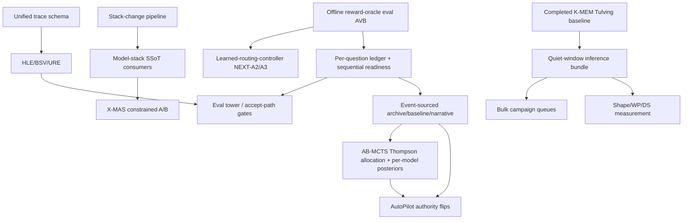

# Routing & Optimization — Coordination Index

**Created**: 2026-03-25
**Purpose**: Actionable entry point for agents working on routing, optimization, and stack infrastructure. Read this first — it tells you what needs doing, in what order, and where to find the details.

> **2026-06-12**: Fable 5 architecture review complete — verdicts + new owning handoffs in [master-handoff-index.md](master-handoff-index.md); standing reference [fable5-findings-00-executive-summary.md](../completed/fable5-findings-00-executive-summary.md). Measurement claims now follow /workspace/MEASUREMENT.md.
> New owning handoffs in this domain: [routing-truth-restoration.md](routing-truth-restoration.md), [model-capability-descriptors.md](model-capability-descriptors.md), and the evidence-plane-* handoffs (autopilot).

---

## How to Use This Index

1. **Read the outstanding tasks below** — they are ordered by priority and dependency
2. **Check the dependency graph** — some tasks unblock others
3. **Read the relevant handoff** for implementation details before starting work
4. **After completing a task**, update both the handoff AND this index (mark task done, update status)
5. **Check cross-cutting concerns** before modifying any subsystem — changes cascade

---

## Standing Comparative Context

Before proposing or revising routing/coordination architecture, read [`research/deep-dives/trinity-evolved-llm-coordinator-methodology.md`](../../research/deep-dives/trinity-evolved-llm-coordinator-methodology.md) (intake-474, ICLR 2026, Sakana AI). Trinity is the most direct prior art for the lightweight-learned-coordinator-over-heterogeneous-pool thesis we are pursuing. The deep-dive cross-checks Trinity's choices against ours on architecture, training signal, optimizer, action space, and pool composition — and lists the portable lessons (tri-role action space, sep-CMA-ES cold-start, block-ε-separability diagnostic, SVD-FT) and the non-portable ones (penultimate-token finding, frontier-closed-pool gain numbers). Reference it explicitly when arguing for a routing-architecture change so we know which Trinity lever the change does or does not echo.

**Routing/coordination design-space reference points (added 2026-04-28)**: four published systems anchor the current research landscape for learned routing and coordination heads:

- **BaRP** (intake-495, arxiv:2510.07429) — bandit-feedback training + 2-D preference-vector conditioning. **EPYC adopts patterns** at DAR-3 (motivation), DAR-4b (preference vector + cost τ), and via the routing-policy lens.
- **LLM Bandit** (intake-496, arxiv:2502.02743) — IRT score predictor + model identity vectors + IRT-stratified cold-start onboarding. **EPYC adopts patterns** at LRC P4.1.3 (P19.9, IRT feature audit), LRC P5 (P19.10, IRT-stratified cold-start), and DAR-5.
- **Trinity** (intake-474, arxiv:2512.04695) — sep-CMA-ES on a 0.6B SLM + 10K head with tri-role `(LLM, role)` action space. **EPYC tracks selectively** — tri-role architectural change (P19.1) is a real candidate; sep-CMA-ES is the realistic CPU-feasible escalation path if DAR-3/4 underdeliver.
- **Conductor** (intake-493, arxiv:2512.04388) — 7B GRPO-trained coordinator emitting `(worker_id, NL_subtask, access_list)`. **EPYC treats as competitive intelligence ONLY** (NOT a target architecture; OC-0.6 captures the comparison row, with explicit "what to learn from / what NOT to copy" framing). GPU-class architecture, out of CPU stack.

When making a routing-architecture proposal, name which of these four (and which Trinity lever from the deep-dive) the proposal echoes — and which it deliberately does not. Closure-inflation discipline applies: do not generalize "Conductor's 7B is out of scope" into "no learned coordinator could ever work" — the four systems are distinct points, not a single architecture.

---

## Subsystem Status

| Subsystem | Handoff | Status | Next Action |
|-----------|---------|--------|-------------|
| Routing Intelligence | [`routing-intelligence.md`](routing-intelligence.md) | **COMPACTED 2026-05-28; RI-10 SAMPLE AUDIT CURRENT 2026-07-03; RAW COUNT READY, ARM DECISION NOT READY** — Phases 0-5 history moved to completed ledger; hardened report semantics distinguish raw high-risk volume from decision-grade canary evidence and do not count non-canary-role shadow rows as sampled canary arms. Current report `ri10_canary_sample_report_20260703T150214Z.json` has `464` high-risk rows since canary start, `350` widened canary-role rows, and `20` arm-attributed rows (`1` enforce / `19` shadow). The current telemetry-health window has `0` missing mode rows and all `20` high-risk rows inside canary scope; the blocker is sample count/balance, not producer health or role scope. | Keep classifier/risk-routing expansion frozen. Collect decision-grade enforce/shadow canary-arm telemetry before RI-10/RI-11/RI-12 rollout decisions; DS-E1 is again blocked on RI-10 arm evidence plus production KV-size measurements. |
| AutoPilot / AutoResearch | [`autopilot-continuous-optimization.md`](autopilot-continuous-optimization.md) | **Authority live after 2026-07-02 post-reboot restart; W7 game-layer hardening COMPLETE; A10 planner hints ACTIVE.** AutoPilot is live as Python PID `1671930` under `--max-trials 2000` with W4/W6 audit flags, `AUTOPILOT_SEQ_VERDICT=1`, `AUTOPILOT_PLANNER_TIMEOUT=600`, and `AUTOPILOT_PLANNER_HINTS=1`; current-code strict phase health is green and trial `1086` is active. A10 is not parked: `44` `opseed-*` StrategyStore rows are persisted with FTS5/FAISS mirrors verified and Phase 2 planner consumers wired. Fresh `seq_readiness_20260703T150214Z` reports cutover ready (`220/120` trusted vectors, `143/30` seq-shadow rows); W8 remains open on promotion-eval evidence (`combined_E=0.932744/100`, accumulating, no fresh promotion eval). | Keep AutoPilot running and monitor strict readiness/W6/era boundaries. Finish N2 W8 promotion-eval evidence and fail closed if any current-era readiness gate regresses. |
| Routing Truth Restoration | [`routing-truth-restoration.md`](routing-truth-restoration.md) | **IMMEDIATE SCOPE COMPLETE 2026-06-12** — W1-W8 landed in `epyc-orchestrator` `b5f26e5` + `41a6944` + `2a52740` + `e40df31` + `1dfbc22`; live `/config/attest` sampled 6 workers with `specialist_routing=true`, `model_fallback=true`, wave-2 flags false, `routing_classifier=false`, no heterogeneity; q_scorer TPS loads from lean registry; confidence/3-way routing dead paths removed; Trinity/URE shadow telemetry persists in progress JSONL; DAR-1 current replay measured 0.00% identifiable mean regret. | Routing expansion stays frozen; revisit `dispatch_swarm_fanout` ownership on 2026-07-12. |
| Stack Startup NUMA Prewarm | [`numa-page-cache-prewarm.md`](../completed/numa-page-cache-prewarm.md) | ✅ **COMPLETE 2026-05-29** (archived) — codified `[1.5]` page-cache prewarm passed cold-cache P5; previously-collapsed shared GGUFs are ~25% per NUMA node, 27.3 s cold prewarm time | Monitor future cold starts for regression; re-open the archived handoff if symptom recurs |
| Dynamic Stack | [`dynamic-stack-concurrency.md`](dynamic-stack-concurrency.md) | **COMPACTED 2026-05-28; DEFAULT TEMPLATE CURRENT 2026-06-13; DS-E1 PACKET CURRENT 2026-07-03; KV HARNESS READY** — Phases B-D complete; DS-6/DS-7 design ledger split to completed history; `069f8c0` aligned `stack_templates/default.yaml` to the live manifest with aliases and retired-role rejection; current packet output reports stack roster + DS-5 manifest freshness + contention ready, but DS-E1 is not decision-ready because RI-10 has raw high-risk volume without decision-grade arm-attributed canary telemetry and executed 2K/8K/32K production KV measurements remain missing; `epyc-inference-research` `b3a2ab6` added the clean-window KV harness, `dea5f8d` made execute mode fail closed if AutoPilot or live `llama-server` processes are present, and `epyc-orchestrator` `6f4f762c` surfaces the port-8194 clean-window preflight in the aggregate Fable5 gate | Collect RI-10 enforce/shadow arm telemetry and, in a clean window, run `scripts/benchmark/ds_e1_kv_measurements.sh --execute`; rerun the DS-E1 packet before any future DS-7 profile codification. DS-6 only if evidence proves static pre-warm insufficient |
| Stack Change Governance | [`standardized-stack-update-pipeline-finalization.md`](standardized-stack-update-pipeline-finalization.md) + [`stack-change-governance-pipeline.md`](stack-change-governance-pipeline.md) | **IN PROGRESS 2026-06-27** — canonical stack-change command/gates, generated stack-prior contract, guard/scanner ownership, runtime attestation, launch/preflight gates, promotion-gate execution, representative swap-CI witnesses, and fail-closed production-blocker waiver enforcement are live. Completed chronology is compacted into dated history ledgers. | Continue high-risk consumer migrations from `orchestration/stack_change_surface_manifest.yaml`; production-blocker waivers require the explicit emergency `--allow-production-blocker-waivers` path; broaden W4 swap-CI only when migrated consumers create new witness surfaces. |
| Model Stack Quantity SSoT | [`model-stack-single-source-update-pipeline.md`](model-stack-single-source-update-pipeline.md) | **PARTIAL IMPLEMENTATION; CONFIG CATALOG RE-AUDITED 2026-06-27** — stack-prior SSoT and representative consumers are live across config/admission, admission degraded fallback manifest derivation, OpenAI `/v1/models` ordering, health/status/preflight, routing/action, routing-classifier label-map canonicalization through the GraphRouter action-space helper (`1bef7f1`), live chat timeout lookup through current config (`b47ac2e`), chat image/vision gating through generated vision roles (`f35448d1`), architect prewarm target/model-hint derivation from stack priors (`11d80ee`), vision serving role discovery from stack-prior launch metadata (`c9d499f`), launch-map auxiliary target classification (`471a4d2`), prompt/delegation, benchmark/eval, runtime policy, PromptForge, GraphRouter training fallback, seeding reward descriptor fallback, seeding topology registry fallback, generated-stack-docs degraded fallback canonicalization, AutoPilot system-card generator fail-closed behavior, X-MAS table compilation, and X-MAS incumbent-aware constrained policy. 2026-06-27 audit found `config_model_catalog` is also not an open migration tail: `ServerURLsConfig`/`TimeoutsConfig` are HIGH-impact surfaces, but URL defaults derive from stack priors, timeouts and `LLMConfig.depth_role_overrides` derive from registry runtime defaults, public `get_config()` stack-prior behavior is covered, and `tests/unit/test_config.py`, `test_config_consolidation.py`, `test_api_imports.py`, `test_session_models.py`, and `test_registry_loader.py` passed. The fresh 2026-06-21 constrained-policy A/B is packaged and is a negative result (`decision.status=hold`, score delta `-0.25`, latency ratio `0.714`); `epyc-orchestrator` `f517902d` repairs the same-cheap-role failure mode by preserving try-cheap-first when X-MAS enforces the configured cheap role and adds row-level `xmas_meta` capture for the next A/B, and `b108f865` versions the repaired policy as `incumbent_constrained_cheapfirst_v2`. X-MAS enforce remains default-off until the repaired policy passes a quiet-window A/B. Guard inventory remains `consumer_surface_count=13`, `rule_count=27`; completed chronology is compacted into the handoff history ledgers. `health_preflight_probes`, `launch_maps`, and `config_model_catalog` are re-audited/guarded surfaces, not open migration tails. | Deploy/reload the repaired X-MAS policy in a quiet window, rerun the constrained-policy A/B with `xmas_meta` capture and required policy `incumbent_constrained_cheapfirst_v2`, and promote only if the decision gate passes; shared launch/stack-prior helper work remains main-thread if a future concrete duplicated fact appears. |
| Registry Compile / Master Reconcile | [`registry-compile-master-reconcile.md`](../completed/registry-compile-master-reconcile.md) | ✅ **COMPLETE 2026-06-27** — generated lean registry compiles by default from the master registry, strict stack-prior evidence gaps are closed, checked-in lean YAML semantically equals `compile_lean(master, active_roles_from_launch_meta(ROLE_LAUNCH_META))`, worker-general recipe facts derive from registry/server-mode data, and obsolete hand-edit banner wording has been removed. | Historical reference; reopen only for a concrete new master/lean drift class or duplicated runtime fact. |
| Prompt Construction / Sampling Determinism | [`prompt-construction-determinism.md`](prompt-construction-determinism.md) · master **N14** | **DEPLOYED LIVE 2026-06-26, attestation-green, committed (orch `f4a8a3ca` / root: this docs commit, unpushed)** — audit found prompt *construction* deterministic but *sampling* not. Fixed + reloaded: per-role `generation_defaults.temperature` (0.1–0.3) wired into all 3 payload sites (was accidental greedy 0.0), fixed `seed`, unified `top_k/top_p/repeat_penalty` across `/completion`+`/v1/chat/completions`, and `architect_general` flipped to chat-completions so `enable_thinking=false` fires (cc-set 6→7). `stack_change_pipeline check` all-green, `runtime_attestation: ok`. 2026-06-27 N13 closed the kernel/AutoPilot-speed era fence (`E5-cpu-kernel`, `E5-autopilot-speed`); sampling-quality era remains separate. 2026-06-28 orchestrator `16876006` packages the guarded J12 clean-window runner, but does not close D2 while AutoPilot is active. | Operator: **D2** run `uv run python scripts/benchmark/j12_think_loop_probe.py --roles frontdoor architect_general --confirm-clean-window` in Queue-2/clean window and treat leaks/known loops as the architect flip revert gate; **D3** manual canonical bench greedy→sampled (co-schedule w/ N13 post-reboot bench); **D4** sampling-quality `autopilot_quality` era after D2/D3. |
| Within-Role Placement + KV Migration | [`within-role-placement-state-machine.md`](within-role-placement-state-machine.md) | **WP-0/WP-1/WP-2/WP-3/WP-4/WP-5-scaffold IMPLEMENTED 2026-05-26** MERGED TO MAIN (`epyc-orchestrator` merge `fe6805c`; tip now `15350fe`; 155/155 dispatcher-adjacent tests at merge). WP-2/WP-3/WP-4 ship behind env flags (ORCHESTRATOR_PLACEMENT_STATE_MACHINE, ORCHESTRATOR_REVERSE_MIGRATION) defaulting off; WP-0/WP-1/WP-5-scaffold are live. WP-3 dropped the speculative load-transition trigger (could not preempt mid-decode); shipped transactional MigrationTransaction + policy gating + migration_budget_ms threading on the existing session-handover trigger. | **WP-6 / WP-7 / WP-5 full ratification** — all inference-gated, awaiting operator approval + measurement. WP-3/WP-4 gate verifications also inference-gated. |
| Cross-Role Contention + Placement | [`shape-keyed-contention-gating.md`](shape-keyed-contention-gating.md) | **A/A-1 + B CODE-COMPLETE END-TO-END; C prep only. Remaining = rollout-only, no code.** Step 1 (GLOBAL region mutex) was armed live on 2026-05-31 and the 24-row sampler was analyzed 2026-06-12: all rows `matrix=ok`, `global_locks=4`, 14/24 rows had blocked pairs, max `wait_s=205.4`, and 2 rows reported `timeout=2`; counters reset/alias inside the trace, so this proves function but not a stable cost total. Step 2 (dispatch-side caller passes real `candidate_topology_idx`) DONE 2026-05-31 — `inference.py` defers coarse pre-gate, `concurrency_aware._dispatch` gates per-candidate, `contention_gate.admit()` threads idx; 146-test suite green. Both shape-aware flags still default off -> inert. C only has pure `select_backfill_candidate`; heavy veto/barrier/pressure-skip untouched. | Rollout: (1) clean quiesce-window live smoke for Step 2 (disjoint admit / overlap queue) before `SHAPE_AWARE_CONTENTION=1`; (2) if smoke passes, flag-on bracket with attested env; (3) switch A placement to exact-region snapshot; (4) C behavior changes under an epoch boundary. |
| KV Cache Quantization | [`kv-cache-quantization.md`](../completed/kv-cache-quantization.md) | COMPLETE — Hadamard deployed, TQ/PQ abandoned | Historical reference; monitor upstream TurboQuant from inference index |
| Context Folding | [`context-folding-progressive.md`](context-folding-progressive.md) | **COMPACTED 2026-05-28** — core phases and Phase 2d preserved in completed ledger. CF-DD8 closed 2026-06-13: no new CF-owned per-message cap; tool-output-compression owns budget reduction, surgical snip is telemetry-gated. CF-2c.0 alpha sweep met the `>2%` proxy gate on 2026-06-19; next is Phase 2b design-variant promotion plus live/held-out validation, not production behavior. | CF-L5 max-compression validation and CF-3c live quality-monitor validation remain. |
| Conversation Management | [`orchestrator-conversation-management.md`](../completed/orchestrator-conversation-management.md) | COMPLETE (B1-B7 + integration) | Historical reference |
| LangGraph Migration | [`langgraph-migration.md`](../completed/langgraph-migration.md) | COMPLETE / historical migration infrastructure | Historical reference; reopen only for a fresh LangGraph migration push |
| ~~CC Local Integration~~ | ~~[`claude-code-local-constellation-routing.md`](../archived/claude-code-local-constellation-routing.md)~~ | ARCHIVED — superseded by Hermes outer shell | — |
| Retrain Routing Models | [`retrain-routing-models.md`](retrain-routing-models.md) | **PARTIAL 2026-06-12** — BGE repair completed HEALTHY; current-data MLP retrain staged (81.0% val acc; >=0.8 threshold precision 94.4% / coverage 61.6%); live flag still OFF | Decide/execute clean-window `routing_classifier` rollout or keep staged; GAT/SkillBank remain frozen unless future regret gates justify them |
| Meta-Harness Optimization | [`meta-harness-optimization.md`](meta-harness-optimization.md) | **COMPACTED 2026-05-28** — Tier 1/2, MH-4/5, and HLE-1/2 preserved in completed ledger. | MH-6/7/9 plus HLE-3/J9 observe-only validation; Tier 3 outer loop remains deferred. |
| Web Research Pipeline | [`searxng-search-backend.md`](searxng-search-backend.md) | SX-1–4 done; root CLI fallback semantics hardened in `epyc-root` `fa75cfa` so valid JSON without `.results` exits documented fallback code `2`; CA-1–7 landed/validated in `epyc-orchestrator` `0dadb2e` + `38ddc97` + `6424d05`: Crawl4AI-first `web_research` fetch backend on port `11235`, urllib fallback/cache/provenance preserved, first-run Docker timeout hardening, live container smoke against `/health`, `/crawl`, and `_fetch_page()`, plus opt-in bounded docs/log crawl helper. SX-5/6 remain AR-3 gated and CA-6 waits for Camofox. Claude Code bash bridge moved to completed: [`searxng-bash-websearch-bridge.md`](../completed/searxng-bash-websearch-bridge.md). | Next: SX-5/6 remain AR-3-gated; CA-6 waits for Camofox; optional future CA-7 live-service smoke or default-pipeline wiring only if needed |
| Internal Interaction Lifecycle | [`internal-interaction-lifecycle.md`](internal-interaction-lifecycle.md) | P1 substrate landed 2026-06-28 in orchestrator `18956892`: additive `Interaction` dataclasses, `interaction_type` telemetry, internal delegation wrapper, and `ProgressLogger.log_interaction()`; no inference admission-path edit | P2/J17 remain gated on P1 regression bake + cross-role contention bake; chosen consult seam is `run_edit_transaction()` with requester `coder_escalation` and consultant `architect_general` |
| Decision-Aware Routing | [`decision-aware-routing.md`](decision-aware-routing.md) | GATED — DAR-2 contrastive is live, but the 2026-07-03 DAR-1 current replay measured 0.00% gate regret over 22,992 routing decisions with 98.6% regret-identifiable coverage and 99.6% uniform Q-values | DAR-3/DAR-6/Package-I expansion remains frozen until a future DAR-1 replay proves >=5% regret and N2 per-question vectors exist |
| Learned Routing Controller | [`learned-routing-controller.md`](learned-routing-controller.md) | **STAGED, not live (refreshed 2026-06-27)** — BGE repair is healthy and current retrain produced 81.0% validation accuracy with 94.4% precision at threshold >=0.8 over 61.6% coverage; production attestation still reports `routing_classifier=false`. Phases 1.5+ remain frozen until per-question eval vectors exist and a future DAR-1 replay shows >=5% routing regret. P4.5 journal-derived soft-label SFT and P4.6 soft-arm role dropout both ran as zero-inference methodology experiments and both are **NULL** under the current role-success gate. | Do not retune the current soft-label/dropout path. Regret gate still applies to enabling the classifier in production. The actionable LRC thread is content-routing miss learning from Phase A and future classifier rollout/canary evidence, not P4.5/P4.6 replay. |
| Environment Synthesis (5th species) | [`agent-world-env-synthesis.md`](agent-world-env-synthesis.md) | NEW 2026-04-22 — stub/in-planning; Phase 1 training-free, Phase 2 GPU-gated (intake-444, DD6) | AW-1: scaffold `env_synth/` module |
| Deep Research Mode | [`minddr-deep-research-mode.md`](minddr-deep-research-mode.md) | REFRESHED 2026-05-28 — Phase 1 scaffold landed; MD-9 A/B is the live gate; Phase 2 GPU-gated | MD-9: sentinel A/B with EV-9 rubric if available; keep dispatcher wiring deferred until pass |
| Tri-Role Coordinator | [`tri-role-coordinator-architecture.md`](tri-role-coordinator-architecture.md) | REFRESHED 2026-06-20 — TR-1/2/3.1/3.2/3.3/3.4 complete; latest report has 10,686 role-bearing rows over 7.822d, TR-3.3 clean-week PASS, TR-3.4 non-degenerate PASS | TR-4/5 remain frozen until DAR-regret and per-question-vector gates pass; clean-week is no longer the blocker |
| Outer-Coordinator Learned Head | [`outer-coordinator-learned-head.md`](outer-coordinator-learned-head.md) | REFRESHED 2026-06-25 — SCOPING/PARKING ONLY; no implementation until dependency gates or measured Claude-loop bottleneck. **Calibration update**: Sakana Fugu (intake-728, June 2026) productizes Trinity+Conductor at frontier scale — Fugu Ultra SWE-Bench Pro 73.7%, GPQA-D 95.5% (self-reported, multi-agent, non-standardized scaffold). Two-tier design (single-dispatch for latency / team-assembly for quality) is a direct design reference for OC-0's latency/quality axis. Conductor code/weights remain commercially blocked post-Fugu launch. Real-world: ~30-minute Fugu Ultra wait times suggest multi-agent orchestration overhead is real. | OC-0 only when triggered by measured ROI; archive as not_pursued if replaceable token fraction <20%; do not treat Fugu benchmark scores as single-model baselines |
| ~~Stack Audit~~ | ~~[`orchestrator-stack-audit.md`](../completed/orchestrator-stack-audit.md)~~ | ARCHIVED 2026-03-29 | Purpose fulfilled by NUMA + REAP deployments |

## Outstanding Tasks (Priority Order)

This index is a dispatch surface. Completed implementation chronology was pruned during the 2026-06-19 wrap-up and moved to [../archived/routing-and-optimization-index-history-through-2026-06-19.md](../archived/routing-and-optimization-index-history-through-2026-06-19.md). Keep detailed task state in the owning handoffs; keep this section to live work only.

| Priority | Queue | Current entry point | Next action |
|----------|-------|---------------------|-------------|
| P0 complete | Post-reboot AutoPilot restart w/ authority | [post-reboot-autopilot-restart-runbook.md](post-reboot-autopilot-restart-runbook.md) | Executed 2026-07-02: stack live, consent file locked, AutoPilot restarted with W4/W6 + `AUTOPILOT_SEQ_VERDICT=1` + planner hints and `--max-trials 2000`, strict readiness green, dashboard authority decision-grade, remote `main` fast-forwarded for root and orchestrator. Subsequent restarts kept the same env live; current Python PID is `1671930`. |
| P0 | Evidence-plane readiness and authority gates | [autopilot-continuous-optimization.md](autopilot-continuous-optimization.md), [evidence-plane-ledger-and-sequential-verdicts.md](evidence-plane-ledger-and-sequential-verdicts.md), [evidence-plane-event-sourcing-and-narrative.md](evidence-plane-event-sourcing-and-narrative.md) | Authority is live after the reboot cutover and the planner-guard deployment is current-code clean. Continue strict-readiness/W6/era monitoring, finish W8 promotion-eval evidence, and fail closed if any current-era readiness gate regresses. A8 remains open for live W8/N2 coordination, not residual archive-source or post-repair preflight hygiene. |
| P0 | Stack-change / model-stack SSoT | [standardized-stack-update-pipeline-finalization.md](standardized-stack-update-pipeline-finalization.md), [model-stack-single-source-update-pipeline.md](model-stack-single-source-update-pipeline.md) | Keep the generated/guarded SSoT contract fresh; broaden swap-CI only when future migrated consumers create new witness surfaces. |
| P0 | X-MAS text routing | [x-mas-text-routing.md](x-mas-text-routing.md), [model-stack-single-source-update-pipeline.md](model-stack-single-source-update-pipeline.md) | Winner table is configured default-off (`21d96da2`) and validates. The 2026-06-21 incumbent-aware constrained-policy held-out A/B completed in a quiet window and still held (`score_delta=-0.25`, `latency_ratio=0.714`, regressions in code/math/reasoning). Same-cheap-role cheap-first suppression is repaired and versioned as `incumbent_constrained_cheapfirst_v2`; next step is a repaired quiet-window A/B, not enablement. |
| P1 (READY) | Offline reward-oracle eval | [learned-routing-controller.md](learned-routing-controller.md), [research/deep-dives/2026-06-20-avb-offline-reward-stack.md](../../research/deep-dives/2026-06-20-avb-offline-reward-stack.md) | NeuralTxt remains non-decision-grade after coverage repair, but the deterministic `reference_token_coverage` scorer is the current decision-grade offline baseline candidate (`322` prompt-free labels, target agreement `0.9410`, stress checks pass). The manifest-backed verifier path is landed and remains offline-only. The initial `322`-row verifier NPZ failed frontdoor, broader multi-action, temperature/bias, quantile-histogram, and 10-seed robustness gates. The sparse-action expansion path is scored and rebuilt: deduped plan `202` candidates (`architect_general=200`, `coder_escalation=2`), expansion labels `202` rows at target agreement `0.9406`, merged verifier NPZ `524` rows with canonical action coverage `architect_general=210`, `coder_escalation=90`, `frontdoor=224`. Response telemetry and exact-conflict dropping remove the observed contradiction blocker (`0` conflicting groups / rows in the `336`-row repaired NPZ) and improve isotonic mean Brier/AUC to `0.1641/0.8183`, but calibrated ECE remains too high (`0.1113`) and all existing methods pass `0/10`; the verifier remains `not_promotion_grade`. Source-family rebalance for `three_way_eval:frontdoor` is scored/rebuilt in orchestrator `e792f4d8`: `82` new labels, `606` merged labels, `418` retained conflict-dropped rows, canonical coverage `architect_general=210`, `coder_escalation=78`, `frontdoor=130`, but calibrated robustness still fails (`0/10` for temperature/ece-temperature/quantile, `1/10` isotonic). Post-rebalance model-family and source-action interaction reruns are also `not_promotion_grade`: source-action MLP calibrated pass counts are `0/10` for all methods, best model-family pass count remains `random_forest:ece_temperature_bias=2/10`, `three_way_eval` best mean ECE worsens to `0.1276`, and `seeding_eval` still lacks two-class coverage. The **pairwise-ranker** path (parallel to the verifier NPZ) passes aggregate `pairwise_ranker_signal`; its independent holdout **repaired `suite:livecodebench`** (+778 prompt-free rows → 889-pair contract, mean acc/AUC `0.8807/0.9677` over `616` test pairs) but still **fails `source_family:seeding_eval` and `suite:thinking`**, and the +1,359-row / 1,271-pair `thinking` hard holdout is a NULL diagnostic (random-split strong, independent holdout `5/9`, thinking unimproved). **Next action**: the offline action-pair / source-suite-action intersection AUDIT diagnostic is now **LANDED** (`scripts/graph_router/audit_offline_reward_pairwise_preference_directions.py` + test, orchestrator `434a60a0`; read-only, evidence-only, outside the MEASUREMENT.md trust boundary). On the 1271-pair hard-holdouts contract it pinpoints the concrete collection targets behind the failing holdouts: `source_family:seeding_eval`'s `architect_general>{coder_escalation,frontdoor}` cross-action pairs are **2-row, one-sided**, and `suite:thinking`'s `architect_general>coder_escalation` is **6-row direction-imbalanced** (artifact in `orchestration/reports/offline_reward_oracle_token_coverage_final_labels_20260621/offline_reward_pairwise_preference_direction_audit.{json,md}`). Next: collect **non-overlapping cross-action preference rows, balancing both directions**, for those targets, then re-run the pairwise-ranker holdouts; do NOT retune the absolute MLP/calibrator/pairwise family again. OFFLINE-only (no serve-time reference); not blocked by the FROZEN routing-learning expansion because this is oracle/eval tooling, not classifier enablement. [2026-06-22 checkpoint; chronology → progress/2026-06/2026-06-22.md] |
| ~~P1 (ZERO-INFERENCE) — LRC P4.5/P4.6 training-methodology experiments~~ ✅ COMPLETE 2026-06-27 (NULL) | [learned-routing-controller.md](learned-routing-controller.md) P4.5/P4.6 | P4.5 ran end-to-end (BGE up, 540/540 embedded, 5-seed KL-vs-CE A/B): soft labels did **not** beat hard labels. P4.6 added opt-in soft-arm role dropout and ran 10 offline trials (`0.2`/`0.3` rates × 5 seeds): best delta tied hard labels, mean delta `-0.0074`, adopt count `0`. Keep hard-label training; do not retune this soft-label/dropout path. **Separate actionable thread**: Phase A found genuine content-routing misses (cruxeval 0%→87% worker_general, bigcodebench/gpqa→coder) the LRC could learn directly. |
| P1 | Routing canaries and classifier rollout | [routing-intelligence.md](routing-intelligence.md), [retrain-routing-models.md](retrain-routing-models.md), [learned-routing-controller.md](learned-routing-controller.md) | RI-10 raw high-risk count is sufficient, but decision-grade enforce/shadow arm-attributed telemetry is not; keep classifier/risk-routing changes gated by their owning rollout handoffs, and do not pursue learned-routing expansion until DAR regret and per-question-vector gates reopen. |
| P1 | Dynamic stack / placement | [dynamic-stack-concurrency.md](dynamic-stack-concurrency.md), [within-role-placement-state-machine.md](within-role-placement-state-machine.md), [shape-keyed-contention-gating.md](shape-keyed-contention-gating.md) | DS-E1 packet exists but is not decision-ready because RI-10 arm-attributed canary telemetry and production KV-size measurements are both missing; collect RI-10 arm evidence and run the DS-E1 KV harness in a clean window before WP-6/WP-7 or shape-keyed quiesce-window brackets. |
| P1 | Bulk inference campaign / clean windows | [bulk-inference-campaign.md](bulk-inference-campaign.md) | K-MEM Tulving completed/scored; resume the model-batched or quiesce-window execution order recorded there based on current stack residency and host-health. |
| P2 | Delegation/context/edit harness work | [delegation-context-preassembly.md](delegation-context-preassembly.md), [bep-dcp-falsification-harness.md](bep-dcp-falsification-harness.md), [batched-edit-parallel-apply.md](batched-edit-parallel-apply.md), [internal-interaction-lifecycle.md](internal-interaction-lifecycle.md) | DCP/J7 summaries now self-classify outcomes; the existing first live artifact is `decision.status=hold` due to latency regression and missing quality scores. Internal Interaction Lifecycle P1 code is landed but not bake-cleared; do not trigger P2/J17 until its regression bake and cross-role contention bake clear. Treat J8 as optional legacy batch-edit decision evidence; keep BEP deterministic applier work disjoint from inference lanes. |
| P2 | Harness, trace, behavior-signature follow-through | [meta-harness-optimization.md](meta-harness-optimization.md), [unified-trace-memory-service.md](unified-trace-memory-service.md), [eval-tower-verification.md](eval-tower-verification.md), [autopilot-continuous-optimization.md](autopilot-continuous-optimization.md) | Use the shared trace schema for HLE/BSV/URE fields; run HLE-3 fixed-model lane before treating harness deltas as model or routing deltas. |
| P2 | Research-derived routing experiments | [decision-aware-routing.md](decision-aware-routing.md), [tri-role-coordinator-architecture.md](tri-role-coordinator-architecture.md), [outer-coordinator-learned-head.md](outer-coordinator-learned-head.md), [swarm-dataset-distillation.md](swarm-dataset-distillation.md), [halo-trace-loop-spike.md](halo-trace-loop-spike.md) | Keep DAR/tri-role/outer-coordinator expansion frozen until DAR regret and per-question-vector gates pass; tri-role clean-week telemetry is satisfied, but routing-regret evidence is still closed. Treat HALO and swarm-as-dataset as separate gated spikes. **OC calibration update (2026-06-25)**: Sakana Fugu (intake-728) confirms Trinity+Conductor pattern works at frontier scale — competitive intelligence only, no implementation gate change. |
| P2 (DESIGN/EXPERIMENT) | AB-MCTS Thompson allocation + per-model online posteriors | [autopilot-continuous-optimization.md](autopilot-continuous-optimization.md) (RIU 2026-06-20) | AB-MCTS Thompson go-wider/go-deeper allocation + per-model online posteriors (intake-720) — candidate replacement for autopilot's heuristic weighted-random species selection (`meta_optimizer.py:139-145`) and a no-train alternative to the STAGED MLP routing classifier. Autopilot W4/W6 readiness is currently blocked, so treat this as design/experiment, not enablement. Note DAR is FROZEN (fable5-findings-02). (added 2026-06-20 via research-intake batch 695-720 deep-dive) |
| P3 | Web/search and PromptForge tails | [searxng-search-backend.md](searxng-search-backend.md), [minddr-deep-research-mode.md](minddr-deep-research-mode.md), [agent-world-env-synthesis.md](agent-world-env-synthesis.md) | Run SX-5/6 only after AR-3/Camofox gates; run MD-9 sentinel A/B and AW scaffolding as isolated work. |
| P3 (GATED) | Fusion typed-judge-schema + model-discretionary invocation + recursion-bound | [autopilot-continuous-optimization.md](autopilot-continuous-optimization.md) (program.md), [research/deep-dives/optillm-test-time-techniques.md](../../research/deep-dives/optillm-test-time-techniques.md) | Fusion typed-judge-schema + model-discretionary invocation + recursion-bound (intake-712/714) → the GATED P21.B method-selection axis; lives in autopilot/program.md + the optillm deep-dive, NOT this index's body. GATED — P21.B not built. Only judge-contract/invocation/recursion port n-free; the panel is the n-degraded MoA path. Cross-link intake-601. (added 2026-06-20 via research-intake batch 695-720 deep-dive) |

**A9 current-state override (2026-06-28)**: orchestrator `926fd30b`
promoted the remaining offline reward-oracle pairwise collection work from a
prose runbook into a guarded acquisition window. The current generated
`offline_reward_pairwise_collection_window.v1` manifest contains `9` batches
and the executable script refuses with exit `75` while AutoPilot is active.
Next action is to run that guarded script in a coordinated clean measurement
window, then rebuild the pairwise contract and rerun holdouts; do not retune the
absolute MLP/calibrator/pairwise family first.

## Additional Active References

These files remain active but are not the shortest pickup path for the main queues above. Keep them indexed for discoverability; update the owning row if one becomes the primary implementation surface.

| Handoff | Current role | Next action |
|---------|--------------|-------------|
| [launcher-numa-mode-gating.md](launcher-numa-mode-gating.md) | Launcher flag implemented; production default remains an operator decision. | Decide whether `--numa-mode` should become the canonical default or stay explicit. |
| [model-stack-change-standardization-audit.md](model-stack-change-standardization-audit.md) | Stack-change standardization audit/provenance for N11/N11a. | Use as supporting context; current pickup path is the stack-governance and SSoT handoffs. |
| [model-stack-update-pipeline-audit.md](model-stack-update-pipeline-audit.md) | Historical-detail support for the stack-prior consumer-migration contract. | Keep shrinking residual consumer surfaces through the concise SSoT handoff. |
| [multi-file-coding-completion-capability.md](multi-file-coding-completion-capability.md) | BEP/multi-file edit transaction remediation is built but rollout-gated. | Run the clean-window A/B and promotion evidence before enabling routine edit-mode routing. |
| [non-inference-backlog.md](non-inference-backlog.md) | Cross-cutting no-inference backlog; only three Round-2 baseline items remain open. | Use as filler only when it does not preempt higher-ROI active queues. |
| [orchestrator-nps4-48x4-notes.md](orchestrator-nps4-48x4-notes.md) | Notes-only NPS4/topology reference. | Consult before stack/placement changes; do not treat as an implementation queue. |
| [repo-readiness-scorer.md](repo-readiness-scorer.md) | Deterministic readiness scorer landed; AutoPilot consumption is future work. | Wire into AutoPilot only after a concrete promotion/remediation workflow exists. |
| [tool-use-eval-contract.md](tool-use-eval-contract.md) | Tool-use sentinels and Gate-3 are live; child/sub-LM schema contracts are shipped for both batched and single-delegate REPL paths (`18b5ceb`, `6426dd4`); Phase-2 native OpenAI tools seam is partially shipped. | Do not reopen child-schema work. Add the native-tools sentinel variant only in a clean restart/window, then decide native-vs-REPL parity expectations before wiring any objective. |

## Dependency Graph

> **Dependency notes (added 2026-06-20 via research-intake batch 695-720 deep-dive)**:
> - **Offline reward-oracle (AVB) ↔ routing quality**: the AVB tiny scorer was tested as an OFFLINE quality oracle candidate for per-question vectors (N2) and the learned-routing-controller NEXT-A2/A3 reward signal, but it remains blocked. The current adoptable offline baseline is the deterministic `reference_token_coverage` manifest and its manifest-backed verifier NPZ. Frontdoor-only verifier consumption failed; the broader multi-action verifier still failed raw calibration; temperature/bias scaling did not repair ECE; quantile-histogram calibration cleared one held-out split but failed robustness. The expansion rebuild fixes sparse action coverage (`architect_general=210`, `coder_escalation=90`, `frontdoor=224`), response telemetry plus conflict-drop removes exact contradiction groups, but robustness still fails. Existing quantile settings top out at `2/10`, and ECE-targeted temperature/bias remains `0/10`, so scalar post-hoc calibration is not enough. This does not unblock the FROZEN routing-learning expansion — it is upstream eval tooling whose manifest/decision gate and NPZ train/eval step must pass before any future regret-gated controller work trusts its labels. OFFLINE-only (no serve-time reference).
> - **AB-MCTS ↔ autopilot readiness**: AB-MCTS Thompson allocation is a candidate replacement for autopilot's heuristic species selection, so it lives downstream of the A8 event-sourced archive/baseline plane and gates into AutoPilot authority flips. It is design/experiment while W4/W6 readiness is blocked; do not wire it into live species selection before the readiness report passes.

## Cross-Cutting Concerns

Check these before modifying any subsystem — changes in one affect the others.

### 1. Q-Scorer Baselines ↔ Stack Config
`routing-intelligence.md` § baselines defines per-role t/s used by `q_scorer.py`. If the stack changes (different models, instance counts), `baseline_tps_by_role` MUST update. ~~**Current issue**: frontdoor baseline stale (RI-0).~~ ✅ Fixed 2026-03-29 (frontdoor 19.6→12.7, architect_coding 7.0→8.0).

### 2. Routing Quality → Stack Capacity
High escalation rate from routing means more specialist instances needed. Low escalation rate means more frontdoor instances may be optimal. Routing classifier quality directly affects what the scheduler provisions.

### 3. Autoresearch Scope Includes Stack
The `program.md` governs what autoresearch can modify. Stack-config (models, instances, NUMA, tiers) is an optimization axis alongside routing params and prompts. StructuralLab species handles stack experiments.

### 4. Factual Risk → Resource Allocation
When risk-aware routing goes to enforce (RI-2 through RI-6), high-risk prompts trigger escalation to larger models. The stack scheduler must anticipate architect demand from the risk score distribution.

### 5. Conversation Logs Feed All Three
Observed patterns inform routing (Q-value training), autopilot (experiment evaluation), and stack (demand patterns, tier utilization). This mirrors episodic memory's Q-value accumulation loop.

**Operationalized 2026-04-25**: [`unified-trace-memory-service.md`](unified-trace-memory-service.md) (stub) collapses `agent_audit.log` + `progress/` + `autopilot_journal.{tsv,jsonl}` + `autopilot_state.json` into a single SQLite query layer for cross-source provenance queries during autopilot debugging and post-nightshift analysis. **Not** a replacement for autopilot's evolutionary memory (`repl_memory/strategy_store.py`, episodic store, skill bank) or Hermes's conversation memory — those remain domain-specific. Cross-link: include `trial_id` in both the unified store and `strategy_store` so an insight can link back to its source events.

### 6. KV Cache Config ↔ Stack Capacity
`kv-cache-quantization.md` — Hadamard + q4_0 K / f16 V is the production KV config. DS-3 (`--slot-save-path`) interacts with KV quantization config — if KV type changes, save/restore format may need updating. Dynamic stack assembly (DS-6) must account for per-model KV quantization when computing memory budgets.

### 7. Context Folding ↔ AutoResearch Baseline
`context-folding-progressive.md` Phase 0-1 (compaction trigger + two-level condensation) changes session quality behavior. The autoresearch baseline (AR-1) should be captured AFTER Phase 0-1 is deployed, or the "before" number will reflect a compaction policy that is about to change. Phase 3 process rewards feed MemRL Q-value enrichment (routing-intelligence Phase 5). **Updated 2026-04-05**: Phase 2 now includes free-zone threshold sweep and helpfulness scoring (intake-261/262); Phase 3 now includes role-aware compaction profiles that parameterize aggressiveness per orchestrator role. Phase 3b role profiles will directly affect autopilot token costs — `worker_general` is the canonical compaction role, with `worker_coder` remaining the more conservative profile. **Updated 2026-04-05 (session 4)**: Phase 1+ (SegmentCache), 2c (helpfulness scoring), 3a (process rewards), 3b (CompactionProfile + CompactionQualityMonitor) all code-complete with 32 unit tests. Feature flags: `segment_cache_dedup`, `helpfulness_scoring`, `process_reward_telemetry`, `role_aware_compaction` (all off by default).
**Updated 2026-04-06**: Phase 2c ByteRover enhancement (intake-267) adds compound retention scoring (access_count, importance_score, maturity_tier with hysteresis) to `segment_helpfulness()`. Design documented in handoff. Implementation after Package C — uses Package C Δ_k ground truth for weight calibration.

### 9. Instruction Budget ↔ PromptForge Mutations
intake-272 (ETH Zurich) shows context files increase inference cost by 20%+ without improving success rates. Every PromptForge mutation that adds instructions must be evaluated against instruction overhead (AP-16). AP-17 provides the corrective mechanism — structural pruning to reduce instruction load. Agent files should target ≤400 words of toolchain-only instructions (intake-271). This constrains both `prompt_mutation` and `code_mutation` species: quality gains that come with >15% instruction overhead increase should be scrutinized.

### 10. GEPA ↔ Multiple Subsystems
`autopilot-continuous-optimization.md` P10 (GEPA PromptForge Integration) and `meta-harness-optimization.md` Tier 2b/MH-4 (GEPA as search algorithm) evaluate the same technique from two perspectives. Autopilot owns implementation (AP-18–21: DSPy signature wrapping, optimize_anything, Full Program Adapter). Meta-harness evaluates whether GEPA's Pareto-frontier selection outperforms our current top-1 selection as a search algorithm. Results from either inform the other. Source: 2026-04-12 research intake (intake-327/345/240).

### 11. SearXNG Backend ↔ Web Search Pipeline (P8b)
`searxng-search-backend.md` replaces the DDG/Brave scraping layer that P8b's WS-1/WS-2/WS-3 fixes operate on. SearXNG is orthogonal to prompt-level over-reliance fixes but changes the search result quality and metadata available to the pipeline. When SearXNG is deployed: (a) WS-2 Omega re-measurement should use SearXNG results, not DDG HTML, (b) `unresponsive_engines[]` telemetry feeds the same monitoring pipeline as DS-1 queue depth. Source: 2026-04-14 research intake (intake-359/360/361).

### 12. Decision-Aware Routing ↔ Difficulty Signal ↔ AP-27
`decision-aware-routing.md` P13 addresses the zero-predictive-spread pathology diagnosed in Package B Phase 4 (research-eval P0). If contrastive Q-scoring (DAR-2) resolves the flat-band problem, `difficulty_signal.py` may become useful as a routing feature again. DAR-4 (model-feature-conditioned Q) interacts with AP-27 (RLVR eval tower) because the verification framework must evaluate the new routing reward signal. Source: 2026-04-14 deep-dive research (intake-366).

### 13. Math-Verify Ground Truth ↔ Decision-Aware Routing
intake-377 (2026-04-15 deep-dive) shows exact-match scoring underestimates math model capability by ~66% (Math-Verify accuracy 0.1328 vs lm-eval-harness 0.0802). DAR-3/DAR-4 reward signals in `decision-aware-routing.md` derive from eval tower scoring. If Q-scorer trains on exact-match rewards that systematically undercount correct math answers, Q-values will be biased toward models producing parseable outputs, not correct ones. Math-Verify must be adopted in the scoring pipeline before DAR-3 SPO+ training begins. See `eval-tower-verification.md` Research Intake Update 2026-04-15 for integration caveats (NOT symmetric, NOT thread-safe). Deep dive: `research/deep-dives/math-verify-integration-analysis.md`.

### 14. Offline reward-oracle (AVB) ↔ routing-quality reward signal
The P1-READY offline reward-oracle eval began from the AVB tiny answer-quality scorer (intake-706/716/717/719) as an OFFLINE quality oracle candidate for the learned-routing-controller NEXT-A2/A3 reward and the N2 per-question vectors that DAR-1 regret gating consumes. The AVB/NeuralTxt candidate remains blocked; the current adoptable offline baseline is the deterministic `reference_token_coverage` manifest emitted only after the final-label-with-stress `decision_gate` passes, plus prompt-free label/feature/verifier exports. The first verifier NPZ failed frontdoor, broader multi-action, temperature/bias, quantile-histogram, and 10-seed robustness gates. The expansion rebuild fixes the prior sparse-role blocker with `524` verifier rows and canonical action coverage `architect_general=210`, `coder_escalation=90`, `frontdoor=224`, but expanded robustness still fails promotion grade. The normalized/isotonic follow-up improves the measured ceiling (`isotonic` calibrated mean Brier/AUC/ECE `0.1921/0.7514/0.0905`) but passes only `1/10` seeds and exposes `66` conflicting prompt/action groups covering `229` rows, which are indistinguishable to the current prompt/action-only verifier feature contract. The offline-only response-telemetry contract adds prompt-free answer length, expected-answer length, elapsed time, and source-error presence while excluding label-adjacent fields; it reduces conflicts to `47` groups / `188` rows and raises isotonic pass count to `2/10`, but still remains `not_promotion_grade` and cannot be a pre-route serve-time feature. Conservative exact-conflict dropping removes all remaining feature/action contradictions (`0` conflicting groups / rows, `336` retained rows) and improves discrimination (`isotonic` mean Brier/AUC `0.1641/0.8183`), but calibration remains the blocker (`isotonic` ECE `0.1113`, all existing calibrated methods `0/10`). A follow-up no-code sweep shows existing quantile knobs only reach `2/10`, and an ECE-targeted temperature/bias objective reaches `0/10` with mean ECE `0.1388`; the next useful work is richer coverage/features or a different verifier model family rather than another scalar post-hoc calibration objective. This is upstream eval tooling, NOT classifier enablement, so it is explicitly NOT subject to the FROZEN routing-learning-expansion gate. Discipline: labels may only be trusted by future regret-gated controller work after the manifest/decision gate, paraphrase/synonym stress checks, and NPZ train/eval step pass; a scorer that disagrees with the binary reward on stressed paraphrases would bias Q-values toward surface form, mirroring the Math-Verify exact-match bias in Concern §13. OFFLINE-only (no serve-time reference). Source: 2026-06-20 research-intake batch 695-720 deep-dive (`research/deep-dives/2026-06-20-avb-offline-reward-stack.md`) plus the 2026-06-21 token-coverage adoption manifest/export/feature manifest/NPZ/expansion/normalized-isotonic/response-telemetry/conflict-drop/ECE-temperature robustness artifacts.
2026-06-21 addendum: the prompt-free source-family contract
(`source_family_onehot[4]` from source path metadata) was implemented and
measured as `source_family_response_telemetry`; it preserves old contracts and
keeps the conflict-dropped artifact at `336` rows / `0` conflicting model-input
groups, but robustness is still `not_promotion_grade` (`0/10` for
temperature/ECE/isotonic methods, `1/10` quantile histogram, best mean ECE still
`0.1119`). Treat this as a partial feature-contract repair, not a promotion;
next A9 work should move to verifier model-family repair or source-stratified
calibration/evaluation.
2026-06-21 addendum: the model-family scout now compares `logistic_l2`,
`hist_gradient_boosting`, `random_forest`, and `mlp_sklearn` over the same
source-family conflict-dropped NPZ. It is also `not_promotion_grade`: no
family/method reaches `10/10`; best pass counts are `2/10` (`logistic_l2` +
isotonic, `random_forest` + ECE-temperature), and the best mean ECE remains
above gate (`logistic_l2` quantile `0.0968`, logistic isotonic `0.0987`,
hist-gradient isotonic `0.1022`). The next useful work is source-stratified
calibration/evaluation or more balanced evidence rows, not another generic
model-family sweep.
2026-06-21 addendum: the source-family aggregate makes that target concrete:
`orchestrator_live_seed` is near gate (`hist_gradient_boosting:raw` mean ECE
`0.0575`, mean AUC `0.9469`), `seeding_eval` has no two-class metric coverage
after conflict dropping (`11` retained rows total), and `three_way_eval` is the
dominant calibration failure (best mean ECE `0.1340`). Next A9 work should add
or rebalance evidence for `three_way_eval` and `seeding_eval`, not retune the
same global calibrators.
2026-06-21 addendum: the source-family expansion planner now uses the retained
conflict-dropped NPZ as its baseline. The retained source-family/action counts
are `orchestrator_live_seed:architect_general=10`, `orchestrator_live_seed:coder_escalation=76`,
`orchestrator_live_seed:frontdoor=39`, `seeding_eval:coder_escalation=2`,
`seeding_eval:frontdoor=9`, and `three_way_eval:architect_general=200`.
Scanning existing benchmark results while excluding the expanded manifest found
no new `seeding_eval` candidates, so seeding repair requires a new or more
varied source run. It did find prompt-free `three_way_eval` candidates and
recommends `/mnt/raid0/llm/epyc-inference-research/benchmarks/results/eval/3way_20260303_025953.jsonl`
for `three_way_eval:frontdoor` (`82` rows) as the next concrete rebalance step.
2026-06-21 addendum: orchestrator `e792f4d8` completed that
`three_way_eval:frontdoor` rebalance. The selected source contributed `82`
prompt-free labels (`frontdoor:direct=27`, `frontdoor:repl=55`), yielding a
`606`-row merged label manifest. The rebuilt
`source_family_response_telemetry` conflict-dropped NPZ retains `418` rows with
`0` conflicting model-input groups and canonical action coverage
`architect_general=210`, `coder_escalation=78`, `frontdoor=130`. The 10-seed
robustness result remains `not_promotion_grade`: calibrated pass counts are
`temperature_bias=0/10`, `ece_temperature_bias=0/10`,
`quantile_histogram=0/10`, and `isotonic=1/10`. Do not enable a runtime verifier
gate from this evidence.
2026-06-21 addendum: the post-rebalance model-family/source-family rerun on
the `418`-row NPZ is also `not_promotion_grade`. Best global pass counts are
`random_forest:ece_temperature_bias=2/10`, `hist_gradient_boosting:quantile_histogram=1/10`,
and `mlp_sklearn:ece_temperature_bias=1/10`; no family/method reaches `10/10`.
The source strata make the blocker precise: `orchestrator_live_seed` best mean
ECE is `0.0781`, `three_way_eval` best mean ECE is only `0.1120`, and
`seeding_eval` still lacks two-class metric coverage (`11` retained rows).
Next A9 work should create/repair `seeding_eval` evidence or add
source-specific features; do not spend another pass on global calibrator/model
family sweeps.
2026-06-21 addendum: orchestrator `fbc91bf8` tested the obvious
source-specific feature repair by adding an offline
`source_action_response_telemetry` contract with `source_family_x_action`
interaction features. The rebuilt `418`-row NPZ still has `0` conflicting
model-input groups and the same canonical coverage (`210/78/130`), but the
10-seed MLP robustness result remains `not_promotion_grade` (`0/10` calibrated
passes for all methods). The model-family rerun is also `not_promotion_grade`:
best global pass count stays `random_forest:ece_temperature_bias=2/10`, and
`three_way_eval` best mean ECE is `0.1276`. This rules out source/action
interaction terms as the next easy repair; A9 should now generate or repair
`seeding_eval` evidence.
2026-06-21 addendum: orchestrator `413cc3a` repairs the prompt-free
`seeding_eval` evidence layer without llama inference. The selected missing
sources `seeding_20260304_195000.jsonl`, `seeding_20260305_192103.jsonl`, and
`seeding_20260305_202050.jsonl` add `114` exact candidate-matched labels
(`51` positives / `63` negatives; `frontdoor:direct=71`,
`frontdoor:repl=41`, plus two architect-family rows). The merged label artifact
now has `720` rows, and
`offline_reward_feature_manifest_with_seeding_eval_expansion.jsonl` has `720`
prompt-free feature rows spanning the prior source-family expansion plus the
new seeding-eval repair. No runtime verifier gate changed, and the next A9 step
is now a quiet-window NPZ/robustness rebuild from that manifest, not another
planner/model-family/source-action sweep.
2026-06-21 addendum: orchestrator `caba3929` completed that seeding-eval
rebuild. The source-family control and the intended
`source_action_response_telemetry` contract both retain `532/720` rows after
dropping `188` conflicting rows, with canonical action coverage
`architect_general=212`, `coder_escalation=78`, `frontdoor=242` and no unmapped
actions. The source-action verifier adds `source_family_x_action` interaction
features (`z_dim=1089`), but still remains `not_promotion_grade`: 10-seed
robustness gives `temperature_bias=0/10` and `quantile_histogram=0/10`
calibrated passes, with mean calibrated ROC-AUC/ECE `0.7054/0.1308` and
`0.6724/0.1400` respectively. No live verifier weights or runtime gate changed.
The seeding-eval rebuild is therefore closed as a null result; next A9 work
should stop retuning this MLP/calibrator path and instead add better balanced
offline evidence or a materially different reward/verifier design.

The pairwise A9 branch now has a targeted holdout repair for the weak
`suite:livecodebench` stratum. Orchestrator generated a prompt-free
non-overlapping candidate plan with `778` livecodebench source/role rows across
`209` candidate groups, scored/exported them through the deterministic
token-coverage oracle, and rebuilt a combined prompt-free manifest with `1,498`
rows. The score-ordered pairwise contract now has `889` pairs, `512`
cross-action rows, and `301` contrastive groups. Random group-disjoint ranker
eval strengthened (`random_forest` mean accuracy/AUC `0.8525/0.9495`), and
independent holdout repaired `suite:livecodebench` (`logistic_l2`, mean
accuracy/AUC `0.8807/0.9677`, `616` test pairs). The top-level holdout decision
remains `mixed_holdout_signal` because `source_family:seeding_eval` and
`suite:thinking` still fail. Runtime gate changes remain disallowed.

The analogous `suite:thinking` holdout expansion is now also packaged as a
negative diagnostic. It adds `1,359` prompt-free thinking rows and rebuilds a
`1,271`-pair score-ordered contract with `769` cross-action rows. Random
group-disjoint ranker eval remains strong (`hist_gradient_boosting` mean
accuracy/AUC `0.8121/0.9210`), but independent holdout worsens to `5/9`
passing. `suite:thinking` remains below signal (`0.5732/0.6770` mean
accuracy/AUC over `410` test pairs), and `orchestrator_live_seed` plus
`general` newly fail. Treat this as evidence that simple same-feature row
expansion is not enough for the remaining hard strata.

The 2026-06-27 audit-target planner follow-up now lets
`plan_offline_reward_pairwise_holdout_expansion.py` consume the preference
direction audit's `collection_targets` directly. The compact planning summary
(`offline_reward_pairwise_audit_target_expansion_plan_summary.{json,md}`) finds
`8,825` reproducible, prompt-free candidate rows across `2,413` non-overlapping
groups for suite-level `architect_general>frontdoor` targets, but leaves the
highest-value gaps unmatched: `source_family:seeding_eval` still has no
`architect_general>{coder_escalation,frontdoor}` candidates in the current
parsed corpus, and `suite:thinking` still has no
`architect_general>coder_escalation` candidate coverage. Next A9 work is
therefore split: suite-level `architect_general>frontdoor` can proceed through
the existing scoring/rebuild path, while `seeding_eval` and `thinking` require
new source evidence or a different pairwise feature/stratification design.

The audit-target scoring/rebuild path has now proceeded through the existing
offline deterministic pipeline. It adds `8,825` prompt-free labels (`4,449`
positive / `4,376` negative, target agreement `0.9164`), rebuilds an `11,682`-
row combined feature manifest, and emits a `6,192`-pair score-ordered contract
with `4,296` cross-action rows across `1,937` contrastive groups. Random
group-disjoint ranker eval remains `pairwise_ranker_signal`, and independent
holdout coverage improves from `5/9` passing on the hard-holdout diagnostic to
`13/16` passing. This is meaningful coverage repair, but not a runtime candidate:
the holdout decision remains `mixed_holdout_signal` because
`source_family:orchestrator_live_seed`, `source_family:seeding_eval`, and
`suite:general` still fail. Next A9 work should target those source-family /
suite gaps directly instead of retuning the current pairwise ranker family.

Orchestrator `cb1a3619` records the expanded-gap exhaustion audit. The expanded
direction audit still reports `preference_coverage_gaps_found` on the
`6,192`-pair contract, with weak strata including the two failing source
families and `suite:general`. The expanded planner now writes negative plan
artifacts instead of discarding them, and
`offline_reward_pairwise_expanded_gap_plan_summary.{json,md}` confirms the
current parsed result corpus has no non-overlapping candidates for the remaining
collection targets: `candidate_rows=0`, `candidate_groups=0`,
`skipped_pairwise_overlap_groups=6`, `skipped_no_cross_action_groups=334`, and
all nine expanded collection targets unmatched. Next A9 work is new source
record generation/collection for `orchestrator_live_seed`, `seeding_eval`, and
`suite:general`; do not spend more cycles rebuilding or retuning against the
current artifact set.

Orchestrator `10e5133b` adds collection-priority metadata to that expanded-gap
plan and regenerates the artifacts. Priority `0` is the source-family blocker
set (`orchestrator_live_seed` and `seeding_eval` action pairs), priority `1` is
`suite:general`, and priority `2` is direction-balance cleanup. The batches
remain marked `can_run_during_active_autopilot=false`; the next meaningful A9
move is to run the priority-0 collection commands in a clean/coordinated
measurement window, then rebuild the pairwise contract and rerun holdouts.

### 8. Conversation Mgmt B2 ↔ Context Folding Phase 1
`orchestrator-conversation-management.md` B2 (protected-zone compression from Hermes/OpenGauss) and `context-folding-progressive.md` Phase 1 (two-level condensation) both modify session compaction behavior. They must be sequenced — context-folding Phase 1 should land first as the structural upgrade, then B2's protected-zone logic can layer on top. Alternatively, B2's tool-pair sanitization (`_sanitize_tool_pairs()`) could be extracted as a standalone prerequisite for both. **Updated 2026-04-05**: Context-folding Phase 3b (role-aware compaction profiles) must align with B2's role taxonomy — the `CompactionProfile` roles must match the conversation management role definitions. **Updated 2026-04-05 (session 4)**: `CompactionProfile` roles now defined (`architect`, `worker_coder`, `worker_general`, `worker_fast`) with `get_compaction_profile()` in `session_log.py`. B2 can now reference these profiles directly. `segment_helpfulness()` + `prioritized_compaction()` available as building blocks for B2's protected-zone logic.

---

## Reporting

After completing any task group:

1. Update the owning handoff first; that file is the task-level source of truth.
2. Update this index only if priority, dependency, or next-action routing changes. Do not re-add completed implementation narration here.
3. Append `progress/YYYY-MM/YYYY-MM-DD.md` with the self-contained result and validation evidence.
4. Update `CHANGELOG.md` only for significant user-facing or process-facing changes.

---

## Upstream Dependencies

This index consumes data and findings from:

| Source | Handoff | What It Provides |
|--------|---------|-----------------|
| Inference acceleration | [`inference-acceleration-index.md`](inference-acceleration-index.md) | Benchmark results, model speed/quality data, NUMA deployment findings. Stack config changes originate from acceleration work. |
| KV cache quantization | [`kv-cache-quantization.md`](../completed/kv-cache-quantization.md) | Production KV config (`--kv-hadamard -ctk q4_0 -ctv f16`), memory budget inputs for stack planning. |

Changes in upstream handoffs may invalidate assumptions in this index (e.g., model speed numbers, memory footprints). After any upstream deployment, verify RI-0 baseline and stack table in `dynamic-stack-concurrency.md`.

## Related Infrastructure

These handoffs are tracked in other indices but have cross-cutting impact here:

| Handoff | Index | Relevant Aspects |
|---------|-------|-----------------|
| [`context-folding-progressive.md`](context-folding-progressive.md) | this index | Phase 3a process rewards feed routing intelligence; Phase 3b role-aware profiles affect per-role token costs; Phases 0-2 compaction mechanics |
| [`tool-output-compression.md`](tool-output-compression.md) | research-evaluation | RTK/native hooks reduce context pressure, interacts with autopilot token costs |
| [`reasoning-compression.md`](reasoning-compression.md) | research-evaluation | TrimR/difficulty_signal shares scorer infra with factual-risk routing |
| [`bulk-inference-campaign.md`](bulk-inference-campaign.md) | this index | Packages B-E consolidate 14 inference tasks; B feeds RI-9/TrimR, D feeds AR-3/RI-10/DS-5 |
| ~~[`rlm-orchestrator-roadmap.md`](../completed/rlm-orchestrator-roadmap.md)~~ | archived | Follow-on tasks extracted to P9. |
| [`searxng-search-backend.md`](searxng-search-backend.md) | standalone | Web search backend replacement; affects P8b search pipeline and ColBERT reranker input |
| [`decision-aware-routing.md`](decision-aware-routing.md) | this index (P13) | Decision-aware Q-scorer: contrastive + SPO+ + bilinear model-feature scoring |
| [`unified-trace-memory-service.md`](unified-trace-memory-service.md) | standalone (stub 2026-04-25) | Cross-source provenance store over `agent_audit.log` + `progress/` + `autopilot_journal.*` + `autopilot_state.json`. Operationalizes Cross-Cutting Concern §5 above. Read-only query layer; no migration of existing writers. Useful during autopilot debugging and post-nightshift "why did we decide X" investigations. |

---

## Key File Locations

| What | Where |
|------|-------|
| Factual risk scorer | `epyc-orchestrator/src/classifiers/factual_risk.py` |
| Q-scorer baselines | `epyc-orchestrator/orchestration/repl_memory/q_scorer.py` |
| Autopilot scripts | `epyc-orchestrator/scripts/autopilot/` |
| Autoresearch strategy | `epyc-orchestrator/scripts/autopilot/program.md` |
| Safety gate | `epyc-orchestrator/scripts/autopilot/safety_gate.py` |
| Classifier config | `epyc-orchestrator/orchestration/classifier_config.yaml` |
| Stack launcher | `epyc-orchestrator/scripts/server/orchestrator_stack.py` |
| Round-robin backend | `epyc-orchestrator/src/backends/round_robin.py` |
| Seeding types | `epyc-orchestrator/scripts/benchmark/seeding_types.py` |
| Model registry (full) | `epyc-inference-research/orchestration/model_registry.yaml` |
| Debug suite pool | `epyc-inference-research/benchmarks/prompts/question_pool.jsonl` |
| Model registry (lean) | `epyc-orchestrator/orchestration/model_registry.yaml` |
| KV cache config | `epyc-llama` production branch (`--kv-hadamard` flag in `orchestrator_stack.py`) |
