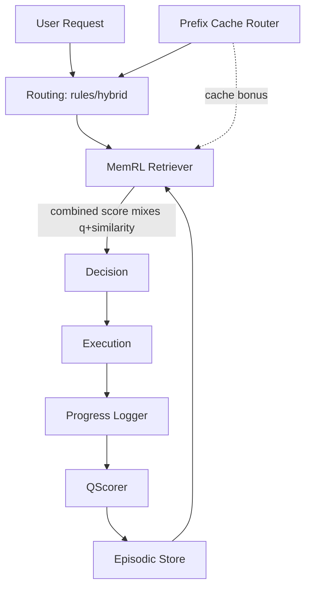
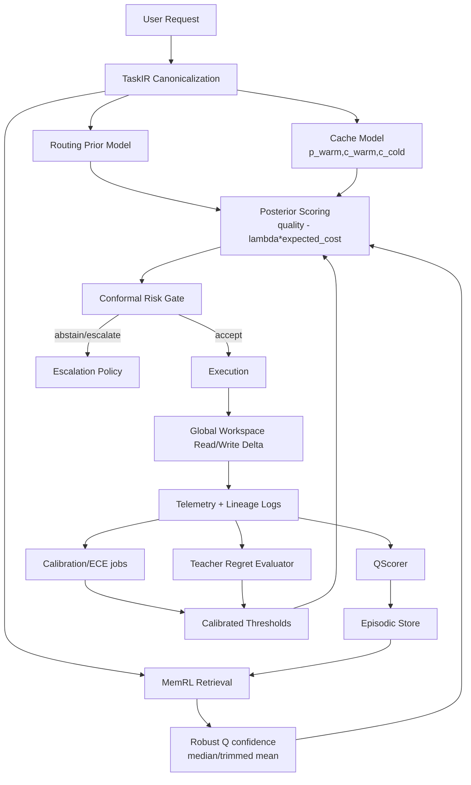

# Handoff: Orchestration Architecture Optimization (from `architecture_review.md`)

- **Created**: 2026-02-16
- **Status**: COMPLETE (100% `architecture_review.md` feature coverage implemented)
- **Priority**: High
- **Primary input**: `/home/daniele/Downloads/architecture_review.md`
- **Scope**: Convert review recommendations into an implementation-grade roadmap with code-level guidance, experiment design, and documentation updates.

---

## 1) Executive Summary

This handoff operationalizes all major recommendations from the architecture review into a phased program that is compatible with the current codebase and runtime constraints.

Core outcomes targeted:

1. Replace heuristic routing artifacts with calibrated, risk-controlled decisioning.
2. Preserve purity of `P(success|action)` in MemRL learning signals.
3. Convert cache effects from hidden bonuses into explicit expected-cost features.
4. Add delegation credit assignment and teacher-regret telemetry.
5. Introduce a bounded global workspace state to reduce multi-agent drift.
6. Evolve escalation policy for structured output failures from hard rule to conditional policy.
7. Regulate think-harder usage using measurable marginal utility.

### Implementation Snapshot (2026-02-16)

Implemented in code:

1. Telemetry contract hardening across chat pipeline routing/completion events.
2. Signal-purity retrieval refactor (robust Q confidence, decoupled from similarity).
3. Cache-aware expected-cost routing and removal of score-hack cache bonus path.
4. Conditional schema escalation (capability-gap aware; parser/transient failures stay retry-only).
5. Teacher/delegation reward shaping and trajectory extraction enrichment.
6. Calibration/risk-control fields and replay metrics (ECE/Brier/coverage/risk).
7. Think-harder ROI regulation scaffolding and workspace-state integration.
8. Heuristic prior + learned posterior-style routing blend.
9. Seeding/Debugger/Meta-agent tunability wiring for new retrieval parameters.
10. Async runtime regression fix for proactive delegation planning call:
   - production path offloaded with `asyncio.to_thread(...)`
   - pytest/mocked path uses inline call to avoid teardown hangs
   - file: `src/api/routes/chat_pipeline/proactive_stage.py`

Closure status (2026-02-16 follow-on):

1. Regret-optimized replay objective implemented (`utility_score`, `rm_softmax_score`) and used for meta-agent promotion/ranking.
2. Strict runtime conformal risk gate implemented with rollout controls and budget guardrails.
3. Think-harder regulation upgraded to adaptive decaying envelope with cooldown and EMA marginal-utility gating.
4. TaskIR canonicalization enforced across routing/proactive/dispatcher/repl routing entrypoints with deterministic serialization.
5. Workspace upgraded to proposal -> selection -> broadcast controller cycle with bounded logs and lightweight conflict resolution.
6. Priors/posterior unification implemented on hybrid route path with decomposition telemetry.
7. Replay counterfactual routing simulation upgraded to action-level posterior scoring and margin tracking.

---

## 2) Current-State Snapshot (Code Reality)

### 2.1 Confirmed strengths already in code

1. Two-phase retrieval and hybrid fallback exist (`orchestration/repl_memory/retriever.py`).
2. Async Q-scoring and cost-aware reward shaping exist (`orchestration/repl_memory/q_scorer.py`).
3. Prefix routing/canonicalization exists (`src/prefix_cache.py`).
4. Escalation policy is centralized (`src/escalation.py`).
5. Graph state includes think-harder, grammar, and cache fields (`src/graph/state.py`).
6. Progress logging pipeline exists and is pervasive (`orchestration/repl_memory/progress_logger.py` + `src/api/routes/chat_pipeline/*`).

### 2.2 Residual gaps for 100% `architecture_review.md` coverage

None open in code at this handoff revision. Remaining work is operational rollout/evaluation cadence, not feature implementation.

---

## 3) Recommendation Mapping Matrix

| Review Recommendation | Current Status | Gap Severity | Primary Modules |
|---|---|---:|---|
| Regret vs teacher telemetry | Implemented (objective + metrics + promotion path) | Low | `orchestration/repl_memory/progress_logger.py`, `orchestration/repl_memory/q_scorer.py`, `orchestration/repl_memory/replay/meta_agent.py` |
| Cache-aware latency model (`p_warm*c_warm + ...`) | Implemented | Low | `orchestration/repl_memory/retriever.py`, `src/prefix_cache.py`, `src/api/models/responses.py` |
| Signal purity for `P(success|action)` | Implemented | Low | `orchestration/repl_memory/retriever.py`, `orchestration/repl_memory/q_scorer.py`, `orchestration/repl_memory/replay/engine.py` |
| Calibration + ECE + conformal thresholds | Implemented (runtime strict gate + replay metrics) | Low | `orchestration/repl_memory/replay/metrics.py`, `orchestration/repl_memory/retriever.py`, routing pipeline |
| Conditional schema escalation | Implemented | Low | `src/escalation.py`, `src/graph/helpers.py` |
| Think-harder regulation | Implemented (adaptive envelope + EMA + cooldown gate) | Low | `src/escalation.py`, `src/graph/helpers.py`, `src/api/models/responses.py` |
| TaskIR/prompt canonicalization hardening | Implemented | Low | `src/prefix_cache.py`, `orchestration/formalization_ir.schema.json`, prompt builders |
| Global workspace architecture | Implemented (proposal/selection/broadcast) | Low | `src/graph/state.py`, `src/graph/helpers.py`, `src/proactive_delegation/*` |
| Heuristics to Bayesian priors | Implemented (always-on prior/posterior blend) | Low | `src/api/routes/chat_routing.py`, `orchestration/repl_memory/retriever.py`, `src/routing_bindings.py` |

---

## 4) Target Architecture (Diagrams)

### 4.1 Current (simplified)



### 4.2 Target (review-aligned)



---

## 5) Phased Implementation Plan

## Phase 0: Telemetry Contract Hardening (foundational)

### Objective
Create an unambiguous measurement contract to prevent mixed signals during subsequent changes.

### Deliverables
1. Extend `ProgressEntry.data` payload conventions for routing events with:
   - `decision_source` (`learned`, `rules`, `forced`, `failure_vetoed`, `heuristic_override`)
   - `was_forced` (bool)
   - `similarity_topk`, `q_topk`, `q_robust_confidence`
   - `cache_state` (`warm`, `cold`, `mixed`) and expected cost fields
2. Add task completion fields:
   - `producer_role`, `delegation_lineage`, `final_answer_role`
3. Add optional teacher telemetry fields:
   - `pass_teacher`, `pass_chosen`, `regret`, `speedup_vs_teacher`

### Code touchpoints
- `orchestration/repl_memory/progress_logger.py`
- `src/api/routes/chat_pipeline/routing.py`
- `src/api/routes/chat_pipeline/repl_executor.py`
- `src/api/models/responses.py`

### Acceptance criteria
1. 99%+ of real-mode routing events include `decision_source` and confidence fields.
2. Daily logs have enough columns to compute regret/ECE offline.

---

## Phase 1: Signal Purity and Retrieval Confidence Refactor

### Objective
Decouple confidence from similarity and keep `P(success|action)` interpretable.

### Deliverables
1. Introduce robust confidence function:
   - `confidence = trimmed_mean(top_k_q)` or `median(top_k_q)`
2. Keep similarity for candidate retrieval and neighborhood weighting only.
3. Preserve separate fields:
   - `selection_score`
   - `q_confidence`
4. Exclude forced/heuristic decisions from calibration update sets.

### Code clarifications/suggestions
1. In `orchestration/repl_memory/retriever.py`, do not reuse `combined_score` as confidence gate.
2. Introduce a small dataclass for score decomposition:
   - `ScoreComponents(q_confidence, similarity_support, expected_cost, posterior_score)`
3. Add unit tests with adversarial cases:
   - high similarity + low Q should not pass confidence gate.

### Acceptance criteria
1. Learned routing fallback behavior remains stable (no elevated failure rate).
2. Reliability curves improve on replay baseline.

---

## Phase 2: Cache-Aware Expected-Cost Routing

### Objective
Replace hidden cache bonus with explicit cost modeling.

### Deliverables
1. Remove/disable `CACHE_AFFINITY_BONUS` multiplication path.
2. Add expected cost estimate:
   - `E[cost] = p_warm * warm_cost + (1 - p_warm) * cold_cost`
3. Log warm/cold latency estimates per role.
4. Feed expected cost only into routing decision, not Q update confidence target.

### Code touchpoints
- `orchestration/repl_memory/retriever.py`
- `src/prefix_cache.py`
- `src/api/models/responses.py`

### Acceptance criteria
1. Equal or better route quality with reduced decision variance under cache churn.
2. Cache effects are explainable from logs without score hacks.

---

## Phase 3: Conditional Schema Escalation Policy

### Objective
Replace absolute “never escalate schema/format” with failure-signature-aware conditional escalation.

### Deliverables
1. Add schema failure taxonomy:
   - parser-only
   - structural schema mismatch
   - repeated instruction-following breakdown
2. Introduce escalation conditions:
   - if `N` retries exhausted and signature indicates capability gap, escalate to schema-strong role.
3. Keep parser/transient formatting failures in retry-only path.

### Code touchpoints
- `src/escalation.py`
- `src/graph/helpers.py` (`_classify_error` granularity)
- escalation tests in `tests/*escalation*`

### Acceptance criteria
1. Reduced repeated schema failure loops.
2. Escalation rate increase remains bounded and justified by success delta.

---

## Phase 4: Teacher-Regret and Delegation Credit Assignment

### Objective
Enable policy learning against a teacher ceiling and proper attribution of multi-hop delegation outcomes.

### Deliverables
1. Add teacher comparison hooks for sampled traffic/replay.
2. Log regret/speedup metrics.
3. Add lineage model:
   - `delegated_roles`
   - `hop_costs`
   - `winning_hop`
4. Reward shaping updates to avoid architect over-credit when specialists solved key sub-problems.

### Code touchpoints
- `orchestration/repl_memory/q_scorer.py`
- `orchestration/repl_memory/progress_logger.py`
- `src/proactive_delegation/delegator.py`

### Acceptance criteria
1. Replay can compute per-role substitution opportunities.
2. Architect over-selection trend decreases where specialist equivalence exists.

---

## Phase 5: Calibration and Conformal Risk Control

### Objective
Add explicit calibration and risk guarantees to route acceptance.

### Deliverables
1. Compute and store ECE/Brier by role/action family.
2. Add threshold calibration job (offline periodic).
3. Apply conformal/risk-controlled abstain-or-escalate decision before final route commit.

### Code touchpoints
- `orchestration/repl_memory/replay/metrics.py`
- `orchestration/repl_memory/retriever.py`
- calibration artifacts in `orchestration/repl_memory/replay/*`

### Acceptance criteria
1. Measured ECE decreases vs baseline.
2. Coverage/risk target met on holdout replay set.

---

## Phase 6: THINK_HARDER Regulation

### Objective
Keep think-harder as a controlled compute expansion, not a blind retry heuristic.

### Deliverables
1. Track marginal quality gain vs token/latency cost per role.
2. Policy gate for think-harder enablement by task type and historical payoff.
3. Auto-disable for low-yield segments.

### Code touchpoints
- `src/escalation.py`
- `src/graph/nodes.py`
- `src/api/models/responses.py`

### Acceptance criteria
1. Reduced unnecessary long reasoning runs.
2. Accuracy preserved or improved on difficult tasks.

---

## Phase 7: Global Workspace State

### Objective
Introduce explicit shared state to reduce cross-agent drift.

### Deliverables
1. Add `workspace_state` to `TaskState` with schema and version.
2. Add read/write-delta protocol for specialists.
3. Add capacity limits and conflict-resolution policy.

### Suggested schema (minimal)

```json
{
  "version": 1,
  "objective": "...",
  "constraints": ["..."],
  "invariants": ["..."],
  "commitments": [{"id":"c1","owner":"architect_general","text":"..."}],
  "open_questions": [{"id":"q1","text":"...","owner":"worker_general"}],
  "decisions": [{"id":"d1","text":"...","rationale":"..."}],
  "updated_at": "ISO-8601"
}
```

### Code touchpoints
- `src/graph/state.py`
- `src/graph/helpers.py`
- delegation prompt builders for workspace injection

### Acceptance criteria
1. Lower contradiction/rework rate in multi-agent tasks.
2. Workspace growth remains bounded by policy.

---

## Phase 8: Heuristics as Priors, Learned Posterior as Decider

### Objective
Convert hard heuristics to prior signals, preserving emergency constraints as hard gates.

### Deliverables
1. Expose heuristic outputs as prior logits/probabilities.
2. Combine priors with learned evidence and risk controls.
3. Keep strict safety constraints hard-coded where necessary.

### Code touchpoints
- `src/api/routes/chat_routing.py`
- `src/routing_bindings.py`
- `orchestration/repl_memory/retriever.py`

### Acceptance criteria
1. Smoother routing behavior near heuristic boundaries.
2. Better adaptation to shifting query distributions.

---

## 5A) Completion Backlog for Full `architecture_review.md` Coverage

This section is authoritative for remaining implementation work. A feature is only "complete" when all listed acceptance checks pass.

### PR4: Regret-Optimized Policy Objective (Teacher-Match Under Cost Constraint)

1. Promote regret/speedup from telemetry-only to optimizer target in replay/meta-agent search:
   - add utility objective: `U = pass_chosen - lambda_cost * normalized_cost - lambda_regret * regret`
   - add softmax-weighted regret surrogate for candidate ranking in meta-agent loop.
2. Ensure teacher comparison sampling strategy is explicit and bounded (offline replay + periodic online sample).
3. Acceptance:
   - candidate ranking in replay changes when regret fields change while success is fixed
   - policy report includes regret-frontier plots/tables by role.

### PR5: Runtime Conformal Risk Gate (Strict Abstain/Escalate Contract)

1. Enforce runtime gate before route commit:
   - if effective confidence < calibrated threshold (with conformal margin), abstain or escalate.
2. Add config-level risk budget caps and rollback switches.
3. Wire gate decision provenance into logs (`risk_gate_action`, `risk_gate_reason`, `risk_budget_id`).
4. Acceptance:
   - deterministic behavior in unit tests for accept vs abstain vs escalate branches
   - staged shadow run validates bounded risk drift before global enablement.

### PR6: THINK_HARDER Auto-Tuner (S-GRPO-Inspired Decaying Reward)

1. Add per-role decaying marginal utility function over additional think tokens/latency.
2. Auto-adjust envelope knobs (`max_tokens`, temperature, enable/disable) by task slice and recent ROI window.
3. Add cooldown logic to prevent oscillation.
4. Acceptance:
   - lower think-harder spend on low-yield slices
   - no regression on difficult-task success slice.

### PR7: TaskIR Canonicalization + Prompt Compression Hardening

1. Introduce canonical TaskIR budget contract and enforce across all prompt entrypoints:
   - objective/context/retrieval snippets/invariants caps
   - deterministic ordering/serialization for cache stability.
2. Add canonicalizer tests for truncation, deterministic normalization, and invariant preservation.
3. Acceptance:
   - prompt-length variance reduced for same logical task across retries
   - stable prefix similarity and improved cache hit consistency.

### PR8: Global Workspace Selection-and-Broadcast Semantics

1. Extend `workspace_state` protocol with explicit proposal/selection/broadcast cycle:
   - specialists propose deltas
   - controller selects committed delta set
   - broadcast snapshot becomes next-turn shared view.
2. Add conflict-resolution policy and bounded capacity pruning policy.
3. Acceptance:
   - multi-agent contradiction/rework rate decreases on delegation-heavy eval slice
   - workspace remains size-bounded under long sessions.

### PR9: Full Prior/Posterior Unification + Replay Sensitivity Upgrade

1. Always-on probabilistic priors from heuristics (never direct hard route except safety gates).
2. Posterior decomposition emitted for every route:
   - `prior_logit`, `learned_evidence`, `cost_term`, `risk_term`, `posterior_score`.
3. Upgrade replay counterfactual simulation to better capture behavior changes from routing knobs.
4. Acceptance:
   - route flips can be explained from posterior decomposition
   - replay metrics separate baseline vs tuned when routed actions differ.

---

## 6) Testing and Evaluation Plan

### 6.1 Test additions by layer

1. Unit tests:
   - retrieval score decomposition
   - robust confidence function behavior
   - schema escalation taxonomy transitions
   - workspace read/write merge semantics
2. Integration tests:
   - route decision provenance logged end-to-end
   - cache-aware routing with warm/cold scenarios
   - conditional schema escalation with repeated failures
3. Replay tests:
   - ECE before/after
   - regret/speedup deltas
   - escalation mix and cost envelope

### 6.2 KPI dashboard (minimum)

1. `route_success_rate`
2. `ece_global` and `ece_by_role`
3. `regret_mean`, `regret_p95`
4. `speedup_vs_teacher_mean`
5. `schema_failure_loop_rate`
6. `think_harder_roi`
7. `cache_hit_rate` and `expected_vs_actual_cost_error`

---

## 7) Research Overview and Evidence Weighting

## 7.1 Themes with strongest operational relevance

1. **Regret minimization for routing**: supports direct policy objective matching “best quality under cost constraints.”
2. **Conformal risk control**: provides practical mechanism for bounded-risk abstention/escalation.
3. **Routing from preference/utility signals (RouteLLM family)**: supports cost-quality frontiers and calibrated dispatch.
4. **Cache-aware inference (SGLang/RadixAttention concepts)**: validates explicit warm/cold modeling.

## 7.2 Medium-confidence but useful ideas

1. **Router-R1 multi-round routing**: supports iterative delegation framing.
2. **S-GRPO-inspired early-exit thinking control**: useful conceptual basis for think-harder regulation.
3. **SHIELDA-like error taxonomies**: useful for structured escalation policy design.

## 7.3 Lower-confidence / cautionary use only

1. Blog-style prompt caching summaries.
2. Review aggregators without primary experimental details.
3. Any source where citation target and linked artifact mismatch.

---

## 8) Annotated Reference List (from review bibliography)

Primary references to anchor implementation:

1. Causal LLM Routing (OpenReview): https://openreview.net/forum?id=iZC5xoQQkX
2. Conformal Risk-Controlled Routing (OpenReview): https://openreview.net/forum?id=lLR61sHcS5
3. RouteLLM: https://arxiv.org/abs/2406.18665
4. SGLang / RadixAttention context: https://arxiv.org/abs/2312.07104
5. Router-R1 multi-round routing: https://openreview.net/forum?id=DWf4vroKWJ

Secondary/supporting references:

6. SHIELDA taxonomy: https://arxiv.org/html/2508.07935v1
7. Self-REF confidence training: https://icml.cc/virtual/2025/poster/45145
8. CP-router review (secondary): https://www.themoonlight.io/en/review/cp-router-an-uncertainty-aware-router-between-llm-and-lrm
9. Prompt caching blogs (background only):
   - https://uplatz.com/blog/the-stateful-turn-evolution-of-prefix-and-prompt-caching-in-large-language-model-architectures/
   - https://sankalp.bearblog.dev/how-prompt-caching-works/

Note: Keep production design decisions pinned to primary papers/docs and replay evidence in this repo.

---

## 9) Architecture Documentation / Chapter Update Recommendations

## 9.1 `docs/ARCHITECTURE.md`

Add/update sections:

1. Routing Decision Stack:
   - priors, learned posterior, cost model, conformal gate
2. Telemetry Contract:
   - required fields and invariants
3. Workspace State:
   - schema and lifecycle
4. Escalation Policy:
   - conditional schema escalation logic

## 9.2 `docs/chapters/10-orchestration-architecture.md`

Add chapter subsection:

1. "Posterior Routing with Risk Controls"
2. Include updated routing flow and confidence decomposition.

## 9.3 `docs/chapters/15-memrl-system.md`

Add subsection:

1. Signal purity of `P(success|action)`.
2. Robust confidence estimator and exclusion rules (`forced` decisions).
3. Teacher-regret telemetry fields and offline evaluator.

## 9.4 `docs/chapters/18-escalation-and-routing.md`

Add subsection:

1. Conditional schema escalation taxonomy and thresholds.
2. Think-harder regulation policy and ROI metrics.

## 9.5 `docs/chapters/25-cost-aware-rewards.md`

Add subsection:

1. Warm/cold expected-cost model in routing (distinct from reward update).
2. Avoiding confidence/cost contamination.

## 9.6 New chapter recommendation

Create `docs/chapters/28-calibration-and-risk-control.md` (or equivalent) with:

1. Calibration metrics definitions and operational targets.
2. Conformal gating workflow and failure modes.
3. Replay calibration pipeline and threshold refresh cadence.

## 9.7 Index updates

1. `docs/chapters/INDEX.md`: add calibration chapter and new cross-links.
2. Link relevant handoff status in docs where implementation is pending.

---

## 10) Risks, Tradeoffs, and Mitigations

1. **Risk**: Multiple simultaneous routing changes can obscure causal attribution.
   - **Mitigation**: one phase at a time, replay baseline lock before/after each phase.
2. **Risk**: Overfitting calibration to stale distribution.
   - **Mitigation**: rolling holdout windows and threshold refresh policy.
3. **Risk**: Workspace state becoming prompt bloat vector.
   - **Mitigation**: strict capacity and pruning policy with salience scoring.
4. **Risk**: Schema escalation increases cost unexpectedly.
   - **Mitigation**: strict retry budget and per-signature escalation caps.

---

## 11) Implementation Sequence (Recommended)

1. Phase 0 telemetry contract
2. Phase 1 signal purity refactor
3. Phase 2 cache-aware expected-cost routing
4. Phase 3 conditional schema escalation
5. Phase 4 teacher-regret + delegation credit
6. Phase 5 calibration + conformal gate
7. Phase 6 think-harder regulation
8. Phase 7 global workspace state
9. Phase 8 heuristic priors + posterior decider

This sequence minimizes rework and preserves observability at each transition.

---

## 12) Resume Commands

```bash
cd /mnt/raid0/llm/claude

# Read handoff
sed -n '1,260p' handoffs/active/orchestration-architecture-optimization-handoff.md

# Inspect key modules
rg -n "combined_score|q_weight|CACHE_AFFINITY_BONUS|confidence_threshold" orchestration/repl_memory/retriever.py
rg -n "no_escalate_categories|SCHEMA|FORMAT|THINK_HARDER" src/escalation.py
rg -n "ROUTING_DECISION|ESCALATION_TRIGGERED|TASK_COMPLETED" orchestration/repl_memory/progress_logger.py

# Run quality gates + focused tests after each phase
make gates
pytest tests/ -q -k "retriever or escalation or memrl or chat_pipeline"
```

---

## 13) Immediate Next Action for Implementer

Move from core-track completion to full review-parity implementation:

1. Start PR4 (Regret-Optimized Policy Objective) and lock objective function contract in code + docs.
2. Implement PR5 runtime conformal gate with explicit staged-rollout guardrails.
3. Execute PR6-PR9 sequentially with per-PR replay + unit/integration acceptance checks.
4. Update this handoff after each PR with pass/fail against Section 5A acceptance criteria.

---

## 14) Required Final Task (Post-Implementation Review Pass)

Run this review only **after all phases are implemented**.

### Parameter Wiring Matrix (PR Description Snippet)

| Parameter | Runtime use site | Seeding capture/consumption path | Debugger visibility | Meta-agent tunability |
|---|---|---|---|---|
| `cost_lambda` | `orchestration/repl_memory/retriever.py` (`_retrieve`, `GraphEnhancedRetriever._retrieve_with_graph`) | `scripts/benchmark/seed_specialist_routing.py` (`_build_retrieval_config_from_args` -> periodic/post replay `ReplayEngine.run_with_metrics`) | `src/pipeline_monitor/claude_debugger.py` (`retrieval_overrides` + replay summary) | `orchestration/repl_memory/replay/meta_agent.py` (`_PARAM_RANGES`, `_format_config`) + `orchestration/repl_memory/replay/candidates.py` |
| `confidence_estimator` | `orchestration/repl_memory/retriever.py` (`_compute_robust_confidence`) | same seeding path | same debugger path | same meta-agent path |
| `confidence_trim_ratio` | `orchestration/repl_memory/retriever.py` (`_compute_robust_confidence`) | same seeding path | same debugger path | same meta-agent path |
| `confidence_min_neighbors` | `orchestration/repl_memory/retriever.py` (`_apply_confidence`, replay confidence extraction) | same seeding path | same debugger path | same meta-agent path |
| `warm_probability_hit` | `orchestration/repl_memory/retriever.py` (`_estimate_cost_components`) | same seeding path | same debugger path | same meta-agent path |
| `warm_probability_miss` | `orchestration/repl_memory/retriever.py` (`_estimate_cost_components`) | same seeding path | same debugger path | same meta-agent path |
| `warm_cost_fallback_s` | `orchestration/repl_memory/retriever.py` (`_estimate_cost_components`) | same seeding path | same debugger path | same meta-agent path |
| `cold_cost_fallback_s` | `orchestration/repl_memory/retriever.py` (`_estimate_cost_components`) | same seeding path | same debugger path | same meta-agent path |
| `calibrated_confidence_threshold` | `orchestration/repl_memory/retriever.py` (`get_effective_confidence_threshold`, `should_use_learned`, `get_best_action`) | same seeding path | same debugger path | `orchestration/repl_memory/replay/meta_agent.py` (`_PARAM_RANGES`, `_format_config`) + candidates serialization |
| `conformal_margin` | `orchestration/repl_memory/retriever.py` (`get_effective_confidence_threshold`) | same seeding path | same debugger path | same meta-agent path |
| `risk_control_enabled` | `orchestration/repl_memory/retriever.py` (`get_effective_confidence_threshold`) | same seeding path | same debugger path | parsed in `orchestration/repl_memory/replay/meta_agent.py` + persisted in `orchestration/repl_memory/replay/candidates.py` |
| `risk_budget_id` | `orchestration/repl_memory/retriever.py` (`evaluate_risk_gate`, decision meta emission) | same seeding path | same debugger path | formatted/parsed in `orchestration/repl_memory/replay/meta_agent.py` + persisted in `orchestration/repl_memory/replay/candidates.py` |
| `risk_gate_min_samples` | `orchestration/repl_memory/retriever.py` (`evaluate_risk_gate`) | same seeding path | same debugger path | `_PARAM_RANGES` + `_format_config` in `orchestration/repl_memory/replay/meta_agent.py` |
| `risk_abstain_target_role` | `orchestration/repl_memory/retriever.py` (`HybridRouter.route`, `route_with_mode`) | same seeding path | same debugger path | `_format_config` + candidate persistence path |
| `risk_gate_rollout_ratio` | `orchestration/repl_memory/retriever.py` (`_is_risk_gate_enforced_for_route`) | same seeding path | same debugger path | `_PARAM_RANGES` + `_format_config` in `orchestration/repl_memory/replay/meta_agent.py` |
| `risk_gate_kill_switch` | `orchestration/repl_memory/retriever.py` (`evaluate_risk_gate`) | same seeding path | same debugger path | `_format_config` + candidate persistence path |
| `risk_budget_guardrail_min_events` | `orchestration/repl_memory/retriever.py` (`_guardrail_blocks_gate`) | same seeding path | same debugger path | `_PARAM_RANGES` + `_format_config` in `orchestration/repl_memory/replay/meta_agent.py` |
| `risk_budget_guardrail_max_abstain_rate` | `orchestration/repl_memory/retriever.py` (`_guardrail_blocks_gate`) | same seeding path | same debugger path | `_PARAM_RANGES` + `_format_config` in `orchestration/repl_memory/replay/meta_agent.py` |
| `prior_strength` | `orchestration/repl_memory/retriever.py` (`HybridRouter._apply_priors`) | same seeding path | same debugger path | `_PARAM_RANGES` + `_format_config` in `orchestration/repl_memory/replay/meta_agent.py` |

### Validation Checklist for Final Pass

1. Confirm each parameter appears in `RetrievalConfig` and has at least one runtime call site.
2. Confirm seeding CLI can set each parameter and replay hooks consume it.
3. Confirm ClaudeDebugger replay context renders retrieval overrides and calibration outputs.
4. Confirm meta-agent prompt/parse/validation path can propose/store each parameter.

---

## 15) Next Steps (Execution Order)

1. ✅ Core track delivered.
2. ✅ PR4 delivered (regret objective + promotion path).
3. ✅ PR5 delivered (strict runtime risk gate + rollout controls + guardrails).
4. ✅ PR6 delivered (adaptive decaying think-harder regulation).
5. ✅ PR7 delivered (TaskIR canonicalization and deterministic serialization across routing entrypoints).
6. ✅ PR8 delivered (workspace proposal/selection/broadcast controller semantics).
7. ✅ PR9 delivered (always-on prior/posterior blend + replay counterfactual sensitivity upgrade).
8. ✅ Final wiring verification complete for seeding/debugger/meta-agent surfaces.

---

## 16) Shadow Replay Snapshot (2026-02-16)

### Comparison setup

1. Dataset: last 14 days from progress logs.
2. Trajectories: 1000 complete (extractor skipped 230 incomplete).
3. Engine: `ReplayEngine(tmp_dir=/tmp/replay)`.
4. Baseline config: `RetrievalConfig()`.
5. Tuned config:
   - `cost_lambda=0.22`
   - `confidence_estimator='trimmed_mean'`
   - `confidence_trim_ratio=0.15`
   - `confidence_min_neighbors=5`
   - `warm_probability_hit=0.88`
   - `warm_probability_miss=0.12`
   - `calibrated_confidence_threshold=0.67`
   - `conformal_margin=0.03`
   - `risk_control_enabled=True`

### KPI table

| Metric | Baseline | Tuned | Delta |
|---|---:|---:|---:|
| routing_accuracy | 0.0000 | 0.0000 | 0.0000 |
| avg_reward | 0.9720 | 0.9720 | 0.0000 |
| cumulative_reward | 972.05 | 972.05 | 0.00 |
| cost_efficiency | 0.9720 | 0.9720 | 0.0000 |
| ece_global | 0.0000 | 0.0000 | 0.0000 |
| brier_global | 0.0000 | 0.0000 | 0.0000 |
| conformal_coverage | 1.0000 | 1.0000 | 0.0000 |
| conformal_risk | 0.0150 | 0.0150 | 0.0000 |

### Interpretation

No measurable delta in this replay sample. This indicates the current replay extraction/objective shape is not yet sensitive to these new routing knobs on this dataset slice. Use this as a baseline instrumentation check, not a performance claim.

---

## 17) PR Description Draft (Ready to Paste)

### Title

`orchestration: risk-controlled posterior routing + telemetry/workspace/regulation hardening`

### Summary

This PR implements the architecture-optimization handoff across routing, escalation, replay metrics, and tuning surfaces:

1. Decouples confidence from similarity and uses robust Q-confidence for gating.
2. Replaces cache-affinity score hacks with expected warm/cold cost modeling.
3. Adds conditional schema escalation policy.
4. Adds teacher/delegation reward-shaping fields and extraction paths.
5. Adds calibration/risk metrics (ECE/Brier/coverage/risk) in replay.
6. Adds think-harder ROI regulation + bounded workspace state.
7. Wires retrieval knobs through seeding/debugger/meta-agent paths.

### Validation

`pytest -q -n 0 tests/unit/test_replay_engine.py tests/unit/test_pipeline_routing.py tests/unit/test_chat_pipeline_stages.py tests/unit/test_stream_adapter.py tests/unit/test_escalation.py tests/unit/test_orchestration_graph.py`

Result: `159 passed`.

### KPI Snapshot (shadow replay)

See Section 16 in this handoff. Baseline and tuned configs were equal on current replay slice (instrumentation sanity check; no performance claim).

### Required parameter matrix

Use Section 14 directly in the PR body.

---

## 18) Numerical Parameter Governance (Agent Policy)

To keep tuning maintainable as the architecture evolves:

1. Classify each numeric value as either:
   - `tunable`: behavior-control parameter expected to change with replay/eval.
   - `invariant`: stable semantic/system boundary.
2. Place `tunable` values in typed config/dataclass control surfaces with env override paths when relevant.
3. Place `invariant` values in constants modules (global or subsystem-local), not inline literals.
4. Do **not** use a monolithic "all numerics" file; keep tunables owned by their subsystem.
5. PRs introducing new numerics should include a short classification note (`tunable` vs `invariant`).
6. Agent/runtime files should default to control-plane ownership for tunables:
   - `src/config` dataclasses/settings define the parameter.
   - runtime consumes via `get_config()` (or injected config object), not inline literals.
7. New parameter changes should be reflected in both:
   - `docs/reference/constants-governance.md`
   - PR matrix mapping runtime site + seed/debug/meta-agent exposure when applicable.
