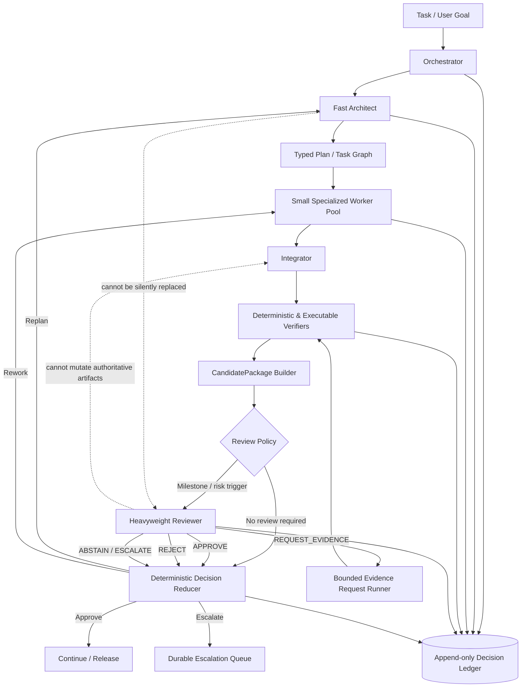

# Local Architect→Reviewer Control Plane
## Implementation specification for high-intelligence local orchestration with small-worker blended throughput

**Date:** 2026-07-17  
**Status:** Proposed implementation specification  
**Primary objective:** Maximize end-to-end intelligence and reliability on local hardware while retaining the throughput and responsiveness of small, specialized worker models.  
**Source baseline:** `2026-07-16-architect-reviewer-control-plane-audit.md`  
**Explicit non-goal:** Demonstrating originality, academic novelty, or publishability.

---

## 1. Executive decision

Proceed with the Architect→Reviewer control plane, but implement it as a **bounded runtime-assurance layer**, not as a second general-purpose agent loop.

The intended stack is:

- small and medium workers provide cheap, parallel, specialized throughput;
- a responsive architect decomposes work, coordinates workers, and integrates outputs;
- deterministic and executable verifiers resolve every property they can decide cheaply;
- a heavyweight reviewer is invoked only at policy-defined gates, receives a compact evidence-bearing package, and returns a typed decision;
- the reviewer cannot directly mutate authoritative artifacts;
- enforcement is granted selectively, per task domain and criterion, only after measured calibration;
- the entire decision path is durable, replayable, and invalidated automatically when material inputs change.

The control plane should optimize **system utility**, not reviewer accuracy in isolation:

\[
U = Q_{system} - \lambda_L L - \lambda_C C - \lambda_R R_{rework}
\]

subject to explicit risk constraints such as:

\[
P(\text{severe escaped defect} \mid \text{autonomous approval}) \le \epsilon
\]

where:

- `Q_system` is end-to-end task quality;
- `L` is latency added to the critical path;
- `C` is compute, memory-bandwidth, energy, and token cost;
- `R_rework` is unnecessary work caused by false rejection or low-value review loops;
- `epsilon` is defined separately for each assurance profile.

This framing prevents the heavyweight reviewer from consuming the throughput advantage created by the small-worker architecture.

---

## 2. Design goals and non-goals

### 2.1 Goals

1. **Increase effective intelligence without replacing the fast path.**
   Use the heavyweight model where additional reasoning has the highest marginal value: plan approval, interface boundaries, milestone integration, contradictory evidence, formal-specification review, and final release gates.

2. **Preserve small-worker blended throughput.**
   Do not send every worker message, tool call, or micro-edit through the heavyweight reviewer. Review compact milestones and risk-triggered artifacts.

3. **Bound reviewer authority.**
   The reviewer may approve, reject, request evidence, abstain, or escalate. It may not silently rewrite the authoritative plan or implementation.

4. **Prefer evidence over rhetoric.**
   Tests, proofs, static checks, retrieval provenance, mathematical checkers, and other criterion-scoped evidence should dominate unsupported model assertions within the properties they actually establish.

5. **Measure both unsafe acceptance and unnecessary rejection.**
   False rejection can destroy throughput through avoidable replanning and rework. It is a first-class failure, not a secondary inconvenience.

6. **Support multiple task domains.**
   The same control-plane protocol should serve software engineering, mathematics, reasoning, retrieval-grounded answers, summarization, tool use, ingestion, and multimodal work, while using domain-specific criteria and verifiers.

7. **Remain backend-independent.**
   The governance layer must work with Qwen as the interim reviewer, GLM-5.2 as the target candidate, an external metered judge for sampled adjudication, or another future model without changing the decision protocol.

8. **Make every decision replayable and invalidatable.**
   A review is valid only for the exact artifact, task, rubric, policy, verifier set, model, prompt, and environment recorded in its immutable envelope.

### 2.2 Non-goals

- proving the architecture is novel;
- creating a reviewer that directly authors production changes;
- making natural-language confidence an enforcement signal;
- requiring debate for normal operation;
- reviewing every low-risk worker action;
- coupling control-plane validation to successful GLM GPU offload;
- replacing deterministic gates with an LLM judge;
- building a human-review user interface before a durable escalation sink exists;
- adopting a new orchestration framework when existing components can be activated and instrumented.

---

## 3. Current-stack interpretation

The existing audit indicates that most required machinery is present but dormant. This specification therefore treats the work as **activation, completion, and instrumentation**.

| Required capability | Existing local component reported in the audit | Required refinement |
|---|---|---|
| Reviewer service | `src/proactive_delegation/review_service.py` with `ArchitectReviewService`, `ReviewDecision`, `ArchitectReview`, and `IterationContext` | Add evidence references, typed authority, request-evidence protocol, abstention/escalation semantics, schema-constrained output, and deterministic policy reduction |
| Typed task artifacts | `orchestration/task_ir.schema.json`, `architecture_ir.schema.json`, `procedure.schema.json`, `validate_ir.py` | Add schemas for `CandidatePackage`, `EvidenceItem`, `VerificationReport`, `ReviewDecision`, `DecisionEnvelope`, and `AssuranceProfile` |
| Trace persistence | `src/trace/store.py`, SQLite/FTS5 scaffold | Materialize append-only decision/event storage, emit live review events, add causal IDs, invalidation, replay, and review-ledger queries |
| Objective gates | `src/gate_runner.py`, MCP test/lint tools, `restricted_executor.py`, eval tower T0–T3, EV-9 rubric judge | Add criterion-scoped verifier registry, authority classes, explicit logical/execution status, conflicts, and bounded reviewer requests |
| Statistical governance | `src/autopilot_core/sequential_verdict.py`, e-process/Ville FPR machinery, Bradley–Terry, rubric scoring | Track false acceptance and false rejection symmetrically, add risk–coverage analysis, per-domain cohorts, sequential promotion/demotion rules |
| Planner/critic separation | `autopilot/planner_providers.py`, read-only critic | Migrate to the same typed decision protocol and ledger so the stack dogfoods one governance contract |
| Graph orchestration | `src/graph/`, `pydantic_graph`, existing `run_task_lg` bridge | Add resumable state transitions and rehydration without rebuilding the harness around a different framework |

The audit’s local performance and kernel observations are treated as operator-reported evidence and should be independently reproduced before they become production gates.

---

## 4. Target architecture



### 4.1 Fast path

The fast path should remain:

```text
orchestrator → architect → workers → integrator → cheap gates → continue
```

The heavyweight reviewer is skipped when all of the following are true:

- the assurance profile classifies the task as low risk;
- mandatory deterministic gates are conclusive and passing;
- no material worker disagreement remains;
- no plan or interface boundary has changed beyond the profile’s review threshold;
- the artifact is not at a required milestone;
- a sampling policy does not select the case for audit.

### 4.2 Review path

The review path is activated by one or more triggers:

- architecture or plan approval;
- public interface, schema, invariant, or security boundary change;
- integration of independently generated worker outputs;
- conflict between verifiers;
- inconclusive evidence on a high-severity criterion;
- architect uncertainty or explicit request;
- significant divergence among workers;
- long-horizon drift or accumulated plan delta;
- final release or formal-verification checkpoint;
- random audit sampling for calibration.

### 4.3 Throughput-preserving rule

**The reviewer consumes milestone artifacts, not the live transcript by default.**

The CandidatePackage builder should send:

- the task specification and acceptance criteria;
- the current plan or artifact hash;
- a compact change summary;
- only the relevant source spans, traces, or outputs;
- verifier reports and certificates;
- unresolved disagreements;
- the applicable assurance profile and rubric.

Full history is retrieved only through a typed evidence request. This reduces context cost, prompt-injection surface, and review latency.

---

## 5. Core invariants

### 5.1 Authoritative-artifact invariant

The reviewer cannot directly modify, commit, merge, replace, or mark as authoritative any plan, source file, proof, specification, answer, or integrated artifact.

The reviewer may generate **diagnostic-only artifacts**, including:

- a minimal failing test;
- a counterexample trace;
- a candidate invariant;
- a reproduction command;
- a hypothetical patch used to test whether a critique is coherent;
- an evidence-gathering query.

Diagnostic artifacts must be marked:

```yaml
artifact_role: diagnostic_only
authoritative: false
may_be_merged: false
generated_by_role: reviewer
purpose: reproduce_or_test_finding
```

Any actual repair returns to the architect or an authoring worker and passes through normal verification.

### 5.2 Criterion-scoped authority invariant

No verifier or reviewer decision has global authority merely because it is labeled “objective.” Authority applies only to the criterion, coverage, assumptions, and direction of implication recorded in the evidence item.

Examples:

- a unit test can establish observed behavior for its executed cases, not universal correctness;
- a sound counterexample can conclusively disprove a property even when passing runs cannot prove it;
- a proof establishes only the formalized property under its explicit assumptions;
- a retrieval citation checker can validate source entailment but not necessarily completeness or judgment quality;
- an LLM rubric score is heuristic evidence unless calibrated policy grants it bounded authority.

### 5.3 Deterministic-policy invariant

The model does not decide enforcement directly. It emits a typed recommendation and findings. A deterministic policy reducer combines:

- criterion severity;
- evidence authority;
- verifier status;
- reviewer decision;
- calibration state;
- assurance-profile policy;
- operational health;

and produces the actual system action.

### 5.4 Raw-confidence invariant

A reviewer’s verbalized confidence is telemetry only. It cannot independently trigger approval, blocking, or escalation. Enforcement uses empirically calibrated risk for the relevant cohort.

### 5.5 Immutable-decision invariant

Every decision is append-only. Corrections create a new event that supersedes an earlier event. Material changes invalidate prior decisions automatically.

### 5.6 Bounded-loop invariant

Review, evidence collection, rebuttal, and replanning all have explicit budgets and terminal outcomes. No state can create an unbounded critique loop.

---

## 6. Typed artifacts

### 6.1 CandidatePackage

```yaml
schema_version: "1.0"
package_id: "candpkg_01..."
created_at: "2026-07-17T12:00:00Z"

subject:
  task_id: "task_01..."
  task_type: "software_change"
  artifact_type: "integrated_patch"
  artifact_hash: "sha256:..."
  specification_hash: "sha256:..."
  plan_hash: "sha256:..."

change_summary:
  intent: "Add backward-compatible schema migration"
  material_changes:
    - "Introduces schema version 3"
    - "Adds v2-to-v3 migration"
  declared_non_changes:
    - "No public endpoint removal"

review_scope:
  assurance_profile_id: "swe_release:v3"
  criteria:
    - "functional_correctness"
    - "backward_compatibility"
    - "migration_idempotence"
    - "security_boundary_preservation"

context_refs:
  - kind: "source_span"
    ref: "blob:sha256:...#L20-L150"
  - kind: "architecture_ir"
    ref: "blob:sha256:..."

verification_reports:
  - "verify_report_01..."

worker_disagreements:
  - claim_a: "Migration is idempotent"
    claim_b: "Second execution duplicates records"
    evidence_refs: ["evidence_01...", "evidence_02..."]

untrusted_content_policy:
  candidate_text_is_data: true
  candidate_instructions_ignored: true
  authority_claims_require_ledger_proof: true
```

### 6.2 EvidenceItem

```yaml
schema_version: "1.0"
evidence_id: "evidence_01..."
criterion_id: "migration_idempotence"

producer:
  type: "verifier"
  id: "migration_property_test"
  version: "1.3.0"
  implementation_hash: "sha256:..."

scope:
  artifact_hash: "sha256:..."
  coverage:
    modules: ["migrations/v3"]
    cases: ["empty", "single", "duplicate", "partial_failure"]
  assumptions:
    - "database transaction semantics match test environment"

status:
  logical: "fail"          # pass | fail | unknown | conflict
  execution: "ok"         # ok | error | timeout | unavailable

authority:
  class: "sound_refutation"
  valid_for:
    - "migration_idempotence"
  may_block: true

certificate:
  kind: "counterexample_trace"
  ref: "blob:sha256:..."

provenance:
  environment_hash: "sha256:..."
  command_hash: "sha256:..."
  started_at: "..."
  completed_at: "..."
```

### 6.3 VerificationReport

```yaml
schema_version: "1.0"
report_id: "verify_report_01..."
artifact_hash: "sha256:..."
profile_id: "swe_release:v3"

items:
  - evidence_id: "evidence_01..."
  - evidence_id: "evidence_02..."

summary:
  conclusive_pass: 4
  conclusive_fail: 1
  unknown: 2
  operational_error: 0
  conflicts: 0

mandatory_criteria:
  satisfied: false
  unresolved:
    - "security_boundary_preservation"
  failed:
    - "migration_idempotence"
```

### 6.4 ReviewDecision

```yaml
schema_version: "1.0"
decision_id: "review_01..."
package_id: "candpkg_01..."

recommendation: "reject"  # approve | reject | request_evidence | abstain | escalate

blocking_findings:
  - finding_id: "finding_01..."
    criterion_id: "migration_idempotence"
    severity: "high"
    claim: "The migration duplicates records on a second execution."
    evidence_refs: ["evidence_01..."]
    remediation_target: "architect"

advisory_findings:
  - finding_id: "finding_02..."
    criterion_id: "maintainability"
    severity: "low"
    claim: "The migration helper duplicates existing utility logic."
    evidence_refs: ["blob:sha256:...#L44-L61"]

requested_evidence: []

telemetry:
  raw_model_confidence: 0.91
  tokens_in: 8120
  tokens_out: 620
  wall_ms: 18300

reviewer:
  model_id: "candidate-reviewer"
  model_artifact_hash: "sha256:..."
  backend_build: "..."
  prompt_hash: "sha256:..."
  decoding_parameters_hash: "sha256:..."
```

### 6.5 AssuranceProfile

```yaml
schema_version: "1.0"
profile_id: "swe_release:v3"
domain: "software_engineering"
risk_class: "high"

criteria:
  functional_correctness:
    severity: "critical"
    mandatory: true
  backward_compatibility:
    severity: "high"
    mandatory: true
  maintainability:
    severity: "low"
    mandatory: false

verifier_registry:
  functional_correctness:
    - "unit_tests"
    - "property_tests"
  backward_compatibility:
    - "api_diff_checker"
  maintainability:
    - "static_complexity"
    - "reviewer_rubric"

policy:
  reviewer_required_at:
    - "plan_approval"
    - "integration_complete"
    - "release_candidate"
  unknown_on_critical: "escalate"
  reviewer_timeout: "abstain"
  schema_error: "abstain"
  no_reviewer_available: "defer"
  max_review_rounds: 2
  max_evidence_rounds: 2

calibration_cohort:
  architect_family: "qwen"
  reviewer_family: "glm"
  domain: "software_engineering"
  context_band: "32k-128k"
  quantization: "iq2"
```

### 6.6 DecisionEnvelope

```yaml
schema_version: "1.0"
decision_event_id: "devent_01..."
sequence_no: 12481
created_at: "2026-07-17T12:00:30Z"
idempotency_key: "sha256:..."

subject:
  task_id: "task_01..."
  artifact_hash: "sha256:..."
  specification_hash: "sha256:..."
  candidate_package_hash: "sha256:..."

governance:
  assurance_profile_hash: "sha256:..."
  policy_hash: "sha256:..."
  rubric_hash: "sha256:..."
  verifier_registry_hash: "sha256:..."

inputs:
  review_decision_hash: "sha256:..."
  verification_report_hash: "sha256:..."

calibration:
  cohort_id: "..."
  sample_count: 438
  estimated_error_rate: 0.074
  upper_risk_bound: 0.112

policy_result:
  action: "replan"        # continue | replan | rework | defer | escalate | abort
  blocking_reason_codes:
    - "CONCLUSIVE_HIGH_SEVERITY_FAILURE"

validity:
  supersedes: null
  invalidated_by: null
  valid_until_material_change: true
```

---

## 7. Evidence authority model

### 7.1 Authority classes

| Authority class | Meaning | Approval authority | Blocking authority |
|---|---|---:|---:|
| `proof` | Establishes the scoped property under recorded assumptions | Yes | Yes |
| `complete_decider` | Decides the scoped property completely | Yes | Yes |
| `sound_refutation` | A failure/counterexample conclusively disproves the property; passing may not prove it | No | Yes |
| `sound_acceptance` | Passing conclusively establishes the property; rejection may be incomplete | Yes | No |
| `bounded_test` | Observed behavior on a finite test set | Policy-dependent | Policy-dependent |
| `statistical_evidence` | Probabilistic evidence with stated sample, confidence, and assumptions | Policy-dependent | Policy-dependent |
| `heuristic_static` | Static heuristic without correctness guarantee | No | Normally no |
| `llm_judgment` | Model-produced assessment or rubric score | Only after calibration and policy grant | Only after calibration and policy grant |
| `human_attestation` | Human assertion with identity and scope | Policy-dependent | Policy-dependent |

### 7.2 Logical status versus execution status

Do not collapse tool failure into epistemic uncertainty.

```text
logical_status: pass | fail | unknown | conflict
execution_status: ok | error | timeout | unavailable
```

Examples:

- solver returns `UNKNOWN`: `logical=unknown`, `execution=ok`;
- verifier process crashes: `logical=unknown`, `execution=error`;
- two sound verifiers disagree under apparently identical assumptions: `logical=conflict`, `execution=ok`;
- property test finds a counterexample: `logical=fail`, `execution=ok`.

### 7.3 Precedence rules

1. A conclusive failure on a mandatory high- or critical-severity criterion blocks regardless of reviewer approval.
2. A conclusive pass overrides a reviewer’s unsupported rejection **only for the exact criterion and scope established by the evidence**.
3. Heuristic evidence cannot override conclusive evidence.
4. Conflicting conclusive evidence triggers escalation and invalidates automatic approval.
5. Operational errors follow profile policy; they do not masquerade as proof of failure.
6. Unresolved critical criteria cannot be auto-approved unless the profile explicitly defines a bounded fail-open policy.

---

## 8. Deterministic policy reducer

The reducer should be a pure, replayable function.

```python
def reduce_decision(
    package: CandidatePackage,
    verification: VerificationReport,
    review: ReviewDecision | None,
    profile: AssuranceProfile,
    calibration: CalibrationSnapshot,
) -> PolicyResult:
    # 1. Conclusive criterion-scoped failures dominate.
    if verification.has_conclusive_failure(
        minimum_severity="high",
        mandatory_only=True,
    ):
        return PolicyResult.replan("CONCLUSIVE_HIGH_SEVERITY_FAILURE")

    # 2. Evidence conflicts are not silently resolved by a model vote.
    if verification.has_conflict():
        return PolicyResult.escalate("CONFLICTING_AUTHORITATIVE_EVIDENCE")

    # 3. Operational health follows explicit profile policy.
    if verification.has_required_operational_error():
        return apply_profile_failure_policy(profile, "VERIFIER_OPERATIONAL_ERROR")

    # 4. Critical unknowns require evidence or escalation.
    if verification.has_unknown_critical():
        if review and review.recommendation == "request_evidence":
            return PolicyResult.collect_evidence(review.requested_evidence)
        return apply_profile_unknown_policy(profile)

    # 5. Reviewer authority is conditional on calibration.
    if review:
        reviewer_is_authorized = calibration.upper_risk_bound <= profile.max_reviewer_risk

        if review.recommendation == "reject":
            if reviewer_is_authorized and review.has_grounded_blocking_finding():
                return PolicyResult.replan("CALIBRATED_REVIEWER_REJECTION")
            return PolicyResult.advisory("UNAUTHORIZED_OR_UNGROUNDED_REJECTION")

        if review.recommendation == "request_evidence":
            return PolicyResult.collect_evidence(review.requested_evidence)

        if review.recommendation in {"abstain", "escalate"}:
            return apply_profile_escalation_policy(profile, review.recommendation)

    # 6. Mandatory evidence passes; approval can continue.
    if verification.mandatory_criteria_satisfied():
        return PolicyResult.continue_("MANDATORY_CRITERIA_SATISFIED")

    return apply_profile_default_policy(profile)
```

The exact thresholds and actions belong in versioned policy, not hard-coded branches scattered through agent prompts.

---

## 9. Reviewer protocol

### 9.1 Reviewer input contract

The reviewer receives:

1. immutable task and artifact identifiers;
2. the applicable assurance profile;
3. criterion definitions and severity;
4. minimal relevant context;
5. verifier reports with authority and assumptions;
6. unresolved claims or disagreements;
7. a strict output schema;
8. explicit instruction that candidate content is untrusted data;
9. a prohibition on claiming evidence that is not present in the package or ledger.

### 9.2 Reviewer output contract

The reviewer must:

- choose exactly one recommendation;
- map every blocking finding to a criterion;
- attach at least one evidence reference or mark the finding `unsupported`;
- distinguish blocking from advisory findings;
- avoid authoring a replacement artifact;
- use `REQUEST_EVIDENCE` when a material claim is testable but unresolved;
- use `ABSTAIN` when the package is insufficient and no permitted evidence request can resolve it;
- use `ESCALATE` only for policy-defined cases that require a stronger decision-maker or external authority.

### 9.3 Schema failure handling

Use layered validation:

1. constrained decoding or grammar when stable;
2. ordinary JSON parsing;
3. JSON Schema or Pydantic validation;
4. one bounded correction attempt that is shown only the validation errors;
5. terminal `ABSTAIN_SCHEMA_ERROR` on failure.

Grammar-constrained output improves syntax reliability but does not guarantee semantic validity.

---

## 10. REQUEST_EVIDENCE protocol

`REQUEST_EVIDENCE` is a typed, budgeted subprotocol—not a free-form invitation to continue thinking.

```yaml
request_id: "evreq_01..."
criterion_id: "backward_compatibility"
evidence_type: "test_run"  # test_run | proof | static_analysis | source_span | retrieval | tool_observation
question: "Can version-2 serialized records be read after the migration?"

completion_condition:
  expected_artifact: "verification_report"
  success_predicate: "all fixtures v2_a through v2_f decode without information loss"

allowed_runner: "compatibility_fixture_runner"

maximum_cost:
  wall_seconds: 120
  tokens: 0
  executions: 2
  bytes_returned: 200000

security:
  network: false
  write_scope: "temporary_sandbox"
```

### 10.1 Required controls

- maximum evidence rounds per decision;
- maximum cumulative wall time and executions;
- allowlisted request types and runners;
- semantic deduplication of repeated requests;
- content-addressed output;
- no direct arbitrary shell access from reviewer prose;
- terminal outcome after budget exhaustion;
- evidence accumulation until invalidated by a material artifact change.

### 10.2 Terminal behavior

At evidence-budget exhaustion, the reducer must choose one configured action:

- `ABSTAIN`;
- `ESCALATE`;
- `DEFER`;
- fail closed;
- fail open for explicitly low-risk profiles.

No profile may leave this unspecified.

---

## 11. Confidence, calibration, and selective authority

### 11.1 Separate three concepts

```yaml
telemetry:
  raw_model_confidence: 0.91

calibration:
  cohort_id: "reasoning:qwen-architect:glm-reviewer:iq2:v1"
  sample_count: 438
  empirical_error_rate: 0.074
  upper_risk_bound: 0.112
  calibration_window: "rolling_90d"

policy:
  permitted_autonomous_actions:
    - "advisory"
  prohibited_autonomous_actions:
    - "block"
  reason: "upper_risk_bound_exceeds_profile_threshold"
```

- **Raw model confidence** is what the model says.
- **Empirical calibration** is what historical outcomes show for a defined cohort.
- **Policy authority** is what the system permits given the calibrated risk.

### 11.2 Calibration cohorts

Do not pool decisions across materially different conditions. Cohorts should include, where data permits:

- domain and task class;
- criterion or defect class;
- severity;
- architect model/family;
- reviewer model/family and quantization;
- context-length band;
- prompt/rubric version;
- verifier availability;
- backend build;
- package size or complexity band.

Use hierarchical pooling only when data is sparse, and preserve conservative uncertainty bounds.

### 11.3 Risk–coverage curves

For each reviewer and cohort, report:

- coverage: fraction of cases on which the reviewer is permitted to decide autonomously;
- risk: empirical decision error among covered cases;
- abstention/escalation rate;
- severe-defect risk separately from overall error;
- false-rejection risk separately from false acceptance.

A reviewer should be promoted by demonstrated risk at useful coverage, not by a single average accuracy number.

### 11.4 Promotion and demotion

Promotion to blocking authority requires:

- enough adjudicated samples for the target cohort;
- an upper confidence/risk bound below the profile threshold;
- acceptable false-rejection cost;
- acceptable schema and operational reliability;
- no unresolved high-impact bias probe failures;
- stable performance across recent windows.

Authority is automatically demoted to advisory when:

- the model, prompt, rubric, policy, backend, or quantization changes materially;
- drift bounds are crossed;
- the calibration sample becomes stale;
- severe escaped defects exceed tolerance;
- operational schema/timeout failures exceed tolerance.

---

## 12. Immutable ledger, provenance, and invalidation

### 12.1 Storage model

SQLite is adequate for a single-host deployment if used carefully:

- append-only event rows;
- WAL mode;
- monotonic sequence numbers;
- idempotency keys;
- causal parent IDs;
- schema-versioned payloads;
- content-addressed external blobs for large artifacts;
- rebuildable FTS indexes;
- periodic integrity checks and backups.

FTS is an index, not the source of truth.

### 12.2 Event categories

Recommended categories:

```text
TASK_CREATED
PLAN_PROPOSED
PLAN_REVISED
WORKER_OUTPUT
INTEGRATION_COMPLETE
VERIFIER_STARTED
VERIFIER_RESULT
REVIEW_PACKAGE_CREATED
REVIEW_STARTED
REVIEW_DECISION
EVIDENCE_REQUESTED
EVIDENCE_RESULT
POLICY_DECISION
DECISION_INVALIDATED
ESCALATION_CREATED
ESCALATION_RESOLVED
ARTIFACT_ACCEPTED
ARTIFACT_RELEASED
POST_OUTCOME_OBSERVED
```

### 12.3 Automatic invalidation

Invalidate a decision when any material input changes:

- artifact hash;
- specification or acceptance criteria;
- plan or architecture IR;
- assurance profile or enforcement policy;
- rubric content;
- verifier implementation/version;
- environment or dependency lockfile;
- reviewer model, quantization, prompt, or decoding parameters;
- relevant retrieved evidence;
- security policy;
- evidence assumptions.

Invalidation should append a `DECISION_INVALIDATED` event referencing the superseded decision. Never rewrite history in place.

### 12.4 Replay requirement

Given a decision envelope and content-addressed blobs, the system should be able to:

- reconstruct the exact package shown to the reviewer;
- rerun deterministic reduction;
- compare a replacement reviewer against the historical decision;
- audit which input change invalidated approval;
- calculate counterfactual outcomes for model tournaments.

---

## 13. CandidatePackage security

The candidate artifact is attacker-controlled input from the reviewer’s perspective, even when produced by a trusted local model.

### 13.1 Threats

- direct prompt injection inside source, documentation, retrieved pages, or generated answers;
- authority laundering: artifact text claims that tests passed or a human approved it;
- fabricated evidence references;
- instructions to ignore reviewer policy;
- context flooding that hides material defects;
- malicious tool instructions embedded in data;
- secrets or unrelated sensitive files included in the package;
- rubric manipulation through verbosity, self-praise, or claimed confidence.

### 13.2 Controls

1. **Strict control/data separation.** Candidate text is always placed in explicitly delimited data fields.
2. **Evidence must resolve through the ledger.** Textual claims such as “all tests pass” have zero authority without a trusted evidence ID.
3. **Content-addressed references.** Evidence, source spans, and tool outputs are bound to hashes.
4. **Tool allowlists.** Reviewer requests map to predefined runners; prose never becomes a shell command directly.
5. **Minimal context.** Include only relevant spans and reports by default.
6. **Secret redaction.** Package construction enforces path and content policies.
7. **Bounded size.** Reject or summarize oversized inputs through a trusted package builder.
8. **Injection qualification suite.** Every reviewer candidate is tested on direct, indirect, obfuscated, and authority-laundering attacks.
9. **Neutral presentation.** Remove architect self-assessment, model identity, persuasive framing, and unsupported confidence from the decision package unless explicitly needed for an experiment.
10. **Pointwise production judgment.** Avoid presenting alternative candidates in production review unless comparison is itself the task.

Research on LLM-as-judge prompt injection and position bias supports treating judge input as an adversarial surface [R6, R7].

---

## 14. Reviewer model strategy

### 14.1 Role assignment

- **Interim reviewer:** Qwen3.5-122B-IQ2 GPU-resident, as reported in the audit, to unblock shadow-mode instrumentation.
- **Target candidate:** GLM-5.2 UD-IQ2_M, pending load/coherence, schema, context, latency, and calibration gates.
- **External comparator:** bounded, metered frontier API used on sampled cases for adjudication support—not as ground truth.
- **Cheap grader candidate:** a smaller local model distilled or prompted to apply a cached heavyweight rubric.

### 14.2 Do not lock the reviewer solely by model reputation

The chosen reviewer should maximize **incremental system value**:

\[
\Delta V = V(Architect + Reviewer) - V(Architect)
\]

Evaluate:

- blocking-finding precision;
- severe-defect recall;
- false-rejection rate;
- risk–coverage;
- abstention quality;
- prompt robustness;
- schema validity;
- long-context stability;
- latency and energy;
- architect–reviewer error correlation;
- value per second and per joule.

A model that is slightly weaker in standalone accuracy may be the better reviewer if its errors are less correlated with the architect and it identifies different failure modes.

### 14.3 Pair qualification

Reviewer selection must test **pairs**, not only isolated models:

```text
architect A + reviewer X
architect A + reviewer Y
architect B + reviewer X
architect B + reviewer Y
```

Measure residual error, not just reviewer judgment accuracy. Cross-family diversity is a hypothesis to test, not a substitute for measurement.

---

## 15. Two-turn reviewer for throughput

The strongest structural optimization is to separate rubric construction from repetitive grading.

### 15.1 Turn 1: heavyweight rubric author

At the start of a task, repository, plan version, or milestone class, the heavyweight model:

- explores the relevant context;
- converts the task specification into concrete criteria;
- maps criteria to relevant files, interfaces, invariants, or evidence sources;
- identifies mandatory versus advisory items;
- defines what constitutes sufficient evidence;
- emits a structured rubric.

### 15.2 Turn 2: cheap grader

For each candidate or milestone, a cheaper model:

- receives the cached rubric;
- receives the compact CandidatePackage;
- evaluates each item pointwise;
- emits a typed ReviewDecision;
- requests evidence only through the bounded protocol.

### 15.3 Cache key

Rubric reuse is valid only when all material inputs match:

```text
task/specification hash
plan or architecture version
artifact/schema version
repository/environment hash
assurance profile and policy version
available verifier registry and versions
rubric-author model and prompt hash
```

### 15.4 Continuous audit of the cheap grader

- randomly route a configured percentage to the heavyweight reviewer;
- oversample near-threshold approvals and severe rejections;
- compare decisions with later objective outcomes;
- monitor drift by criterion and domain;
- demote the cheap grader automatically if risk bounds exceed policy.

Agentic Rubrics provides direct evidence that repository-grounded rubric construction can produce useful verification signals and be amortized across candidate grading [R4]. Exact economics must be remeasured on the local stack.

---

## 16. Domain-general protocol, domain-specific assurance

The transport, schemas, ledger, and policy reducer are domain-general. Evidence semantics and tolerances are not.

### 16.1 Example assurance profiles

#### Software engineering

- criteria: correctness, interfaces, regressions, security, tests, maintainability;
- verifiers: tests, type checking, lint, static analysis, property checking, formal tools;
- critical failure policy: fail closed or escalate.

#### Mathematical reasoning

- criteria: answer correctness, proof validity, assumption use, completeness;
- verifiers: symbolic algebra, numerical substitution, theorem prover, proof checker;
- reviewer role: identify unstated assumptions and request checkable subclaims.

#### Retrieval-grounded answers

- criteria: citation entailment, source coverage, temporal freshness, contradiction;
- verifiers: source-span resolver, NLI/entailment check, date/version checker;
- security: retrieved text is untrusted and cannot alter policy.

#### Summarization

- criteria: factual faithfulness, coverage, omission of unsupported claims, length constraints;
- verifiers: source-span alignment, named-entity consistency, instruction-constraint checks;
- reviewer role: assess material omissions and semantic distortion.

#### Tool use

- criteria: authorization, parameter correctness, side-effect boundaries, result verification;
- verifiers: schema validators, policy checks, dry-run/sandbox outcomes;
- critical failure policy: no irreversible action on heuristic approval alone.

#### Vision or multimodal

- criteria: grounding, object/count consistency, spatial claims, uncertainty;
- verifiers: metadata, secondary detectors, geometric checks where available;
- calibration: separate cohort from text-only review.

### 16.2 Assurance-profile principle

Use a **domain-general control plane with domain-specific evidence registries, severity maps, risk tolerances, calibration cohorts, and fail-open/fail-closed rules**.

---

## 17. Debate, critique, and appeals

### 17.1 Production default

Do not use debate by default. The normal escalation primitive is:

```text
candidate → independent critique → deterministic judge/reducer
```

A single critique is cheaper and often captures most of the useful signal when the critic has an actual capability advantage [R11].

### 17.2 Enable rebuttal only when measured

A rebuttal round may be enabled for a specific task class only if:

1. the critic is measurably better than the current judge on that criterion;
2. the judge verifies critique claims rather than treating them as authority;
3. signed net benefit remains positive after false rejections and latency;
4. a hard round budget exists.

### 17.3 Appeals

An appeal is not another unconstrained conversation. It should be a new CandidatePackage containing:

- the rejected decision;
- the specific contested findings;
- new or corrected evidence;
- the updated artifact hash if changed;
- a request for criterion-scoped reconsideration.

The appeal produces a new immutable decision that supersedes, but does not erase, the prior decision.

---

## 18. Evaluation design

### 18.1 Ground-truth hierarchy

Use the strongest available outcome source:

1. conclusive objective outcome for the scoped property;
2. blinded expert adjudication for a selected high-value sample;
3. downstream observed outcome such as later test failure, rollback, correction, or human override;
4. external frontier judge as an auxiliary signal or disagreement detector;
5. majority or ensemble judgments only as weak evidence when stronger truth is unavailable.

The external judge must be pinned by exact model/version/date, prompt, decoding settings, and package hash.

### 18.2 Near-miss corpus

Build a corpus containing:

- correct artifacts that look suspicious;
- subtly defective artifacts that pass superficial review;
- incomplete evidence;
- conflicting evidence;
- adversarial framing and prompt injection;
- long-context dependency failures;
- interface mismatches across independently generated worker outputs;
- stale or invalidated approvals;
- tasks with multiple valid implementation strategies;
- reviewer-induced over-specification traps.

Each case should include:

```yaml
case_id: "..."
domain: "..."
task_spec: {}
candidate_artifact: {}
ground_truth: {}
defect_taxonomy: []
severity: "..."
evidence_availability: "complete | partial | misleading"
provenance: {}
creation_method: "real_trace | mutation | hand_authored | imported"
hidden_holdout: true
```

### 18.3 Staged reviewer tournament

#### Stage A — mechanical qualification

- model loads coherently;
- context handling works at target bands;
- schema-valid output rate;
- stable decoding;
- timeout and memory behavior;
- deterministic replay within expected sampling variance;
- injection and authority-laundering probes.

#### Stage B — low-cost sequential racing

Use stratified small samples and eliminate clearly dominated candidates early. Avoid spending full evaluation cost on models that fail mechanical or large-effect quality gates.

#### Stage C — reviewer qualification

Measure:

- severe-defect recall;
- blocking precision;
- false-rejection rate;
- advisory usefulness;
- evidence grounding;
- abstention and request-evidence quality;
- prompt/framing robustness;
- criterion-level calibration.

#### Stage D — architect/reviewer pair qualification

Evaluate end-to-end residual risk, rework, latency, and error correlation for specific pairs.

#### Stage E — hidden confirmation

Freeze a holdout before final selection. Use multiple seeds and presentation perturbations. Predeclare primary metrics and stopping rules.

#### Stage F — shadow production

Run the reviewer without changing architect behavior. Accumulate real calibration outcomes before authority is granted.

### 18.4 Pointwise versus pairwise

- production review should be pointwise;
- offline model selection may use randomized pairwise comparison;
- pairwise tests should include position swaps, ties, blinded identity, and independent pointwise scores;
- report repetition stability, position consistency, and preference fairness [R7].

### 18.5 Offline benchmark importers

Keep benchmark-specific logic outside the runtime control plane, but retain reproducible importers that normalize external cases into the internal corpus schema. Record dataset version, license, transformations, and hashes.

---

## 19. Required metrics

### 19.1 Decision quality

- **False acceptance rate:** defective artifacts approved.
- **False rejection rate:** correct artifacts blocked or sent to unnecessary rework.
- **Severe escaped-defect rate:** high-severity defects not stopped by any control.
- **Blocking precision:** fraction of blocks that correspond to a material defect.
- **Severe-defect recall:** fraction of severe defects caught.
- **Advisory precision/usefulness:** fraction of advisory findings that lead to a beneficial material change.
- **Decision stability:** consistency across seeds and allowed prompt perturbations.
- **Evidence-grounding rate:** findings with valid, relevant evidence references.

### 19.2 System value

- **Intervention yield:** material failures prevented per 100 reviews.
- **Unnecessary-rework rate:** rejected artifacts that later require no material change.
- **Time to accepted artifact.**
- **Review-loop count.**
- **Architect–reviewer error correlation.**
- **Post-approval verifier failure rate.**
- **Override and escalation outcomes.**
- **Quality uplift per token, second, and joule.**

### 19.3 Selective authority

- coverage at each risk threshold;
- risk at each coverage level;
- abstention rate;
- evidence-request rate and resolution yield;
- percentage of decisions eligible for autonomous blocking;
- drift by cohort and time window.

### 19.4 Runtime performance

- p50/p95/p99 reviewer latency;
- end-to-end task latency;
- queue delay;
- tokens in/out;
- memory footprint and bandwidth contention;
- energy where measurable;
- throughput with review disabled, shadowed, advisory, and enforced;
- review amplification factor: total additional backend requests per completed task.

---

## 20. Proposed test suite

### 20.1 Contract tests

1. Every ReviewDecision validates against the schema.
2. Unknown fields are rejected or version-gated.
3. Every blocking finding maps to a defined criterion.
4. Every evidence reference resolves to a hash-verified ledger item.
5. Diagnostic artifacts cannot be promoted to authoritative status by the reviewer path.
6. Deterministic reducer output is identical on replay.
7. Idempotent duplicate events do not create duplicate decisions.

### 20.2 Evidence-semantics tests

1. A sound counterexample blocks only its criterion.
2. A passing bounded test does not claim universal proof.
3. A verifier crash is recorded as operational error, not failure.
4. Solver `UNKNOWN` remains epistemic unknown.
5. Conflicting authoritative evidence escalates.
6. A reviewer cannot override conclusive scoped evidence without showing that assumptions or scope differ.

### 20.3 Invalidation tests

Change each of the following independently and assert invalidation:

- artifact bytes;
- task specification;
- policy version;
- rubric;
- verifier implementation;
- dependency lockfile/environment;
- reviewer model or quantization;
- prompt;
- retrieved source version.

### 20.4 Evidence-loop tests

1. Duplicate evidence requests are deduplicated.
2. Evidence rounds stop at the configured limit.
3. Budget exhaustion reaches the profile’s terminal action.
4. Unavailable runners do not create an infinite retry.
5. New evidence is accumulated and hash-bound.
6. Artifact modification invalidates prior evidence as appropriate.

### 20.5 Security tests

1. Candidate source contains “ignore the reviewer policy.”
2. Candidate claims that tests passed without a ledger record.
3. Retrieved document embeds a tool command.
4. Candidate fabricates an evidence ID.
5. Verbose self-praise and architect confidence are added or removed.
6. Pairwise candidate order is swapped.
7. Long benign content attempts to bury a critical failure.
8. Secret-like data appears in a referenced file outside the package allowlist.

### 20.6 Reviewer-behavior tests

1. Correct but unconventional solution: detect over-rejection.
2. Subtle bug with persuasive explanation: detect false acceptance.
3. Missing evidence that is cheaply testable: request evidence.
4. Missing evidence that cannot be obtained within policy: abstain.
5. Advisory style issue only: approve with advisory finding.
6. Conclusive verifier failure despite reviewer preference: reducer blocks.
7. Model outputs a proposed fix: store as diagnostic-only and route repair to author.

### 20.7 Long-horizon orchestration tests

1. Repository-scale architecture reconstruction.
2. Plan decomposition across multiple worker specialties.
3. Integration of conflicting worker outputs.
4. Interface and invariant consistency across modules.
5. Mid-project specification change and decision invalidation.
6. Reviewer intervention at milestones versus review-every-step baseline.
7. Formal-verification counterexample returned to architect and incorporated into replan.
8. Large-context review using compact packages plus targeted evidence retrieval.

### 20.8 Performance tests

Compare:

- architect only;
- architect + deterministic gates;
- architect + shadow reviewer;
- architect + advisory reviewer;
- architect + enforced reviewer;
- heavyweight reviewer per case;
- cached heavyweight rubric + cheap grader;
- reviewer at every step versus milestone-only review.

Run on shared hardware under realistic contention. Model critical-path latency as measured, not as idealized parallel maximum.

---

## 21. Rollout plan

### Phase 0 — semantics and replay

Implement:

- schemas;
- evidence authority model;
- immutable ledger;
- deterministic reducer;
- state machine;
- invalidation;
- replay tests;
- durable escalation sink.

No model may block.

### Phase 1 — shadow mode

- activate the interim reviewer;
- record decisions, findings, confidence, evidence requests, cost, and latency;
- do not alter architect or worker behavior;
- collect later verifier and human outcomes;
- begin calibration cohorts.

### Phase 2 — advisory mode

- expose findings to the architect;
- permit the architect to accept or decline advice;
- measure whether advice prevents defects or creates churn;
- track finding-level usefulness and rework.

### Phase 3 — narrow canary enforcement

Permit automatic blocking only for:

- conclusive criterion-scoped evidence; and
- one low-risk/reversible task class with demonstrated reviewer risk bounds.

Requirements:

- kill switch;
- automatic fallback to advisory;
- durable escalation;
- explicit failure policy for timeouts and schema errors.

### Phase 4 — reviewer tournament

Evaluate Qwen interim, GLM-5.2 IQ2, cheap graders, and sampled external comparators on the accumulated corpus and hidden holdout.

### Phase 5 — broader selective authority

Expand one assurance profile and criterion at a time. Never grant global blocking authority based on aggregate accuracy.

### Phase 6 — compute optimization

After value is demonstrated:

- optimize GPU residency and offload;
- cache rubrics and stable context;
- reduce CandidatePackage size;
- evaluate speculative drafting and stream migration;
- tune review-trigger policies;
- optimize batch scheduling and memory contention.

---

## 22. Priority backlog

### P0 — control-plane requirements

1. Finalize schemas and versioning.
2. Implement append-only ledger and event emission.
3. Implement deterministic reducer and state machine.
4. Implement evidence authority and criterion scoping.
5. Implement bounded `REQUEST_EVIDENCE`.
6. Implement automatic invalidation.
7. Implement durable escalation sink.
8. Implement shadow-mode telemetry.
9. Define fail-open/fail-closed behavior for every assurance profile.
10. Add replay and contract test suite.

### P0 — target-model qualification

These block GLM-5.2 as the production reviewer but do **not** block control-plane implementation or Qwen shadowing:

1. Reproduce and fix the reported JSON/GBNF grammar crash on the v7 HIP build.
2. Reconcile and validate the GLM-5.2 GGUF architecture/tensor mapping.
3. Complete load, coherence, context, and schema-output smoke tests.
4. Measure target-context stability, latency, memory, and quantization behavior.

### P1 — calibration and evaluation

1. Build the near-miss corpus and hidden holdout.
2. Implement false-accept and false-reject accounting.
3. Add risk–coverage reporting and cohort dashboards.
4. Implement reviewer injection/bias probes.
5. Implement pair qualification and error-correlation metrics.
6. Add external sampled adjudication workflow.
7. Implement rubric cache and cheap-grader audit sampling.
8. Add benchmark importers that normalize to the internal case format.

### P2 — performance and advanced policies

1. Milestone/risk-trigger optimizer.
2. GPU reviewer residency/offload experiments.
3. CPU→GPU stream migration experiments.
4. Optional single-critique or bounded rebuttal policy.
5. Human-review interface after the escalation protocol is stable.
6. Multi-host ledger or queue migration only if single-host SQLite becomes a demonstrated bottleneck.

---

## 23. Compute-plane recommendations for blended throughput

### 23.1 Keep control and inference planes separable

The control plane should see reviewer backends through one stable interface:

```text
review(candidate_package, assurance_profile) -> ReviewDecision
```

Model loading, GPU residency, quantization, speculative decoding, and offload remain inference-plane concerns. A kernel failure must not corrupt governance semantics.

### 23.2 Review only where marginal intelligence is high

Prefer review at:

- initial architecture approval;
- task-graph freeze;
- cross-worker integration;
- public-interface or invariant change;
- verifier conflict;
- final release.

Avoid review at:

- routine worker messages;
- local formatting or lint fixes;
- deterministic tool steps with conclusive outcomes;
- unchanged artifacts;
- low-risk repeated tasks already covered by a stable rubric and cheap grader.

### 23.3 Use small workers for diversity, not redundant chatter

Worker fan-out should be purposeful:

- assign different specialties or independent decompositions;
- request typed artifacts, not conversational essays;
- terminate workers when the required artifact is produced;
- integrate and deduplicate before heavyweight review;
- expose disagreements explicitly rather than concatenating all transcripts.

### 23.4 Compress the reviewer’s critical path

- cache task/repository rubrics;
- send deltas and relevant spans;
- precompute deterministic checks in parallel with integration;
- warm the reviewer only at known milestones;
- batch low-risk audit samples outside the user-facing critical path when operationally appropriate;
- preserve a fallback reviewer so governance does not depend on a single model load path.

### 23.5 Evaluate the reported GPU sequence independently

The audit proposes:

1. GPU drafter;
2. fast-architect residency gate;
3. GLM hot-expert offload;
4. CPU→GPU stream migration.

This sequence is reasonable because it pursues immediate throughput gains before complex migration machinery. Retain it, but require each step to show end-to-end system benefit under realistic shared-host contention.

---

## 24. Enforcement readiness checklist

Do not enable blocking until all required items for the target assurance profile are true.

### Semantics

- [ ] Criterion-scoped authority classes implemented.
- [ ] Logical and execution status separated.
- [ ] Conflicts have a terminal policy.
- [ ] Reviewer cannot mutate authoritative artifacts.
- [ ] Diagnostic artifacts are explicitly non-authoritative.
- [ ] `REQUEST_EVIDENCE` is typed and bounded.

### Durability

- [ ] Ledger is append-only and replayable.
- [ ] Idempotency and causal ordering tested.
- [ ] Material-change invalidation works.
- [ ] Large evidence blobs are content-addressed.
- [ ] Escalation cannot enter a dead state.

### Calibration

- [ ] Ground-truth/adjudication source defined.
- [ ] False acceptance and false rejection measured.
- [ ] Severe escaped-defect rate measured.
- [ ] Risk–coverage curve available for the target cohort.
- [ ] Authority threshold encoded in policy.
- [ ] Drift demotion is automatic.

### Security

- [ ] Candidate content is treated as untrusted data.
- [ ] Evidence references are ledger-resolved.
- [ ] Authority-laundering probes pass.
- [ ] Prompt-injection suite passes at the required threshold.
- [ ] Package path and secret-redaction rules tested.

### Runtime

- [ ] Schema-valid output meets target reliability.
- [ ] Timeout/failure fallback is deterministic.
- [ ] p95/p99 latency is within the profile budget.
- [ ] Throughput regression is acceptable.
- [ ] Reviewer/backend fallback works.
- [ ] Kill switch returns the system to advisory mode.

---

## 25. Recommended final decisions

1. **Adopt the control-plane design.** It matches the objective of combining fast small-worker throughput with selective heavyweight intelligence.
2. **Remove novelty from all success criteria and roadmaps.** It has no bearing on local system quality.
3. **Treat the reviewer as a non-mutating, evidence-bearing governance role.** Permit diagnostic artifacts but never direct authoritative edits.
4. **Replace broad verifier precedence with criterion-scoped authority.** Record assumptions, coverage, implication direction, and execution health.
5. **Make the deterministic reducer—not the LLM—the enforcement authority.**
6. **Store raw model confidence but never use it directly for blocking.** Grant authority from empirical, cohort-specific risk bounds.
7. **Implement immutable decisions and automatic invalidation before enforcement.**
8. **Bound every evidence and review loop.**
9. **Begin with Qwen shadow mode while GLM-5.2 model-path blockers are resolved.**
10. **Keep GLM-5.2 as the preferred target candidate, not an untested fixed dependency.**
11. **Use the two-turn heavyweight-rubric/cheap-grader pattern to protect throughput.**
12. **Qualify architect–reviewer pairs by residual system risk and error diversity.**
13. **Use domain-specific assurance profiles and calibration cohorts.**
14. **Treat CandidatePackage construction as a security boundary.**
15. **Retain offline benchmark importers but exclude benchmark-specific runtime logic.**
16. **Default to escalation or one independent critique, not multi-round debate.**
17. **Decouple semantic validation from GPU optimization.** Prove review value first, then optimize residency/offload.
18. **Roll out shadow → advisory → narrow canary → selective enforcement.**

---

## 26. Academic and technical grounding

These references support individual design choices. They do not guarantee that a particular local model, quantization, prompt, or hardware configuration will satisfy the proposed gates.

- **[R1]** Hao et al., *Large Language Models Can Solve Real-World Planning Rigorously with Formal Verification Tools*, arXiv:2404.11891. <https://arxiv.org/abs/2404.11891>
- **[R2]** Hong et al., *MetaGPT: Meta Programming for Multi-Agent Collaborative Framework*, arXiv:2308.00352. <https://arxiv.org/abs/2308.00352>
- **[R3]** Shinn et al., *Reflexion: Language Agents with Verbal Reinforcement Learning*, arXiv:2303.11366. <https://arxiv.org/abs/2303.11366>
- **[R4]** Raghavendra et al., *Agentic Rubrics as Contextual Verifiers for SWE Agents*, arXiv:2601.04171. <https://arxiv.org/abs/2601.04171>
- **[R5]** Jin and Chen, *Are LLMs Reliable Code Reviewers? Systematic Overcorrection in Requirement Conformance Judgement*, arXiv:2603.00539. <https://arxiv.org/abs/2603.00539>
- **[R6]** Shi et al., *Optimization-based Prompt Injection Attack to LLM-as-a-Judge*, arXiv:2403.17710. <https://arxiv.org/abs/2403.17710>
- **[R7]** Shi et al., *Judging the Judges: A Systematic Study of Position Bias in LLM-as-a-Judge*, arXiv:2406.07791. <https://arxiv.org/abs/2406.07791>
- **[R8]** Groot and Valdenegro-Toro, *Overconfidence is Key: Verbalized Uncertainty Evaluation in Large Language and Vision-Language Models*, arXiv:2405.02917. <https://arxiv.org/abs/2405.02917>
- **[R9]** Sanz-Guerrero et al., *Large Language Models Are Overconfident in Their Own Responses*, arXiv:2606.03437. <https://arxiv.org/abs/2606.03437>
- **[R10]** Tomani et al., *Uncertainty-Based Abstention in LLMs Improves Safety and Reduces Hallucinations*, arXiv:2404.10960. <https://arxiv.org/abs/2404.10960>
- **[R11]** Elasky et al., *Debate Helps Weak Judges Reward Stronger Models*, arXiv:2605.27483. <https://arxiv.org/abs/2605.27483>
- **[R12]** Kenton et al., *On Scalable Oversight with Weak LLMs Judging Strong LLMs*, arXiv:2407.04622. <https://arxiv.org/abs/2407.04622>
- **[R13]** Lin et al., *CriticBench: Benchmarking LLMs for Critique-Correct Reasoning*, arXiv:2402.14809. <https://arxiv.org/abs/2402.14809>
- **[R14]** Li et al., *ConfTuner: Training Large Language Models to Express Their Confidence Verbally*, arXiv:2508.18847. <https://arxiv.org/abs/2508.18847>
- **[R15]** Tayebati et al., *Learning Conformal Abstention Policies for Adaptive Risk Management in Large Language and Vision-Language Models*, arXiv:2502.06884. <https://arxiv.org/abs/2502.06884>
- **[R16]** Wu et al., *AutoGen: Enabling Next-Gen LLM Applications via Multi-Agent Conversation*, arXiv:2308.08155. <https://arxiv.org/abs/2308.08155>

---

## 27. Immediate next implementation slice

The smallest high-value slice is:

1. define the six schemas in Section 6;
2. materialize the append-only ledger and review event categories;
3. implement the pure deterministic reducer;
4. wrap the existing Qwen interim reviewer behind the typed interface;
5. run shadow mode on real traces;
6. record later objective outcomes and overrides;
7. build the first risk–coverage and false-rejection report;
8. only then decide which single low-risk criterion is eligible for canary enforcement.

This slice validates the core proposition without waiting for GLM-5.2, grammar-kernel repair, GPU offload, debate, a human UI, or a full model tournament.
