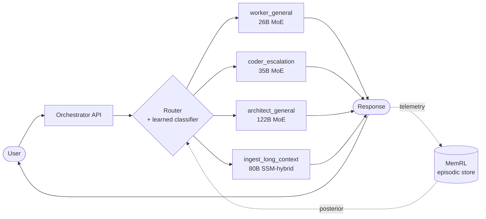

---
hide:
  - navigation
  - toc
---

# EPYC Local-Inference

**Production multi-model LLM inference on a single AMD EPYC 9655. CPU-only, no GPU.**

96 cores / 192 threads (Zen 5), 1.13 TB DDR5-5600 ECC across 12 channels (~460 GB/s aggregate), NPS4 NUMA.

Each box on the right is a separate `llama-server` instance pinned to a NUMA quarter. The router chooses among them per request, escalates when a smaller model fails, and learns from every outcome.

---

## What's here

This site collects the **distilled knowledge** behind the project — the topic syntheses, subsystem walkthroughs, and research deep-dives that explain *how* the stack works and *why* each design choice was made.

- :material-book-open-page-variant:{ .lg .middle } **[Stories](stories/index.md)**

    ---

    The narrative layer — cross-cutting threads about how features were built, what we tried and ruled out, what we're investigating now. Start here if you're cold on the project.

- :material-tag-multiple:{ .lg .middle } **[Topics](topics/index.md)**

    ---

    30 compiled articles synthesizing every research thread — speculative decoding, KV cache, MoE optimization, routing, hardware, autonomous research. Each article cites its sources.

- :material-cog:{ .lg .middle } **[Subsystems](subsystems/index.md)**

    ---

    Pedagogical walkthroughs of the production stack — orchestrator (runtime, REPL, MemRL, escalation, SkillBank…) and research infrastructure (benchmarks, cost-aware rewards, model sizing).

- :material-magnify:{ .lg .middle } **[Deep-Dives](deep-dives/index.md)**

    ---

    Long-form analyses of individual papers, techniques, and decisions. Authored when a topic warrants more than an intake entry — including ideas we tried and ruled out.

---

## Recent landings

| Date | Win |
|---|---|
| 2026-05-24 | Autopilot exogenous-restart resilience — fleet markers + WAL crash recovery; 60/60 tests |
| 2026-05-21 | Learned routing controller — 98.7% val acc, classifier wired end-to-end |
| 2026-05-09 | OMP idle-spin fix — `KMP_BLOCKTIME=10`; frontdoor decode +78% |
| 2026-05-08 | `worker_general` → gemma4-26B-A4B MTP — +36% throughput, +18pp tool_compliance |
| 2026-05-06 | Qwen3.6-35B-A3B Q8 production upgrade — frontdoor + coder consolidated |
| 2026-04-26 | L3-as-NUMA evaluation — reverted, all 5 prod models −30 to −52% |
| 2026-04-24 | NPS4 + CCD + Q8 8×8 AVX-512BW kernel — 48-thread peak 46.6 t/s |

See [Topics → Hardware Optimization](topics/hardware-optimization.md) and [Topics → Inference Serving](topics/inference-serving.md) for the underlying story.

---

## Source code

Application code lives in three sibling repos:

| Repo | Purpose |
|---|---|
| [pestopoppa/epyc-root](https://github.com/pestopoppa/epyc-root) | Governance, knowledge base, handoffs, agent definitions (this site builds from here) |
| [pestopoppa/epyc-orchestrator](https://github.com/pestopoppa/epyc-orchestrator) | Production orchestration — routing, REPL, MemRL, autopilot |
| [pestopoppa/epyc-inference-research](https://github.com/pestopoppa/epyc-inference-research) | Benchmarks, model registry, eval suites |
